หลังจากใช้ iPhone 5S จากญาติมาได้ประมาณปีนึง ก็เริ่มคิดจะหามือถือใหม่ละ ตอนแรกจริงๆ คือเล็ง iPhone 7 Plus เลย (เริ่มเป็นสาวกไปละ 55) ค่าตัวก็ตามนั้น 35k รุ่น 128GB แต่จนวันนึงมีข่าวว่า Huawei เปิดตัว Huawei P10/P10 Plus ที่ทั้งกล้องหน้าและกล้องหลังออกแบบโดย Leica! ก็เลยไปไถๆ เว็บมันดู เออก็น่าสนใจ รูปร่างเครื่องดูดีเชียว กล้องก็โหด สเปคดูดี แต่พอเอาราคานอกคูณตรงๆ เป็นราคาไทย…โอ้ แม่งพอๆ กับ 7 Plus เลย ตอนนั้นยังรู้สึกว่าเป็นสาวกไป 90% ละ เพราะใช้ Mac และเริ่มติด ecosystem ของมันเต็มที่ละ ก็เลยปักหลักว่าจะซื้อ 7 Plus

จนพองานนิทรรศ 17 เท่านั้นแหละ Huawei ก็เปิดตัว P10 ในไทย ราคาออกมาตามรูป

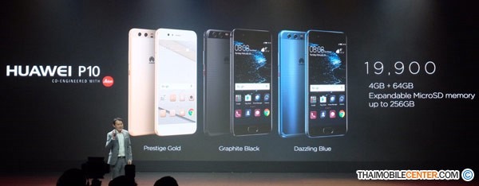

_ที่มารูป: <http://www.thaimobilecenter.com/news-2559/huawei-p10.asp>_

ผมนี่กลับลำเลยครับ…เช้ดโด้จ่ายสองหมื่นทอนร้อยนึง ได้มือถือสเปคอย่างเถื่อน กล้องอย่างโหด ถูกกว่า i7 เป็นหมื่น

ก็เลยรอวันที่มันเข้าไทยมาครับ แล้วก็ไปสอยมาแล้วเรียบร้อย เลยเอามารีวิวกันดีกว่า

ตัวที่ซื้อมาเป็น Huawei P10 64GB สีดำครับ ตอนแรกผมสนใจสีน้ำเงินด้วย แต่ก็มีฟีลลิ่งอยากเห็นตัวเครื่องก่อนแล้วค่อยตัดสินใจ ปรากฎว่าร้านที่ไปซื้อไม่มีตัวสีน้ำเงินโชว์เลย ก็เลยเอาสีดำมานั่นแหละ (ถึงอยากได้น้ำเงินมากกว่า ก็อดอยู่ดี เพราะร้านบอกสีน้ำเงินหมดละจ้า)

**ค่าเสียหายรวมหมดตกที่ 18,400 บาท**ครับ เป็นโปรของ AIS ตัวร้าน Jaymart ลดค่าเครื่องให้ 1,500 บาทถ้าซื้อเครื่องไปพร้อมติดสัญญา 6 เดือน ซึ่งโปรนี้ที่ AIS Shop จะไม่มีครับ ของ AIS Shop จะมีแต่ [AIS Hot Deal](http://www.ais.co.th/hotdeal/) ที่ลดค่าเครื่อง 5,000 บาท แต่ติดสัญญาปีนึง และจ่ายล่วงหน้า 2,000 บาท ครับ ผมเห็นว่าติดสัญญาปีนึงมันเถื่อนไป เลยเอาเบาๆ ละกัน (พอหมดสัญญา 6 เดือนจะได้ลดโปรเอา)

ส่วนของแถมที่สาขาที่ผมไปซื้อ ก็แถมเคสฝาพับแท้ของ Huawei **กับขาตั้งกล้องครับ**

ฟังไม่ผิดครับ คือแถมขาตั้งกล้องให้จริงๆ

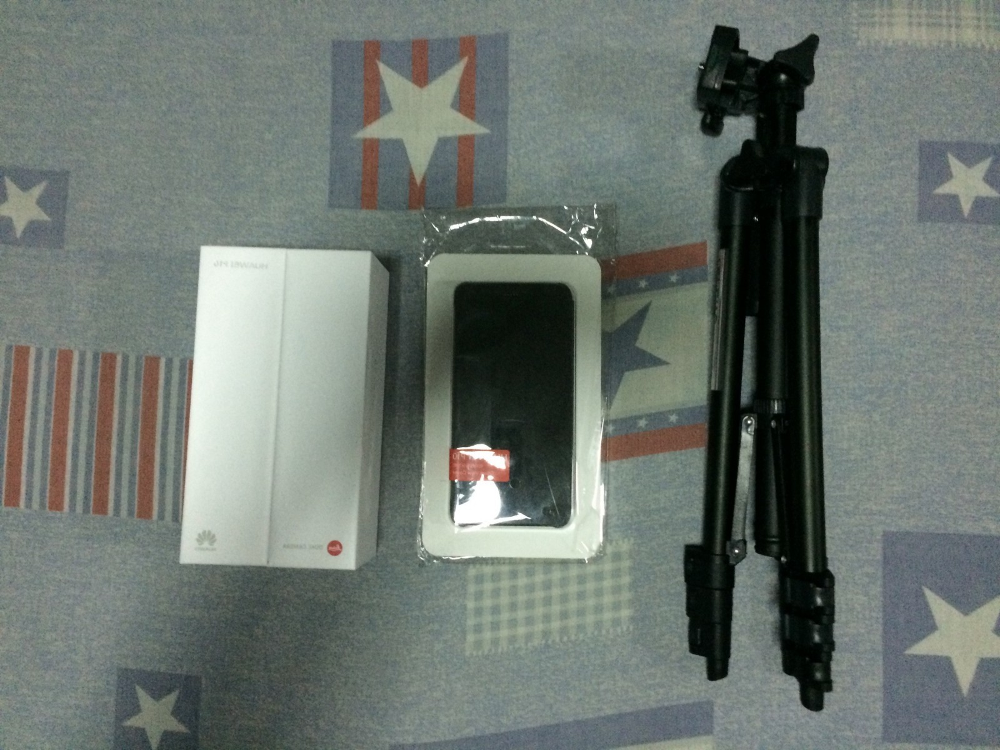

**Note**: จะบอกว่าบางร้านแถมเยอะกว่านี้อีก…อย่างร้าน CSC นี่เห็นคนซื้อกันละแบบ หิ้วของแถมกันอย่างเยอะมากๆ…

## แกะกล่อง

กล่องก็ดูมีความหรูหราพอตัว ทรงแบบกล่องไอโฟนเลย เปิดมาก็จะเจอตัวเครื่องนอนรออยู่ในซองพลาสติกเลย

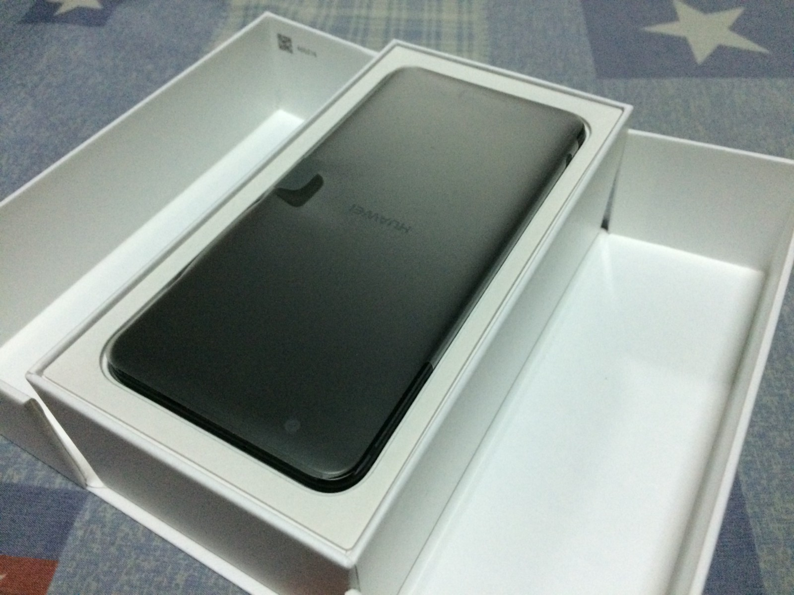

แล้วก็บรรจงแกะพลาสติกออก สัมผัสแรกของเครื่องก็คือ เชี่ย อย่างบาง ขนาดเครื่องก็จะประมาณ iPhone 7 นี่แหละครับ ถือมือเดียวได้สบายๆ (แต่ผมเป็นคนมือใหญ่พอสมควรนะ ฮ่าๆ)

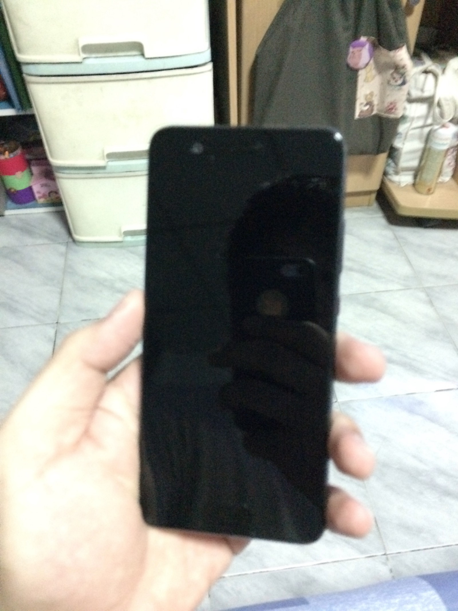

ข้างหน้าก็ไม่มีอะไรครับ ที่โดดเด่นและต่างจาก P9 เลยคือย้ายตัวสแกนนิ้วจากด้านหลังมาไว้ด้านหน้าแล้ว และปุ่มด้านหน้าก็จะไม่ใช่แค่ตัวสแกนนิ้วอย่างเดียว แต่ทำตัวเป็น Smart Button ได้อีกด้วย (จะไปพูดต่อใน section ถัดไป) ทำให้พอย้ายมา แล้วหน้าตาปุ่มก็โค้งๆ จะรู้สึกเหมือนจับมือถือซัมซุงจริมๆ (ไม่นับ S8 นะ)

หลังจากนั้นก็ดูของข้างในกล่องต่อครับ สุดท้ายสิ่งที่อยู่ในกล้องเรียงรายได้ตามนี้

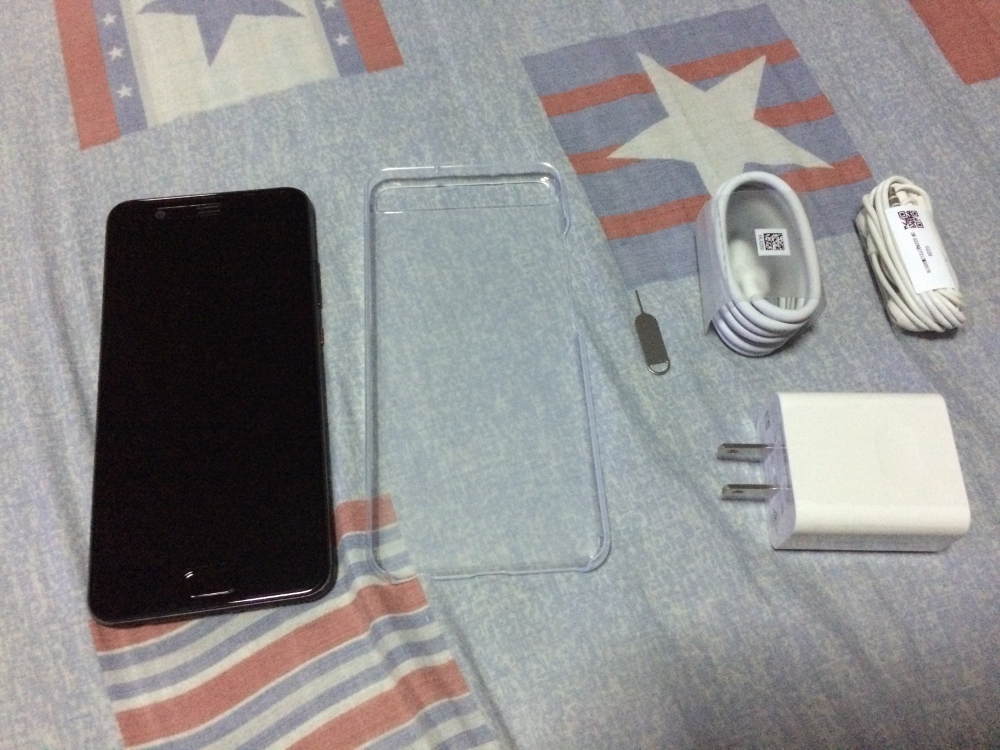

ก็คือมีตัวเครื่อง P10 + เคสใสซึ่งแถมมาให้ในกล่องเลย + แท่งจิ้มช่องใส่ซิม + สาย USB-C + Adapter Huawei Super Charge + หูฟัง

อ่อ แล้วตัวเครื่องเนี่ย คือติดฟิล์มกันรอยมาให้แล้วด้วย เรียกได้ว่าถ้าคนไม่คิดมาก คือซื้อเครื่องมาก็ไม่ต้องไปตระเวนซื้อเคส ซื้อฟิล์มกันรอยมาติดเลยทีเดียว ฟินๆ กันไป

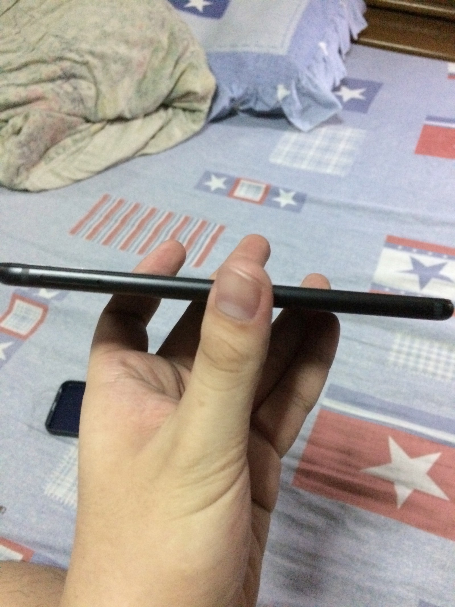

_ให้ดูความบาง (เอาไปเทียบกับ i7 Plus แล้ว บางกว่านิดนึง แต่ไม่ได้ลองกับ i7)_

ตัวเครื่องนั้นดูงานประกอบก็เนี๊ยบดี ส่วนดีไซน์ผมให้นิยามว่า **หน้าซัมซุง หลังไอโฟน** คือมองข้างหน้านี่ยังกับซัมซุง ส่วนมองข้างหลังจะว่าเหมือนไอโฟนก็ไม่ปาน 55555

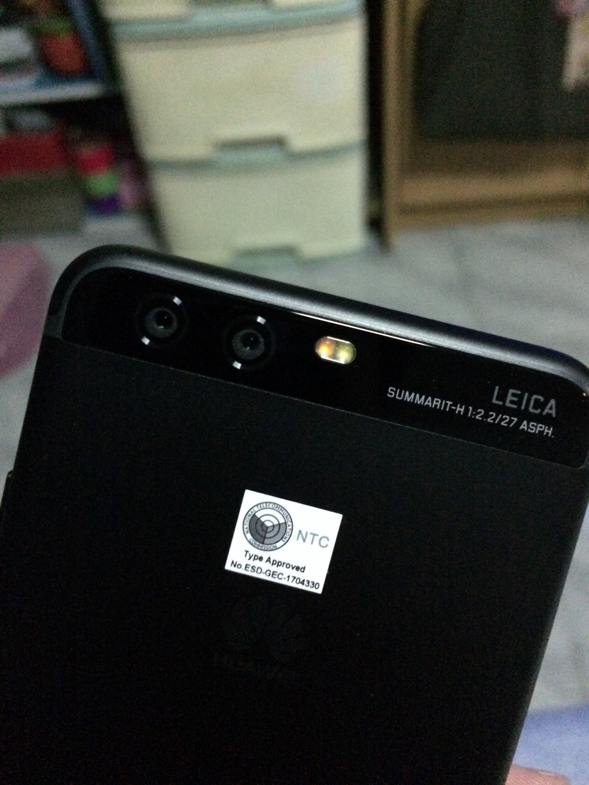

ส่วนที่ผมชอบคือ กล้องหลังมันไม่นูนออกมาครับ เรียบสนิทไปเลย แถมมีกระจกกันอีกชั้นด้วย ทำให้พอดูรวมๆ จากข้างๆ ก็จะบางเรียบสนิท แต่ติดที่ว่าตัวเครื่องสีดำโลโก้ Huawei มันไม่เงาออกมาครับ สีก็ออกเทาจางๆ ถ้าไม่สังเกตจะไม่เห็นจริงๆ ว่ามีโลโก้ Huawei อยู่

ส่วนด้านล่างก็มีช่อง USB-C 1 ช่อง กับหูฟัง 3.5 ครับ (ยังไม่โดนตัดทิ้งนาจา) ปุ่มเพิ่ม-ลดเสียง และปุ่มล็อคจอจะอยู่ทางขวามือครับ

ส่วนทางซ้ายก็จะมีช่องของถาดใส่ซิมอยู่ครับ ซึ่งสามารถใส่ซิมได้ 2 ตัวครับ แต่ว่าจะต้องเลือกในซิมช่องที่ 2 ว่าจะใส่ซิม หรือใส่ microSD ครับ คือถ้าใส่ microSD ก็จะใส่ซิมตัวที่สองไม่ได้ ถ้าใส่ซิมตัวที่สอง ก็ใส่ microSD ไม่ได้

เอาล่ะ เรื่องตัวเครื่องจบไปแล้ว มาดูที่การใช้งานกันดีกว่า

## กลับสู่ Android

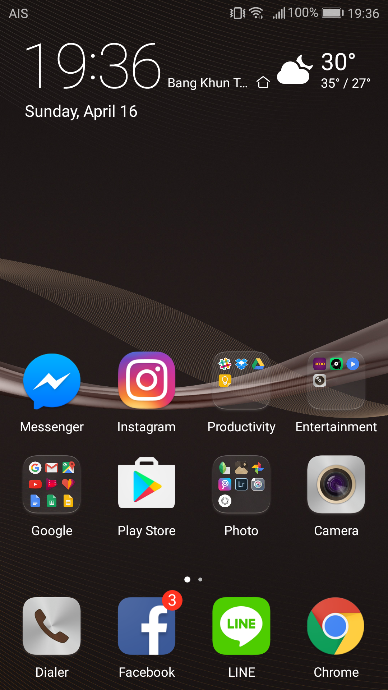

คือผมเองก็ไม่มีปัญหากับตัว Android แต่อย่างใด ผมเลยรู้สึกเฉยๆ กับการย้ายจาก iOS มา Android (เศร้าอย่างเดียวคือ…แชทไลน์หาย…) แต่ว่า Android เวอร์ชัน Huawei นี่…หน้าตาเกือบจะเป็น iOS ละ ตามรูปข้างบน เลยรู้สึกว่าไม่ค่อยต่างจากเดิมมาก คือเอาแอพทั้งหมดไปไว้ที่ Home Screen

แต่ทั้งนั้นเราก็ Switch ไปใช้แบบ Drawer ตามสไตล์ Android ปกติก็ได้ครับ

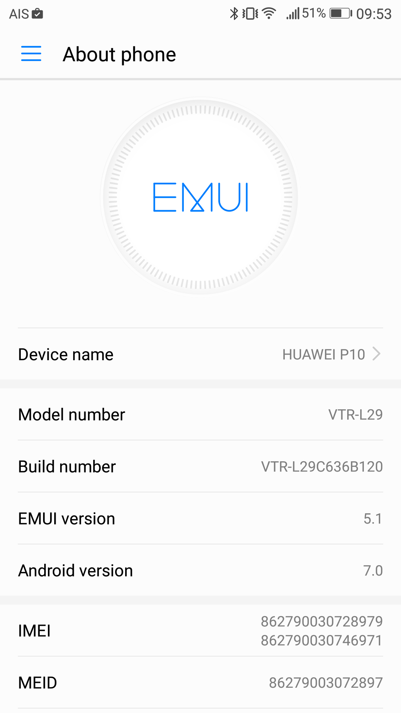

Android ที่ให้มาเป็น Android 7 มาตั้งแต่เกิดเลยครับ ROM ที่ใช้ก็เป็นรอมดัดแปลงของ Huawei เอง ชื่อ EMUI

เรื่องการใช้งานทั่วไป ก็ถือว่าลื่นมากๆ จะมีติดนิดหน่อยคือเรื่องทัชไม่ค่อยฟินเท่า iPhone (จริงๆ เรื่องทัชสกรีนต้องยอมใจไอโฟนจริงๆ ทัชลื่นมือมากๆ)

มีอีกจุดที่จะแตกต่างกับมือถือ Android ตัวอื่นๆ เป็นพิเศษ คือตัว Navigation Key ที่จะเอาไว้ใช้งานมือถือ แบบพวกกด Back กลับหรือกด Home ไปหน้าหลัก โดยปกติถ้าเป็นอย่างซัมซุง Navigation Key จะเป็น Physical ทั้งหมด คือจะเป็นปุ่มบนตัวเครื่อง ปุ่มกลางก็คือไปหน้า Home มีปุ่ม Back ทางขวา มีปุ่มเปิด Recent Apps ทางซ้าย แต่ใน Huawei P10 เราสามารถใช้ Navigation Key บนจอได้ แบบนี้

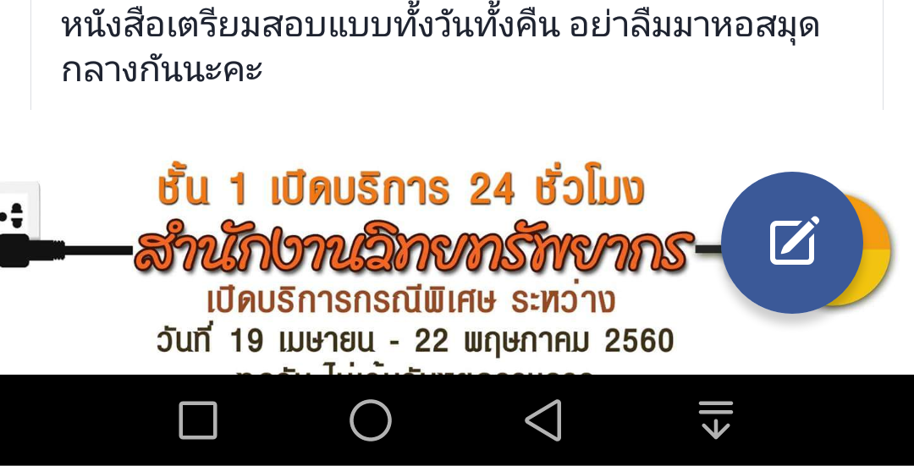

หรือจะเป็นแบบใหม่ คือใช้ Gesture บนปุ่มสแกนนิ้วบนจอเรานี่แหละ ปุ่มเดียวเอาอยู่ โดยท่าของมันจะมีได้ 3แบบคือ

- แตะ = Back
- กดค้าง = Home
- ปาดซ้ายหรือขวา = เปิด Recent Apps

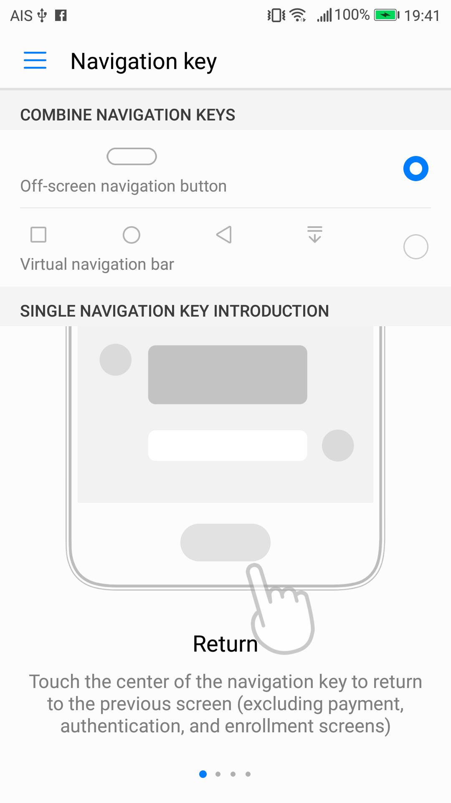
ซึ่งอันนี้มีคนชอบบ้างไม่ชอบบ้าง ก็แล้วแต่คนครับ ส่วนตัวของผมพอชินๆ แล้วใช้สะดวกดี

อ๋อ พูดถึงสแกนนิ้ว…รู้สึกว่าไวกว่าไอโฟนอีกครับ คือแบบแตะปุ๊ปใช้มือถือได้เลย แถมไม่ต้องกดปุ่ม Lock จอทีนึงแล้วค่อยสแกนนิ้วด้วย (อันนี้ชอบมาก) แล้วเราใช้ตัวสแกนนิ้วในการ Lock Apps ไม่ให้คนอื่นเข้าได้ด้วยครับ

ส่วน ROM นั้นความจุที่มีให้ของรุ่น 64GB เบ็ดเสร็จมีที่ให้ใช้ประมาณ 49GB ครับ (แต่นั่นก็ไม่ใช่ปัญหา เพราะเราใส่ SD Card ได้สูงสุดที่ 256GB เช้ดเข้จะเยอะไปไหน…) แล้วจุดที่ชอบอย่างคือปกติเราอาจจะเห็น Android เจ้าอื่นซดแบตอย่างเยอะ แต่ P10 นี่ บอกเลยว่าแรมใช้เฉลี่ยที่ 2.5GB ครับ (ยังไม่เคยเจอแตะถึง 3GB ด้วย) ถือว่าแรม 4GB ก็เพียงพอแล้วแหละครับ

อีกจุดที่ชอบคือ Smart Assistance และพวก Gesture เท่ห์ๆ ของเครื่องครับ เช่น

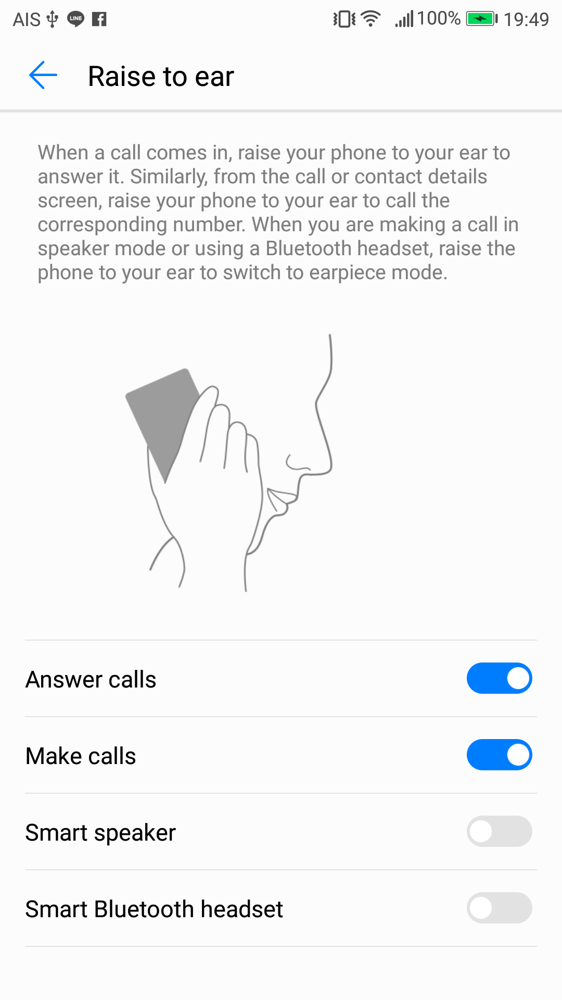

- ยกหูโทรศัพท์ = โทรออกหรือรับสาย
- คว่ำเครื่องตอนมีโทรศัพท์เข้าหรือนาฬิกาปลุก = ปิดเสียงเรียกเข้า
- มีคนโทรมาเสียงดัง ยกขึ้นมาดู = เสียงเบาลง
- เอาข้อนิ้วเคาะจอ = แคปภาพหน้าจอ (อันนี้อึ้ง)
- เอาข้อนิ้วลากจอ = Multi Window (ใช่ครับ support Multi Window ด้วย)
- เอาข้อนิ้ววาดเป็นรูป = ตั้งได้ว่าจะทำอะไร เช่น วาดเป็นตัว C ให้เปิด Chrome อะไรงี้

ซึ่งไอ้พวกฟีเจอร์เอาข้อนิ้วมาใช้เนี่ย มีแคปจอที่ได้ใช้ นอกนั้นแอบใช้ยาก 55 ส่วนยกหูโทรศัพท์นี่ชอบจริง

เรื่องแบตเตอรี่ รุ่นนี้ค่อนข้างจะอึดพอสมควร แต่ยังไม่ได้ลองใช้แบบปล่อยจาก 100% ออกจากบ้านถึงเย็น ไว้ถ้าทดลองมาแล้วจะมาบอกครับ

## กล้อง

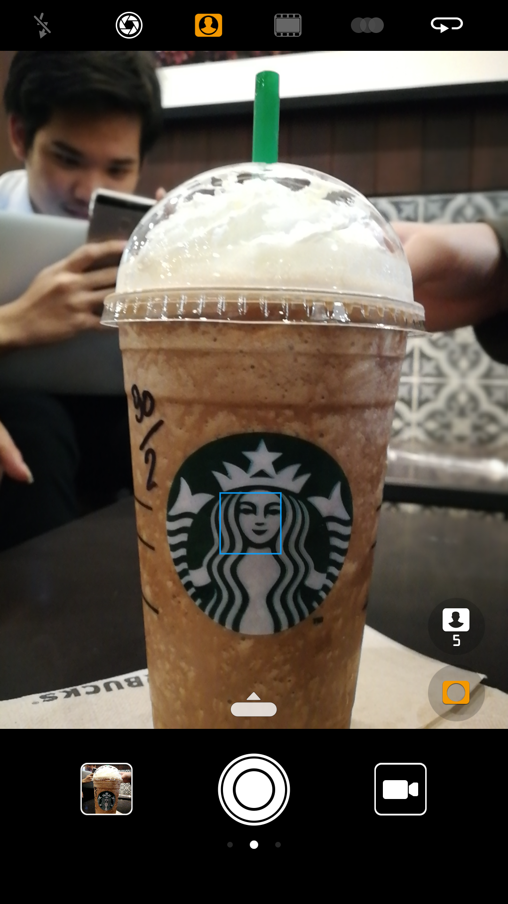

คือ P10 ชูโรงเรื่องกล้องอย่างหนัก จะไม่พูดนี่ก็คงบาปมหันต์มากๆ…ก่อนจะไปดูละเอียด ขอ clarify เรื่องกล้องว่า ที่เขาโฆษณาว่า Co-Engineered with Leica เนี่ย คือเหมือนว่า Leica เขา Design ตัว spec กล้องให้ครับ แต่ไม่ได้ผลิตเอง (ถ้าผลิตเอง P10 นี่แม่งคงจะเครื่องละเป็นแสน) แต่ว่าก็อย่างว่าครับ คือแค่ Design ให้ก็คงการันตีถึงความเทพแล้ว

ตัวซอฟต์แวร์กล้องของ P10 ต้องบอกเลยว่า “นี่สรุปกูซื้อมือถือหรือซื้อกล้อง” คือเมนูมีเยอะมากๆ แถมยังมีโหมด Pro ให้นั่งปรับได้เองด้วยสำหรับมืออาชีพ หรือถ้าไม่อยากคิดมาก ก็มีโหมดต่างๆ ให้เลือกเหมือนกัน ซึ่งตอนแรกผมก็รู้สึกปวดหัวมาก คือมีอะไรให้กดเยอะเหลือเกิน เยอะจนงง แต่พอหยิบออกมาถ่ายบ่อยๆ ก็จะเริ่มใช้เป็นละ

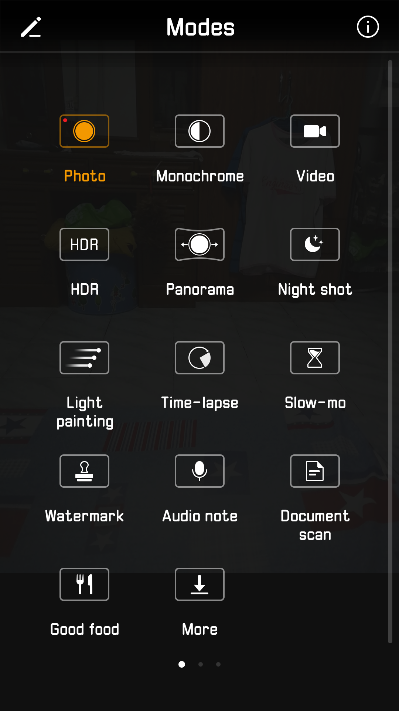

_มีโหมดให้เลือกเยอะ_

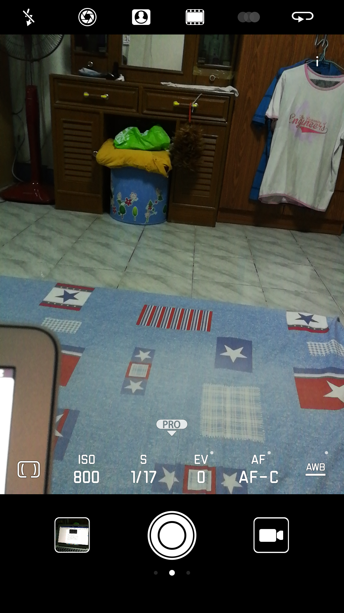

_มีโหมด Pro ด้วย_

ใน P10 นั้นตัวกล้องหลังเป็น Leica Dual Camera 2.0 ครับ ปรับปรุงมาจาก P9 เป็นกล้องคู่ที่ประกอบด้วยกล้องสี 12 MP + 20 MP Monochrome F2.2 ทั้งคู่ครับ มาพร้อมกับ OIS กันสั่น และ 2x Hybrid Zoom ครับ (Hybrid Zoom เท่าที่เข้าใจคือ มันจะซูมได้โดยภาพไม่แตกที่ 2x ครับ ถ้าไปไกลกว่านั้นก็เรียบร้อย ซึ่งไม่ได้ลองเทสเหมือนกัน 55) นอกจากนี้ยังถ่ายวิดีโอได้ถึง 4K ด้วยครับ และ 1080p ก็ถ่าย 60FPS ได้ด้วย

ส่วนกล้องหน้าความละเอียดจะอยู่ที่ 8MP ครับ และเป็นตัวแรกของโลก ที่ Leica ออกแบบเลนส์ให้กับกล้องหน้าครับ (ทั้ง P9, Mate 9 กล้องหน้ายังไม่ Leica ครับ)…อีกจุดที่ผมชอบของกล้องหน้าคือ มันมี Adaptive Selfie ครับ คือถ้ามันค้นพบว่า มีคนหน้าตกขอบจอ มันจะ zoom out ภาพออกให้คนไม่ตกขอบจอครับ (ถือว่าโหดมากๆ)

เอาล่ะ แต่ผมจะไม่พูดพร่ำทำเพลงอะไรเยอะละ…เอารูปไปดูกันเถอะ (จะบอกว่ารูปทั้งหมดนี้ จบที่การกดแชะครั้งเดียวจริงๆ ไม่มีการแต่งเพิ่มใดๆ ทั้งนั้น)

Selfie กับกล้องหน้า

กล้องหลัง Portrait Mode

Monochrome อันนี้ผมชอบมากๆ มีฟีลลิ่งย้อนเวลา

Monochrome ก็ถ่าย Portrait ได้

_โซนของกินนนนนนน (ขออภัยสำหรับคนดูตอนดึกๆ 5555)_

_กล้องหลัง Portrait ถ่ายในร้านแมคสีลมตอนสี่ทุ่ม_

_รูปเซ็ตนี้ถ่ายจาก”ในรถ” มีกระจกกั้นอยู่…_

_Night Mode ในโรงหนัง ถ่ายประมาณ 3 วิ (Night Mode ต้องหาขาตั้งกล้องมา ไม่งั้นไม่รอดจริงๆ)_

ซึ่งในแง่มุมเรื่องกล้อง ได้ลองเอาไปเทียบกับตัวอื่นๆ อย่าง iPhone 7 Plus ที่น่าจะชกได้สมน้ำสมเนื้อหน่อย (จริงๆ เป็นคู่ที่ไม่ควรชก เพราะ 7 Plus F1.8 แต่ P10 F2.2) ก็ได้ข้อสรุปมาว่า ตัวกล้องของ P10 จะมีสีสดเว่อร์กว่าพอสมควร (โดยเฉพาะรูปแรก จานทรูสีแดงแป๊ดไหมละครับ 55) ส่วน iPhone สีจะดู real กว่า ส่วนเรื่องถ่ายในที่มืด ไม่ได้ลองเทสจริงจัง แต่เท่าที่อ่านจากข้างนอก iPhone จะแพ้พอสมควร

ตัวผมเองก็ไม่ได้เซียนเรื่องนี้มาก กล้องใครจะดีกว่าใครนี่ก็เป็นเรื่องของความชอบส่วนตัวด้วยแหละ แต่สำหรับผม ถือว่าโดนใจมากๆ สำหรับ P10

## บทสรุป

สำหรับผมเอง ด้วยค่าตัวที่สองหมื่นทอนร้อยนึง นับว่าโหดและคุ้มมากๆ ละครับ ทั้งเรื่องสเปคการใช้งานลื่นไหล กล้องโหดมาก (หลายคนเห็นกล้อง P10 ครั้งแรกแบบตาลุกวาวทุกคน)

ถือว่าตัดสินใจไม่ผิดที่ได้มาลองใช้ Huawei ครับ หลังจากที่มือถือก่อนหน้านี้คือ Samsung 3 เครื่อง (S4 Mini/S4 ที่ญาติให้มา/J7) กับ iPhone 5S ผมว่าอนาคตแบรนด์นี้น่าจะไกลพอสมควร ในไทยคนเริ่มใช้กันเยอะพอสมควรละ

สำหรับรีวิว P10 วันนี้คงจบลงแต่เท่านี้ครับ มีอะไรคอมเม้นมาได้เสมอครับผม :D

ปล.ราคาเครื่องเปล่าเป็นตามนี้นะครับ

- P10 32GB 17,900 บาท มีสีเทากับทอง
- P10 64GB 19,900 บาท มีสีดำ น้ำเงิน ทอง
- P10 Plus 64GB 23,900 บาท มีสีดำ น้ำเงิน ทอง

คนที่มองหาสีเขียว กับ P10 Plus แรม 6GB ก็รอไปก่อนครับ ยังไม่เข้าไทย (อยากเห็นสีเขียวเหมือนกัน…)
