ไม่อยากเกริ่นอะไรมากละ เข้าเรื่องเลยดีกว่า 5555

## ทำไมถึงได้ไปถึง Brisbane, Australia?

เหตุเกิดจากว่าบริษัทที่ทำงานอยู่ [(TakemeTour)](https://www.takemetour.com) ได้มีโอกาสไปเข้าร่วมในโครงการที่ชื่อว่า HotDesQ อารมณ์คล้ายๆ accelerator แหละ โดยให้ทีมเราไป relocated อยู่ที่ออสเตรเลียเป็นเวลายาวนานร่วม 6 เดือนเลยละกัน โดยก็จะมี event / seminar / conference ต่างๆ ให้ attend รวมถึงมี opportunity ต่างๆ อีกด้วย และเขาก็ยังให้ co-working space เรามานั่งทำงานอีกด้วย ซึ่งเราได้เลือกไปเมือง Brisbane (บริสเบน) ที่ออสเตรเลียนั่นเอง

ทีนี้ ด้วยความที่เวลายาวนาน และจำนวนคนที่ไปครั้งนึงก็ลิมิต พี่ต้าที่เป็น CEO จึงเสนอเขาไปว่า เราจะ rotate คนในทีมวนกันไป โดยแต่ละคนจะมาช้าเร็วก็แล้วแต่คนไป เขาก็โอเค

และหวยก็ตกลงมาที่เราได้โอกาสไป โดยอยู่นานร่วมกว่า 5 สัปดาห์เลยทีเดียว (21 May - 30 June)

และหากใครรู้จักผม ก็จะรู้ว่าเคยไปต่างประเทศแค่ครั้งเดียว (คือที่สิงคโปร์เมื่อปีก่อน)

การไป Brisbane ครั้งนี้ จึงเป็นเหมือนการเดินทางต่างประเทศที่ทั้งไกลที่สุด และยาวนานที่สุดในชีวิตผมตอนนี้แล้ว

## Brisbane มันอยู่ที่ไหนของออสเตรเลีย?

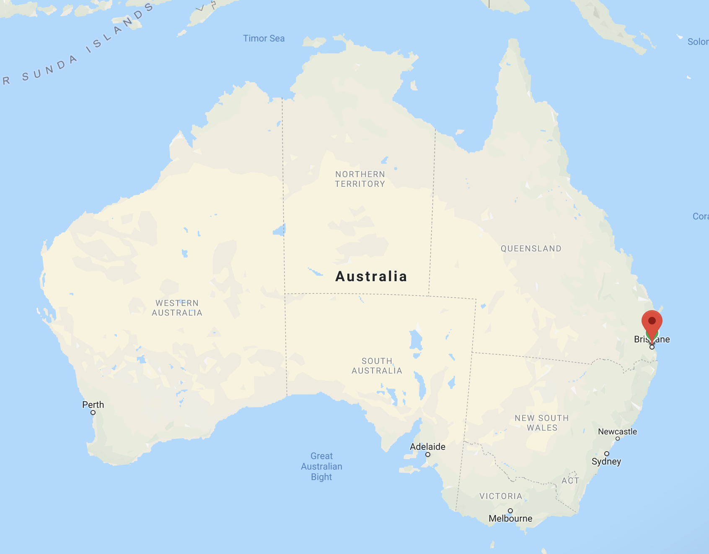

Brisbane เป็นหนึ่งเมืองที่คนไทยหลายคนไม่ค่อยจะรู้จักกัน คนไทยส่วนมากถ้าพูดถึงประเทศออสเตรเลียก็จะนึกถึงเมืองใหญ่อย่าง Sydney และ Melbourne คนจะรู้จัก Brisbane น้อยมาก

Brisbane ตั้งอยู่ที่ฝั่งตะวันออกของออสเตรเลีย ติดอยู่กับชายฝั่งทะเล จริงๆ พอมาอยู่สักพักเรารู้สึกว่า บริสเบนเป็นอารมณ์เหมือนเมืองที่ "ไม่ใช่เมืองหลัก แต่ก็ไม่ใช่ชนบท" มันมีความผสมกันระหว่างเมืองใหญ่ที่คนพลุกพล่าน กับเมืองชนบทที่เงียบสงบ

## ทำวีซ่า

ออสเตรเลียเป็นประเทศที่ต้องใช้วีซ่าเพื่อที่จะเข้าออกประเทศ ก็เลยต้องมีการทำวีซ่า ซึ่งรวมๆ process นั้นไม่ค่อยนานมาก เริ่มจากไปกรอกข้อมูลบนเว็บไซต์เลย พร้อมทั้งอัพโหลดเอกสารให้ครบ เมื่อกรอกเสร็จ เราจึงไปเก็บข้อมูล Biometric ที่ VFS Global (ติดกับบีทีเอสนานา)

หลังจากนั้นก็แค่รอๆๆ รวมๆ แล้วใช้เวลาประมาณอาทิตย์นึง หากเอกสารครบไม่ขาดอะไร ก็จะได้วีซ่ามา ซึ่งวีซ่าที่ผมได้มีอายุ 1 ปี เข้าออกได้หลายครั้ง และอยู่ครั้งนึงได้นานสูงสุด 3 เดือน

อ่อ ค่าทำรวมๆ ประมาณ 4 พันกว่าบาท

## ออกเดินทาง

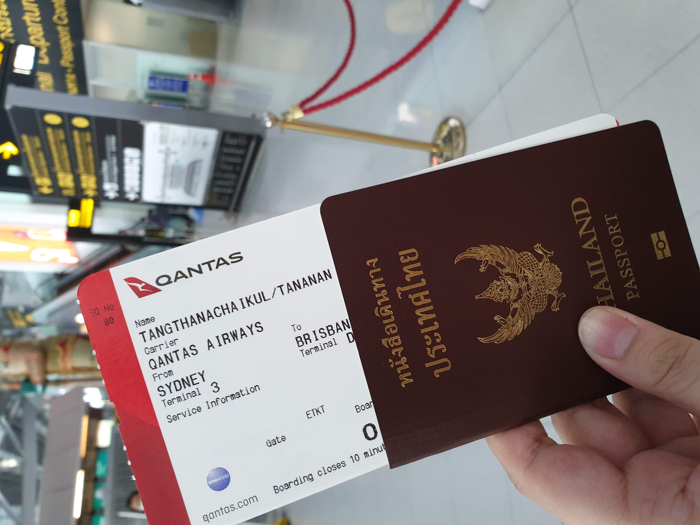

เนื่องจากไปกับบริษัท ดังนั้นค่าตั๋วก็ไม่ต้องออกเอง อิอิ สบายใจ โดยออกบินตอน 18:10 ที่สุวรรณภูมิ แล้วไปเปลี่ยนเครื่องต่อที่ Sydney วันต่อมาเวลา 8 โมงเช้าที่นู้น ทั้งหมดบินผ่านสายการบิน Qantas ซึ่งเป็นสายการบินของออสเตรเลียเองเลย

รวมๆ ไฟลท์ทั้งหมดจะกินเวลา 13 ชั่วโมงด้วยกัน (9 ชั่วโมงจากไทยไป Sydney + 2 ขั่วโมงจาก Sydney ไป Brisbane + 2 ชั่วโมงต่อเครื่อง) นั่งเครื่องจนปวดตูด เจ็ตแล็กจนปวดหัว ดีที่ขาไป Sydney เครื่องบินค่อนข้างลำใหญ่ ที่นั่งใหญ่ และ Full Service อาหารและน้ำครบ (แต่อาหารบนเครื่อง แม่งไม่อร่อยเลยจ้า) และมีหนังให้ดู (ดูแม่งตาแฉะ 55)

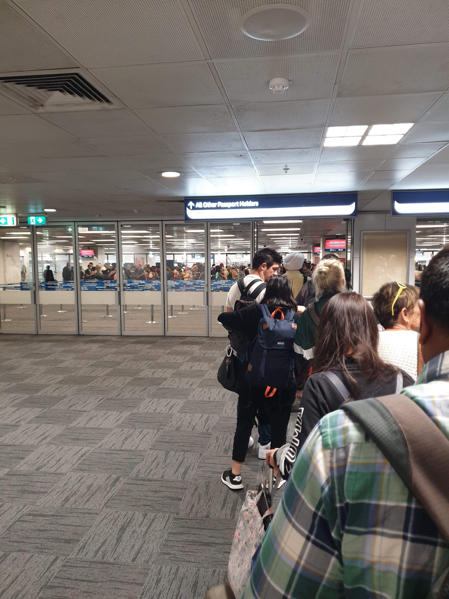

อ่อ ตอนถึง Sydney ต้องผ่านตม.​ คิวยาวมาก...รู้สึก process ช้ากว่าสิงคโปร์ แต่ก็พอเข้าใจว่าน่าจะมีหลายไฟลท์มาถึงพร้อมๆ กัน

เสร็จแล้วก็ไปต่อเครื่องในนั้นแหละ ตอนแรกก็กลัวล่กทำอะไรไม่ถูก เพราะไม่เคยต้องเปลี่ยนเครื่อง แต่สุดท้ายด้วย UX ของสนามบินที่วางมาดีอยู่ เลยจบที่เดินตามป้ายแม่ง เดี๋ยวก็ถึง และก็ถึงจริงๆ 5555

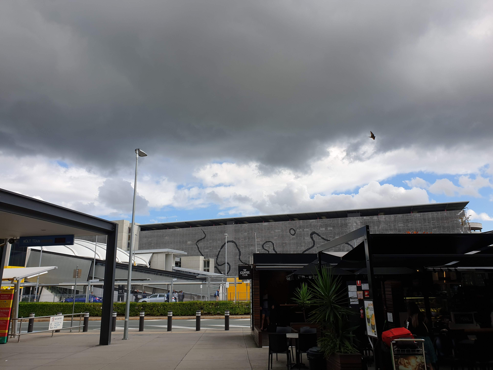

และผ่านไปอีก 2 ชม.หลังจากขึ้นเครื่อง ก็มาถึง Brisbane แล้ว!!!!

## เข้าที่พัก

พี่ที่มาก่อนหน้าแล้วแนะนำให้ใช้แอพเรียกรถที่ชื่อ Ola ซึ่งเข้าใจว่าน่ามีแค่ในออสเตรเลีย ก็คล้ายๆ Uber แต่ราคาถูกกว่า และที่สำคัญคือ มันมีลด 50% สำหรับ new-user ในเวลา 2 สัปดาห์ สามารถใช้กี่ครั้งก็ได้ แต่พ้นสองสัปดาห์ก็ไม่มีโปรโมชั่นนี้แล้ว เรียกได้ว่าโคตรถูก

เสียอย่างเดียว แม่งแอดบัตรเครดิตของไทยไม่ได้...บัตรกรุงไทย Travel Card จะแอด ก็แอดไม่ได้ โชคดีที่มันมี PayPal ก็เลยจ่ายผ่าน PayPal ไป (และโดนเรท PayPal แปลงเงินปวดหัวเลย T-T)

พอเครื่องบินแตะถึงบริสเบน ก็นั่ง Ola เข้าที่พัก คือบริสเบนในโซนที่เราอยู่มีจุดเด่นนึงที่เด่นพอสมควร คือทางแม่งชันมาก เพราะเมืองมันแบบมีเนินเยอะ ชันขึ้นชันลงกันอย่างโหดสัสรัสเซีย

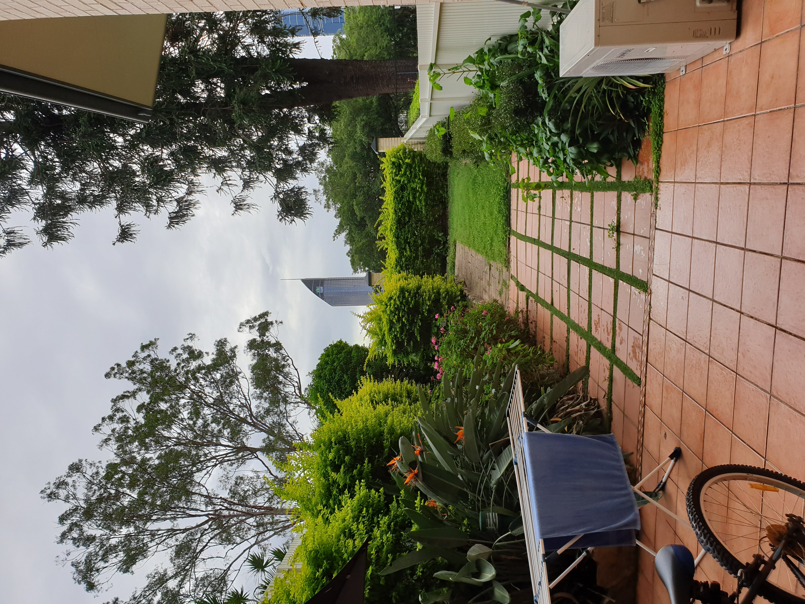

พอถึงที่พักปุ๊ป ก็จัดกระเป๋าเก็บเข้าห้อง...และที่พักก็มีสวนหน้าบ้านด้วย บรรยากาศก็ชิคดีอยู่ (มีคนทักว่าตึกตกข้ามเหมือนตึกธนาคารกสิกรที่ไทย...เออเหมือนจริง เหยดเข้ 55555)

## เข้าไปเดินเล่นในเมือง

เรียกได้ว่ายังนอนไม่เต็มอิ่มบนเครื่อง (บนเครื่องนอนไม่หลับเลยเอาจริงๆ) ก็ต้องลุยกันต่อ เผอิญว่าพี่ในทีมโน้ตบุ๊คคีย์บอร์ดเอ๋อเฉย เลยจะไปที่ Apple Store ให้เขาดูให้ เลยได้แวะเข้าไปส่อง Apple Store ที่บริสเบนเป็นที่เที่ยวที่แรก

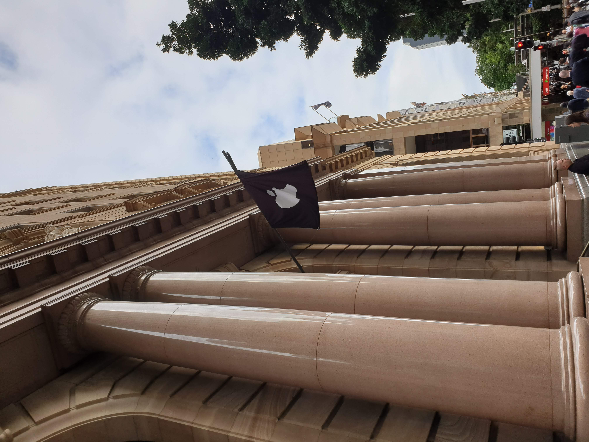

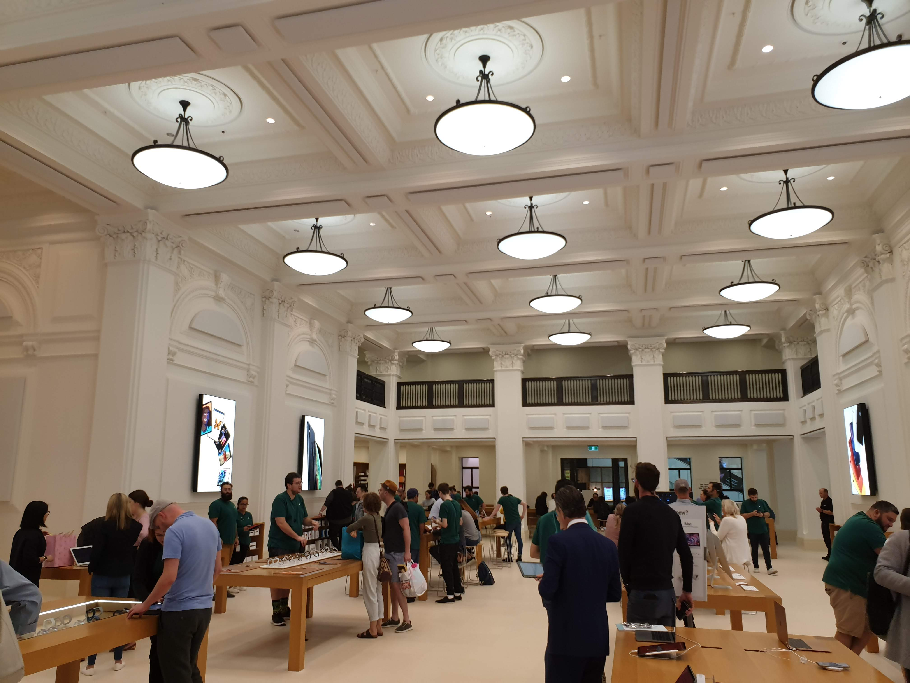

ภายใน Apple Store ของบริสเบนก็เท่ห์ดีนะ คือเอาตึกเก่ามาโม จริงๆ ในไทยถ้าแบบเอาตึกหรือบ้านทรงไทยเก่ามาโมได้นี่ก็น่าจะสวยนะ (แต่ก็น่าจะ...นั่นแหละ)

ส่วนราคาของ ใครหวังว่าถูกกว่าที่ไทย เสียใจจ้า ราคาเท่ากัน (แต่อย่าลืมว่าเรา Tax Refund ได้ สรุปก็ถูกกว่า)

หลังจากนั้นก็กินข้าว ความแปลกอย่างนึงคือ ถ้ามาถามว่าอะไรคืออาหารออสเตรเลีย คือตอบไม่ได้ เพราะมันไม่น่าจะมี ที่ดูๆ มานี่ก็มีแต่อาหารญี่ปุ่น อินเดีย จีน ยุโรป เมกา ไทยก็ยังมี มื้อแรกเลยไปจบที่ซูชิ และข้าวไก่เทอริยากิ 555555

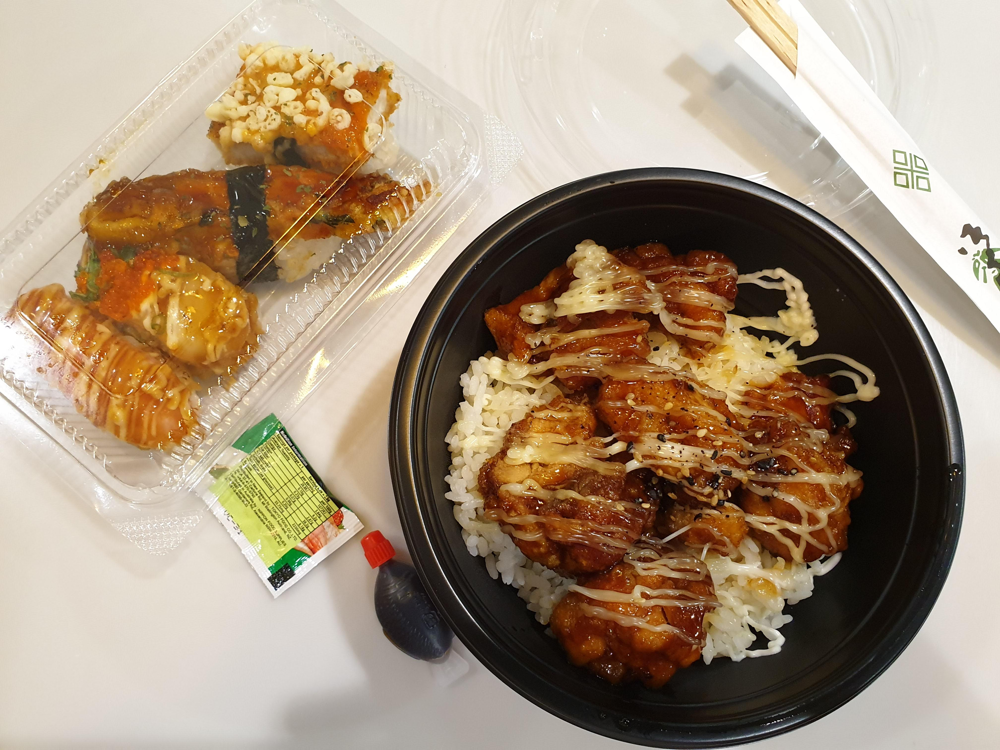

กินข้าวเสร็จ ก็เดินชมเมืองกันต่อ ก็จะมีห้างร้านแบรนด์ต่างๆ ที่เราคุ้นเคยและเห็นอยู่เต็มไปหมด Uniqlo ก็ยังมี นี่ก็เลยแว้บไปดูก่อน (แม่งมีเสื้อเซ็ต Overwatch ด้วยเว้ยคุณ ชิบหายตังกุละ)

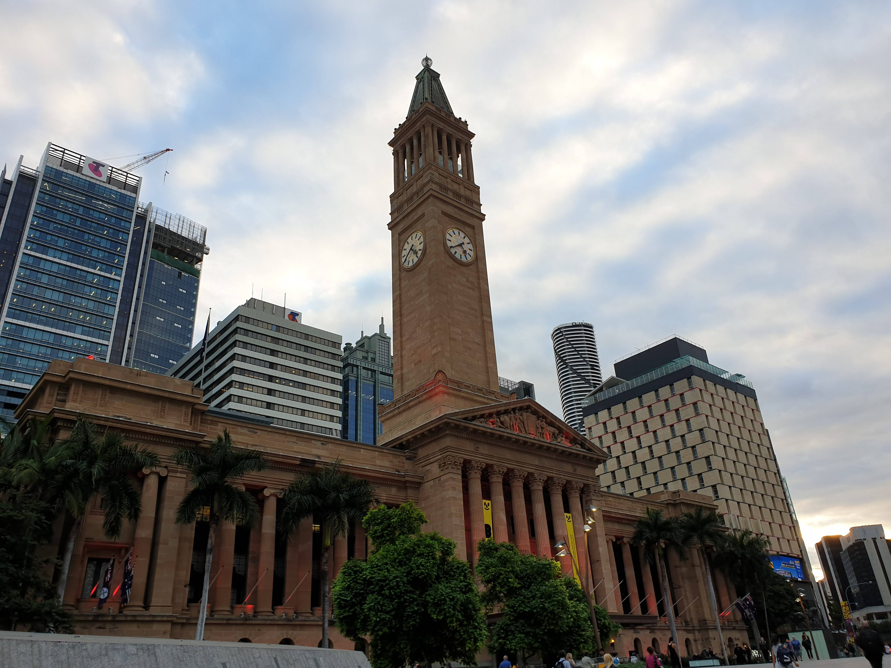

เสร็จแล้วก็มุ่งหน้าไปที่ City Hall เนื่องจากช่วงนี้บริสเบนจัดนิทรรศการอาร์ทชื่อ BAD (Brisbane Art Design) โดยมีจัดหลักๆ ที่ City Hall ของบริสเบน และบริเวณรอบๆ เลยได้ไปเดินดูงานอาร์ตที่ City Hall กัน

และก็อาร์ตจริงๆ กูไม่เข้าไม่ถึง 555555555555555

เสร็จแล้วก็เดินช็อปปิ้งซื้อของเข้าบ้านที่ Woolmart (อารมณ์ก็โลตัส บิ๊กซีบ้านเรา) ความน่าสนใจที่ได้เจอมาคือ

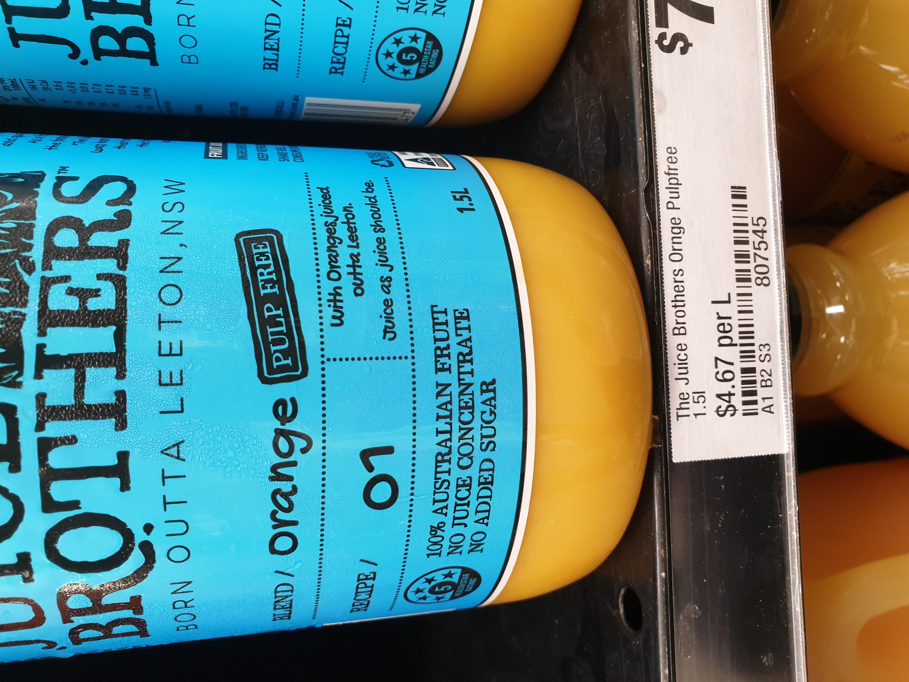

1. อาหารบางประเภท จะมี healthy index บอกเป็นเลข 1 คือไม่ healthy / 5 คือ healthy มาก ถือว่าดีมาก อย่างนี่ซื้อน้ำส้มขวดมา ก็ได้ไป 5 ดาว ก็จัดไป
2. ในห้างเองก็จะบอกราคาต่อหน่วยให้ด้วย คนซื้อก็จะได้เปรียบเทียบง่ายๆ อันนี้ชอบมาก ไม่ต้องหารเลขเอง

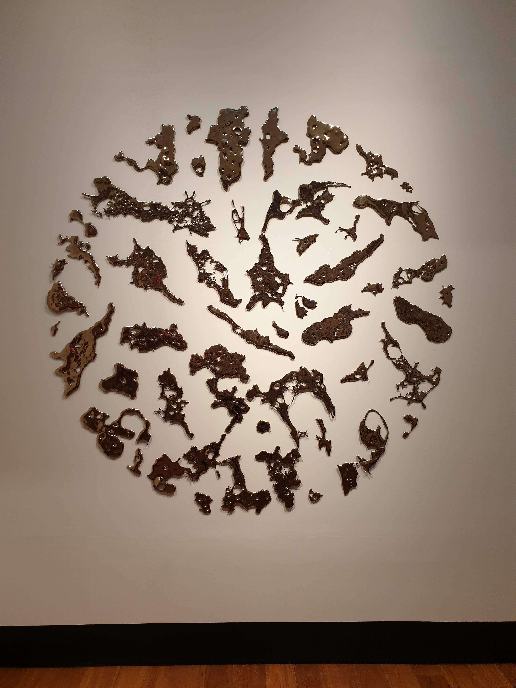

3. เนื้อสัตว์ให้คนกิน กับให้หมากิน มันอยู่ในเชลฟ์โซนเดียวกันเลยครับ คือถ้าเบลอๆ ไปซื้อก็อาจได้อาหารหมาไปกินก็ได้ 5555 เอาเข้าจริงแล้วมันก็คือเนื้อสัตว์นั่นแหละ เพียงแต่เกรดของวัตถุดิบจะไม่ดีเท่าที่คนกินนั่นแหละ
4. ที่นี่จะเน้น self-checkout คือเอาของไปจ่ายตังเอง โดยตู้ก็จะรับทั้งเงินสด และบัตรเครดิต/เดบิต ซึ่งความเทพของ Cashless Society ที่นี่คือ ถ้าสมมติเรามีบัตร VISA Pay Wave หรือจำพวก contactless payment ก็แค่ติ๊ดแตะบัตร ตังคุณก็บินไปแล้ว สะดวกมาก ไม่ต้องหยิบแบงค์หยิบเหรียญให้ปวดหัว แถมไม่ต้องมานั่งเซ็นด้วย (แต่ก็ยังคงมีพนักงานอยู่ ถ้างงๆ พนักงานก็จะเข้ามาช่วยเราเอง)
5. ที่นี่ซื้อของไม่มีถุงพลาสติกให้ ถ้าไม่มี ต้อง**ซื้อ**เพิ่ม เราจะเห็นคนที่นี่พกและหิ้วถุงผ้ากันเป็นธรรมดามาก (บางคนแม่งพกตะกร้ามาเลยก็มี 5555) จริงๆ ในไทยเองก็มีบางที่เริ่มตระหนักแล้ว แต่ถ้าทำกันทุกที่แบบนี้เราว่าทุกคนก็จะชินเป็นนิสัยเอง

## ประทับใจในอากาศ และอัธยาศัยของผู้คน

คือที่นี่ตอนมาถึงสัมผัสแรกคือ อากาศเย็นสบายมาก ใส่แจ็คเก็ตไม่ต้องเว่อวังก็สามารถอยู่ได้แล้ว สูดอากาศได้สบายใจเต็มปอดมาก แค่นี้ก็ประทับใจกว่าไทยเยอะละ (ไทยนี่ทั้งร้อนทั้ง PM2.5)

อีกสิ่งที่น่าสนใจและผมก็ชอบมาก คือความอัธยาศัยดีของผู้คนที่นี่ คือคนที่นี่ค่อนข้าง nice พอสมควร ยิ่งพอไปพวกร้านอาหาร หรือซื้อของเนี่ย เขาทักทายเราประหนึ่งญาติมิตรที่ไม่เจอกันมานานมาก (แม้แต่ตอนนั่ง Ola เอง เขาก็ทักทายสวัสดีทุกคันด้วยนะ) และบริการดีด้วยนะ ถือว่าประทับใจจริงๆ แถมบางทีเวลาเรางงและสงสัยอะไร เขาก็เต็มใจและยินดีที่จะคลายข้อสงสัยให้ด้วยนะ บ้านเราในไทยบางทีเวลาถามอะไรไปยังมีแอบหงุดหงิดเซ็งเป็ดอยู่เลย

## สวัสดี QUT Creative Enterprise

ในโครงการ HotDesQ ที่เราได้ attend นั้น เราได้ไปทำงานอยู่ใน QUT (Queensland University of Technology) Creative Enterprise ก็คือไปทำงานในมหาลัยนั่นแหละ ซึ่งที่ๆ ได้ไปนั่งทำงานเป็น co-working space

การเดินทางจากบ้านที่พัก ไป QUT ก็มีสองแบบหลักๆ แบบขี้เกียจก็นั่ง Ola ไป ตกที่ 15A$ (A$ หรือ $ ที่จะเขียนในบล็อกชุดนี้จะหมายถึง Australian Dollar โดย 1A$ จะประมาณ 22 บาท) แต่ Ola เรามีลดครึ่งราคาไง ถูกเลย

หรืออีกแบบนึงคือ เดินไปขึ้นรถของมหาลัยฟรี ซึ่งจะบอกเลยว่า การเดินทางด้วยทางเท้าถ้าระยะทางไม่ไกลเว่อร์มากๆ เป็นการเดินทางที่ดีมากๆ เพราะอากาศที่นี่มันเย็นสบายไง และฟุตบาทที่นี่คือดีมาก

แต่เนื่องจากเรายังไม่มีบัตรของ QUT เราก็นั่ง Ola กันไปก่อน (มันหารกันก็ถูกด้วยแหละ รับได้)
