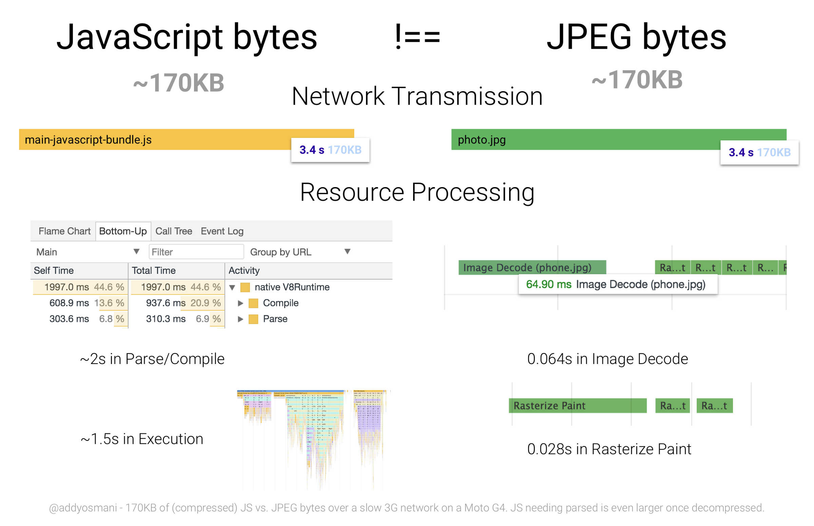
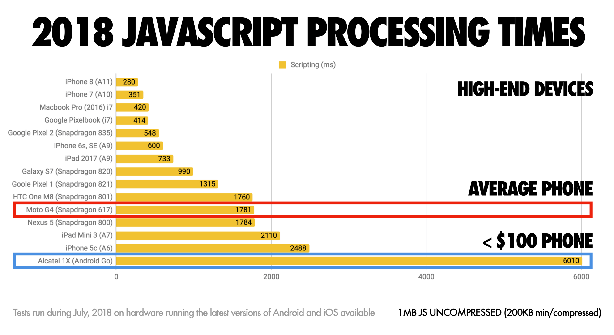
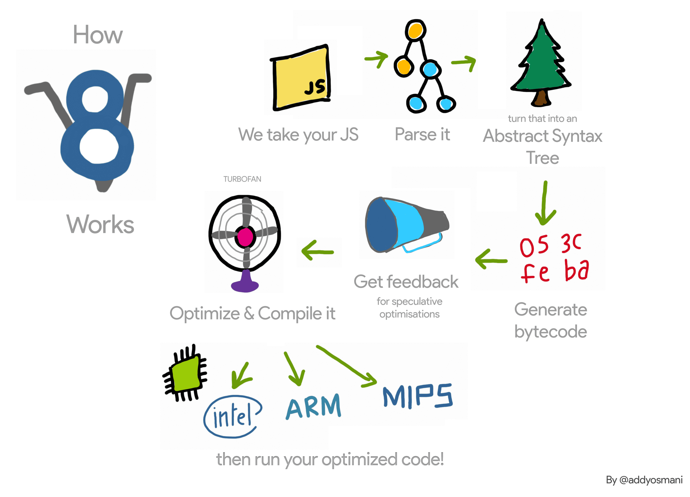
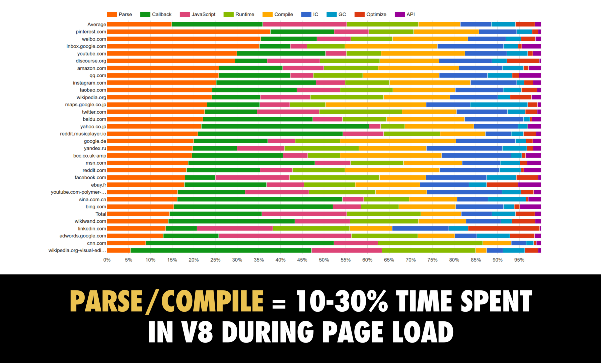
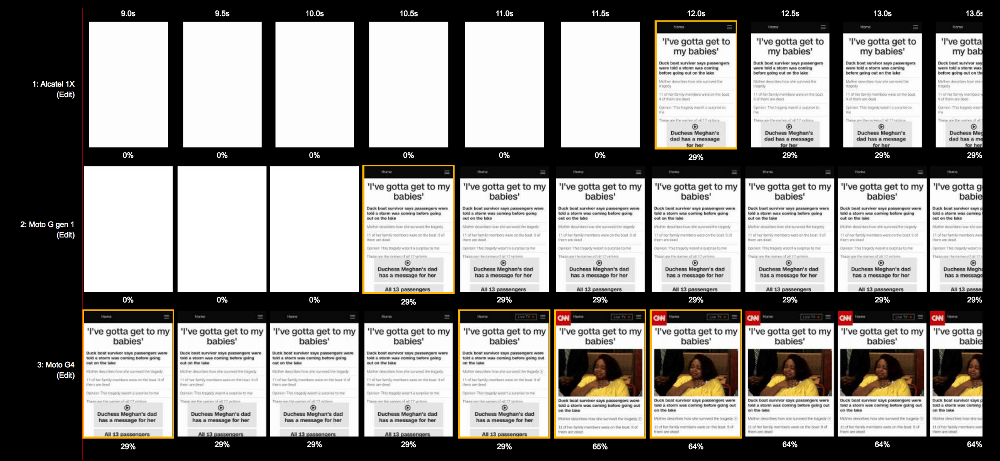
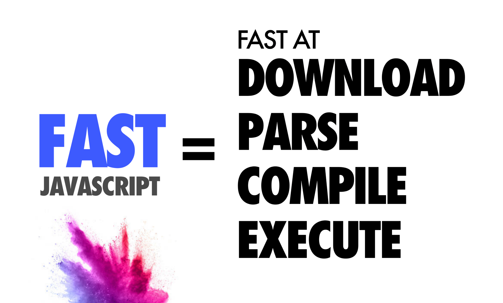

ก็มาต่อกันสำหรับเรื่องที่สองในซี่รี่ส์ Web Performance ครับ ในครั้งก่อนผมพูดถึง[เรื่องของการ optimize รูปภาพ](/web-performance-series-optimize-images) ไปแล้ว มาในตอนนี้จะพูดถึงอีกตัวที่หลายคนมักเลือกใช้ในยุคสมัยนี้ และก็เป็นตัวที่สร้างปัญหาได้แบบสุดๆ เช่นกัน นั่นก็คือ **JavaScript** นั่นเอง

## JavaScript "มีค่าใช้จ่ายที่แพงที่สุด" ในเว็บไซต์

ในสมัยที่ Single Page Application ที่รันโดย JavaScript และยุคที่ JavaScript library ครองเมือง ไม่ว่าจะ React, Vue, Angular นั้น ทำให้ภาษาอย่าง JavaScript นั้นเติบโตขึ้นมาก แต่สิ่งนึงที่หลายคนมักจะชอบมองข้ามกันไป ก็คือ **อีเจ้า JavaScript เนี่ยมีค่าใช้จ่ายในเชิง performance สูงที่สุด** หากเทียบกับ resource อื่นๆ

เหตุผลสำคัญก็เพราะว่า JavaScript เป็น resource ประเภทที่ไม่ได้จบงานหลังจาก network โหลดไฟล์ JavaScript เสร็จ แต่มันมีกระบวนการอื่นๆ นอกจากนั้นอีกเยอะมาก ซึ่งไอ้กระบวนการพวกนั้นแหละ เป็นตัวที่หน่วงให้เว็บไซต์ให้ช้าลงเยอะมาก

ซึ่งในปริมาณ data ที่เท่ากันนั้น หากเป็นรูปภาพ สิ่งที่ทำก็คือจะโหลด request ผ่าน network แล้วก็ทำการ decode นิดหน่อย แต่หากเป็น JavaScript เรื่องราวจะไม่ได้จบแค่การโหลด network หากยังมีกระบวนการต่อมานั่นคือการ parsing / compile JavaScript ถึงจะ execution ได้อีกที ซึี่งทั้งหมดทั้งมวลนั้นอาจกินเวลายาวนานได้เลย

และความปวดหัวไม่ได้จบแค่ว่ามันยังต้องทำ step เหล่านั้นนะครับ ความปวดหัวต่อมาคือความเร็วในกระบวนการพวกนั้น ขึ้นกับความเร็วของ hardware เครื่องด้วย ยิ่ง hardware ช้า หรือเก่าๆ จะยิ่งทำให้กระบวนการพวกนี้ช้าลงไปอีก

หลายคนเวลา development มักจะเจอ pitfall ประมาณว่า "ก็ไม่เห็นช้าเลยนิ" แต่จริงๆ เรากำลังทำเว็บอยู่บนคอมพิวเตอร์ที่ประสิทธิภาพดีกว่ามือถือหลายเท่าตัวมากๆ หรือต่อให้ dev บนมือถือ หลายๆ ครั้งก็มักจะ dev บนมือถือตัวบนๆ ที่แรงๆ **ทั้งๆ ที่จริงแล้ว มือถือตัวท็อปนั้น เร็วกว่ามือถือที่เป็นคนส่วนใหญ่ใช้จริงๆ ถึง 8 เท่าเลย!**

นั่นทำให้จากที่ว่าเว็บเราเร็วๆ เนี่ย ช้าเป็นเรือเกลือได้เลยทันตาเวลา user ใช้จริงๆ โดยเฉพาะเว็บที่ใช้ framework หรือ library อย่าง React, Vue, Angular เนี่ย ปวดหัวกันเลยครับ

ดังนั้นประเด็นแรกที่เราควรทำความเข้าใจคือ ไอ้กระบวนการเหล่านั้นมันคืออะไร แล้วในแต่ละจุดเราสามารถทำอะไรได้บ้าง

## JavaScript ทำงานได้ยังไง?

ขั้นตอนหลักๆ กว่าที่ JavaScript จะถูกรันนั้นมีขั้นตอน 4 ขั้นเอง นั่นคือ

1. **Download**: JavaScript ถูก download ผ่าน HTTP Request
2. **Parse**: JavaScript ที่ถูกโหลดมา จะถูกตัว Engine ของ Browser parse ให้เป็น tree ที่เรียกว่า AST (Abstract Syntax Tree) แล้วสิ่งนี้จะแปลงต่อเป็น Byte Code
3. **Compile**: ตัว Byte Code ที่ได้มา จะถูกนำไป compile เพื่อจะนำไป run ต่อตาม hardware architecture ของ device ที่ใช้ เช่น Intel x86 / ARM / MIPS และนอกจากตัว Byte Code จะถูก compile แล้วจริงๆ ก็ยังมีการ optimize ให้เร็วขึ้น เท่าที่ตัว compiler สามารถจะทำได้
4. **Execute**: ตัวโค้ดที่ compile ตาม hardware architecture ก็จะถูกรัน JavaScript ก็จะถือว่าทำงานเสร็จสมบูรณ์ตรงนี้

สิ่งที่คนหลายคนมักจะเข้าใจผิดว่า ทำไมฉันทำอันนู้นอันนี้แล้วมันก็ไม่ได้เร็วขึ้นมากมาย **นั้นก็เพราะว่าในแต่ละจังหวะ จะมีวิธีการ optimize ที่แตกต่างกันออกไปโดยสิ้นเชิง** หลายคนคิดว่า เฮ้ฉันก็ cache JavaScript แล้วนะ แล้วทำไมมันก็ยังช้า ทั้งๆ ที่การทำ cache นั้นช่วยให้ขั้นตอนแรกคือการ download ไวขึ้นเฉยๆ แต่ขั้นตอนถัดมาก็ยังช้าเหมือนเดิม

และความเงิบของชาวเราที่เขียน JavaScript อยู่บ่อยๆ หากทำเว็บในยุคสมัยนี้ก็คือ **ไอ้ที่ช้าๆ จริงๆ มันคือขั้นตอนที่ 2-4 ซะส่วนมาก!!!**

รูปด้านบนอาจจะงงๆ จุดที่อยากให้สนใจคือสีส้มคือเวลาของการ parse กับสีเหลืองที่เป็นเวลาในการ compile เราจะเห็นว่า บางเว็บนั้นเมือเอาสองสีนี้มารวมกัน สามารถกินเวลารวมๆ ไปเกินครึ่งได้เลย (ลองดูของ Pinterest)

และยิ่งบวกกับความจริงที่ว่า มือถือยิ่งเก่ายิ่งช้า ยิ่งสร้างความปวดหัวได้อีก เพราะด้วย JavaScript เดียวกัน เอาไปรันต่าง device ที่เร็วช้าไม่เท่ากัน ผลลัพธ์อาจทำให้คุณช็อคยิ่งกว่าดู Avengers Endgame ไปเลย

และสิ่งเหล่านั้นไม่ใช่แค่พูดขู่ แต่มันเป็นแบบนั้นจริงๆ และเห็นได้ชัดมากๆ ด้วย ดูจากรูปด้านล่างได้

หรือถ้าไม่เชื่อ stat ที่ว่าเว็บเราใช้เวลาการ parse + compile นาน ลองไปดูใน Dev Tools ของ Chrome เพื่อดู stat ได้เลย

## แล้วเราจะทำอย่างไรดี

ง่ายๆ ครับ หลักการคือ

> ทำทุกขั้นตอนให้เร็วขึ้น

Me: ปาดเหงื่อ

ต่อจากนี้ไป ขอให้ทุกคนหายใจเข้าลึกๆ ผ่อนคลาย แล้วค่อยๆ ไปกันทีละเรื่องๆ นะครับ บางเรื่องไม่ยากกว่าที่ท่านคิดครับ (แต่บางเรื่องอาจจะยากกว่าที่คิดได้ 555)

## Reference เนื้อหา และรูปภาพบางส่วนจาก

- [The Cost of JavaScript in 2018](https://medium.com/@addyosmani/the-cost-of-javascript-in-2018-7d8950fbb5d4)
- [The Cost of JavaScript](https://medium.com/dev-channel/the-cost-of-javascript-84009f51e99e)
- [JavaScript Start-up Performance](https://medium.com/reloading/javascript-start-up-performance-69200f43b201)
