ก็มาต่อกันสำหรับเรื่องที่สองในซี่รี่ส์ Web Performance ครับ ในครั้งก่อนผมพูดถึง[เรื่องของการ optimize รูปภาพ](/web-performance-series-optimize-images) ไปแล้ว มาในตอนนี้จะพูดถึงอีกตัวที่หลายคนมักเลือกใช้ในยุคสมัยนี้ และก็เป็นตัวที่สร้างปัญหาได้แบบสุดๆ เช่นกัน นั่นก็คือ **JavaScript** นั่นเอง

## JavaScript "มีค่าใช้จ่ายที่แพงที่สุด" ในเว็บไซต์

ในสมัยที่ Single Page Application ที่รันโดย JavaScript และยุคที่ JavaScript library ครองเมือง ไม่ว่าจะ React, Vue, Angular นั้น ทำให้ภาษาอย่าง JavaScript นั้นเติบโตขึ้นมาก แต่สิ่งนึงที่หลายคนมักจะชอบมองข้ามกันไป ก็คือ **อีเจ้า JavaScript เนี่ยมีค่าใช้จ่ายในเชิง performance สูงที่สุด** หากเทียบกับ resource อื่นๆ

เหตุผลสำคัญก็เพราะว่า JavaScript เป็น resource ประเภทที่ไม่ได้จบงานหลังจาก network โหลดไฟล์ JavaScript เสร็จ แต่มันมีกระบวนการอื่นๆ นอกจากนั้นอีกเยอะมาก ซึ่งไอ้กระบวนการพวกนั้นแหละ เป็นตัวที่หน่วงให้เว็บไซต์ให้ช้าลงเยอะมาก

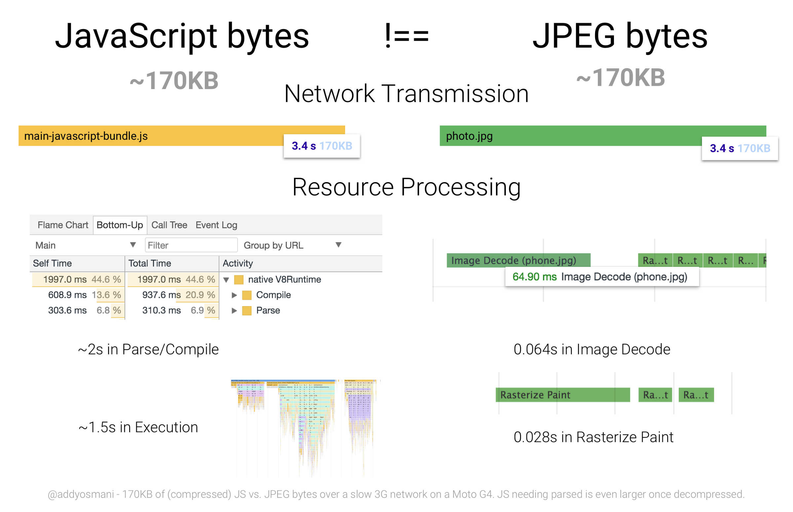

ซึ่งในปริมาณ data ที่เท่ากันนั้น หากเป็นรูปภาพ สิ่งที่ทำก็คือจะโหลด request ผ่าน network แล้วก็ทำการ decode ซึ่งเสียเวลาไม่มาก แต่หากเป็น JavaScript เรื่องราวจะไม่ได้จบแค่การโหลด network หากยังมีกระบวนการต่อมานั่นคือการ parsing / compile JavaScript ถึงจะ execution ได้อีกที ซึี่งทั้งหมดทั้งมวลนั้นอาจกินเวลายาวนานได้​ โดยมีปัจจัยหหลายๆ อย่างมาประกอบ เช่นความเร็วของ hardware เป็นต้น ส่งผลให้ถ้ายิ่ง hardware เก่าๆ ก็จะยิ่งเสียเวลากับกระบวนการพวกนี้มากขึ้น 

หลายคนเวลา development มักจะเจอ pitfall ประมาณว่า "ก็ไม่เห็นช้าเลยนิ" แต่**จริงๆ แล้วเวลาที่เรากำลัง develop ตัวเว็บอยู่ เรามักจะใช้คอมพิวเตอร์ที่ประสิทธิภาพดีกว่ามือถือทั่วไปหลายเท่าตัวมากๆ** หรือต่อให้ dev บนมือถือ หลายๆ ครั้งก็มักจะ dev บนมือถือตัวบนๆ ที่แรงๆ **ทั้งๆ ที่จริงแล้ว มือถือตัวท็อปนั้น เร็วกว่ามือถือที่เป็นคนส่วนใหญ่ใช้จริงๆ ถึง 8 เท่าเลย!**

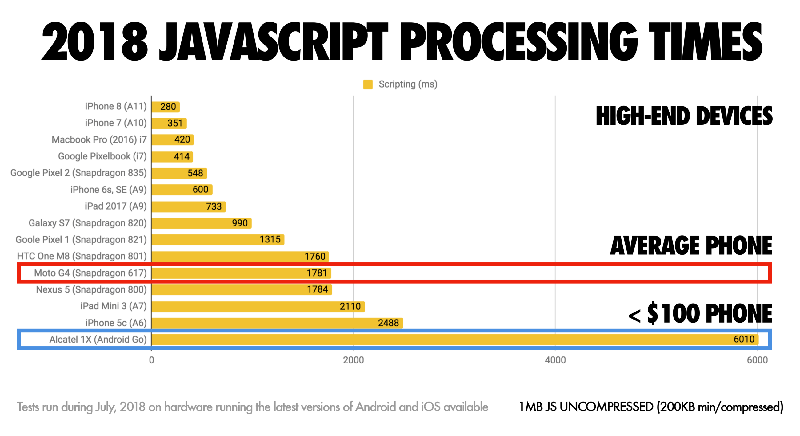

นั่นทำให้จากที่ว่าเว็บเราเร็วๆ เนี่ย ช้าเป็นเรือเกลือได้เลยทันตาเวลา user ใช้จริงๆ โดยเฉพาะเว็บที่ใช้ framework หรือ library อย่าง React, Vue, Angular เนี่ย ปวดหัวกันเลยครับ

ดังนั้นประเด็นแรกที่เราควรทำความเข้าใจคือ กว่า JavaScript จะถูกรันนั้นมันผ่านกระบวนการอะไรบ้าง แล้วในแต่ละจุดเราสามารถทำอะไรได้บ้าง

## JavaScript ทำงานได้ยังไง?

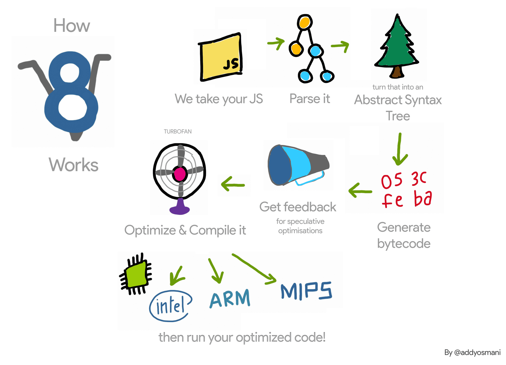

ขั้นตอนหลักๆ กว่าที่ JavaScript จะถูกรันนั้นมีขั้นตอน 4 ขั้นเอง นั่นคือ

1. **Download**: JavaScript ถูก download ผ่าน HTTP Request
2. **Parse**: JavaScript ที่ถูกโหลดมา จะถูกตัว Engine ของ Browser parse ให้เป็น tree ที่เรียกว่า AST (Abstract Syntax Tree) แล้วสิ่งนี้จะแปลงต่อเป็น Byte Code
3. **Compile**: ตัว Byte Code ที่ได้มา จะถูกนำไป compile เพื่อจะนำไป run ต่อตาม hardware architecture ของ device ที่ใช้ เช่น Intel x86 / ARM / MIPS และนอกจากตัว Byte Code จะถูก compile แล้วจริงๆ ก็ยังมีการ optimize ให้เร็วขึ้น เท่าที่ตัว compiler สามารถจะทำได้
4. **Execute**: ตัวโค้ดที่ compile ตาม hardware architecture ก็จะถูกรัน JavaScript ก็จะถือว่าทำงานเสร็จสมบูรณ์ตรงนี้

สิ่งที่คนหลายคนมักจะเข้าใจผิดว่า ทำไมฉันทำอันนู้นอันนี้แล้วมันก็ไม่ได้เร็วขึ้นมากมาย **นั้นก็เพราะว่าในแต่ละจังหวะ จะมีวิธีการ optimize ที่แตกต่างกันออกไปโดยสิ้นเชิง** หลายคนคิดว่า เฮ้ฉันก็ cache JavaScript แล้วนะ แล้วทำไมมันก็ยังช้า ทั้งๆ ที่การทำ cache นั้นช่วยให้ขั้นตอนแรกคือการ download ไวขึ้นเฉยๆ แต่ขั้นตอนถัดมาก็ยังช้าเหมือนเดิม

และเอาเข้าจริงๆ แล้ว เว็บโดยส่วนมาก จะ spend เวลาไปกับขั้นตอนการ Parse และ Compile ไปกว่า 10-30% เลยทีเดียว

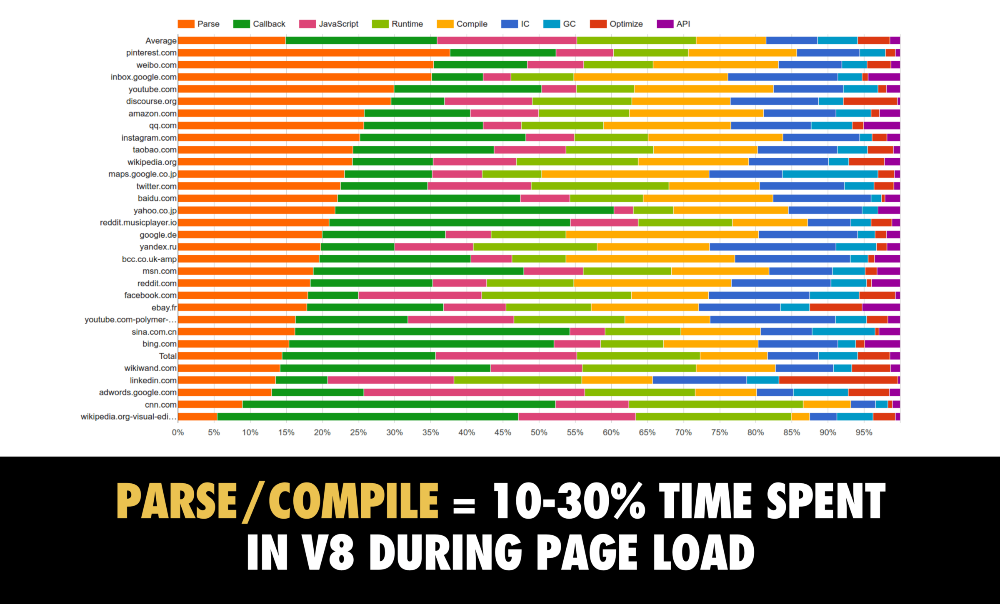

จุดที่อยากให้สนใจคือ **สีส้มซึ่งเป็นเวลาของการ parse กับสีเหลืองที่เป็นเวลาในการ compile** เราจะเห็นว่า **บางเว็บนั้นเมือเอาสองสีนี้มารวมกัน สามารถกินเวลารวมๆ ไปเกินครึ่งได้เลย (ลองดูของ Pinterest)**

และยิ่งบวกกับความจริงที่ว่า มือถือยิ่งเก่ายิ่งช้า ยิ่งสร้างความปวดหัวได้อีก เพราะด้วย JavaScript เดียวกัน เอาไปรันต่าง device ที่เร็วช้าไม่เท่ากัน ผลลัพธ์อาจทำให้คุณช็อคไปสามวันได้เลย

และสิ่งเหล่านั้นไม่ใช่แค่พูดขู่ แต่มันเป็นแบบนั้นจริงๆ และเห็นได้ชัดมากๆ ด้วย ดูจากรูปด้านล่างได้

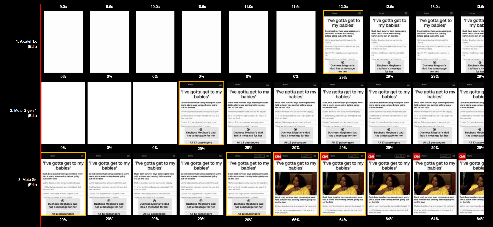

หรือถ้าไม่เชื่อ stat ที่ว่าเว็บเราใช้เวลาการ parse + compile นาน ลองไปดูใน Dev Tools ของ Chrome เพื่อดู stat ได้เลย

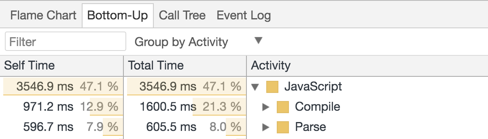

## แล้วเราจะทำอย่างไรดี

โดยหลักการก็คือ

> ทำทุกขั้นตอนให้เร็วขึ้น

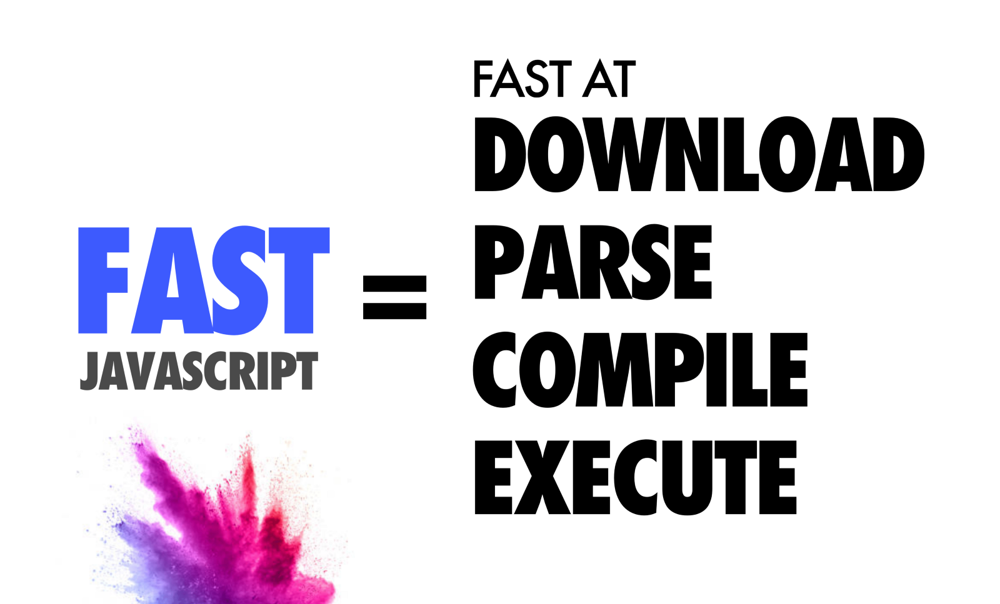

โถ่ มึงก็พูดง่ายนะ 55555

ต่อจากนี้ไป ขอให้ทุกคนหายใจเข้าลึกๆ ผ่อนคลาย แล้วค่อยๆ ไปกันทีละเรื่องๆ นะครับ บางเรื่องไม่ยากกว่าที่ท่านคิดครับ (แต่บางเรื่องอาจจะยากกว่าที่คิดได้ 555 อันนี้ต้องเตือนเอาไว้ก่อน)

## Fast at Download = Serve what user needed

แน่นอนว่าถ้าตัว JavaScript ยิ่งเล็ก ก็จะยิ่งไวขึ้นแน่ๆ อย่างน้อยๆ มันก็ดาวน์โหลดไวขึ้น (นึกภาพโหลด JS 1MB กับ 150KB)

## ติดตั้ง Bundle Analyzer ไว้เช็คว่าบวมตรงไหนเยอะๆ

โปรเจคไหนใช้ Webpack แนะนำให้ติดตั้งตัว plugin [webpack-bundle-analyzer](https://github.com/webpack-contrib/webpack-bundle-analyzer) ก่อนเลย

ตัว analyzer จะช่วย visualize ให้เราเห็นว่า bundle ที่เราได้มามีขนาดเป็นอย่างไรบ้าง และประกอบด้วยอะไรบ้าง ทำให้เราจะนึกภาพออกว่าในไฟล์ JS ที่เราทำมานั้นมีส่วนไหนบวมกันแน่ และพอเราแก้ไข เราก็จะเห็นภาพด้วยว่ามันช่วยลดขนาดจริงๆ หรือไม่

## "Always" minify your JS

เป็นหลักสำคัญประการแรกของการ build JS เอาไปรันบน production คือต้องทำการ minify ตลอด การ minify จะไม่ใช่แค่่ช่วยให้ JS เราเล็กลงเท่านั้น แต่ยังช่วย optimize code ได้บ้างนิดๆ หน่อยๆ ด้วย เช่น ลดรูป condition ให้สั้นลงเป็นต้น

ซึ่งอย่างตัว React เอง ถ้าไม่ minify ก็จะใหญ่พอสมควร แต่พอ minify แล้วก็จะหายไปเยอะเลย ดังนั้นเราก็ควรจะ minify มันเช่นกัน

ส่วนเครื่องมือในการทำ minify แต่ก่อนจะมี [UglifyJS](https://github.com/mishoo/UglifyJS) แต่เดี๋ยวนี้คนเริ่มนิยมใช้ [Terser](https://github.com/terser-js/terser) แทนแล้วเพราะ active มากกว่า

และเอาจริงๆ ไม่ใช่แค่ JS ที่ควร minify ตัว CSS เองก็เช่นกัน และจริงๆ แล้วอย่าง HTML เองเราก็สามารถ minify มันได้เหมือนกัน ทั้งหมดทั้งมวลก็จะช่วยให้ขนาดของ JS ลดลงไปได้เยอะมาก

## ใช้ HTTP/2 ช่วยได้ (นิดนึง)

โดยปกติเราใช้ HTTP/1.1 กันอยู่แล้ว ซึ่งเป็นมาตรฐานทั้งโลก แต่ก็เก่ามากๆ เช่นกัน ตัว HTTP/1.1 นั้นเวลาเรา request ของ resource จาก server มันจะต้องทำทีละ request ดูจากรูปประกอบ หากเราต้องยิง 3 request เราจะต้องยิง 3 รอบ แต่ว่าต่างคนต่างต้องรอ request ก่อนหน้ารับข้อมูลเสร็จแล้วก่อน ซึ่งเสียเวลา

แต่ในมาตรฐานใหม่ที่เป็น HTTP/2 นั้น ปัญหานี้จะหมดไป **โดยที่เราสามารถ request แบบ parallel ได้เลย** และได้ response กลับมาโดยไม่ต้องรอ request ก่อนหน้าแบบ HTTP/1.1 อีกต่อไป

**ที่สำคัญ HTTP/2 เองมีฟีเจอร์ชื่อว่า server-push หาก server เห็นว่ามี asset ที่เดี๋ยวตัว client จะต้องขอมาอีกแน่ๆ ก็จะ push asset นั้นๆ กลับไปให้เลย** เช่น เวลาเข้าเว็บ จะมีการโหลดไฟล์ JS, CSS ต่อตามกันมาอีกเยอะๆ ตัว server ก็ไม่ต้องรอให้ client request JS, CSSS เหล่านั้น ก็ push JS, CSS เหล่านั้นไปให้ได้เลย

ซึ่งวิธีการเปิด HTTP/2 นั้นก็ทำได้ไม่ยาก ใน nginx สามารถใช้ config นี้ได้เลย

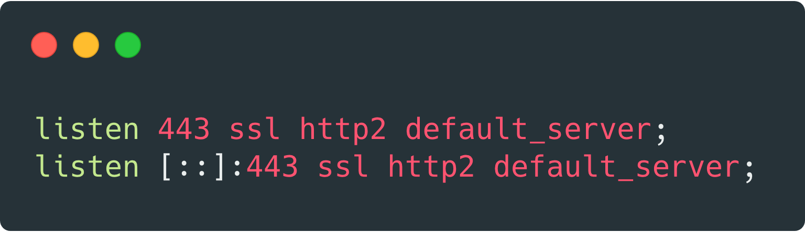

หรือถ้าใครนิยมของง่าย เช่นใช้ Firebase Hosting เองเขาก็เป็น HTTP/2 by default ให้แล้วนะจ๊ะ

## Compress ด้วย GZip

อีกตัวช่วยคือ เราใช้ GZip ในการ compress asset จำพวก text ให้เล็กลงไปได้อีก โดยเฉพาะ JS code ของเรา หากเอาเข้า GZip ก็จะลดขนาดลงไปได้อีก

ซึ่งนอกจาก GZip เองก็ยังมีอีกตัวนึงชื่อ Brotli ตัวนี้เริ่มเป็นที่นิยม และเอาเข้าจริงแล้ว Brotli ให้ compression rate ดีกว่า GZip อีก

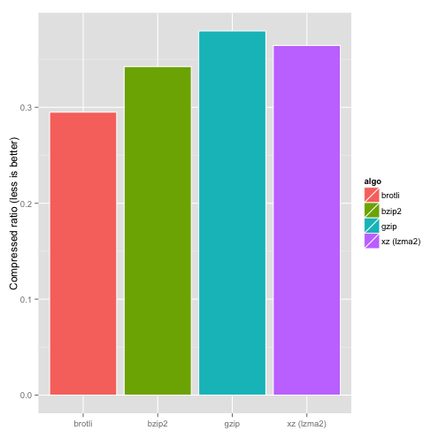

แต่แลกกับการที่กระบวนการ compress จะกินเวลานานกว่า GZip มากโขพอสมควร (ถ้าอยากใช้ Brotli ก็จะแนะนำว่าให้ใช้วิธีการ compress ทิ้งไว้ก่อนเลย)

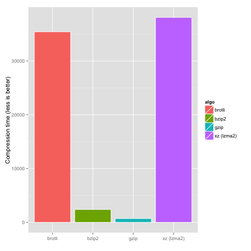

ทำให้โดยทั่วๆ ไป หลายคนจึงเลือกใช้ GZip กัน แต่ Brotli ก็น่าสนใจ เพราะเราสามารถใช้วิธีการ compress 1 ครั้งแล้วเก็บไว้เลยก็ได้ เพราะเวลาที่ใช้ในการ uncompress ของ GZip กับ Brotli ไม่ค่อยต่างกันนัก

โดยทั้ง GZip หรือ Brotli นั้นสามารถไปเปิดใช้ใน Nginx ได้เหมือนกันกับ HTTP/2

**GZip**

**Brotli**

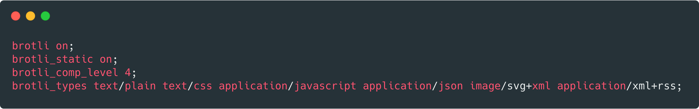

## Code-splitting: อะไรยังไม่ใช้ เอาออกไปก่อน ค่อยโหลดตอนจะใช้

หากเราลองคิดดูว่าในเว็บที่ทำด้วย JavaScript framework อย่างเช่น React, Vue, Angular เวลา build ไฟล์ออกมาจะประกอบด้วยอะไรบ้าง

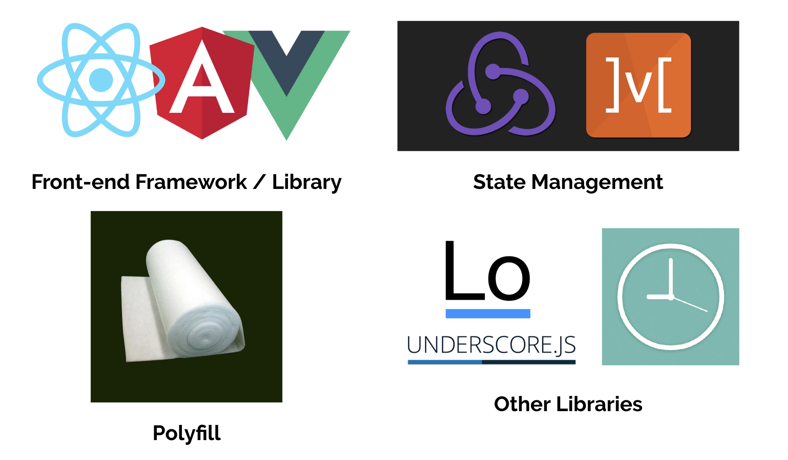

- **ตัว Front-end framework**: ในหลาายๆ framework เช่น React ที่เขียน runtime เองนั้นก็จะมีตัว runtime ซึ่งก็มีขนาดไม่เบาเลยทีเดียว
- **State Management**: บางทีเราก็จะใช้ state management tools เช่น Redux, MobX ในการจัดการ state ของตัวแอพ โค้ดดังกล่าวก็จะอยู่ในตัว bundle ด้วย
- **Polyfill**: บางฟีเจอร์ browser เก่าๆ ไม่มี ตัว polyfill จึงสำหรับไว้รองรับ browser เก่าๆ ที่ไม่มีฟีเจอร์นั้นๆ
- **Library อื่นๆ**: เช่น Lodash ไว้จัดการ data, Moment.js ไว้จัดการวันเวลา
- **ตัว apps**: แน่นอน ตัวแอพ ตัวโค้ดที่เราเขียนก็จะอยู่ใน bundle

เราจะเห็นว่า มีของหลายอย่างรวมใน bundle เดียวกันเยอะมากๆ และยิ่งถ้าแอพเรามีหลายหน้า แอพก็จะใหญ่ขึ้น bundle size ก็จะใหญ่ขึ้น และเราลองคิดดีๆ ถ้าเราไม่ทำอะไรเลย เวลาโหลด JS มาใช้ มันก็จะโหลดทั้งแอพมา ทั้งๆ ที่ user อาจจะใช้แอพอยู่แค่หน้าเดียว แต่โค้ด JS ดันมีแอพทั้งหมดทุกหน้าเลย

จึงมีไอเดียที่เรียกว่า **Code-splitting** โดยไอเดียก็คือ **อะไรยังไม่ใช้ เอาออกไปก่อน ค่อยโหลดตอนจะใช้**

การประยุกต์ง่ายที่สุดก็คือ **หน้านั้นยังไม่ได้เข้านี่หว่า ก็โหลดที่หลังสิ**

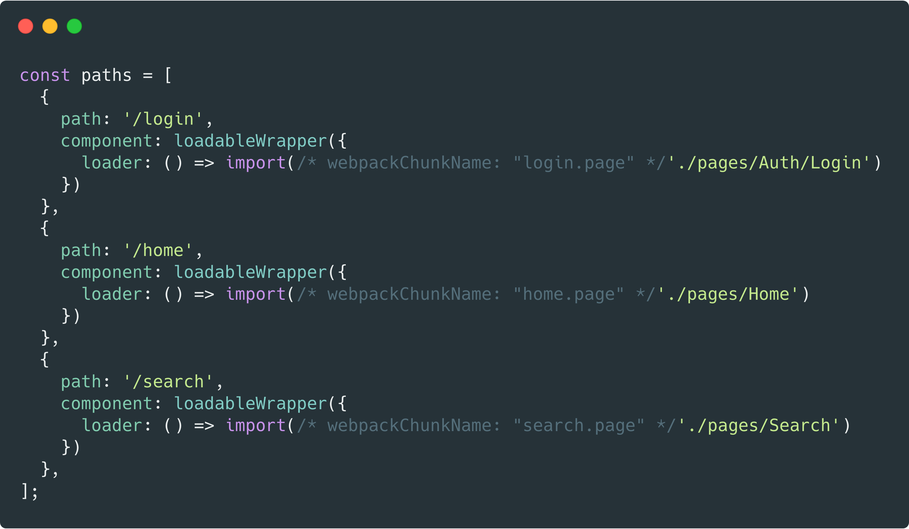

โดยใช้ฟีเจอร์ [dynamic import](https://v8.dev/features/dynamic-import) ของ JavaScript เข้ามาช่วยในการโหลด module ที่ไว้ใช้ทีหลังแยกออกไป แทนที่เราจะใช้ static import (`import`) แบบปกติบนหัวไฟล์

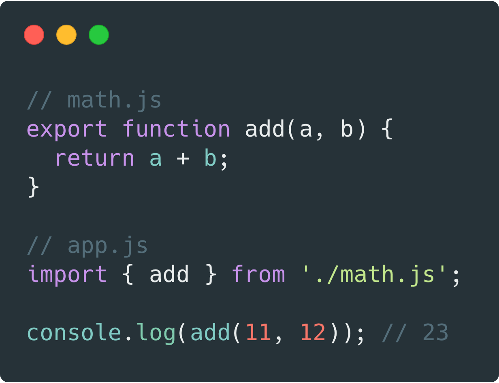

เวลาเราเขียน JS ปกติ เราก็จะทำแบบด้านบน เราเขียน module ออกมาเพื่อ re-use logic ที่จะใช้บ่อยๆ เวลาเอามาใช้ เราก็ import มัน

แต่ด้วยฟีเจอร์ dynamic import เราทำแบบนี้แทน

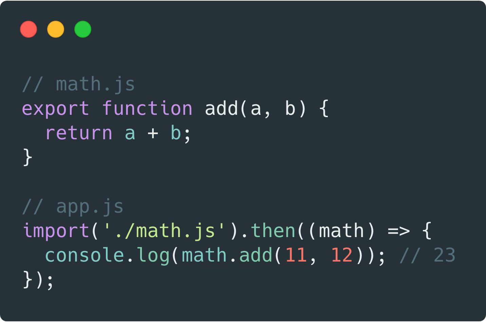

เราใช้การ `import()` แทน `import` แบบแรก เพื่อใช้ module ซึ่งตัว `import()` จะ return Promise ออกมา ทำให้เราจะใช้ `.then()` เพื่อนำ module ไปใช้ หรือจะเขียนเป็น `async await` ก็ได้เหมือนกัน

ผลที่ได้ หากทำการใช้ dynamic import ตัว module คือ ตัว webpack หรือ module bundler ทั้งหลาย จะ split แยกโค้ดของที่ถูกทำ dynamic import ออกมาเป็น chunk อีกก้อนนึง ออกจาก module หลัก

// หารูป compare 2 module

## Code-splitting ใน framework อย่าง React

ซึ่งอย่างใน React เอง library ทำ router เช่น react-router สามารถนำฟีเจอร์ dynamic import มาใช้คู่กัน เพื่อทำการ code-splitting ระดับ route ได้ พูดง่ายๆ ก็คือ path ไหนยังไม่ใช้ ก็จะยังไม่โหลด path ไหนเข้าไปแล้ว ถึงค่อยโหลด ซึ่งมีวิธีการทำสองวิธี

1. ใช้ react-loadable (สำหรับ React <= 16.5)

[react-loadable](https://github.com/jamiebuilds/react-loadable) เป็น library ที่ช่วยให้เราทำ code-splitting component ได้อย่างง่ายดายขึ้นมาก เพราะ API นั้นใช้งานง่ายมากๆ เพียงแค่ wrap ด้วย function ของตัว loadable แล้วนำมันไปใข้งานแบบ React component ได้เลย

ในตัวอย่างโค้ด ปกติ react-router จะรับ props ชื่อ `component` เพื่อบอกว่าหาก path match จะ render component อะไร เราก็จะทำแบบนี้กัน

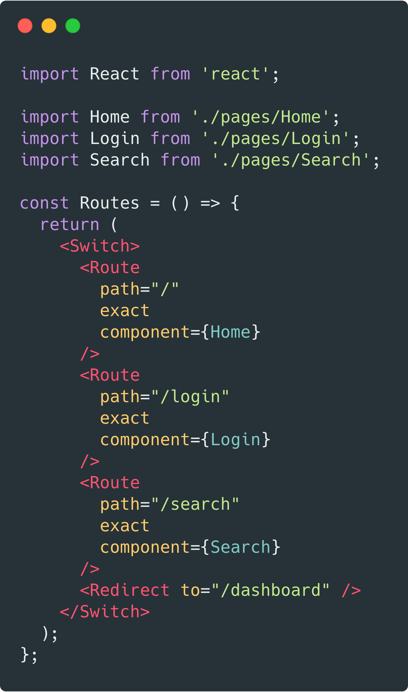

แต่ถ้าใช้ react-loadable แทนที่เราจะ `import` แบบปกติ เราใช้ dynamic import `import()` คู่กับตัว react-loadable เพื่อ import ตัว component ที่จะแสดงมาแทน

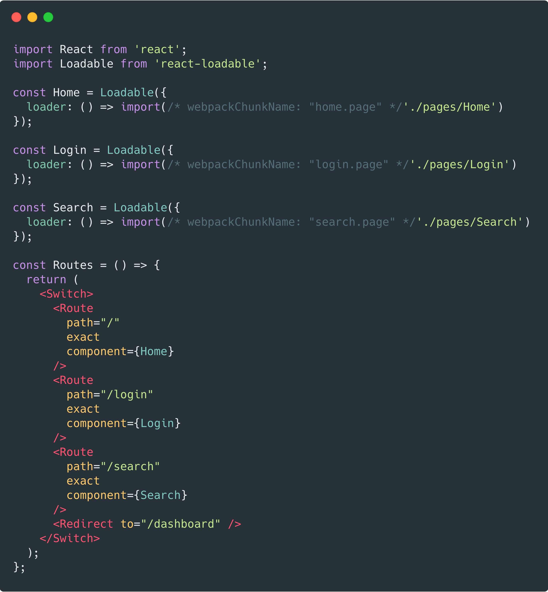

แค่นี้เราก็จะได้การทำ code-splitting แบบง่ายที่สุด คือแยกตาม route ของแอพเรา (เรียกว่า Route based Code-Splitting)

2. ใช้ React.Suspense + React.lazy (React 16.6 เป็นต้นไป)

ใน React 16.6 มีฟีเจอร์ใหม่ คือ `React.Suspense` กับ `React.lazy` ที่ให้เราทำ code-splitting ได้เลยโดยไม่ต้องโหลด library เพิ่ม

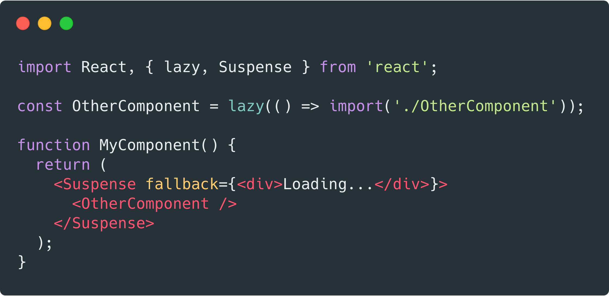

ถ้าดูเผินๆ วิธีการใช้จะคล้ายๆ กับ react-loadable คือมีการใช้ dynamic import `import()` คู่กับตัว `React.lazy` จุดแตกต่างคือมีการใช้ `React.Suspense` component ครอบตัว component ที่ถูก lazy ไว้

ถ้าเราอยากทำ Route based code-splitting แบบวิธีแรก ก็คือทำแบบนี้ได้เลย

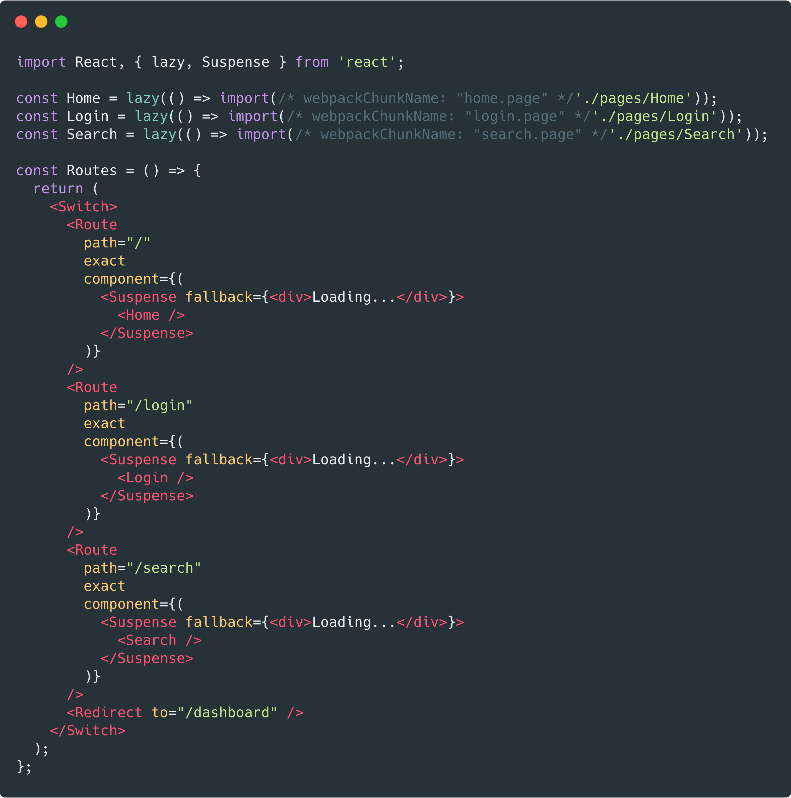

เพียงแค่เทคนิค simple ง่ายๆ Twitter สามารถลด bundle แรกที่ส่งออกไปให้ client ได้ถึง 45% เลยทีเดียว (Tinder เองก็มาบอกว่าลดไปได้ 50% เลยทีเดียว)
 
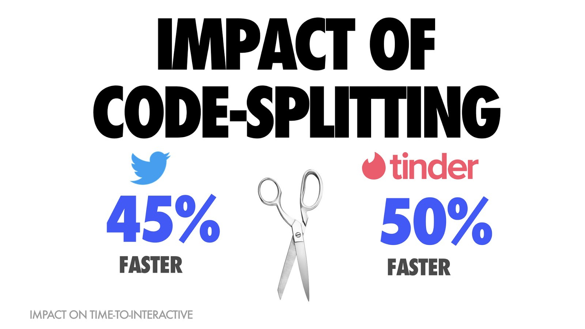

นอกจากนั้น การทำ code-splitting เองนอกจากระดับ route แล้ว ในแต่ละ route เราสามารถทำ code-splitting ได้อีก เช่น ถ้ามี component ไหนที่ยังไม่ถูก render หรือมีเงื่อนไขที่ถูก render ทีหลัง ก็สามารถทำ code-splitting ได้ โดยเอาตัว `React.lazy` กับ `React.Suspense` มาโหลดและแสดงผล component นั้นแทน

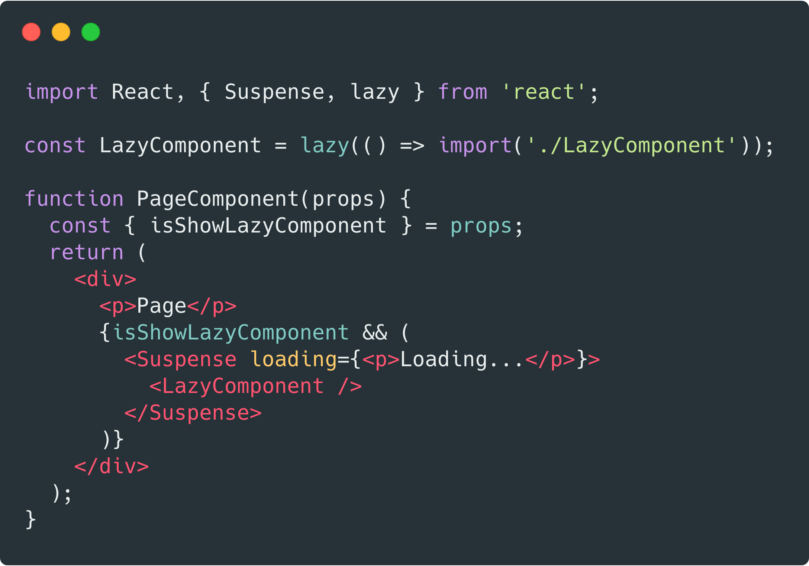

ซึ่งผมเองได้เอาเทคนิคนี้ไปใช้ในเว็บบริษัท ผลออกมาน่าพอใจ เพราะลด JS size รวมๆ ลงไป 16% โดยประมาณ

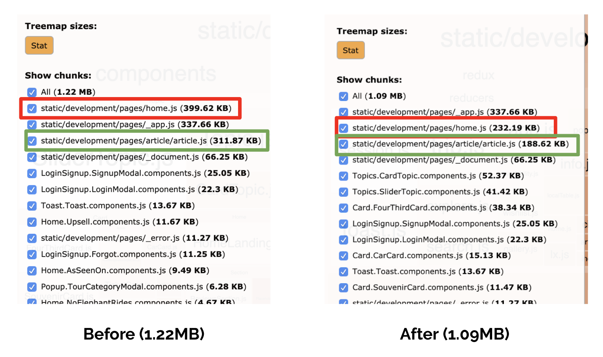

## Library บางตัวใหญ่จัด เอามันออกไปปปปปป

## Reference เนื้อหา และรูปภาพบางส่วนจาก

- [The Cost of JavaScript in 2018](https://medium.com/@addyosmani/the-cost-of-javascript-in-2018-7d8950fbb5d4)
- [The Cost of JavaScript](https://medium.com/dev-channel/the-cost-of-javascript-84009f51e99e)
- [JavaScript Start-up Performance](https://medium.com/reloading/javascript-start-up-performance-69200f43b201)
