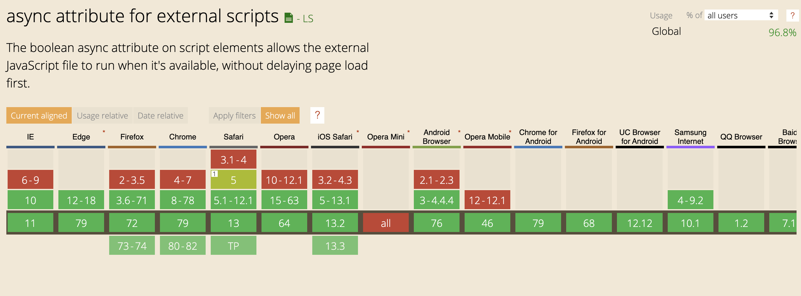
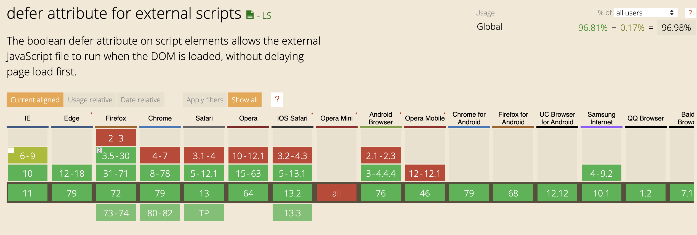

Web Performance Series สามารถอ่านตอนก่อนๆ ได้ดังนี้

- [Web Performance Series: จะใช้รูปอะไร โปรดคิดก่อน](/web-performance-series-optimize-images)
- Web Performance Series: แท็ก script ใช้ให้ดี มีประโยชน์ (ตอนที่คุณกำลังอ่านอยู่)

---

หลังจากทิ้งห่างไปนาน (นานเกินไป) กับบล็อกในชุด Web Performance Series วันก่อนผมได้ discuss คุยกับเพื่อนเรื่องเกี่ยวกับการโหลด JavaScript ผ่าน tag `<script>` ว่าการวางไว้ใน tag `<head>` กับ `<body>` ควรไว้ในไหน เลยนึกออกได้ว่าจริงๆ แล้วประเด็นนี้ก็เป็น 1 ในเรื่องที่น่าเอามาเล่าในการ optimize Web Performance ผมเลยเอาเรื่องนี้มาเขียนเป็นบล็อกต่อเลย

ปกติเวลา browser โหลด HTML เข้ามา สิ่งที่มันทำคือจะทำการ parse HTML ออกมา ให้ browser อ่าน ซึ่งตัว browser จะทำการอ่าน HTML ไล่บรรทัด แล้วทำงานตามนั้นจากบนลงล่าง

ซึ่งหากเรามี HTML แบบนี้

```html
<p>Hello World</p>
<script src="main.js">
```

มันก็จะทำการอ่านบรรทัดแรกก่อน แล้วค่อยทำบรรทัดต่อไป

## การโหลด JS ด้วย tag script จะ block parser process

หลายคนไม่รู้ว่า การใช้ tag `<script>` นั้น **เป็นการ block HTML parser process โดย browser จะไม่ทำอะไรเลยหลังจากอ่านเจอ tag script นั้น จะรอจนกระทั่งตัว JS โหลดสำเร็จ (หรือไม่สำเร็จ) แล้วทำการ execute script นั้น** ทำให้สิ่งที่เกิดขึ้นคือ browser จะเสียเวลาไปโดยเปล่าประโยชน์

ฉะนั้น หากย้อนกลับไปคำถามก่อนว่า ถ้าเราโหลด script ใน tag `<head>` จะเกิดอะไรขึ้น

```html
<html>
<head>
  <title>Hello JS</title>
  <script src="main.js"></script>
</head>
  <h1>Hello World...I got blocked</h1>
</html>
```

พอ browser อ่านถึงบรรทัดต้องโหลด JS มันก็จะ block การทำงาน แล้วรอให้ script `main.js` โหลดเสร็จสิ้น และ execute มัน จึงทำงานต่อได้

ดังนั้นกว่าเราจะได้เห็นคำว่า "Hello World...I got blocked" เนี่ย มันต้องมานั่งรอ `main.js` โหลดเสร็จ และ execute เสร็จ ถึงจะโชว์ขึ้นมาได้ ทำให้ user อาจพบปรากฎการณ์หน้าขาวนานผิดปกติ ส่วนนึงก็เพราะกระบวนการนี้

ดังนั้นหลายๆ คน (และรวมถึงผม) จะแนะนำให้เอา tag script ไปโยนไว้ใน `<body>` จะปลอดภัยกว่า

```html
<html>
<head>
  <title>Hello JS</title>
</head>
  <h1>Hello World...I got blocked</h1>
  <script src="main.js"></script>
</html>
```

เท่านี้มันก็จะไม่ block การทำงานแล้ว

และจริงๆ การเอาไว้ใน `<body>` มีอีกข้อดีคือ หากตัว script เราต้องมีการอ่าน DOM ในเว็บเรา มันจะการันตีได้ว่าสามารถอ่าน DOM ที่เว็บเรามีได้จริงๆ เช่นกรณีนี้

```html
<html>
<head>
  <title>Hello JS</title>
</head>
  <h1 id="intro">Hello World...I got blocked</h1>
  <script src="main.js"></script>
</html>
```

```js
// main.js
const element = document.getElementById('intro');
```

## แต่กระนั้นแล้ว

แต่ในความเป็นจริง เราไม่ได้มีการใช้ script เพียงแค่ตัวเดียว ในหลายๆ ครั้งเราก็โหลด script มาใช้ยาวแปดเมตรเห็นจะได้

```html
<script src="framework.js"></script>
<script src="main.js"></script>
<script src="module-a.js"></script>
<script src="module-b.js"></script>
<script src="module-c.js"></script>
<script src="module-d.js"></script>
<script src="thirdparty-a.js"></script>
<script src="thirdparty-b.js"></script>
<script src="thirdparty-c.js"></script>
```

ทีนี้จำที่ผมบอกว่ามัน block process ของ browser ได้ใช่ไหมครับ ลองนึกสภาพของโค้ดด้านบน ภาพที่จะเกิดขึ้นก็คือมันจะ

เริ่มโหลด -> รอ -> execute -> ทำต่อ -> โหลด -> รอ -> execute

วนไปตั้งแต่อันแรก จนจบ

ฉะนั้นมันจะ block กระจุยกระจายเลย

## async/defer to the rescue

ทีนี้ใน browser จึงออก feature ใหม่สำหรับการโหลด tag script เพิ่มเติมสองแบบคือ `async` กับ `defer` โดยใส่เป็น attribute ของ tag `<script>`

```html
<script src="main.js"></script>
<script async src="module-a.js"></script>
<script defer src="module-b.js"></script>
```

โดยทั้งสองแบบนี้แชร์ concept common ร่วมกันคือลดจำนวนการ block ลง โดยที่หาก script มีการใส่ `async` หรือ `defer` **ในจังหวะการโหลด script จะไม่ทำการ block parser** จะปล่อยให้ browser จัดการ HTML parsing ต่อไป

แต่ความต่างของสองแบบนี้คือจังหวะที่โค้ดจะถูก execute หลังโหลดเสร็จจะเป็นคนละแบบกัน


- ถ้าเป็น `async` script จะ **execute เมื่อถูกโหลดเสร็จ** ดังนั้นจึงมีการ block parser ในจังหวะที่ execute
- ถ้าเป็น `defer` script จะ **execute หลัง HTML parser ทำเสร็จ** ดังนั้นวิธีนี้จะไม่เกิดการ block HTML parser เลย

ถ้าสรุปโดยรูปภาพรูปเดียว ผมจะให้ดูรูปนี้


## ลำดับการเรียก?

ทีนี้เราก็จะมีประเด็นว่า หากใส่ `async` กับ `defer` หลายๆ อัน ลำดับการทำงานจะเป็นยังไง

```html
<script async src="main-async.js"></script>
<script async src="module-async-a.js"></script>
<script async src="module-async-b.js"></script>
<script async src="module-async-c.js"></script>
<script defer src="module-defer-d.js"></script>
<script defer src="module-defer-e.js"></script>
<script defer src="module-defer-f.js"></script>
```

จำง่ายๆ ว่า ด้วยธรรมชาติของ `async` ที่จะรัน script หลังโหลดเสร็จ ซึ่งจริงๆ เราไม่สามารถ predict ได้เลยว่าใครจะโหลดเสร็จก่อนเสร็จหลัง ดังนั้นลำดับเราจึงไม่สามารถคาดเดาได้มากนัก

กลับกันกับ `defer` ที่จะ execute script หลังจาก HTML parser เสร็จแล้ว มันจึงเรียก execute script ตามลำดับเดียวกันกับที่เราวางไว้ใน HTML

ดังนั้นจากตัวอย่างเริ่มต้น เราจะการันตีได้เลยว่า script `module-defer-d.js` `module-defer-e.js` `module-defer-f.js` จะรันตามลำดับนี้

แต่ในกรณีของ script `main-async.js` `module-async-a.js` `module-async-b.js` `module-async-c.js` เราจะไม่สามารถการันตีได้ว่า script ไหนจะถูกรันก่อนหลัง

## แล้วตอนเราจะใช้จริงๆ จะใส่อะไรดี?

หลายครั้งที่ผมลอง optimize web แค่ใส่ async/defer ให้ถูกต้อง ก็ช่วย speed up เว็บไซต์ได้เยอะขึ้นจริงๆ ทั้งๆ ที่ถ้าเราเทียบ effort แล้วมันไม่ได้เยอะมากมายด้วยซ้ำ แค่ใส่ async/defer ให้ครบ เรื่องนี้ึจึงเป็นสิ่งแรกๆ ที่ควรทำ

แต่สำหรับคนที่ยังสงสัยว่า จะใส่ async/defer ตอนไหนดี ผมมีทริกง่ายๆ ว่า

> ใส่ async ไปก่อน ถ้าพัง ใส่ defer ถ้ายังไม่รอด ต้องยอมใส่แบบธรรมดาไป

เท่าที่ผมลองมาแล้ว สุดท้ายใส่ defer หมด เหมือนจะรอดไปโดยปริยายเลยนะครับ

## Browser Support

ฟีเจอร์นี้ support browser หมดแล้ว เก่าๆ อย่าง IE เองก็ยัง support




---

ในส่วนตอนต่อไปจะเป็นเรื่องอะไรนั้น รอติดตามกันได้เลยครับๆ :D
