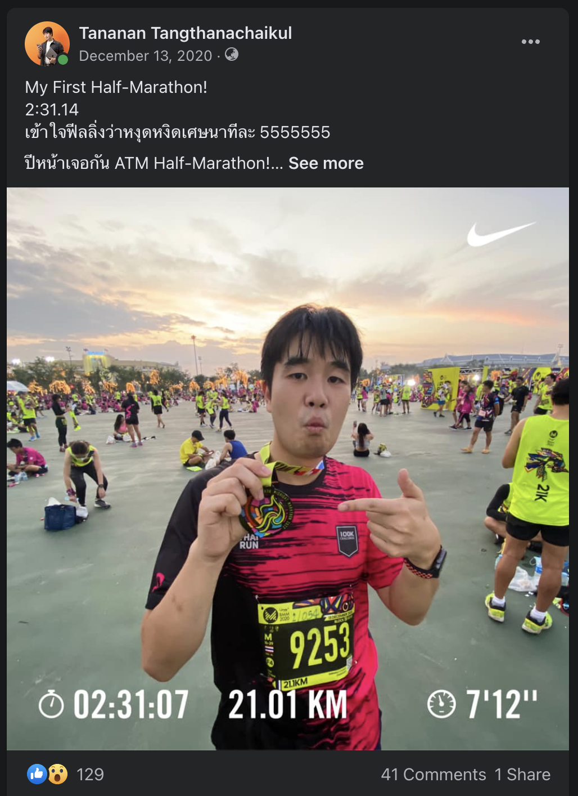
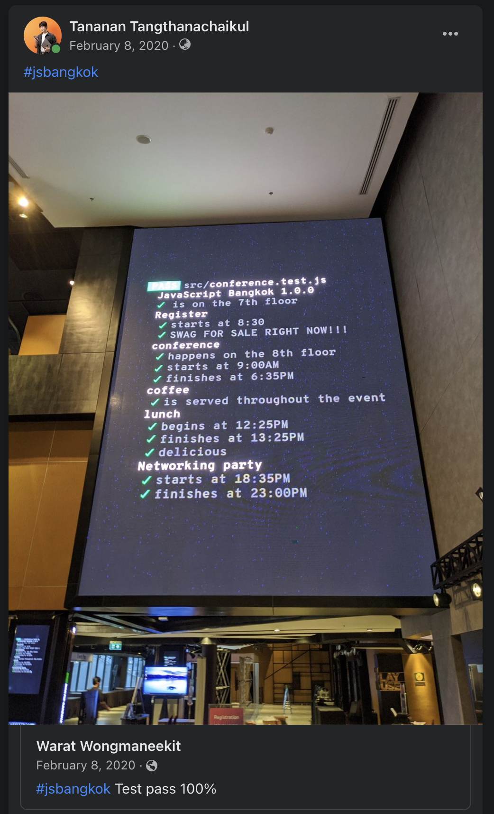

ใช่ครับ อ่านไม่ผิดหรอกครับ

> บล็อกชื่อว่า "2020 - 2021" และถูกเขียนในปี "2022"

วันนี้ที่เขียนบล็อก วันเสาร์ที่ 26 มีนาคม 2022 วันนี้ก็เป็นวันดีๆ อีกวันนึงที่ท้องฟ้าสวยงามมากๆ แบบน้ำตาจะไหล และก็นั่งรอคิวโมโม่อยู่ที่ร้าน GRAPH สาขา Siam Discovery ที่เปิดชั่วคราว

อยู่ๆ ก็นึกได้ว่า เอ๊ะ บล็อกก็ไม่ได้เขียนมาน่าจะ 2 ปีได้

เลยจัดแจง clone ตัวโค้ดลงมาในโน้ตบุ๊ค (ใช่แล้วครับ ยังไม่เคยแม้กระทั่งมีโค้ดเว็บนี้ในเครื่อง) นั่งอัพเกรด Library ที่เก่าชาติเศษ

แล้วก็มาเขียนบล็อกนี้ขึ้น ตรงร้านกราฟนี่แหละ

ซึ่งคนมันก็คงจะสงสัยว่า ทำไมอยู่ๆ มาเขียนเรื่องปี 2020 - 2021 กันในปี 2022 กันนะ

ความคิดผม ณ เวลานี้ก็คือ อยู่ๆ ก็อยากจะ reflect ตัวเอง อยากลองมองย้อนกลับไปดูว่า ในตัวตนปัจจุบัน ที่ทุกวันนี้รู้สึกเหนื่อยล้ากับวันธรรมดาอย่างมาก ทั้งภาระงานและใดๆ ก็แล้วแต่ และเสาร์อาทิตย์ที่มันก็ผ่านไปเร็วเหลือเกิน อยากรู้ว่าตัวเราเอง ณ วันนี้ มองเราในอดีต และเรื่องที่ผ่านมายังไงกันนะ

อะใช่ และผมก็อาจกำลังตั้งคำถามตัวเองว่า "หรืออดีตมันช่วยอะไรผมในวันนี้ได้ไหมนะ"

## ตัวตนที่เคยหลงลืม

เลยเล่นง่ายไปเปิดเฟสบุ๊คตัวเองนี่แหละ เพราะใดๆ คิดว่าเราน่าจะโพสสิ่งต่างๆ บนเฟสอยู่แล้ว มากด filter ดูปี 2020 - 2021

สิ่งแรกๆ ที่เจอคือโพสนี้

เชี่ย ตอนนั้นกุผอมขนาดนั้นเลยเหรอนะ

เชี่ย ตอนนั้น 21 โลวิ่งไปได้ยังไงนะ

ใช่แล้ว ตัวตนแรกที่เคยหลงลืมไป และช่วงนี้กำลังเอามันกลับมาพอดี คือ **นักวิ่ง**

พอนึกย้อนไปแล้ว ก็เลยจำได้ว่าปี 2020 เป็นปีที่มาจริงจังเรื่องสุขภาพครั้งแรกน่าจะในชีวิตเลย ปกติก่อนหน้าเป็นเด็กอ้วนกินตามใจปาก ไม่ค่อยออกกำลังกาย

แล้วก่อนหน้านั้นก็คิดตลอดว่า ตัวเองน่าจะน้ำหนัก 80 ละมั้ง

จนชั่งน้ำหนักมาวันแรก ป้าง 85 โล

เลยรู้สึกได้ว่า เชี่ย เกินไปแล้ว...ลดเถอะ

เลยตัดสินใจว่าออกวิ่ง...โอเค หลายคนก็แนะนำ รวมถึงพี่ที่ออฟฟิศก็แนะนำเหมือนกันว่า ถ้าอยากลดน้ำหนัก การวิ่งไม่ค่อยจะเป็นหนทางที่ดีนัก เทียบกับวิธีอื่นๆ

แต่ผมก็คิดแค่ว่า ก็ถ้ามันออกกำลังกายบ้าง ก็ดีกว่าไม่ออกแหละวะ และวิ่งก็เป็นกีฬาที่ออกได้ง่ายๆ เพราะขอแค่ชุดวิ่ง รองเท้าวิ่ง ก็พอแล้ว

เลยเริ่มออกสตาร์ทวิ่งตั้งแต่ตอนนั้นเป็นต้นมา

แต่แน่นอนว่า เราก็รู้ตัวแหละว่าวิ่งก็ไม่พอ เลยศึกษาแบบครูพักลักจำเอาจากพี่ที่ออฟฟิศ ที่เขาเองก็คุมน้ำหนัก เข้ายิมออกกำลังกาย ก็เรียนรู้พอให้ได้แนวทางว่าถ้าอยากลดน้ำหนักจริงๆ ก็ควรต้องคุมอาหาร

ทีนี้ด้วยความที่แม้เราอยากจะลดนำ้หนักแหละ แต่ก็ไม่อยากเอามากดดัน ว่าเดือนนี้ๆๆๆ ต้องลดเหลือแค่ 80 โลหรืออะไรนะ คือไม่อยากตั้งเป็นเป้าให้เครียดและกดดัน ก็เลยอาศัยว่าลดทีละหน่อยก็ดี ไม่ลดก็เท่าทุน ถ้าเพิ่มมาหน่อยก็อย่าให้มันเพิ่มอีกละกันวันต่อไป

สูตรลดน้ำหนัก ก็ไม่ได้มานั่งนับเป็นแคลๆ ว่าวันนี้กินไปแล้วเท่าไหร่ ไม่ได้นับโภชนาการละเอียด ไม่ได้นับโปรตีนว่าขาดขนาดไหน อาศัยสูตรหลักคือเลี่ยงน้ำตาล เลี่ยงของทอด ของเสี่ยงอ้วน หยุดหมดเลย

แต่ก็ยังมีโอกาสให้เราได้ชีทบ้าง เพราะถ้าเลี่ยงหรืองดตลอดบางทีเหมือนร่างกายไม่ได้ rewarding อย่างปีนั้นก็คือชานมไข่มุกให้กินแค่เดือนละแก้วพอ ก็ให้ reward ตัวเองตามสมควรไป แต่ก็ต้องยั้งใจว่าไม่ควรให้บ่อยๆ

ก็เป็นความยากแหละ เพราะการลดน้ำหนักนี่ว่าเหมือนๆ กับการสั่งสมบุญแบบนึง คือมันเห็นผลชัดๆ วันนี้พน. ไม่ได้หรอก มันต้องไปเรื่อยๆ พอเรามาไกลแล้วมองย้อนไปก็จะ โอ้ ก็มาไกลจริงๆ

ตัดข้ามมาจากการลดน้ำหนัก ก็เรื่องการวิ่ง

การวิ่งนี่ผมเองจะชอบถูกถามประจำว่า "วิ่งนี่มันสนุกยังไงนะ"

ผมจะตอบตรงๆ ว่า

"เอาจริงมันก็ไม่ได้สนุกซะทีเดียวนะ"

5555555555555555

คือต้องเล่าก่อนว่าจริงๆ แล้วการวิ่งที่สนุกและเอาสุขภาพที่กำลังดี คือการวิ่งระยะไม่เกิน 5 กิโลเมตร เพราะเป็นระยะที่พอดีทั้งความสนุก ความเหนื่อย และได้สุขภาพด้วย

แต่ถ้าเกินจากนั้น จะ 10 / 15 / 21 / 42

พวกนี้เอาจริงๆ มันคือ "ความหาทำ" รูปแบบนึง

และเป็นความหาทำที่อาจเป็นการเอาร่างกายมาทรมานด้วยนะ

ลองนึกภาพคนๆ นึงวิ่งสับเท้าซ้ายขวาไปเรื่อยๆ ในเส้นทางที่บางทีก็ต้องวนๆ เป็นระยะเวลาเป็นชั่วโมง เป็นระยะทางกว่า 10 กิโลเมตร สลับไปเป็นพันๆ หมื่นๆ ก้าว มีหยุดบ้าง มีหย่อนบ้าง เร่งบ้าง เป็นใครจะไม่เบื่อ

ใช่ ตูยังเบื่อเลย 555555 ยัดเพลงก็แล้ว ทำอะไรต่ออะไรก็แล้ว

แล้วถามว่าทำไมตัวผมเองก็ยังเลือกวิ่งในระยะที่มันท้าทายขนาดนั้น

"ก็เพราะเราเห็นตัวเองกำลังก้าวขีดจำกัดบางอย่างของตัวเองอยู่เรื่อยๆ มั้ง"

เลยนึกความคิดและความรู้สึกตอนวิ่งได้ 10 กิโลแรกออกเลย

ในวันนั้นก็เป็นวันปกติทั่วไป อากาศก็พอได้ ตอนนั้นสถิติไกลสุดก็น่าจะที่ 5 กิโลได้ ไม่เคยเกิน 7 กิโลคือสามรอบสวนลุมแน่ๆ

ก็ไปใช้ชีวิตตามรูทีนที่เคยเป็นของการวิ่ง ก็คือจะหาร้านกาแฟนั่งกินก่อนไปสวนลุมช่วงห้าโมงเย็น

วันนั้นไม่ได้กะวิ่งอะไรมากมาย แต่พอวิ่งไปได้ห้าโล อยู่ๆ ก็รู้สึกว่า เออหรือเราจะลองอีกสักรอบนึง

ก็เลยซัดไปอีกรอบ เป็น 7.5 กิโล นั่นเอาจริงก็เป็นการ "ทะลายกำแพงขีดจำกัด" ของตัวเองไปแล้วนะ

และก็คิดได้ว่า แต่ถ้าเอาอีกรอบก็จะได้ 10 โลเลยนะ

สิ้นความคิดนั้น ก็ซดน้ำหนึ่งอึกที่เหลืออยู่ และก็สับเท้าไปต่ออีกรอบนึง

แล้วก็ครบรอบนึง แท่นแท้น 10 กิโลเมตรแรกของชีวิต

ถ้าดูจากสถิติตอนแรกมันก็คงไม่ได้ดีมากหรอก แถมยังเป็นการวิ่งๆ เดินๆ  แต่นั่นก็เป็นก้าวแรกของการบอกกับตัวเองว่า "10 โลกูก็วิ่งได้" และนั่นทำให้ 10 กิโลเมตรที่สอง ที่สาม ที่สี่ ที่ห้า และ so on มันก็มีมาเรื่อยๆ ด้วยสถิติที่ก็ดีขึ้นเรื่อยๆ นั่นก็หมายถึงร่างกายแข็งแรงขึ้นเรื่อยๆ ทนทานขึ้นเรื่อยๆ ตามมาเป็นเงา

และเรื่องเช่นเดียวกันก็เกิดขึ้นกับการวิ่งได้ 12 กิโลเมตรแรก

และเรื่องเช่นเดียวกันก็เกิดขึ้นกับการวิ่งได้ 15 กิโลเมตรแรก

และเรื่องเช่นเดียวกันก็เกิดขึ้นกับการวิ่งได้ฮาฟมาราธอนแรก

พอมองย้อนมา มันเหมือนกับการที่เราค่อยๆ ขยายขีดจำกัดของเราเองออกไปเรื่อยๆ

วันนี้ไม่ได้ ไม่เป็นไร พรุ่งนี้เอาใหม่

วันนี้แย่กว่าเมื่อวาน ไม่เป็นไร พรุ่งนี้เอาใหม่

วันนี้ดีกว่าเมื่อวาน เรายินดี และ celebrate small win และพัฒนาต่อในวันพรุ่งนี้

การวิ่งเอาจริงแอบสอนปรัชญาการใช้ชีวิตได้ดีเหมือนกันนะ

"ชีวิตคนเรามันก็มีวันดีบ้าง แย่บ้าง เป็นธรรมดา"

ก็เหมือนวันนี้เราวิ่งได้ดีมากๆ ได้ New Personal Best บางวันเราก็ทำได้ไม่ดีเลย

ก็เรียนรู้จากมันเข้าไว้

---

พอไถๆ ฟีดไปเรื่อยๆ อีก ก็ไปเจอว่าอีกตัวตนที่หลงลืมไปพอสมควรคือ **มนุษย์ Tech ผู้จัดและช่วยจัด Meetup**

พลันคิดว่านานเท่าไหร่แล้วฟะ ที่ไม่ได้ไปงาน meetup แบบ offline กัน

โห แม่งก็สองปีเลยนะ

ปี 2020 ต้นปี คือเราจัดงาน JavaScript Bangkok 1.0.0 เป็นงาน JavaScript Conference ที่ใหญ่ที่สุดในประเทศไทยเป็นครั้งแรก ซึ่งพอมามองย้อน เราคิดว่า แม่งโคตรรรรรรโชคดีที่จัดตอนนั้น เพราะถ้าไม่จัดตอนนั้น น่าจะอดจัดจนถึงทุกวันนี้ เพราะอีกประมาณเดือนนึงโควิดบุกพอดี

งานนั้นเป็นงานที่จัดสนุกมาก และเชิญสปีกเกอร์ที่โคตรเก่ง และมาจากหลากหลายประเทศด้วย เพื่อให้สมกับมันเป็น JS Conference ครั้งแรกของประเทศหน่อย

แต่เอาจริง เสน่ห์ของงาน conference หรือ meetup ต่างๆ เช่น BKK.JS เอย หรืองานไหนต่อไหนก็ตามรวมถึง JS Bangkok ไม่ใช่แค่มีคนเก่งๆ มาเล่าเรื่องราวหรือแชร์ความรู้แบบไม่กั๊กกัน แต่คือการ Networking ต่างหากล่ะ

พอเจอเหตุโควิด งานหลายๆ งานมันกลายเป็น Online ซะเยอะ มันก็พอแก้ขัดได้ แต่พอมาตอนนี้เราคิดย้อน จริงๆ เราแม่งโคตรจะคิดถึงการ Networking แบบ Offline มากๆ

มันเป็นพื้นที่ที่ให้เราได้แชร์ประสบการณ์ เรื่องเล่า ไปหา connection หาโอกาสใหม่ๆ บางทีเจอเพื่อนใหม่ที่เป็นคนวงการเดียวกันได้

ถึงแม้นี่จะเป็นมนุษย์ Introvert แต่เอาจริงส่วน Networking จริงๆ คืออันที่ได้เยอะกว่าการนั่งฟังสปีกเกอร์เยอะมากๆๆๆ

ก็คิดถึง Offline Meetup จริงๆ แหละ และถ้ามีจัดอีก ก็จะไปแบบไม่ลังเลเลยล่ะ

## โควิด

อ่ะในช่วง 2020 - 2021 มันจะไม่พูดถึงโควิด ไม่น่าได้

พอมาปีนี้ เราเริ่มมองว่าโควิดเป็นโรคประจำถิ่น วัคซีนเริ่มเข้าถึง แม้จะมีความกำหมัดว่ากะต้องจ่ายเงินเพื่อเอา mRNA ก็ตามที หรือต่อให้ติดโควิดตอนนี้ ก็ยังงงๆ ว่าจะทำยังไงกันดี ให้ Home Isolation และกูจะได้ยาไหมนะ หรือยังไงนะ หาเตียงก็หาย๊ากยาก ถ้าไม่เส้นก็ไม่รู้จะได้ไหม

แต่กระนั้น ตอนนี้ตัวฉันก็นั่งอยู่กราฟสาขา Siam Discovery คนเดินห้างเยอะมาก ไม่ขาดสาย เหมือนกลับมาเป็นปกติ เพิ่มเติมคือทุกคนใส่มาสก์

แต่ให้ย้อนไปช่วง 2020 ที่โควิดระบาดแรกๆ นะเหรอ ทุกคนไม่ชิวแบบทุกวันนี้แน่นอน

ทุกคนต่างกลัวโรคระบาดชนิดนี้มากๆ ระดับที่ว่าไม่กล้าออกจากบ้านกันจริงๆ หรือการออกจากบ้านก็กลายเป็นเรื่องน่ากลัวโคตรๆ ไปแล้ว

เรา Work from Home กัน อยู่บ้านจนเส้นคำว่าบ้านกับที่ทำงานมันหายไปแล้ว งานกับบ้านถูกหลอมรวม แยกเวลาเริ่มงานเลิกงานไม่ค่อยออก...อ่ะ โอเคหลายคนก็อาจจะชอบ แต่ช่วงแรกนี่คือเป็นแบบนั้นจริง

ห้างปิด เหลือแต่ supermarket ของกินต้องซื้อกลับบ้านเท่านั้น

ปิดพรมแดน บินไปต่างประเทศไม่ได้

เดินทางข้ามจังหวัดยังลำบาก

ชีวิตเหมือนอยู่แต่ในบ้านตลอดเวลา

แถมด้วยมาตรการรัฐที่โคตรจะหัวปวดต่างๆ นาๆ ตอนนั้นเราก็มองไม่ค่อยเห็นอนาคตกันเท่าไหร่ว่าเหตุการณ์นี้จะไปจบตรงไหน ละมันจะเป็นภาพยังไง

---

เหมือนคำกล่าวที่หลายคนบอกว่า โควิดส่งผลกระทบกับทุกคน และก็ไม่เหมือนกันด้วย

หลายคนอาจจะชอบ โอ้ชีวิตได้ work from home สบายดีออก flexibility เยอะขึ้น

หลายคนมองว่าเป็นโอกาสได้ลองทำอะไรใหม่ๆ ทำกับขงกับข้าว

ส่วนถ้าถามผมว่า เป็นยังไงน่ะเหรอ

"มรสุม"

เพราะเหตุหลักๆ มาจาก TakeMeTour ที่ผมทำงานด้วย เป็น TravelTech

และแน่นอนว่า พอโควิดมา การท่องเที่ยวโดนหนักมาก เต็มข้อ

จากที่บริษัทกำลังโต กำลังได้โจทย์ใหม่ที่ท้าทายทั้งทีม อนาคตสดใสโคตรๆ

อยู่ๆ เราเห็นนักท่องเที่ยวขอยกเลิกการจอง เพราะโควิด

คนพาเที่ยว เริ่มไม่สบายใจ เพราะโควิด ไม่กล้าพาทัวร์

ยอดจองเริ่มหดลงเรื่อยๆ

และอยู่ๆ รายได้ก็เป็นศูนย์

แถมโควิดเริ่มระบาด ทีมเริ่มถามหาเรื่อง Work from home

ผมจำวันที่ไม่ได้เลยว่าวันไหน และผมก็ไม่โพสลงเฟสบุ๊คด้วยซ้ำ เพราะผมจำได้แม่นว่าเป็นวันนึงที่โคตรมืดหม่นมากๆ น่าจะมากที่สุดอันนึงของชีวิตแล้ว

พี่นพพี่ต้า ที่เป็น Co-Founder บอกกับผม และวงทีม Management ตรงๆ ว่า เงินสดเราอยู่ได้อีกสองเดือน ถ้าไม่ทำอะไรสักอย่าง เลยคุยกันว่าจะทำยังไง เพราะพี่นพพี่ต้าก็จนปัญญากันจริงๆ

เลยได้ข้อสรุปว่า ก็ต้องหั่นเงินเดือนออก บางคนอาจต้องลดวันทำงาน เป็นหนทางเดียวที่จะรักษาทีมไว้ให้ไปต่อกันได้ทุกคน ในระหว่างที่เราหาทางออกว่าจะทำยังไง

วันนั้นมันมืดหม่นมากจริงๆ เพราะนอกจากพี่นพพี่ต้า ต้องทยอยแจ้งข่าวร้ายเรื่องลดวันทำงานและลดเงิน ซึ่งผมในฐานที่เป็นคนที่ก็น่าจะมี emphaty เยอะพอสมควร ก็เข้าใจทุกคน เข้าใจทั้งมุมพี่นพพี่ต้าที่เป็นเจ้าของบริษัท ว่ามันก็ต้องประคองทีมให้ไปรอด มันต้องหาทางไปต่อ แต่ผมเองก็เข้าใจทุกคนในทีม ว่าการโดนหั่นเงินออกมันก็ส่งผลกระทบตรงๆ แน่ๆ

**แถมมันเป็นวันสุดท้ายที่ทุกคนได้เจอกันที่ออฟฟิศ**

**และก็ไม่รู้ด้วยซ้ำว่า ถ้าเรากลับมาทำงานออฟฟิศกันจะยังเจอกันครบทีมเหมือนเดิมไหม**

---

แต่ก็เหมือนคำกล่าวว่า ฟ้าหลังฝนย่อมสวยงามเสมอ

ในช่วงโควิดแรกๆ เราเริ่มมาทำงานเป็น project รับงานมาทำต่อ ตอนนั้นเข้าข่ายว่า มีอะไรให้กุทำ เอามาเหอะ ทำหมดอะ

ตอนนั้นถือโปรเจคหลายๆ อันมาก หัวหมุนกันมาก แถมยัง Work from home ในสเกลทั้งทีม ทุกอย่างใหม่มาก งงมาก เครียดมาก

เส้นแบ่งเวลางานกับชีวิต มันเริ่มหายไปทีละนิดๆ เริ่มงานเช๊าเช้า แต่เลิกงานมืดมาก

บางคนในทีมโดนโปรเจคนรก ทำงานเบ็ดเสร็จติดกัน 20 วันต่อเนื่อง

แต่พอผ่านไปได้สักสองเดือนได้ เราเริ่มจะรอด เราเริ่มจะเห็นหนทางใหม่ เห็นโอกาสใหม่

as a ผมเองก็ได้โอกาสใหม่ มาจอยเป็น CTO ในบริษัทใหม่ที่ชื่อว่า "Orange Cap Innovative" ในทิศทางใหม่ ในสเกลใหญ่ ในความท้าทายใหม่ๆ

อีกขานึงของทีมก็มีทำ "EasyCompany" ที่ได้พี่ขวัญ นักกฎหมายมือฉมังที่โคตรจะเก่งมากๆ มาจอยทีมกัน และมีความฝันว่าอยากทำ LegalTech เจ๋งๆ ในไทยให้เกิดขึ้นมาให้ได้

เหมือนความรู้ของทีมมันได้โตและกว้างขึ้น จากเดิมมีแค่ Product / Tech / Business / Design ตอนนี้มันมี Legal เข้ามา ก็สนุกไปอีกแบบ

เอาจริงตอนแรกที่ได้ offer CTO นี้มา ก็ยังงงๆ อยู่ ยังกังวลว่ามันต้องทำอะไรบ้าง มันต้องยังไงบ้างนะ แต่ก็ตอบรับไป

เพราะเราก็มองว่ามันเป็นโอกาสอันดีที่จะได้ลองทำอะไรใหม่ๆ ได้เติบโต
