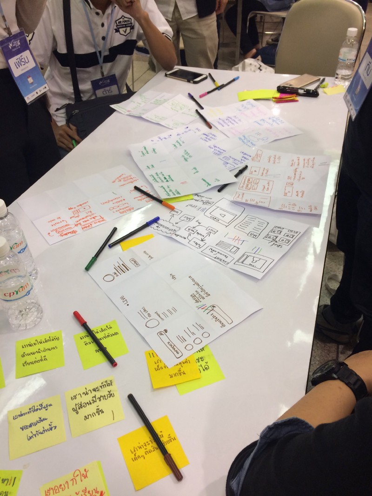

ปกติผมเขียนบล็อกในโฮสต์ของตัวเองครับ แต่มาลองเปลี่ยนมาเขียนใน Medium ดูบ้าง

**หมายเหตุ:** บล็อกนั้นจะ geek เยอะมากๆ ใครไม่ใช่สาย dev จะหาเรื่องอ่านยากมากนะ ฮ่าๆ

โอเค เข้าประเด็นเลยดีกว่า คือเพิ่งได้มีโอกาสไปเข้าร่วมค่าย Young Webmaster Camp ครั้งที่ 14 (YWC#14) เพิ่งกลับมาถึงบ้านเมื่อวานนี้ (นอนตายสนิท) ก็เลยมาเขียนรีวิวแชร์เรื่องราวให้ฟังกัน ว่าค่ายนี้มันคืออะไร สมัครแล้วสัมภาษณ์เป็นยังไง เข้ามาในค่ายแล้วเจออะไร

## YWC คือค่ายอะไร?
YWC เป็นค่ายที่เปิดโอกาสให้นิสิต-นักศึกษาในระดับมหาวิทยาลัย ทุกสาขาอาชีพ ทุกชั้นปี ที่สนใจในสายงานของการทำเว็บไซต์สมัครมาเข้าค่ายได้ โดยสาขาในค่ายนั้นจะมี 4 สาขาด้วยกัน คือ

- **Web Programming:** แน่นอน เว็บจะเกิดขึ้นมาให้เห็นได้ ก็ด้วยพลังของ Developer ขอบตาดำ(กำ)
- **Web Designer:** แต่ถึงแม้ Web Programming จะเสกเว็บให้ขึ้นออกมาได้ แต่หากขาดการ Design ไป ก็ไม่ได้เว็บที่มีหน้าตาสละสวยมาให้ใช้ไง ดังนั้น ดีไซน์เนอร์ระดับพี่ยุ่นฟรีแลนซ์(ไม่ได้นอนเฉย) ก็มีบทบาทสำคัญในการสร้างเว็บด้วย
- **Web Content:** ถึงแม้เราจะมีทั้งคนเขียนโค้ด ทั้งคนดีไซน์แล้ว แต่ถ้าเว็บไร้เนื้อหาที่ดึงดูดให้คนเข้ามาดูเว็บของเรา เว็บก็คงจะไม่มีจุดน่าสนใจใช่ไหมล่ะ ดังนั้นคนทำ Content ที่อดหลับอดนอนเพื่อคิด Content ระดับคุณภาพ จึงมีบทบาทสำคัญมากๆ เพราะ Dev กับ Designer ก็คิด Content สู้คนทำ Content จริงๆ ไม่ได้หรอก จริงไหม
- **Web Marketing:** และท้ายสุด หากเว็บมีทุกอย่างแล้ว ทั้งโค้ด ทั้งดีไซน์ ทั้งคอนเท้นท์ แต่หากขาดคนทำการตลาดที่ยอมแหกตาตื่นตลอดคืน เพื่อหา Business Model ที่จะทำเงินให้กับเว็บได้ เว็บก็เจ๊งอยู่ดี เพราะสุดท้ายเว็บจะไม่มีเงินเข้ามาเลย
แม้ว่าอ่านๆ มา ทุกสาขาแม่งจะอดนอนเหมือนกัน(เวรกำ) แต่ทุกสาขาต่างพึ่งพาอาศัยกันครับ อย่างที่ได้กล่าวๆ ไว้

ซึ่งในค่ายนั้น ก็จะมีกิจกรรมเยอะแยะมากมาย ทั้งมีสาระ เช่น ฟังบรรยายจากพี่ๆ ตัวเทพในสาขา (ตัวเทพจริงๆ อันนี้บอกเลย) รวมถึงทำโปรเจคที่ยิ่งใหญ่อลังการงานสร้าง (ที่เป็นแก่นหลักของค่ายนี้) และกิจกรรมไม่มีสาระก็ยังมีด้วย เช่น สันทนาการ เล่นเกมฐาน บลาๆๆ เรียกได้ว่ากิจกรรมนี้มีหลากหลายครบเครื่องเลยทีเดียว

## สมัครยังไง?

ค่ายก็จะมีเปิดรับสมัครบนเว็บครับ ช่วงเวลาไม่แน่ใจว่าตรงๆ กันไหมในทุกๆ ปีแต่ของปีนี้จะสมัครช่วงกันยายน — พฤศจิกายน ครับ ซึ่งก็ตามปกติของค่ายนั้นการสมัคร ก็จะต้องมีการตอบคำถาม โดยจะมีทั้งคำถามส่วนกลาง ที่จะถามภาพกว้างๆ และทั้งคำถามสาขา ที่จะถามเฉพาะเจาะจงไป

ในส่วนของคำถามสาขานั้น คือเราสมัคร Programming ไป (จริงๆ สมัครค่ายนี้ตั้งแต่ปีที่แล้วละ แต่ดันไปสมัคร Content ที่ติดก็แย่ละ 55) คำถามที่จะเจอก็จะแบบให้คิดเยอะอยู่เหมือนกัน ปีเราคำถามก็มี

- เลือก tools หรือ framework ที่ชอบที่สุดขึ้นมาตัวนึง อธิบายว่ามันคืออะไร ข้อดีข้อเสียคืออะไร
- หากต้องทำเว็บจดโน้ตออนไลน์ คล้ายๆ Google Notes น้องจะใช้ tools อะไรในการทำบ้าง ให้ครบทุกส่วน ทั้ง Front-End Back-End Database
- ทำไมน้องอยากเป็น Web Programmer

ซึ่งบางข้อเนี่ย ตอบได้อย่างชิว เว้นข้อสุดท้ายนี่แหละ แบบสะอึกมานิดนึง จะตอบว่า “ก็เพราะชอบทำเว็บ” มันก็กระไรๆ อยู่เนอะ 5555 แต่ตอนตอบนี่ก็ไม่ได้ตอบแบบ ไม่ใช่คำตอบของตัวเองนะ คือมันเป็นเหตุผลที่อยากเป็น Web Programmer จริงๆ เหมือนกัน

## สัมภาษณ์?

คือเท่าที่เราทำค่ายมา และเคยเห็นระบบการรับสมัครค่ายต่างๆ ก็จะอิงการคัดเลือกคนเข้าค่ายจากการตอบคำถามในใบสมัครนี่แหละ แต่ค่ายนี้มีอะไรที่ extra มาอีกชั้นนึงครับ คือค่ายนี้มีการ**สัมภาษณ์**เพื่อเข้ามาในค่ายอีกด้วย และการจะสัมภาษณ์นั้น ไม่ใช่ว่าทุกคนเข้ามาแล้วก็สัมภาษณ์นะ ต้องมีการทำ**การบ้านสาขา**อีก! การบ้านนั้นก็จะตามแต่ละสาขาให้ทำครับ

และผมสมัคร Programming ใช่ไหมละ แน่นอน การบ้านก็ต้องมีแนวโค้ดๆ ชัวร์ การบ้านที่โดนก็คือ **“ให้ทำเว็บที่มี 1 ไฟล์เท่านั้น มีตัวอักษร YWC อยู่ และให้แสดงความสามารถของ HTML5 ออกมาด้วย”**

ฟังเหมือนจะง่าย แต่จริงๆ มันไม่ง่ายเลย เพราะเขาต้องการ 1 ไฟล์เท่านั้น นั่นหมายความว่า เราต้องยัดทุกอัน ทั้ง CSS และ JavaScript ไปอยู่ใน Single HTML และด้วยความไม่แน่ใจว่าจริงๆ แล้วจะมีเน็ตไหมในที่สัมภาษณ์ ทำให้การทำต้อง base อยู่ที่ Offline first คือไม่มีเน็ตก็เข้าได้

และผมก็ทำอันนี้ไปครับ แงะ Source Code ดูกันได้

และก็ถึงเวลาสัมภาษณ์ครับ คือได้สัมภาษณ์รอบเช้า ก็ไปตั้งแต่เช้าเลย ตอนก่อนเข้าสัมภาษณ์ก็ชิวๆ นะ คือเตรียมงานที่เคยทำมาทั้งหมดแล้ว (เผื่อพี่เขาจะดู) แต่พออยู่หน้าห้อง และใกล้จะถึงคิว ความตื่นเต้นก็แบบ มาเฉย คือมือไม้เริ่มสั่น 555 และพอถึงคิว ก็เข้าห้องสัมภาษณ์ไป ได้สัมภาษณ์กับพี่ฮั้น CTO ของ Jitta ที่เป็น Startup ของคนไทยแท้ๆ แต่ไม่ได้เกิดที่ไทย(งงอะดิ) กับพี่บัง ที่เป็น 1 ใน contributor ของ Joomla!

> **สำหรับคนนอกสายที่เข้ามาอ่านนะ** Contributor เป็นคำที่มีการใช้ในวงการ Open Source คือเป็นวงการที่มีคนทำโปรเจคต่างๆ และทำการ Open Source Code ให้เลย ก็คือไม่มีการอุบอิบโค้ดใดๆ เลย โค้ดที่ release ปล่อยจริงเป็นยังไง ก็เป็นยังงั้นเลย ทีนี้ถามว่าทำไมเขาต้อง Open Source หล่ะ เหตุผลส่วนนึงคือ สมมติเรามีไอเดียอยากจะทำอะไรดีๆ เจ๋งๆ เราก็เปิดโปรเจคมา แล้วเราก็ทำๆ ไป สักพักนึงเราก็ค้นพบว่า เฮ้ยมีคนสนใจโปรเจคเราแฮะ อยากทำร่วมด้วย เขาก็มาช่วยเราทำได้ หรือแบบ เฮ้ย โค้ดตรงนี้มันเขียนไม่ดีนะ เขาก็มาช่วยแก้ให้ ซึ่งการช่วยทำ ช่วยแก้เนี่ย เขาเรียกว่า Contribute ให้ครับ ซึ่งในโปรเจคยักษ์ๆ ทางด้านการทำเว็บที่ดังๆ ต่างเป็น Open Source ทั้งนั้นครับ และ contributor ก็มีเยอะคนมากๆ

มาถึงพี่ฮั้นก็โยนคำถามมารัวๆ เลย ก็เริ่มจากถามชื่อ ต่อมาก็เริ่มถามลึกละ ว่าแบบ เนี่ยเห็นเขียนว่าเคยเขียน Angular 2 มาใช่ไหม ก็บอกว่าใช่ ก็ถามว่าชอบ TypeScript ป่าว ก็ตอบไปตามความรู้สึกส่วนตัว แล้วก็ถามว่าซีเนียร์โปรเจ็คทำอะไร ก็เล่าไปให้พี่เขาฟัง (พี่เขาก็บอกว่าดูไม่ค่อยมีอะไรนิ…กำ ก็เลยบอกว่า พี่ผมทำตั้งแต่ Low-Level Network ยัน Application เลยนะ 55)

นอกจากถาม technical แล้วก็มีแบบคำถามชิวๆ ด้วยนะ เช่น ถามว่ารู้จักพี่นัทพี่วีไหม (เป็นพี่คณะ ซึ่งพี่นัทก็ไปทำงานอยู่กับ Jitta) ก็ตอบว่ารู้จัก พี่ก็ถามต่อ “แล้วพี่นัทรู้จักเราเปล่า” อารมณ์แบบ อืมมมมมมมมมมมมมม ไม่รู้พี่ 5555555

และก็ปิดท้ายด้วยว่า เปิดโอกาสให้ถาม ตอนนั้นก็ไม่รู้จะถามอะไรเหมือนกัน ก็ถามพี่บังเรื่อง Open Source นี่แหละ ว่าแบบพี่ได้เข้าไปมีส่วนร่วมยังไง อะไรยังงี้ และความพีคต่อมาคือ เหมือนมีพูดถึงบล็อกอะไรสักอย่าง เราก็ เฮ้ย มีบล็อกนะ ก็บอกพี่ไป จริงๆ ผมก็เขียนบล็อกด้วยครับ พี่ฮั้นก็อย่างไวเลย ถามหาลิ้ง ผมก็บอกไป พี่เขาบอก เฮ้ยเข้าไม่ได้ (ชิบหาย)

สุดท้ายสัมภาษณ์เสร็จออกมา ค้นพบว่า **ไอ้ห่า Domain หมดอายุเมื่อวาน** (โคตรเศร้า) ฟีลลิ่งตอนนั้นก็แบบ โล่งเฉพาะเรื่องสัมภาษณ์นะ มาคุยกับพี่เขาสนุกดี คือเราคุยกับแบบชิวๆ ด้วยไง ไม่กดดันตัวเอง 55 (แต่โล่งไม่หมดนะ มีสอบไง ผมนี่กลับบ้านอ่านสอบต่อเลย)

หลังจากนั้นไม่นาน ผลสัมภาษณ์ก็ออกครับ (ออกในคืนที่สอบเสร็จไปตัวนึงเลย 555) ก็ติดค่ายเรียบร้อยครับ

## ค่ายวันแรก
ค่ายปีนี้จัดที่มหิดลครับ ก็นั่ง BTS ไปบางหว้า และทีนี้ค่ายก็มีเตรียมรถให้ ก็สบายใจไปเลย ไม่เสียค่าเดินทาง 55

ไปถึงก็มีพิธีเปิด แล้วก็มีบรรยายครับ มีสองเรื่องที่บรรยายในพิธีเปิดครับคือ

1. **เปิดโลกคนทำเว็บ แชร์ประสบการณ์ตรงคนดิจิทัล:** มีพี่ๆ สามท่านมาบรรยายให้ฟัง (จำชื่อได้ไม่หมด) ก็มาแชร์ว่าทำเว็บอะไรอยู่ เทรนด์ในปีหน้าจะเป็นอย่างไร ที่จำความได้คือเทรนด์ปีหน้าจะเป็น Real-time ซะเยอะ ถ้าทำ content ที่เป็น Live ได้ จะมีชัยไปเยอะ
2. **กฎหมายและจริยธรรม เรื่องไม่ยาก ที่ห้ามมองข้าม:** คนบรรยาย session นี้หลักๆ คืออ.ไพบูลย์ที่เป็นผู้ร่วมร่างพ.ร.บ.คอมฯ 2559 ขึ้นมาครับ คืออ.บอกว่า ที่เราเห็นๆ กันเป็นยังงี้เนี่ย จริงๆ เวอร์ชั่นตอนแรกชั่วร้ายกว่านี้มาก (ชั่วร้ายจนแบบ ทำให้วงการเว็บพังพินาศได้ 55) ซึ่งทางสมาคมผู้ดูแลเว็บไทยก็ออกร่างคู่ขนานมา ซึ่งอ.ไพบูลย์ก็มาช่วยออกร่างส่วนนั้นให้ และก็ตอบคำถามและสิ่งที่ควรรู้เกี่ยวกับตัวพ.ร.บ.คอมฉบับใหม่นี้ ซึ่งอ.บอกว่ารวมๆ แล้วหลายอย่างดีขึ้นมาก และมา clarify หลายอันให้ฟัง เช่น ถ้าถูกสั่งบล็อก content ก็จะมีการระบุระยะเวลาบล็อกที่ชัดเจน เช่นถ้าสั่งบล็อก 1 ปี พ้นไปปีนึงแล้ว เจ้าของเว็บปลดบล็อกได้ทันที รวมถึงถ้าสั่งบล็อกแล้ว กรอบเวลาที่เจ้าของเว็บจะทำการบล็อกนั้นจะขึ้นอยู่กับประเภทของเว็บไซต์ เช่น ถ้าเว็บใหญ่ๆ หน่อย ก็อาจจะใช้เวลานานหน่อย อะไรแบบนี้

หลังจากบรรยายเสร็จ มีเกมเล่นหน่อยๆ ให้หายง่วง แล้วก็แยกกันตามกลุ่มครับ (ตอนแรกก็รวมกันตามสาขาก่อน) พอแยกกันตามกลุ่มแล้วก็ทำความรู้จักกับเพื่อนๆ กลุ่มจุดที่ช็อคสุดในตอนนั้นคือ น้องที่อยู่สาขา Design คนนึงนั้นอยู่ปี 1 (เกิดย้อนถาม ตอนปี 1 ตูทำอะไรอยู่วะ 55) น้อง content อีกคนก็เรียนสหเวชฯ (ก็ค้นพบเลยว่า คนที่เรียนสาขานึง แต่ทำงานอีก field ที่ดูจะคนละเรื่องเลย ก็มีอยู่ให้เห็นๆ กันได้) และที่ช็อคสุดไม่แพ้กันคือ (เพื่อน)(พี่)คิน มาเป็นพี่กลุ่มเฉย

และก็แยกกันไปบรรยายตามสาขาครับ Dev มีสอง session มี

1. **Wongnai Infrastructure โดยพี่บอย CTO วงใน:** พี่บอยก็มาเล่าให้ฟังว่า ตั้งแต่เริ่มทำ Wongnai มาเนี่ย design infrastructure ยังไงบ้าง และขยับขยายยังไงบ้าง ซึ่งพี่ก็มีเล่าให้ฟังว่า มีช่วงที่เว็บเคยล่มไปสองสามวันเพราะ migrate Database รวมระหว่าง Wongnai Beauty (ที่รีวิวเกี่ยวกับพวกความสวยงามเป็นหลักๆ) กับ Wongnai เข้าด้วยกัน ที่ตอนนั้นไปสองสามวันเพราะ พี่เขารวม database 2 อันเข้าด้วยกันใน database เดียว และใช้ flag เพิ่มอีกคอลัมน์ของตารางว่า อันนี้เป็นรีวิวอาหาร หรือรีวิว Beauty ซึ่งไอ้เหตุที่ล่มอะ คือการเพิ่มคอลัมน์ใหม่ให้กับ data เป็นล้านๆ row นี่แหละ ระหว่าง migrate I/O ก็ใช้งานหนักไง Web ก็เลยตายไปเลย ซึ่งจุดที่พี่ๆ พูดหลายอันเราเลยเห็นภาพเลยว่า เวลาขยับขยาย หรือจะทำอะไรสักอย่างเนี่ย การเลือก tool ก็เป็นส่วนสำคัญมาก พี่เขาโฟกัส tool ที่มี community ใหญ่ๆ เพราะเชื่อว่า community ยิ่งใหญ่ เวลาเกิดปัญหาจะมีคนช่วยแก้เยอะ
2. **เปิดโลก Open Source โดยพี่บัง 1 ใน Contributor ของ Joomla!:** ตอนสัมภาษณ์ก็เจอพี่บังไป ก็เคยถามเรื่อง Open Source ไปทีนึงละ ทีนี้พี่ก็จัดเต็มเลย พี่ก็เล่าให้ฟังว่า Open Source คืออะไร รวมถึงประเด็นที่ชอบมากคือ ไอ้ License แต่ละอันเนี่ย แม่งต่างกันตรงไหนวะ พี่เขาก็พูดได้ clear ดี สรุปความต่างหลักๆ ของแต่ละ License คือจะมีการอนุญาตให้เอาไปใช้ต่อต่างกันไปครับ บางตัวนั้นถ้าเอาไปใช้ต่อ ต้องระบุชัดเจนว่ามาจากไหน บางตัวถ้าใช้ต่อ งานนั้นต้องมี License ประเภทเดียวกัน อะไรแบบนี้ นอกจากนั้นพี่ยังเล่าให้ฟังว่า จริงๆ แล้ว Open Source มันเหมือนวงการที่แบบ มีคนมีเป้าหมายเดียวกัน อยากทำอะไรร่วมๆ กันมาช่วยกันทำครับ ซึ่ง Joomla! ก็เป็นหนึ่งในนั้น เป็น CMS ที่แบบเกิดมาจาก Open Source จริงๆ ฟังแล้วแบบ โคตรยิ่งใหญ่อะ เหมือนทุกคนมาทำไม่หวังผลอะไรเลย อยากทำเพื่อ contribute ให้กับคนอื่นๆ แค่นั้นเลยจริงๆ

แม้รวมๆ แล้ว topic อาจจะดูไม่มีอะไร แต่ได้แง่คิดเยอะเหมือนกัน

## Thinking Process

ในค่ายก็จะมีให้เราทำเว็บครับ โดยธีมเว็บนั้นคือ “Digital for All” ตามธีมของค่ายเลย เราจะพบว่าธีมแม่งโคตรกว้างยังกะทะเล อารมณ์เหมือนกันอยากจะทำอะไรก็ทำได้ทั้งนั้นอะ ซึ่งแน่นอนว่าเราก็ต้องมีคิดว่าเราจะทำอะไรกันครับ โดยการคิดหาไอเดียนั้นจะใช้สิ่งที่เรียกว่า **Thinking Process** กันในค่ายครับ

ถ้าจะให้บอกว่าทั้งค่ายชอบ session ไหนมากสุดๆ ยกให้ session นี้เป็น session ที่ชอบมากๆ ครับ Thinking Process ที่สอนในค่ายนั้นเกิดจากความคิดของ พี่ตั้ง Google Developer Expert คนแรกของไทย ซึ่งพี่เขียนละเอียดเรื่องเบื้องหลังของ Thinking Process กว่าจะออกมาใช้ในค่ายไว้ในบล็อกพี่เขาแล้วว่ากว่าจะมีมาสอนในค่าย มันเป็นมายังไง

ไอเดียหลักของ Thinking Process นั้นคือ

> **“ทำยังไงให้การ Brainstorming นั้นไม่ถูกชี้นำโดยคนๆ เดียว และให้ Process นั้นย้อนกลับ และทำซ้ำได้”
ความเจ๋งคือการที่มันมีขั้นตอนที่ชัดเจนครับ เพราะโดยปกติ หากเคยได้ยินการ Brainstorming กัน ภาพที่เราเห็นคือ เราก็สุมหัวรวมกันช่วยกันคิด ซึ่งบางทีสิ่งที่เกิดขึ้นได้ก็มี**

- ไอเดียเกิดจากการชี้นำของคนบางคน
- เราคิดถึง solution ก่อนที่จะคิดถึงปัญหาอีก
- เราไม่รู้จะย้อนกลับไปคิดตรงไหนก่อนถึงจะดี เราควรจะกลับไปหา solution ใหม่ หรือจะกลับไปหาปัญหาใหม่ หรือควรจะกลับไป discuss core ไอเดียใหม่

ซึ่ง Thinking Process ที่พี่ตั้งคิดมานั้น ได้ design ให้ process มีขั้นตอนรวมๆ ตามนี้ครับ

1. **Find Theme:** ขั้นแรก ทุกคนในกลุ่มจะเขียนหัวข้อ หรือสิ่งที่เราสนใจ คนละ 3 หัวข้อ จะเขียนอะไรก็ได้ ไม่มีการจำกัดกรอบ **แต่ห้ามเขียน Solution เอาแค่ไอเดีย** เมื่อทุกคนเขียนเสร็จ เราก็จะเล่าให้เพื่อนฟังว่า ทำไมถึงเขียนอันนี้ ทำไมมันถึงน่าสนใจ **และห้ามเล่า Solution** ทำไปเรื่อยๆ ทุกคน เมื่อเสร็จ จะโหวตกัน โดยมีคะแนน 3 โหวตให้โหวตว่าชอบไอเดียไหน เมื่อโหวตเสร็จ เอาอันที่คะแนนโหวตเยอะสุดแค่อันเดียว
2. **Map Insight:** เราจะถามเจ้าของไอเดียว่า “ทำไมถึงเลือกปัญหานี้” โดยเราจะถามเพื่อพยายามให้เข้าใจว่า จริงๆ แล้วปัญหาของเขาคืออะไร และตอนนั้นที่เขาเจอปัญหาดังกล่าวเขาจัดการปัญหายังไง และถามปิดท้ายว่า ถ้าอยากให้มีอะไรสักอย่างมาแก้ปัญหาเนี่ย เขาอยากเห็นหน้าตาเป็นยังไง
3. **Decide:** เมื่อเราได้ปัญหามาแล้ว ทีนี้เราจะมาหาสิ่งที่ใกล้เคียงกับ Solution ไปขั้นนึง **แต่ยังไม่ใช่ Solution** โดยให้เราเขียนเป็น How might we “เราน่าจะ…” แทน เช่น สมมติปัญหาคือ หาร้านอาหารไม่เจอ เราก็อาจจะเขียน “เราน่าจะช่วยให้เขาหาร้านอาหารได้ง่ายขึ้น” สังเกตว่ามันไม่ใช่ solution เสียทีเดียว แต่เป็นคำพูดที่บอกว่า เราน่าจะทำแบบนี้นะ solution คือพอยท์ทางไปเลยว่าแบบ ทำขั้นตอน 1 2 3 ตามนี้ โดยเพื่อนในทีม จะเขียนคนละ 3 อัน แล้วเอามาขายเพื่อนๆ แล้วทำการโหวต โดยเอา top 4 ที่โหวตเยอะสุดมา
4. **Idea Sketch:** ขั้นนี้จะทำ **“Crazy’s 8”** โดยเอา A4 มาแบ่ง 8 ช่อง **เขียน Solution ที่เราอยากทำ** โดย 1 ช่องเสมือน 1 feature วาดเขียนอะไรก็ได้ ไม่จำกัด โดยให้เวลาวาดแค่ 8 นาทีเท่านั้น (+ เวลาคิดก่อน 5 นาที) เมื่อเสร็จก็จะมาขายของกัน แต่ละคนก็จะขายว่าจะทำอะไร เสร็จแล้วก็โหวต โดยมี 7 แต้มให้เราโหวต
5. **Draw It!:** ขั้นสุดท้ายคือ เราจะเอาทุกอย่าง มาวาดในกระดาษแผ่นใหญ่ จะวาดอะไรก็ได้ เช่น ฟีเจอร์เว็บเราจะมีอะไรบ้าง จะหาเงินจากไหน Business Model เป็นยังไง หรือจะบอกว่า concept เว็บเราคืออะไร

ความเจ๋งของ Thinking Process คือ หากเรารู้สึกว่าอันไหนไม่เวิร์ก เราสามารถย้อนกลับไปได้ เช่น เรานั่ง sketch เสร็จ เจอว่า ทำไมรู้สึกวิธีแก้ไขจาก เราน่าจะ… มันไม่เวิร์กหว่า เราก็ย้อนกลับไปนั่งทำ เราน่าจะ… อีกรอบก็ได้ หรือถ้าธีมมันพังแต่แรก ก็ย้อนกลับไปทำแต่แรกได้ ซึ่งหากเราทำ Brainstorm เรามักจะย้อนกลับไปนั่งโฟกัสอะไรไม่ได้ เพราะเราพูดโถมๆ รัวๆ กันหมด ตั้งแต่ปัญหายัน Solution แต่ใน Thinking Process นี้แต่ละขั้นจะมีการโฟกัสอย่างชัดเจน ว่าเราตั้งเป้าทำอะไร ทำให้การย้อนกลับไปทำนั้นดูมีเป้าหมายเพื่อจะแก้ปัญหานั้นๆ

