ปีนี้ Year in Review มาจะวันสุดท้ายของปีจริงๆ

ไม่พูดพร่ำทำเพลง เริ่มกันเลยดีกว่า Let's GO!

---

## YWC#15 กับ Workshop ที่ยาวนานที่สุดในประวัติศาสตร์ค่าย

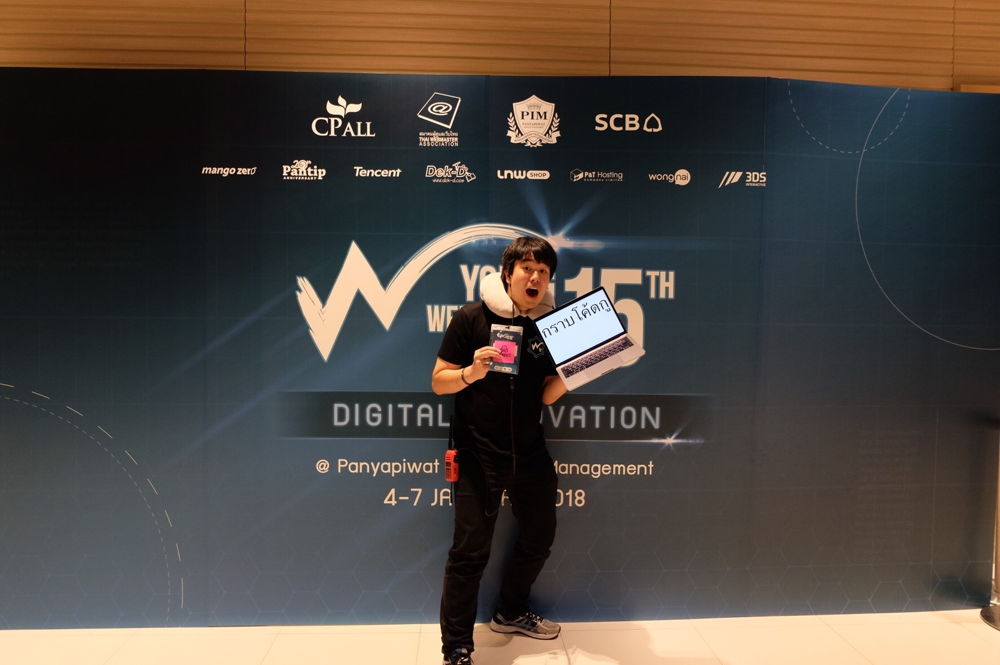

พีคกันตั้งแต่หลังปีใหม่กับค่าย YWC#15 ที่ขึ้นชื่อเรื่องของการอดนอนขั้นสูงสุด หากคิดว่าเป็นน้องค่ายนอนน้อยแล้ว เป็นพี่สตาฟค่ายนอนน้อยยิ่งกว่าอีกคุณผู้ชมมมม

และปีนี้ก็มีเรื่องพีคมากๆ เกิดขึ้นตลอดค่าย โดยเฉพาะในวันทำ workshop ที่เกิดเหตุการณ์ network ล่ม ทำให้ต้อง setup network แบบเฉพาะกิจขึ้นมา ด้วยพลังกายและพลังใจของพี่ๆ Senior ของ YWC ทุกคนที่ร่วมด้วยช่วยกัน จนสุดท้ายทุกคนก็ผ่านมันมาได้

หากอยากอ่านฉบับเต็มๆ ว่าชีวิตพี่ค่ายเป็นยังไง <a href="/เพื่อน-พี่น้อง-ครอบครัว-ไม่ได้นอน-ywc-15-66a377d5e043" target="_blank" rel="noopener noreferrer">ไปอ่าน!</a>

(ระหว่างที่กำลังพิมพ์ๆ อยู่นี้ ค่าย YWC#16 ก็กำลังทำเวิร์กช็อปกันอย่างดุเดือดด้วย)

---

## ปีแห่งการกลับมาอ่านหนังสือจริงๆ จังๆ

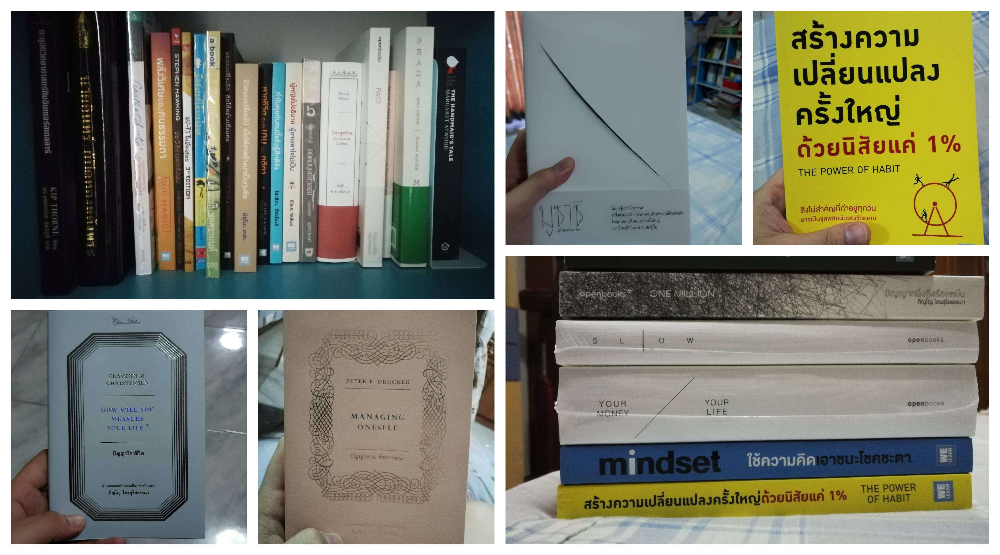

ถ้าใครรู้จักผม จะรู้เลยว่าปีนี้เปิดโหมดหนอนหนังสือหนักมาก ซึ่งเป็นเรื่องสืบเนื่องมาจากปีก่อนที่พี่นพให้หนังสือเป็นของขวัญวันรับปริญญา ก็เลยอ่านหนังสือตั้งแต่ตอนนั้น และปีนี้ก็รู้สึกว่าอ่านหนังสือไปเยอะมาก แม้ว่าเป้าที่เล็งไว้ว่าจะอ่านเดือนละเล่มจะทำไม่สำเร็จก็ตาาที แต่ปีนี้อ่านหลายเล่มมากๆ และมีที่ดองอยู่เต็มไปหมดเลย (สัญญากับตัวเองว่าหยุดยาวปีใหม่จะนั่งอ่านต่อจ้า)

ซึ่งการได้กลับมาอ่านหนังสือในปีนี้ ถือว่าได้อะไรดีๆ กลับมาเยอะเหมือนกัน หากคุณเป็นคนที่ค้นพบตัวเองว่าไม่ชอบการอ่านหนังสือ จริงๆ แล้วอาจเป็นเพราะว่า **คุณยังหาหนังสือที่คุณชอบอ่าน** ยังไม่เจอนั่นเอง

ในปีนี้ได้อ่านหนังสือจบไปทั้งสิ้น 20 เล่ม ประกอบไปด้วย (จะใส่ \*\*\* สำหรับหนังสือในดวงใจ)

1. **Future**: อ่านยาก แต่อ่านเพลิน
2. **Past \*\*\***: พระเจ้าตากถือว่าเป็นบิดาแห่งวงการ startup ของไทยก็คงได้
3. **วิชาสุดท้ายที่มหาวิทยาลัยไม่ได้สอน**: หนังสือรวมสุนทรพจน์ของคนดังหลายๆ คนที่ไปพูดในงานรับปริญญา เสมือนของขวัญจากบัณฑิต แก่บัณฑิต
4. **Managing Oneself \*\*\***: คนอยู่ในวัยทำงาน ควรอ่าน ดีมากกกกกกกกกกกกกกกกกกก
5. **Prada Mandala**: อ่านแล้วรู้สึกมีความอาร์ทติสสูงมาก 555
6. **คิดแบบยิว ทำแบบญี่ปุ่น**: บางไอเดียของคนยิวก็ดี แต่ถ้าทำแบบญี่ปุ่นจะดีกว่า
7. **เทคนิคการโน้มน้าวใจด้วยการฟัง ไม่ใช่การพูด**: ฟังและเก็บรายละเอียดกับประเด็น จนคนพูดรู้สึกว่าเราตั้งใจฟังจริงๆ แต่การฟังก็ดันไม่ใช่เรื่องง่าย
8. **ยอดมนุษย์ลำลอง**: หลายๆ บทสนุกมาก ได้อะไรมาคิดเยอะ
9. **เปลี่ยนวิธีทำงานแค่ 1% คุณก็แซงหน้าคน 99% ได้แล้ว**
10. **Strength Finders 2.0**: เอามาทำแบบสอบถามก็คุ้มค่าราคาแล้ว ค่อนข้างตรงอยู่
11. **ได้ทุกสิ่งด้วยสิ่งเดียว**: เขาบอกว่าทุกอย่างหากเรามี focus หรือสิ่งให้จดจ่อแค่อย่างเดียว มักจะดีกว่าทำหลายๆ อย่าง ซึ่งก็เห็นด้วย
12. **เรื่องเล้นลับโลก**: อ่านแล้วก็รู้สึกอิหยังวะกับหลายๆ เรื่องจริงๆ 55555
13. **One Million**: อ่านยากตามสไตล์หนังสือของอาจารย์ภิญโญ แต่ก็อ่านเพลิน ปีหน้าคงต้อง revise ทั้งชุดอ่านอีกรอบ
14. **The Power of Habit \*\*\***: ดีมากกกกกกกกกกก เป็นเรื่องเกี่ยวกับนิสัยว่าเกิดมายังไง ทำไมถึงติดเป็นนิสัยมาได้
15. **เหตุเกิดจากความเหงา**: เจ้าเตยซื้อมาให้ สนุกดีนะ เป็นเรื่องเกี่ยวกับวิทยาศาสตร์ของความเหงา
16. **The Four**: อ่านแล้วรู้สึกโคตรเดือด 5555
17. **คนละก้าว**: พี่ตูนแม่งโคตรใจ
18. **51 วิธีคิดของหัวหน้าที่ลูกน้องอยากทำงานด้วย**: ช่วงนั้นเริ่มมาคุมทีม มีความ suffer เหลือบไปเจอพอดี เลยคว้ามา ถือว่าโอเคดี
19. **มูซาชิ \*\*\***: สนุก อ่านเพลินมาก
20. **How will you measure your life? \*\*\***: เป็นเล่มอ่านคู่กับ Managing Oneself เวรี่กู๊ดเหมือนกัน
21. **ปัญญาอิตาลี**: ประสบการณ์หนึ่งที่ได้รับมาจากการท่องเที่ยว คือการพบปะกับผู้คน และดูว่าเขาใช้ชีวิตอย่างไร
22. **สิ่งสำคัญของชีวิต**: การได้อ่านแนวคิดของนักธุรกิจเก่งๆ ที่ประสบความสำเร็จนี่มันก็ดีเหมือนกันนะ

ส่วนที่กำลังอ่านอยู่ หรือบางเล่มยังอ่านไม่จบก็น่าสนใจไม่แพ้กัน

- **Naked Statistics**: เอาสถิติมาย่อยให้ง่าย ลืมสูตรเลขปวดกบาลไป สนุก มีแง่คิดทางสถิติที่น่าสนใจเยอะ
- **Finding Sisu**: คนฟินแลนด์จัดว่าเป็นชนชาติที่ "สู้ชีวิต" เอามากๆ และกุญแจสำคัญคือสิ่งที่เรียกว่า "ซิสุ" ซึ่งมันไม่ใช่แค่ว่าอย่าย่อท้อต่ออุปสรรคอย่างเดียว แต่จริงๆ มีหลายอย่างมาก
- **ปัญญามูซาชิ**: เป็นเล่มวิเคราะห์ของนิยายมูซาชิ
- **Sapiens**: รวบรวมประวัติศาสตร์ของเผ่าพันธุ์ Sapiens ตั้งแต่ยุคนู้นนนนนนน อ่านสนุกเพราะเรียบเรียงมาดีมาก

ถ้านับว่าทั้งชีวิตมาอ่านหนังสือแต่การ์ตูน และนิยาย และกลับมาอ่านหนังสือแนวอื่นๆ บ้างเป็นปีแรก ก็รู้สึกว่าเป็นปีแรกที่ทำได้ดีเลย แต่รู้เลยเหมือนกันว่าตนขาดวินัย เพราะมัวแต่ไปติดเกมจนไม่ได้อ่านหนังสือ 5555555

---

## อยู่ดีๆ ก็ต้องมาเป็น Team Lead

ถ้าพูดถึงเรื่องงาน สามารถเล่าเป็นมหากาพย์เรื่องยาวมากๆ ได้เลย และเป็นจุดสำคัญที่ทำให้ปีนี้ได้เรียนรู้อะไรต่างๆ เยอะมาก เยอะแบบไม่คาดคิดว่าต้องเจออะไรแบบนี้มาก่อน

เริ่มเรื่องที่ว่า หลายคนคงทราบแล้วว่าพี่ปันเจ ไม่ได้เป็น CTO อยู่ที่ TakeMeTour อีกแล้ว พอข่าวออกไป หลายคนที่สนิทก็มาถามหลังไมค์ผมเยอะมากๆ ว่าแล้วใครเป็น CTO อ่ะ ก็ตอบได้แค่ว่า

"ยังไม่มี"

แล้วใครที่ดูทีม/ใหญ่สุดในทีม tech ล่ะ

**"ฉันเองไงจะใครละ"**

(แต่ขอ clarify ก่อนนะว่ายังไม่เป็น CTO นะครับ)

ในช่วงแรกเองก็มีพี่เจต ที่เป็นพี่ Senior มาคุมทีมให้ ตนเลยยังโฟกัสกับงานเขียนโค้ดได้ แต่ก็เริ่มได้งานฝั่งที่เป็นช่วยดูเรื่อง tech stack ว่าจะใช้อะไรต่อไป จะลองใช้อะไรใหม่ๆ ที่ adopt กับ product ได้ไหม ซึ่งก็ถือว่าไม่ใช่เรื่องใหม่มาก เพราะก็ทำมาตั้งแต่ปีก่อน จนเริ่มเป็นนิสัยบ้างแล้ว

แต่ก็มีสัญญาณบอกเหตุมาบ้าง เพราะพี่เจตตัดสินใจจะไปเรียนต่อ (ซึ่งถ้าพี่ได้อ่าน ขอให้พี่โชคดีนะครัช)

นั่นทำให้ท้ายที่สุด ในเวลาอนาคตอันใกล้ ท้ายที่สุดแล้วคนที่ต้องมาทำงานแทนพี่เจต ถ้าหาคนนอกไม่ได้ ก็เอาคนในมาเป็นนี่แหละ

ใช่ และหวยก็ตกลงที่ฉันเอง

หากหลายคนนึกภาพไม่ออกว่า การที่อยู่ดีๆ ต้องมาคุมทีมเป็นอย่างไรบ้าง ให้ลองนึกว่า

### จากแรงงาน กลายมาเป็นคนสั่งงาน

Junior Dev หลายๆ ที่ก็มักจะเป็นขั้นแรงงานนี่แหละ คือเขียนโค้ดตามสั่ง ตามสเปคที่บอก จะละเอียดขนาดไหนก็แล้วแต่ที่ ที่ TakeMeTour เองก็เป็นแบบนั้นครับ จะเป็นแนวว่า ตรงนี้มันเป็นยังงี้ๆๆๆๆ ให้ทำอันนี้เพิ่ม แต่อาจจะไม่ละเอียดลึกเท่าไหร่ (อย่างมากจะลอง walkthrough โค้ดว่าจุดที่ให้แก้อยู่ตรงไหน)

แต่พอมาคุมทีม ก็ต้องมองงานกว้างขึ้น และแน่นอนว่าก็เป็นคนสั่งงานมากขึ้น ซึ่งด้วยความที่ส่วนตัวเองก็เป็นคนขี้เกรงใจอยู่แล้ว หลายๆ ครั้งเวลามีงานเข้ามา บางทีก็ไม่ส่งต่องานให้กับทีม เพราะเห็นว่ามีงานอยู่แล้ว ไม่อยากกองให้เพิ่ม ก็เอางานมาไว้กับตัวเอง สุดท้ายก็แทบจะตายเอาเพราะงานล้นมือ (ความ ironic นี้คือตอนพี่เจตคุมทีม ผมก็เห็นพี่เขากองงานกับตัวเองเยอะ ผมก็ทักไปว่าเออแบ่งๆ มาก็ได้นะพี่...พอตูมาทำงานแบบพี่เจตจริงๆ ก็พบว่าตูก็ทำตามพี่เขานี่หว่า)

นั่นทำให้การผันตัวมาทำสิ่งนี้จึงไม่ใช่เรื่องง่ายๆ เลยนะ โดยเฉพาะยิ่งถ้าไม่ได้เตรียมตัวเองมาดีพอ

### เขียนโค้ดน้อยลงมาก

มีช่วงนึงที่ค้นพบว่า **"เชี่ย วันนี้แม่งยังไม่ได้เขียนโค้ดสักกะตัวเลย"** เพราะหมดเวลาไปกับการประชุม และการเก็บ requirement หรือหมดเวลากับการเคลียร์เคสจากฝั่ง Customer Experience ที่คอยดูแลลูกค้าอยู่ (บางทีก็นั่งตอบอีเมลด้วย)

ถึงแม้ว่าด้วยเนื้องานแล้วมันก็จะต้องมาขาทางฝั่ง manage เยอะ แต่จริงๆ ฝั่ง technical ก็ยังต้องคมอยู่เหมือนเดิมด้วย ก็จะต้องหาเวลามาเขียนโค้ดบ้าง ให้สนิมไม่เกาะ

### มองภาพรวมมากขึ้น

จากแต่ก่อนพอเป็นคนงานเขียนโค้ด เราก็มักจะเป็นคนทำฟีเจอร์นั้นๆ ทำให้รู้ละเอียดถึง use-case ที่ละเอียดยิบมาก (เป็น ownership ของฟีเจอร์นั้นเอง) แต่พอมาเป็นหัวหน้า ก็ต้องมองภาพรวมมากขึ้น แทนที่เราจะรู้ทุก use-case ของฟีเจอร์นั้นๆ เราต้องมาดูภาพกว้างของระบบมากกว่า ดูว่าอนาคตจะเพิ่มฟีเจอร์อะไรบ้าง ถ้าจะเพิ่มฟีเจอร์​นี้จะเป็นไปได้ไหม ใช้เวลานานไหม ถ้าใช้เวลานานเรา trade-off อะไรได้บ้าง เช่น แบ่งฟีเจอร์เป็นฟีเจอร์ย่อยๆ ออกเป็นเฟสได้ไหม หรือลดทอนฟีเจอร์ลงไปก่อน

### ทักษะการต่อรองเก่งขึ้น

พอมาคุมทีม พบว่าทักษะการต่อรองกับคนอื่นจะเก่งขึ้นมากๆๆๆ เพราะหลายครั้ง requirement ที่มามักจะอลังการมาก แต่อยากได้ไวๆ (บรีฟหลักล้าน ของานพรุ่งนี้) เราก็ต้องต่อรองกันว่าจะทำยังไงดี อาจจะเปลี่ยนเป็นงานหลักล้าน แต่เลื่อนเดดไลน์ออกไปไกลหน่อย หรือลดจากงานหลักล้านเป็นหลักร้อย แล้ว launch ทันในเร็วๆ นี้ ขึ้นอยู่กับว่าจะตกลงกันยังไง

### ทำ Prove of Concept (PoC)

สิ่งนึงที่เวลาเราจะเอา tech หรืออะไรใหม่ๆ มาใช้ สิ่งนึงที่ต้องทำนอกเหนือจากความอยากจะเอามาใช้ อยากเอามาให้ทีมได้ลองเล่นกัน คือการทำ PoC (Prove of Concept) ว่าไอ้เครื่องมือนี้เนี่ยมันเวิร์กจริงๆ ไหมก่อน แล้วลองดูว่าเราจะไปใช้ในเชิงไหนได้บ้าง

อย่างในปีนี้เอง ก็ลองเอา <a href="https://cloud.google.com/natural-language/" target="_blank" rel="noopener noreferrer">Google Cloud Natural Language API</a> มาใช้ ก็ลอง PoC ดูว่ามันทำอะไรได้บ้าง เหมาะกับ use-case เราไหม ก็ได้ลอง trail ใช้ดู

มีช่วงนึงที่ได้งานทำเว็บให้ Krabi Biennale 2018 ก็ได้ลอง PoC ภาษา TypeScript ดูว่ามันเวิร์กไหมหากให้ทีมลองมาเขียน ผลคือเวิร์กกว่าที่คาด ก็เลยได้ใช้ขึ้น production ไปแล้วเรียบร้อย

ล่าสุดเร็วๆ นัี้ก็ลอง PoC การเขียน Unit Testing ดู ทีมเองยังไม่เคยเทสกันเลย และผมเองก็ไม่เคยด้วย ก็กำลังดูๆ ว่าจะต้องเรียนรู้อะไรบ้าง ถึงจะเขียนเทสแล้วช่วยชีวิตเราได้ (เขาเรียกว่าแก้บาปที่เกิดมาแต่อดีต)

อ่อ อีกอย่างคือ ช่วงนี้กำลังลองเล่น Flutter อยู่ด้วย

### ต้องใจเย็นมากขึ้น

> "ถ้าพลาดหลุดระเบิดอารมณ์ออกมาทีเดียว คือจบเลยนะ" - พี่เจตได้กล่าวไว้

พอมาคุมทีมก็ต้องมีความใจเย็นมากขึ้น หัวร้อนให้น้อยลง เพราะสิ่งที่ส่งผลมากที่สุดเมื่อเป็นหัวหน้า คือเรื่องของภาพลักษณ์​ และการเข้าถึงนี่แหละ

ลองคิดเอาว่า ระหว่างหัวหน้าใจดี เข้าถึงง่าย คุยง่าย เทียบกับเจ้านายที่ด่ายับเละเทะ แค่นี้ก็รู้แล้วว่าลูกน้องชอบ และอยากเข้าหาแบบไหนมากกว่า

และอย่าได้คิดแม้แต่นิดเดียวว่า "เจ้านายมึงมีแค่คนเดียว กูจะทำอะไรก็ได้" เด็ดขาดเลยล่ะ

### Recruit คน

เป็นคนต้องดูการ recruit ตั้งแต่หาคน ยันสัมภาษณ์ (เป็นครั้งแรกในชีวิต ที่ต้องเป็นคนสัมภาษณ์งาน) หลายๆ ครั้งก็ตัดสินใจยากมากว่าจะรับเข้ามาไหม เพราะปัจจัยจะรับคนเข้ามาทีนึงก็มีเยอะเหลือเกิน บางที tech skill ได้ แต่การสื่อสารไม่ค่อยดี รับมาปัญหาก็เกิดแน่ เพราะการสื่อสารเป็นเรื่องสำคัญมากๆ หรือบางคน tech skill อาจไม่แข็ง แต่รู้สึกใจสู้ ก็เลือกยากอีกเพราะไม่มั่นใจว่าพอเข้ามาจริงๆ ความใจสู้จะช่วยงานเราได้หรือเปล่า

### เผชิญหน้า Legacy Code และสิ่งที่ "นี่คืออิหยังวะ"

พอพี่ปันเจไม่อยู่ หลายๆ ส่วนในระบบที่พี่เป็นคนวางไว้ก็ต้องมีคนสานต่อ โดยเฉพาะฝั่ง Infrastructure ที่รันบน Kubernetes (K8S) ที่พี่เขาเป็นคนขึ้นไว้ทั้งหมด เราก็ต้องรับพาร์ทนั้นไป

ก็มีความ suffer ตรงที่ knowledge ของฝั่ง K8S ของเรายังไม่แข็งแกร่งพอ แรกๆ พอเจอปัญหาถึงกับปวดหัวตุ๊บ โอ้ยทำไงดี แต่สุดท้ายด้วยปัญหา จึงได้เรียนรู้ และได้เข้าใจกับมันจริงๆ

แต่จุดที่หนักกว่านั้นก็คงเป็น Legacy Code หรือ flow ของระบบเก่า ที่พอไปเจอหรือถูกพูดขึ้นมาที ก็มีคำว่า "อิหยังวะ" ขึ้นมาในหัวทันที อีนี่แม่มอะไรวะ ตูไม่เคยได้ยิน ซึ่งก็จะอาจจะไปจบที่ปล่อยมัน deprecate ไป หรือพยายามทำความเข้าใจกับมัน (โดยมากจะพยายามอันหลังก่อน ถ้าไม่ไหวจริงๆ ก็ไปอันแรก)

### จึงเลยรู้ว่าชีวิตเราไม่มีคำว่าพร้อม

ไปรอจนพร้อมก็คงสายไปแล้ว หลายๆ อย่างเรามักได้เรียนรู้จากความไม่พร้อมนี่แหละ

แต่นั่นเราก็ต้องมี mindset ที่พร้อมจะสู้ชีวิต และ open-mind อยู่ตลอดเวลา ว่าทุกสิ่งเราสามารถเรียนรู้และเข้าใจได้ หากทุ่มเทกับมันมากพอในระดับนึง

---

## ไปต่างประเทศ 1st Time

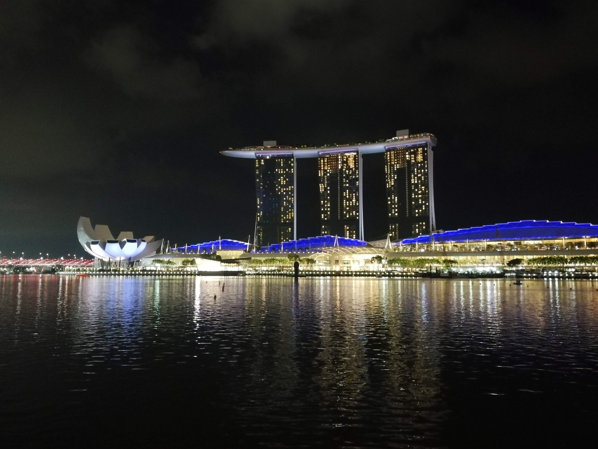

ครับ ทั้งชีวิตนี้ไม่เคยไปต่างประเทศ ไม่เคยนั่งเครื่องบินมาก่อนเลย ปีนี้เลยได้ไปเป็นครั้งแรกในชีวิต โดยมีพี่ต้า CEO พาไป ไปกับพี่หมูใหญ่ที่เป็น Designer ของทีมในตอนนั้นด้วย โดยไปประเทศใกล้ๆ นี้เองคือประเทศสิงคโปร์

ก็รู้สึกว่าเหมือนออกไปมองโลกให้กว้างขึ้นจริงๆ ดูว่าบ้านเมืองเขาเป็นยังไง ไอ้ที่บอกว่าเจริญกว่าเราเนี่ยเจริญกว่าจริงๆ ไหม และมันเป็นแบบไหนกัน และพบว่า เออ แม่งเจริญกว่าจริงๆ ด้วย 55555

ที่ประทับใจคือ ระบบการขนส่งบ้านเขาถือว่าดีมาก รถเมล์ทุกคันติดแอร์หมด รถไฟฟ้าเขาเป็นระบบเดียวกัน ไม่มีเดี๋ยวมึงจะ BTS แล้วไป MRT ต่อ Airport Link ทุกอันเป็น 1 network หมด และความเจ๋งคือ บัตรการขนส่งของเขาใช้ใบเดียว ไปได้ทุกหนแห่งจริงๆ สะดวกมากๆ แม้กระทั่งรถเมล์ก็ยังใช้บัตรในการเดินทาง

ที่สำคัญคือ รถไม่ติดด้วยครับ 555555555

และปีหน้าคิดว่าถ้ามีโอกาสได้ไป ก็คงตอบรับเลยแหละ และอาจจะลองหาเรื่องไปเที่ยวต่างประเทศบ้าง (ที่ไปมาเหมือนเที่ยวครึ่ง ทำงานครึ่ง แต่ก็เที่ยวเยอะแหละนะ 555)

---

## เป็น Speaker 1st Time

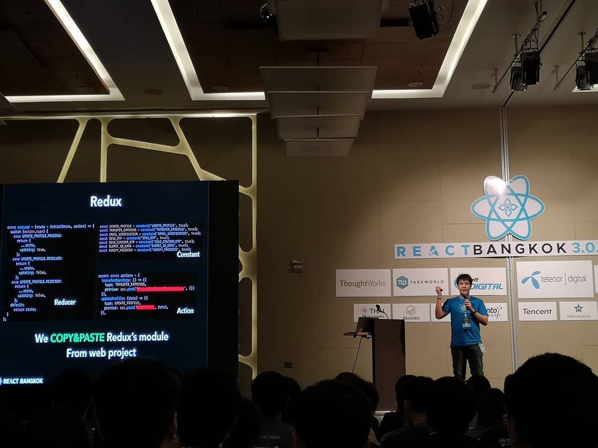

เป็นอีกเป้าหมายที่ achieve ในปีนี้คือได้เป็น Speaker ในงานเทคสักงาน ก็ได้ไปพูดในงาน React Bangkok 3.0.0 ซึ่งเป็นงาน conference ของ React Developer ในเมืองไทยที่จะจัดเป็นครั้งสุดท้าย ก่อนที่จะเป็น JS Bangkok ในปีหน้าที่จะรวมเป็น JavaScript Developer แทน

ในงานก็เอาเรื่องการใช้ Expo ซึ่งเป็นอีกทางเลือกของการทำแอพ cross-platform iOS กับ Android โดยใช้ React Native มาแชร์ให้ฟังกัน ว่าต้องไปเจอะเจออะไรบ้าง

ตอนแรกก็รู้สึกตื่นสนามมาก สั่นไปหมด เพื่อนๆ พี่ๆ ที่เจอกันก็มาบอกว่านี่กูมาเพื่อฟังมึงเลยนะ...ครับ ไม่ได้ช่วยให้กูหายสั่นเลยครับ กดดันกว่าเดิมอีก แต่สุดท้ายก็ผ่านไปได้ด้วยดี(มั้ง)

---

## ปีแห่งการเปิดบัตรเครดิตใบแรก (และสอง และสาม และสี่)

ตอนแรกเราก็กลัวเรื่องนี้ เพราะที่บ้านมีประสบการณ์ตรงเรื่องหนี้บัตรเครดิต ก็เลยไม่ได้สนใจกับมันมาก จนพี่หมูใหญ่ก็มาป้ายยา บอกว่าบัตรเครดิตถ้าใช้ดีๆ สิทธิประโยชน์ก็เยอะนะ ลองไปทำมาหัดใช้ก่อนก็ได้ เช่นของ KTC เองไม่มีค่าธรรมเนียม ถ้าไม่ใช้ก็ปล่อยมันทิ้งไว้ที่บ้านก็ได้ ก็เลยลองสมัครดู

ปรากฎว่าตอนแรกสมัคร KTC ไป ไม่ผ่าน เลยไปสมัคร KBank ก็ผ่าน คิดว่าเพราะเงินเดือนเข้าของ KBank อยู่แล้ว ก็เลยได้มา แต่ด้วยใจเองยังอยากได้ KTC เพราะแต้มมันเอาไปใช้อะไรต่ออะไรได้เยอะมาก และไม่มีค่าธรรมเนียมอีก เลยไปลองสมัคร KTC อีกรอบ ก็ผ่าน (แบบงงๆ แล้วตอนก่อนทำไมตูไม่ผ่านวะ)

จนไปๆ มาๆ ตอนนี้มี 4 ใบละ แต่จริงๆ ใช้อยู่ 3 คงพอแค่นี้แล้ว

ส่วนนี่เป็นทิป และ FAQ จากเราเอง หลังจากหัดใช้มาจนเริ่มรู้สึกว่าอิ่มตัวกับการถือบัตรเครดิตละ เลยมีคำแนะนำสำหรับคนที่จะเปิดบัตรเครดิตใบแรก

### มีบัตรเครดิต ไม่เท่ากับเป็นหนี้ "หากจ่ายตรงเวลา"

เผื่อคนยังไม่รู้ว่าบัตรเครดิตคืออะไร มันคือเหมือนเรายืมเงินธนาคาร (เครดิต) มาใช้จ่ายก่อน แล้วเราค่อยไปจ่ายเงินคืนทีหลัง สมมติเรารูดบัตรซื้อข้าว 150 บาท นั่นก็คือเหมือนเรายืมเงินธนาคารมา 150 บาทจ่ายค่าข้าว ซึ่งเรายืมเงิน เราก็ต้องคืน โดยธนาคารแต่ละเจ้าจะมีระยะเวลาที่เรียกว่า "ระยะปลอดหนี้" โดยมากคือเยอะสุด 45 วันนับจากใช้จ่ายไป ในช่วงเวลานั้นไม่ถือว่าเราติดหนี้ธนาคาร แต่ถ้าพ้นระยะปลอดหนี้ไปแล้ว ธนาคารก็จะเริ่มเก็บดอกเบี้ยจากยอดนั้น เป็นเรตเท่าไหร่ก็แล้วแต่ แต่ถ้าถึงจุดนั้นแล้วดอกเบี้ยจะเยอะน้ำตาเล็ดมากๆ

ดังนั้นการใช้บัตรเครดิต ต้องคิดเสมอว่า "ต้องจ่ายตรงเวลา" ถ้าบอกว่าให้จ่ายในวันที่ 25 ก็ต้องจ่ายก่อน 25

### บัตรเครดิตจ่ายก่อนโดยยังไม่ต้องรอรอบบิลก็ได้

ปกติแล้วเราจะจ่ายหนี้บัตรเครดิตตอนที่รอบบิลสรุปมาแล้ว แต่บางคนก็ใช้วิธีใช้บัตรเครดิตเหมือนบัตรเติมเงิน คือรูดปุ๊ป ก็โอนเงินจ่ายค่าบัตรตามยอดที่รูดไปเลย แรกๆ ผมเองก็ใช้วิธีนั้น แต่วิธีนี้จะไม่ดีตรงที่ หาก transaction บางอันเกิดมีปัญหา เราจะดึงเงินส่วนนั้นกลับมาก่อนไม่ได้ เพราะจ่ายไปก่อนแล้ว

ตอนนี้ผมเลยใช้วิธีว่า มีบัญชีธนาคารบัญชีนึง เป็นบ่อพักเงินไว้จ่ายค่าบัตรเครดิตไว้ก่อน ถ้าจะจ่าย ผมก็โอนเข้าบัญชีนั้นไปก่อน แล้วห้ามถอนเงินออกจากบัญชีนั้นเด็ดขาด พอถึงเวลารอบบิลสรุปมาแล้ว ก็เช็คดูยอดว่าตรงไหม (อาจจะใช้ Google Sheet ช่วยจด transaction ก็ได้) ถ้าตรงก็ค่อยเอาเงินจากบัญชีนั้นไปจ่ายค่าบัตร ถ้าไม่ตรงก็ติดต่อธนาคารเพื่อเช็ค ก็ว่ากันไปตาม process

ซึ่งบัญชีที่ผมเลือกใช้เป็นบ่อพักนั้นเป็น KBank e-Savings ข้อดีคือมันเปิดบัญชีผ่านแอพ KPLUS ได้เลย และไม่ต้องมีสมุดคู่ฝาก แต่ตัวบัญชีเสมือนบัญชีออมทรัพย์ตัวนึงเลย ก็สะดวกดีเหมือนกัน

### เลือกให้เหมาะกับไลฟ์สไตล์ก็จะดี

จริงๆ บัตรเครดิตมีอีกข้อดีคือสิทธิประโยชน์ของมันเนี่ยแหละ เช่นของ KTC เองก็จะมีระบบแต้ม ที่แต้มไม่มีวันหมดอายุ และตัวแต้มเองสามารถเอาไปแลกอะไรหลายๆ อย่างได้ เช่น ส่วนลดร้านอาหาร, ดูหนังฟรี และอื่นๆ

หรือ บัตรหลายๆ ตัวเกิดมาพร้อมสิทธิพิเศษเลยก็มี เช่น KBank OneSiam ก็มีสิทธิเรื่องที่จอดรถในเครือ Siam Piwat (Paragon, Siam Center, Siam Discovery, IconSiam) หรือใช้จ่ายในห้างได้พ้อยท์เพิ่มขึ้น

หรือถ้าใครต้องขึ้น BTS เป็นประจำ บัตร CitiBank ก็มีตัวที่เป็น Cashback ได้รับเงินขึ้นเมื่อใช้ซื้อเที่ยวของ BTS

นี่ก็เป็นเหตุให้มีบัตรเครดิตงอกมา 4 ใบ เพราะตอนแรกมี KBank กับ KTC ก็รู้สึกว่า KTC ก็มีพ้อยเยอะดี แต่ที่บ้านชอบลากไปเซ็นทรัลอยู่ทุกวีก เลยไปออกบัตรเครดิตของเซ็นทรัลมาอีกใบนึง (Central The 1 ซึ่งเป็นบัตรในเครือ Krungsri ด้วย บางทีสิทธิพิเศษของธนาคารนี้ถือว่าโหดอยู่) และก็เหลือบไปเจอบัตร OneSiam ที่ดูๆ แล้วเหมือน superset ของบัตร KBank ที่เราถืออยู่เลย คือทุกอย่างแทบจะเหมือนกัน แต่ OneSiam ถ้าใช้จ่ายในห้างของ Siam Piwat ก็จะได้แต้มคูณไปอีก ก็เลยเอามาก็ละกัน

(ซึ่งว่าจะไปยกเลิกบัตร KBank ปกติละ)

### ค่าธรรมเนียมขอ wave (ไม่จ่าย) ได้

เป็นทริกที่หลายๆ คนแนะนำมาว่าบัตรหลายๆ เจ้านั้นค่าธรรมเนียมโหดอยู่ บางตัวสามารถโทรไปขอ wave เพื่อจะไม่จ่ายได้ ซึ่งหลายๆ ครั้งธนาคารเองก็ถัวๆ ยอมไป เพราะไม่อยากเสียลูกค้า

หรือถ้าใครไม่สะดวกใจจะโทรไปขอ wave ก็อาจหาบัตรที่ไม่มีค่าธรรมเนียมก็ได้ ตอนนี้จะมี KTC กับ Krungsri ที่ไม่มีค่าธรรมเนียม

### VISA VS MasterCard VS JCB

ถ้าชอบทานอาหารญี่ปุ่น, ช็อปปิ้งร้านที่เป็นเครือจากญี่ปุ่น JCB จะดีสุด เพราะพวกนี้สิทธิประโยชน์จะอิงกับ JCB เยอะ

ส่วน VISA และ MasterCard โดยมากมักจะไม่ต่างกันเท่าไหร่เท่าที่สังเกต แต่ถ้าชอบดูหนังเครือ SF หลายๆ ครั้ง MasterCard ก็จะจัดโปรมาให้ เช่น ตอนนั้นได้โปรดูหนัง 1 แถม 1 มาที่ SF

### บัตรเสริม แต่หนี้เรานะ

บัตรเสริมก็คือบัตรเครดิตอีกหนึ่งใบแยกกันกับบัตรหลัก แต่ชื่อคนถืออาจเป็นชื่อคนอื่นซึ่งเกี่ยวข้องกับเรา เช่นเป็นของพ่อเป็นต้น โดยปกติบัตรเสริมนั้นจะใช้วงเงินร่วมกันกับบัตรหลัก จึงกันปัญหาเรื่องใช้เกินจนจ่ายไม่ไหวได้ระดับนึง

แต่ท้ายสุดแล้ว อย่าคิดว่าพอเป็นบัตรเสริมแล้ว หากบัตรเสริมไม่จ่ายหนี้ หนี้จะเป็นของเจ้าของชื่อบัตรเสริมนะ จริงๆ แล้วหนี้ก้อนนั้นมันก็เป็นหนี้ของเรานี่แหละ อันนี้ FYI ไว้เผื่อใครยังไม่รู้

### มีหลายใบได้ แต่ระวังการใช้จ่าย

โดยปกติแล้ว 1 ใบมักจะให้วงเงินมากกว่าเงินเดือนที่เรามีอยู่แล้วประมาณ 2 เท่า หากมี 3 ใบนั่นหมายความว่าเรามีวงเงินรวมมากกว่าเงินเดือนอยู่ 6 เท่า นั่นทำให้บางทีเรามักจะชอบใช้จ่ายเกินตัว จนสุดท้ายก็กลายเป็นหนี้นี่เอง ฉะนั้นบริหารกันให้ดีนะครับ

---

## ปีแห่งการอัพเกรด gadget (a.k.a. หาเรื่องเสียตัง)

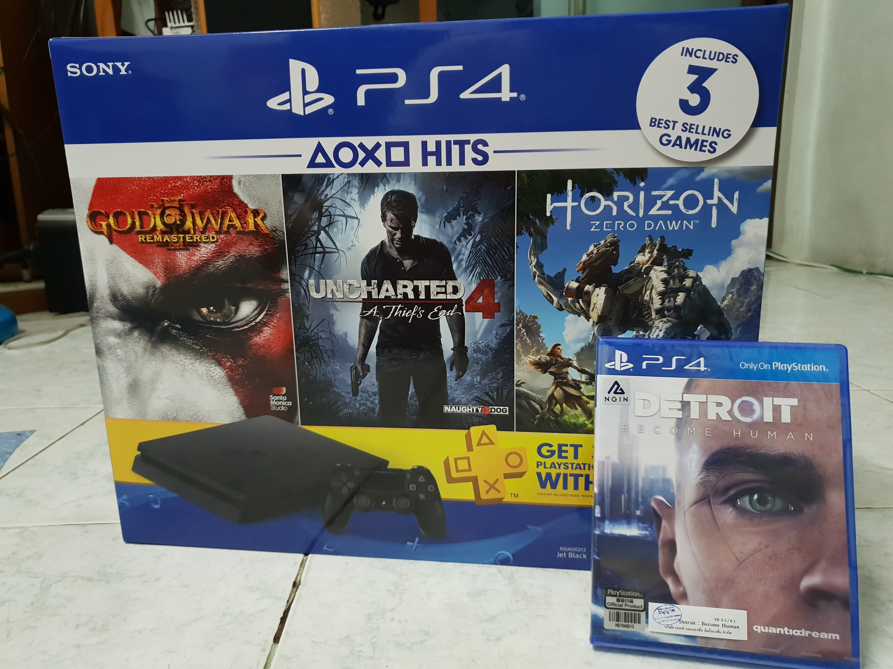

เป็นปีที่รู้สึกว่าใช้เงินซื้อ gadget ใหม่เข้าบ้านเยอะมาก ทั้ง PC ตัวใหม่ / วู่วามอยากหามือถือใหม่ให้น้อง (ด้วยการซื้อ S9+ ให้ตัวเอง และเอาเครื่องเดิมให้น้อง 555555555) / อยู่ดีๆ เงินถึงพอซื้อ PS4 และอยากเล่น Detroit พอดี เลยจัดมาซะเลย

ก็เหมือนที่เขาเคยบอกว่าตอนเด็กๆ ไม่มีตังซื้อเองพอโตมามีตัง มีเงินเก็บ ก็อยากซื้อบ้าง (ทั้งหมดนี้ไม่ได้สร้างหนี้นะครัช ถึงผ่อนก็จ่ายตรงเวลาเป๊ะๆ)

---

### ฟังเพลง Orchestra แบบสดๆ ครั้งแรกในชีวิตใน Distant Worlds: Music from Final Fantasy

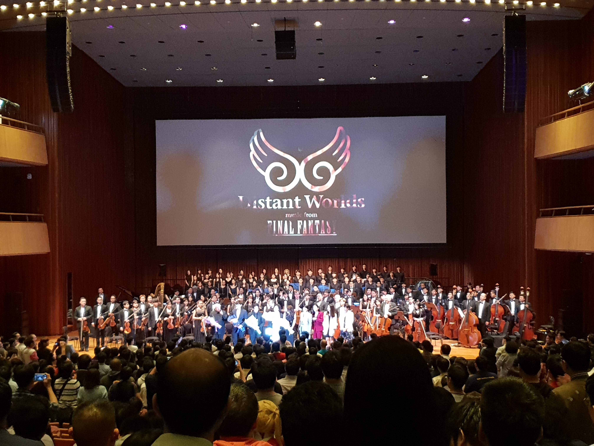

ส่วนตัวติดตามเกม Final Fantasy แค่ภาคใหม่ๆ (เล่นแค่ 13 กับ 15) แต่สิ่งนึงที่เป็นเสน่ห์ของเกมชุดนี้ และผมก็ชอบเหมือนกัน คือเรื่องของเพลงประกอบที่แม่งโคตรจะดีงาม

พอมีข่าวว่ามีคอนเสิร์ตบรรเลงเพลงประกอบจาก Final Fantasy หลากหลายภาคมาเล่นให้ฟังกันสดๆ และมาในไทยเป็นครั้งแรก เลยไม่รีรอ จองตั๋วสิครับรออะไร

และก็ฟินครับ คือบางภาคไม่เคยฟัง เคยฟังครั้งแรกก็คือในคอนฯ​ นี่แหละ รู้สึกประทับใจมาก ชอบบบบบบ

---

### จัด 1st Internal Hackathon: S.H.I.T.s

> S.H.I.T.s. ย่อมาจาก **S**uper **H**igh **I**ntelligent **T**oilet **s**ystem

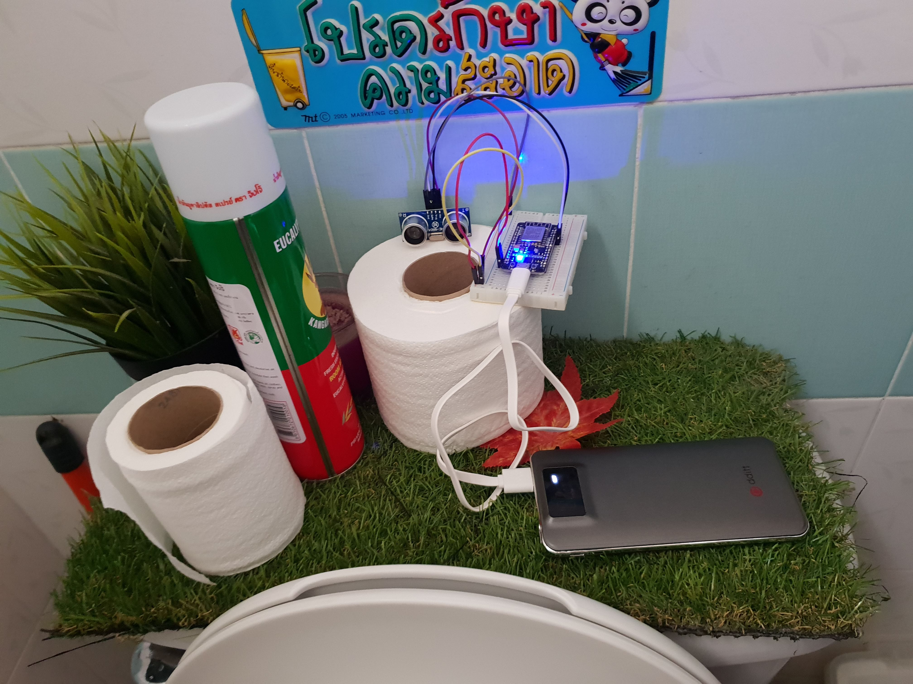

คือเรื่องมีอยู่ว่า ออฟฟิศเรามีการปรับปรุง โดยลดห้องน้ำ (จริงๆ คือเปลี่ยนห้องน้ำ เป็นครัวเล็กๆ และวางตู้เย็น) จนเหลือห้องน้ำห้องเดียว แต่ทีมเริ่มใหญ่ คนเริ่มเยอะ เลยเจอปัญหาต้องมานั่งรอคิวเข้าห้องน้ำ

ทีม dev เลยเกิดไอเดียว่า เออก็ทำ hardware detect หาคนในห้องน้ำเลยสิ พี่ต้าก็เลยเห็นโอกาสทองว่าลองจัด hackathon ภายในดูกันไหม ก็เลยลองจัดดู โดยโจทย์ก็คือเรามีระบบไว้ detect คนอยู่ในห้องน้ำแล้ว ก็ลองทำอะไรต่อยอดสิ่งนี้ดู

ก็ถือว่าเป็นประสบการณ์แปลกใหม่และสนุกดี จริงๆ สนุกตั้งแต่ตอนเตรียม hardware ละ เป็นครั้งนึงในชีวิตที่ได้โค้ดในห้องส้วม 5555555

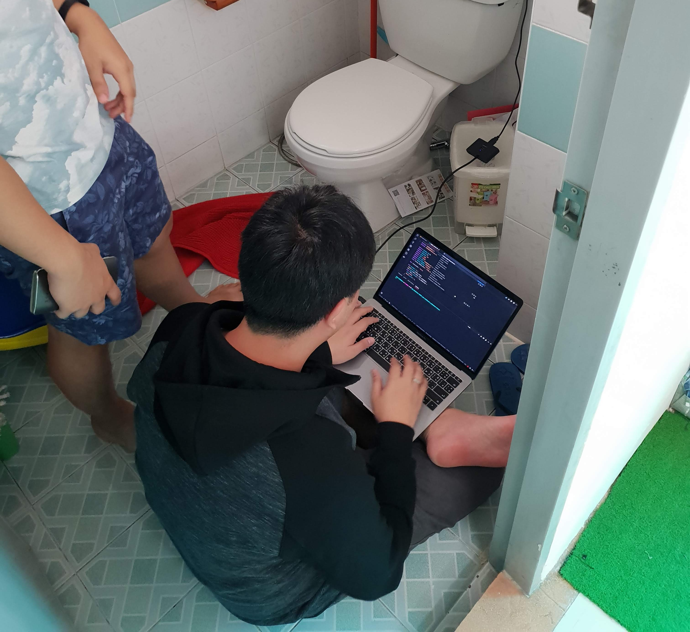

---

## ดูหนังไป 30 เรื่อง

ปีนี้บ้าระห่ำกว่าปีก่อน ดูหนังไป 30 เรื่องเลยทีเดียว! จะบรรยายหมดก็ไม่ไหว แต่ขอหยิบ Top 5 มาให้แทน

### 5. Darkest Hour

คือดูแทบไม่ออกว่า นี่คือ Gary Oldman อะ หนังทรงพลังโคตร ดูจบนี่แล้วไปดู Dunkirk ต่อนี่น่าจะอินมาก

### 4. Ready Player One

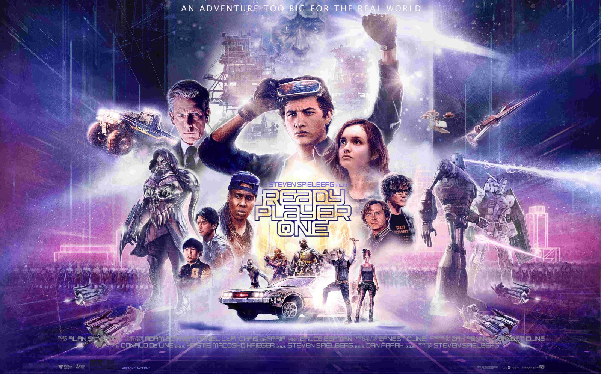

ชอบงานวิชวล ชอบฉากแข่งรถ ชอบความดูง่าย

### 3. The Incredibles 2

น้ำตาจะไหล กับภาคต่อที่ภาคแรกตอนนั้นน่าจะอายุประมาณ Dash ส่วนภาคนี้ อายุแก่กว่า Violet ในเรื่องไปละ 55555

### 2. Mission Impossible: Fallout

ที่สุดของหนังชุดนี้จริงๆ โคตรลุ้น แถมหักมุมกี่ตลบก็ไม่รู้ ตอนดูรอบแรกมีความรู้สึกแบบ "เฮ้ย มึงจะยังไงวะ" เลยจริงๆ

### 1. Avengers: Infinity War

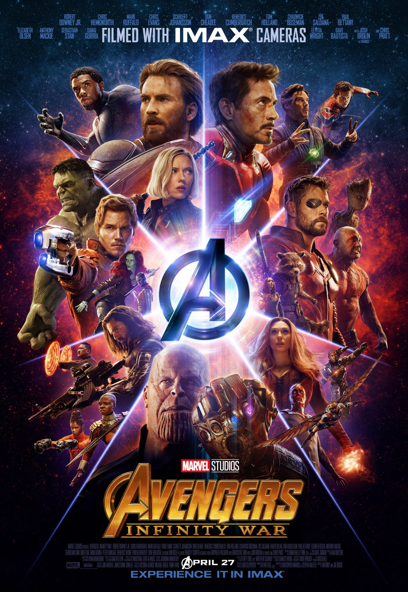

ไม่ต้องบรรยาย เป็นหนังที่ดูแล้วมีอารมณ์ร่วมกับหนังมากสุดในโรงละ ร้องเชรี่ยไปหลายฉากมาก

---

## อื่นๆ

- **ติดเกมมากขึ้นมากๆๆๆๆๆๆๆๆๆ** (แต่ก่อนไม่หนักขนาดนี้) ผลคือเล่นเกมจบไปเยอะมาก 5555 และปีนี้เป็นปีทองของเกม PS4 ด้วย เกมเทพขนมาเต็มสตรีมสุด
- **ปีนี้มาเบนเข็มเขียนบล็อกฝั่ง non-tech ได้มากขึ้น** (คงเพราะงานที่ทำก็มีส่วนนั้นบ้างด้วย)
- **ยังคงเก็บเงินอยู่เรื่อยๆ แต่ยังไม่เอาเงินไปทำให้งอกเงย** เช่น เอาไปลงทุน ปีหน้าคงต้องเริ่มแล้ว
- นอกจากจะเป็น speaker ในงาน React Bangkok ยังได้เป็นสตาฟงานนี้ด้วย โดยงานหลักที่ทำคือเป็นคนตรวจ PR ที่ส่งมาแปลหนังสือ React in patterns เพื่อเอาตั๋วฟรี ไปตามอ่านฉบับแปลได้[ที่นี่](https://reactbkk.gitbook.io/react-in-patterns-th/)
- **ปีนี้เป็นที่คาดเดาเรื่องบางอย่างไว้แล้วว่าจะมาแน่ๆ และมันก็มาจริง** แต่ก็ชอบจะมาเหนือกว่าที่คิดไว้ 5555
- **เป็นปีที่เจอเรื่องไม่คาดคิดเยอะมากในเรื่องของการเขียนโค้ด** โดยเฉพาะเรื่องที่จู่ๆ ก็มีของ break แบบใช้ไม่ได้ไปเลยอยู่สองสามครั้ง เช่น lib node-cron รัน cron ไม่ได้เพราะ version ใหม่เพิ่งอัพมันบั๊ค / fixer.io ที่ไว้ดูอัตราแลกเปลี่ยนเงิน ก็เปลี่ยน API มาเสียตังแทน / อยู่ดีๆ credit Google Cloud ที่ใช้อยู่ก็หมดอายุโดยไม่รู้ตัว เว็บเดี้ยงไปเลยตอนกำลังนอน T-T
- **ในฝั่งการเขียนโค้ดรู้สึกปีนี้อินกับเรื่องการ optimize web ให้เร็วขึ้น** (ตามรอยศาสดา Addy) กับสนใจในแง่มุมของการวาง architecture ของโค้ด และคิดว่าถ้าตัวเองจะลงลึกไปอีกในปีหน้า ก็อยากจะไปทางนั้น
- เข้าใจคำพูดที่ว่า **"หนังสือบางเล่ม เหมาะกับบางช่วงของชีวิตเรา"** จริงๆ เพราะบางเล่มลองคิดอีกที เออช่วงนี้ถ้าอ่านก็คงดีนะ
- **ปีนี้รู้สึกว่าตัวเองเริ่มไม่ค่อยเขินหรือขี้อายที่จะคุยกับฝรั่งเป็นภาษาอังกฤษละ** ต้องยกความดีความชอบให้กับพี่ต้า ที่ไป recruit ชาวต่างชาติมา intern กับเราได้ในปีนี้ (เป็นคนออสเตรียคนนึง คนสิงคโปร์อีกคนนึง) ช่วงนั้นเลยต้องมีการสปีกอิงลิชบ่อยๆ หน่อย แรกๆ ก็ไม่ค่อยกล้า แต่สักพักมันก็ชินไปเอง
- สืบต่อจากข้อบน ความพีคกว่านั้นคือมีต้อง skype interview กับขาวต่างชาติด้วย และสัมภาษณ์ถาม technical ด้วย (บวกกับปกติไม่เคยสัมภาษณ์คนเข้ามาสมัครงานอยู่แล้ว เจองี้ไปโอ้ก็อดเลย)

---

## ถ้าให้สรุปปีนี้เป็น 1 ประโยค

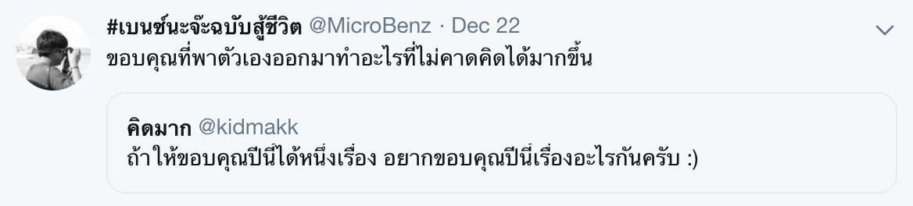

แถม

> อะไรที่มากไป หรือน้อยไป ก็ไม่ดีนักหรอก

ปีนี้มีบางช่วงที่ทำงานหนักเกินไป และเอางานไปคิดมากเกินไป จนจะไม่ไหวอยู่แล้ว จนสุดท้ายต้องค่อยๆ ปรับสเกลมาจนหาสมดุลของตัวเองให้เจอ ค่อยโอเคขึ้นมาหน่อย

---

## เอา Goal ปีก่อนมาดูสิ

- **ออกกำลังกายบ้าง รู้สึกว่าชีวิตต้องคิดถึงเรื่องสุขภาพมากขึ้น**: มีบ้าง แต่ยังขาดวินัยเหมือนเดิม
- **อ่านหนังสืออย่างน้อยเดือนละเล่ม (ไม่นับการ์ตูนนะ)**: ช่วง 5 เดือนแรกยังทันเดือนละเล่ม แล้วก็ดรอปลงไป
- **มา contribute open source ได้แล้วนะเบนซ์**: มีบ้าง เช่นช่วยตรวจหนังสือของงาน React / ทำ open source JSON รวมชื่อมหาลัย
- **อยากเป็นส่วนนึงของ dev community สักอันนึงจริงๆ จังๆ ไม่ใช่เป็นแค่ผู้เข้าร่วม (อาจจะยากหน่อย แต่ต้องลองนะเจ้าเบนซ์)**: ไปช่วยทำ React Bangkok นี่จะนับได้ไหมหว่า 555
- **เป็นไปได้ก็อยากเป็น speaker (แต่ต้องลับคมดาบหน่อยนะก่อน)**: MISSION SUCCESSFUL!
- **YWC#15 ต้องออกมาปัง!!!!!!!!! (เจอกัน 4–7 มกราฯ 5555)**: ปังมั้ง?
- **เลิกนิสัยสิ้นเดือนเหมือนสิ้นใจ หาเงินเก็บบ้าง**: เป็นอาการนี้น้อยลงแล้ว
- **เรื่องความรักก็ขอให้เป็นไปตามโชคชะตาละกันนะ**: นี่ตอนนั้นกูเขียนไรไปวะ 555

---

## ปีหน้าจะทำอะไรล่ะ?

ขอไม่ตั้งเป็น goal เป็นข้อๆ ละกัน **แต่ขอให้ตัวเองยังคงใจสู้ และเปิดรับความท้าทายต่างๆ อยู่เรื่อยๆ อย่างไม่ย่อท้อก็แล้วกัน** และอยากให้ตัวเอง**กล้าหาญ**ขึ้นมากกว่านี้ ส่วนตัวยังรู้สึกว่ายังมีความกลัวบางอย่างอยู่ในใจอยู่

---

## อ่อ ปีหน้าบล็อกส่วนตัวจะไม่ได้อยู่บน Medium แล้ว

หากใครอ่านยันจบตรงนี้ และติดตามอ่านบล็อกผมมาสักระยะ จะรู้สึกว่าหน้าตาเปลี่ยนไป เพราะย้ายมา hosted เองแล้วจ้า ออกจาก medium แล้ว

โดยงวดนี้เปลี่ยนยกเครื่อง มาใช้ Gatsby.js แล้ว ตัว hosting ก็ไม่ต้องไปทำ server เองให้ปวดหัว เพราะย้ายมาใช้ Firebase Hosting แล้วจ้าาาาาาาา

ก็ขอ declare ว่าตัวเว็บจะยังคงเป็น Beta เนื่องจากมีหลายๆ จุดต้อง refine อยู่พอสมควร ยังไงใครมีคำชี้แนะอะไรก็แนะนำได้ครับ

---

ยังไงก็ สวัสดีปีใหม่ทุกคนนะครับ หวังว่าจะได้เจอกันอีก :D
