ใครพลาดตอนก่อนหน้า กดไปอ่านสิครับพี่น้องครับ!

- [Chapter 1 - บริสเบนหนาวมาก](/benz-work-and-travel-at-brisbane-chapter-2)

---

สืบเนื่องจากผมเขียนบล็อกค่อนข้างล้าหลังพอสมควร มีอะไรๆ ให้เล่าได้เยอะ และหลากหลายมุม ก็เลยอาจจะขอเล่าเป็นประเด็นๆ กันไปละกัน timeline จึงอาจจะสลับไปๆ มาๆ นะครัช

หลังจากตอนที่แล้วได้พูดเรื่องว่าทำไมถึงได้มาที่บริสเบน มาทำอะไร และก็มีเล่าเรื่องชีวิตในช่วงวันแรกๆ มาในตอนนี้จะเข้มข้นมากขึ้น จะมาเล่าว่าวันๆ ที่มาอยู่ที่นี่เนี่ยผมทำอะไรบ้าง และมีอะไรที่ต้องหัดและเรียนรู้บ้าง

## กิจวัตรการทำงานเป็นยังไง

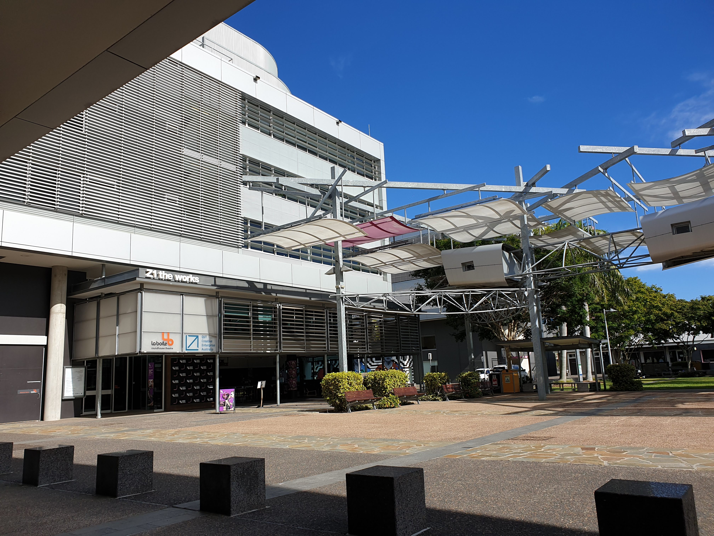

คือการมาที่นี่อย่างที่เคยบอก คือเรามา**ทำงาน** ซึ่งก็ยังต้องทำงานควบคู่ไปกับทีมที่ประเทศไทย ที่ timezone ต่างกัน 3 ชั่วโมง ตอนแรกผมก็คิดว่า timezone ห่างกัน 3 ชั่วโมงไม่น่าจะมีผลอะไรมาก แต่เปล่าเลย กลายเป็นว่าแค่ 3 ชั่วโมงก็ค่อนข้างมีผลได้มากๆ แล้ว

กิจวัตรในแต่ละวันก็จะประมาณนี้

- มาที่นี่ตื่นประมาณ 8 โมง (ตอนอยู่ไทยไม่ตื่นเวลานี้ 555)
- กินข้าวเช้า (อาจเป็นอะไรเบาๆ เร็วๆ พอ) ออกจากบ้าน ถึงออฟฟิศราวๆ 9:00 - 9:30 (แล้วแต่ว่าวันนั้นเดินทางแบบไหน)
- ทำงานตั้งแต่ 9:30 ซึ่งที่ไทยมันคือ 6:30 **ในช่วงเวลานี้จึงเป็นเวลาที่ฝั่งนี้เหมาะกับการเคลียร์งานค้างของวันก่อน เช่นรีวิวโค้ดของคนอื่นๆ ที่เปิด Pull Request ไว้ / เทส feature ที่คนอื่นทำมา** เพราะเป็นเวลาที่ทีมที่ไทยน่าจะยังไม่ค่อยตื่นกัน เคสหรือปัญหาจะยังไม่ค่อยมีมากนัก โดยเฉพาะถ้าทำ code review ตอนนี้ มันจะ feedback ไปหาเจ้าของได้ตอนเจ้าของโค้ดตื่นพอดี
- กินข้าวเที่ยงตอน 12:00 - 13:00 และแว้บมา check-in (อารมณ์เหมือน stand-up meeting ของทีมทั้งบริษัท) ตอน 13:30 (เวลาไทย 10:30)
- หลัง check-in ก็ stand-up meeting กับทีม dev ที่ไทย **เป็นช่วงเวลาที่ดีที่สุดที่จะ sync งานกันข้ามประเทศ** จากเดิมที่ตอนอยู่ไทยทำบ้างไม่ทำบ้าง แต่พอมาคราวนี้เลยได้ทำมันเป็นกิจวัตร และหวังว่าตอนกลับไทยก็คงจะ maintain เหมือนเดิม
- หลังจากนั้นก็จะทำงานยาวจนถึง 19:00
- ประเด็นคือ ทีมที่ไทยเองก็จะทำงานกันถึง 19:00 เวลาไทย นั่นหมายถึงเวลาที่นี่คือ 22:00
- และโดยสถิติแล้ว งานมักจะเข้าช่วง 17:00 เวลาไทย (งานเข้าก็เช่น เคสมา / เจอบั๊ค report / เจอแก้งานด่วน) ซึ่งนั่นเป็นช่วง 20:00 เวลาที่นี่ บางทีกำลังทำข้าวเย็นหรือกินข้าวอยู่ดีๆ ทีมฝั่งไทย reach out ขอความช่วยเหลือมาจ้า (แต่ยังดีไม่ค่อยเจอด่วนจัดๆ)
- เพราะฉะนั้น ถ้าเอาเวลาที่ค่อนข้างโล่งและว่างที่สุด ก็คือต้องหลัง 22:00 เวลาที่นี่ (มันจะไปตรงทุ่มนึงไทย ทุกคนเลิกงานพอดี) แต่บางวันก็จะว่างตั้งแต่หลังเลิกงานเลย (อาจจะช่วยๆ support ทีมที่ไทยบ้าง แล้วแต่เคส)

ทั้งหมดที่เล่าๆ มาส่วนนึงที่จะยังทำให้งาน keep momentum และเดินหน้าต่อไปได้ ก็คือมีทีมงานที่ดีนี่แหละ (ต้องขอบคุณทีม dev สาขาประเทศไทยที่ช่วยให้งานไหลลื่น และแก้เคสบางอย่างเป็นด่านหน้าให้นะครัช)

## นั่งทำงานที่ไหน

เราได้มาทำงานอยู่ที่ **QUT (Queensland University of Technology) Creative Enterprise Australia** (ตัวย่อ: QUTCEA) ซึ่ง QUTCEA เองก็เหมือนเป็นหน่วยงานภายใต้ QUT อีกที โดยโฟกัสที่ช่วยเหลือ local business หรือ startup ในละแวกนี้ให้โตขึ้นครับ

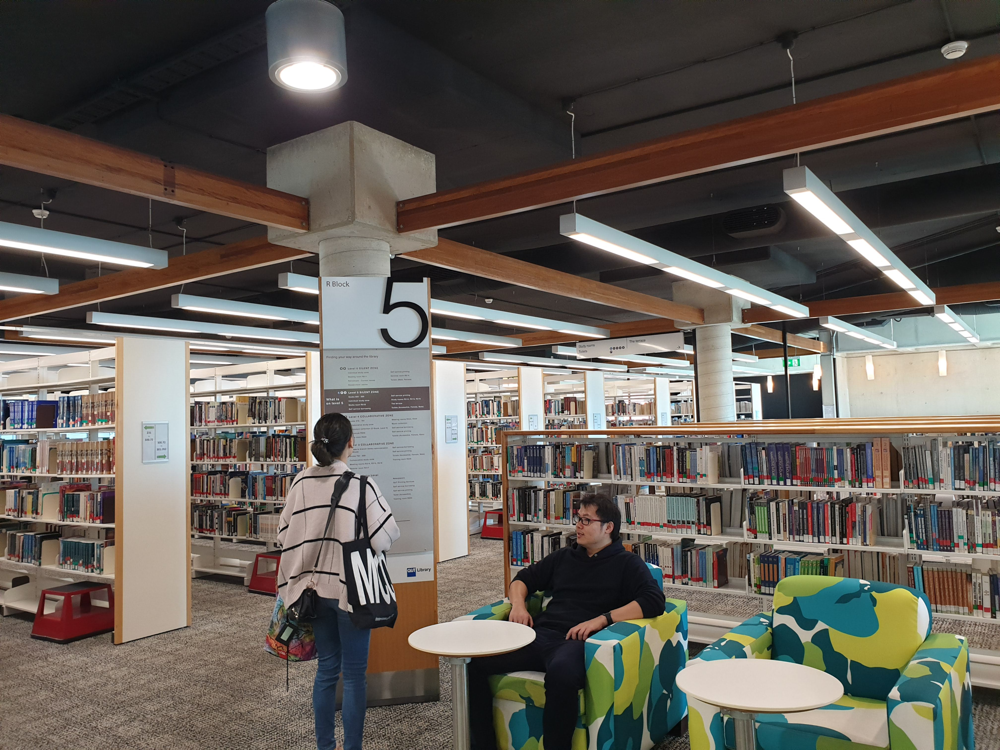

ข้อดีของการที่ได้มาทำงานใน QUTCEA **ก็คือเราสามารถใช้ facility ของมหาลัยได้หมดเลย** โดยพอมาถึงแล้วเราก็ต้องออกบัตรของ QUT เพื่อมาใช้เข้า-ออกตึกที่ทำงานอยู่ ซึ่งเจ้าบัตรนี้ให้นึกถึงว่ามันก็คือบัตรนิสิตแหละ ถึงแม้จะแปะสถานะว่ากรูเป็น visitor ก็ตาม

ซึ่ง facility ที่มีให้ใช้ฟรีเมื่อมีบัตรนั้น ก็จะมี

- **รถเมล์มามหาลัยฟรี:** ทำให่้ทุกวันนี้ถ้าเดินทางแบบเอาฟรี 100% คือเดินไปขึ้นรถเมล์​มหาลัย ถึงที่หมายเลย แถมได้เดินออกกำลังกายด้วย
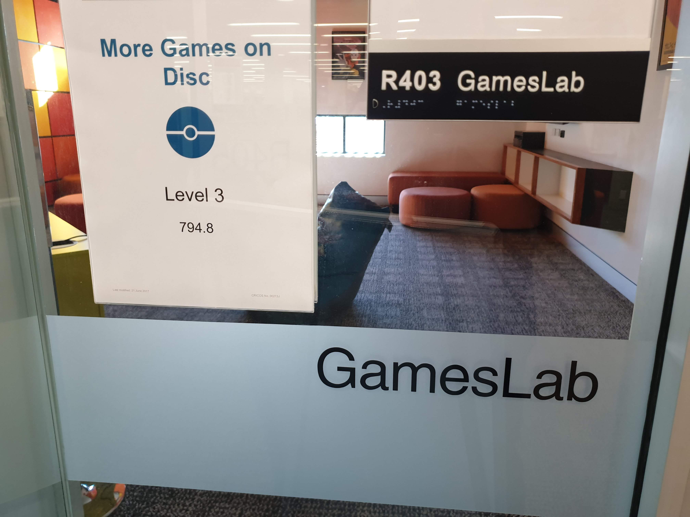
- **ใช้ห้องสมุดได้:** ยืมหนังสือก็ได้เหมือนกันนะเออ (ห้องสมุดมหาลัยที่นี่มีห้องเล่นเกมด้วย PS4 / Xbox One พร้อม โหดสรึส)
- **ใช้อินเตอร์เน็ตมหาลัยได้:** อันนี้ต้องบอกก่อนว่า อย่าอิจฉาเน็ตที่นี่เลย สภาพมันก็พอกันกับ ChulaWiFi อะจ๊ะ 555
- **มี account ของมหาลัย:** ทำให้เรา access online content และ service หลายๆ ตัวได้ฟรีๆ เลย เช่น **Office 365 ก็ใช้ได้ฟรี / แอพ Zoom ที่ไว้ใช้ Video Call ก็ใช้ได้ฟรี**
- **เข้า meseum ได้ลดราคา:** ปกติ meseum นั้นเวลาเราเป็นนิสิต นักศึกษา นักเรียน เราจะได้ลดราคา ซึ่งเราก็เอาเจ้าบัตร QUT เนี่ยไปให้เจ้าหน้าที่ดูตอนซื้อตั๋วเข้า meseum ก็ได้ลดราคาเหมือนกัน...สุโก่ย!

และน่าจะมีอย่างอื่นอีกเยอะแยะ (เอาง่ายๆ คือตอนนี้เหมือนกรูเป็นนักศึกษาของ QUT อะ 5555)

ส่วนพื้นที่ที่ได้มาทำงานก็เป็น Co-Working Space ทำงานร่วมกับคนอื่นๆ ด้วย ซึ่งคนอื่นๆ เองนั้นก็ทำ startup ของตัวเองกันทั้งนั้น หลายๆ ทีมก็อยู่ในอีกโครงการนึงชื่อ The Collider

## Communicate กับทีมผ่านช่องทางไหน?

โชคดีเราอยู่ในยุคสมัยอินเตอร์เน็ตไร้พรมแดน ก็มีใช้หลายตัว เอาแบบที่ใช้กันอยู่แล้วก็ **Slack** ไว้คุยงาน discuss งานกัน

**ส่วน video call ก็มีใช้ [Appear](https://appear.in/) ซึ่งใช้ง่ายและ easy มาก** (Appear เอาไปใช้ stand-up และ check-in กันเป็นปกติ) **กับอีกตัวคือ [Zoom](https://zoom.us/)** ก็มีใช้บ้าง เพราะ quality แอบจะดีกว่า Appear

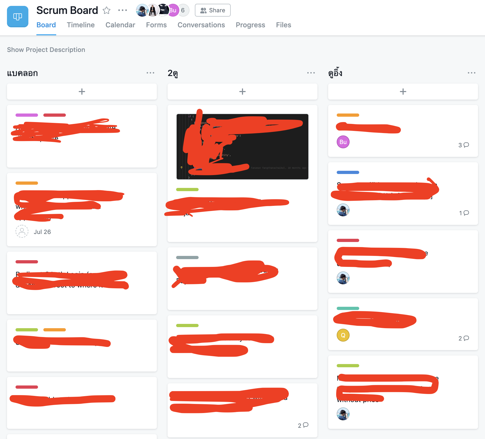

ส่วนเรื่องการจัด task นั้น ปกติแต่ก่อนเราใช้กระดาษเป็น physical แต่ช่วงปีที่ผ่านมาได้ริเริ่มมาใช้ **[Asana](https://asana.com/)** แทนเพื่อลดปริมาณกระดาษ และทำให้มัน online เพื่อที่ให้คนที่ work from home ได้เห็น board เหมือนกัน และบางทีเราก็ discuss บางประเด็นในบอร์ดได้เลย ซึ่งการพยายามโยกมาใช้ Asana ตั้งแต่ปีก่อนได้ผลมากในตอนนี้ เพราะทีมเริ่มชินกับการใช้ Asana เพื่อ track งานแทนกระดาษ ทำให้พอมาทำงานระยะไกล เราก็เหมือนมี scrum board ใช้แชร์ร่วมกันได้เลย จะติดก็ที่ว่า ฟีเจอร์ยังไม่ได้พร้อมขนาดนั้น รวมถึงการอัพรูปมันใส่ใน comment ตรงๆ ไม่ได้ บางทีถกกันก็จะงงว่ารูปอยู่ไหน

**ซึ่ง tools ทั้งหมดนั้นแต่ละตัวก็จะตอบโจทย์เฉพาะอย่างในตัวมันเอง** ยังไม่มีเครื่องมือ 1 เดียวเอาชนะทุกอย่างได้หรอกครับ

**แต่ท้ายสุดหากต้องเร่งด่วนจริงๆ หรือคุยกันด้วย text ละไม่เข้าใจ ก็จะไปจบที่การคอลหากันแทน** (ใช้ Slack คอลก็ง่ายดี และชัดด้วย)

## การเดินทางในบริสเบนเป็นยังไง

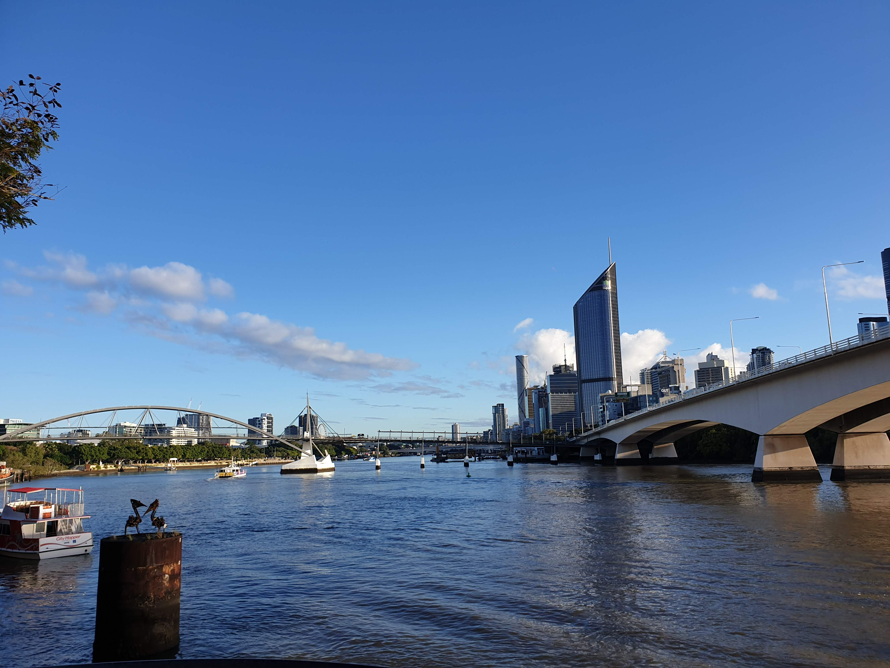

ด้วยความที่อากาศที่นี่ค่อนข้างเย็นสบาย (ถึงแม้จะมีลมแรงชวนตัวสั่นอยู่บ้างในช่วงนี้) ทางเท้ามันน่าเดิน ปลอดภัยเพราะโจรไม่เยอะ (หลายพื้นที่ที่เดิน ถ้าอยู่ไทยคือกูคงโดนปล้นไปแล้ว) **ทำให้การเดินทางด้วยการเดินเท้านั้นจึงเป็นช้อยส์ที่ดี ถ้าไม่เร่งรีบต้องไปไหนมาไหน** (เป็นการออกกำลังกายไปด้วยในตัว)

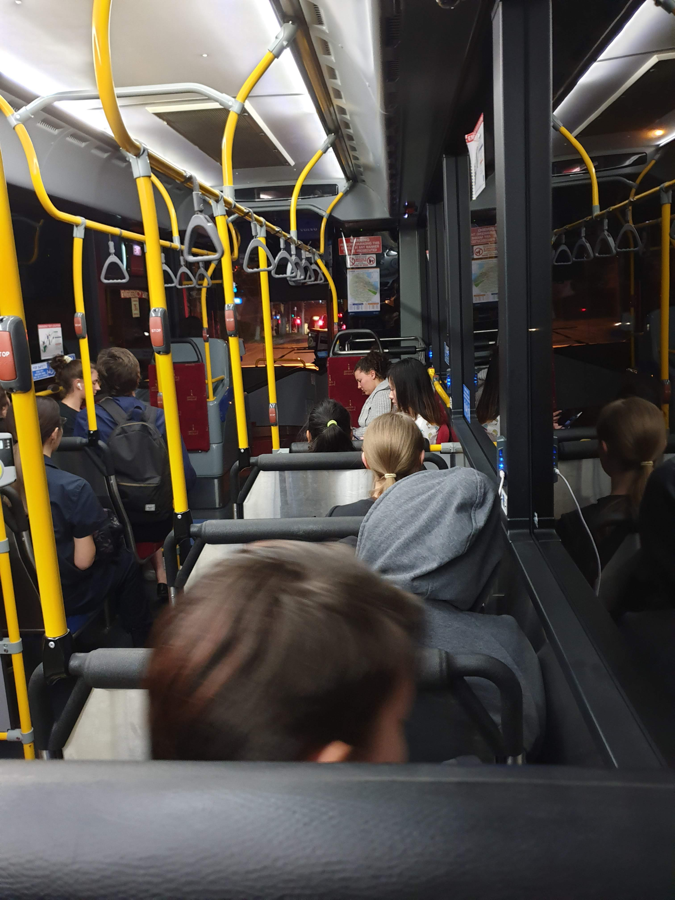

ส่วนของรถสาธารณะนั้น **ที่นี่ก็จะมีรถเมล์ / รถไฟ / รถราง** ซึ่งทั้งหมดนั้นให้บริการโดยเจ้าเดียวกันหมดเลย (ชื่อ Translink) โดยเรา**ต้องซื้อบัตร GoCard มา** โดยมีค่าออกบัตร A$10 ข้อดีของเจ้า GoCard ก็คือ **บัตรเดียวเอาอยู่ทุกอย่าง ใช้เดินทางได้ทุกรูปแบบ** และอีกหนึ่งความเจ๋งคือ ถ้าเราต่อรถเมล์หรือรถไฟไปอีกสายนึง ระบบมันจะคิดเงินใหม่ให้ ซึ่งถ้าสมมติมันอยู่ใน zone คิดราคาเดียวกัน มันจะไม่ตัดตังเพิ่ม พูดง่ายๆ **คือถ้าต่อรถหลายต่อ มันจะไม่เสียตังแบบเอาทีละต่อมาบวกๆ กัน แต่มันจะ optimize ราคาให้ตาม zone ซึ่งมีวิธีคิดของมันแทน**

ตัดภาพมาที่ไทย BTS ต่อ MRT คิดตังแยกกัน บัตรก็แยกกัน

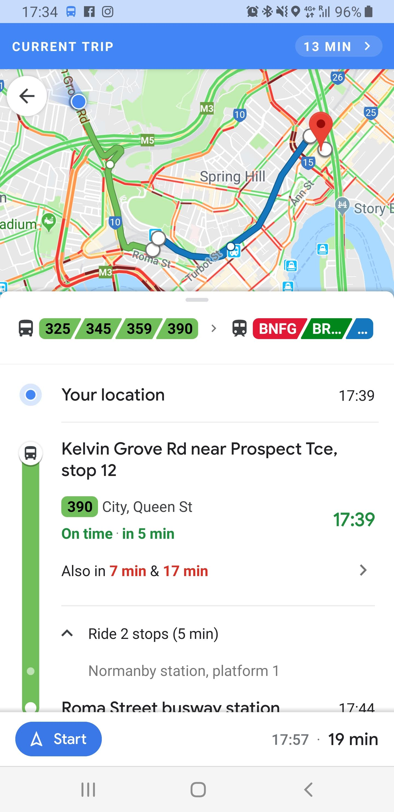

นอกจากนี้ความดีงามคือ **เราสามารถ track ได้ว่ารถเมล์ / รถไฟ จะมาเมื่อไหร่ได้โดยตรงผ่าน Google Maps เลย** ซึ่งค่อนข้างจะตรงอยู่ แต่ก็มีบางครั้งที่มีปัญหาชวนหงุดหงิดใจ เช่นวันก่อนจะไปกินอาหารแม็กซิกัน เลยตัดสินใจว่าเออนั่งรถเมล์ละกัน ไม่กี่ต่อดี ปรากฎว่ามันมีจุดที่ต้องเปลี่ยนสาย แล้ว Google Maps มันดันไม่เผื่อเวลา transfer เลย ปรากฎว่าฝนตก รถติด รถที่นั่งอยู่ไปถึงป้ายเลต ไอ้รถคันที่ต้องไปต่อก็ นั่นละจ้า ออกจากป้ายไปแล้ว

ถ้าเจอขนาดนั้นไม่พอ เลยเปิด Maps calculate ทางใหม่ เออ ทางนี้โอเค รอรถเมล์อยู่ตรงนั้น ปรากฎว่ารถเมล์ไม่จอดครับ เด๋อครับ กูงงเลยทำไมไม่เจอ เลยดูที่ป้าย อ้าวอีห่า **แม่งป้ายนี้ไม่รับคน จะจอดส่งคนอย่างเดียว** กูงงเลยครับ สุดท้ายก็เลยกด Ola ไป

ซึ่งถ้าถามว่า ราคารถเมล์ / รถไฟแรงไหม **ถ้ามาฟัดด้วยการแปลงหน่วยเงินตรงๆ กับไทย ก็แพงจริงครับ** คือนั่งรถเมล์ไปไม่ไกลเล้ย โดยไป A$2 (44 บาท) **แต่ถ้าลองคิดว่า ข้าวจานนึงกินทีเนี่ยมันก็ปาไป A$10 (220 บาท) แล้ว...ถูกหรือยังล่ะครัช** เทียบกับเมืองไทย ข้าวจานนึง 50 บาท ส่วนค่า BTS ล่อไป 59 บาท ค่าเดินทางแม่งแพงกว่าค่าข้าวอีก

แถมอีกอย่างนึงคือ ระบบขนส่งสาธารณะมันค่อนข้างพาเราไปได้หลากหลายจุดทั่วเมืองจริงๆ เหมือนวางแปลนมาอย่างดี อย่างวันก่อนไป Gold Coast ซึ่งไกลเอาการ แต่ก็สามารถเดินทางด้วยรถไฟ / รถราง / รถเมล์ ไปจนถึงได้เลย พูดง่ายๆ คือยูสามารถไปไหนก็ได้ในเมือง ถ้าไม่ consider เรื่องต้องรีบเดินทางในเวลาจำกัด

อีกอย่างคือ **รถเมล์ รถไฟอะไรพวกนี้มันสะอาดด้วย แอร์ด้วยครับ** นั่งไปไม่บ่นร้อนสักคำ แถมเขาไม่มีมาตรการยัดคนให้แน่นรถเมล์ด้วยนะ คือพอแน่นระดับนึง ก็จะหยุดรับคนเลย 

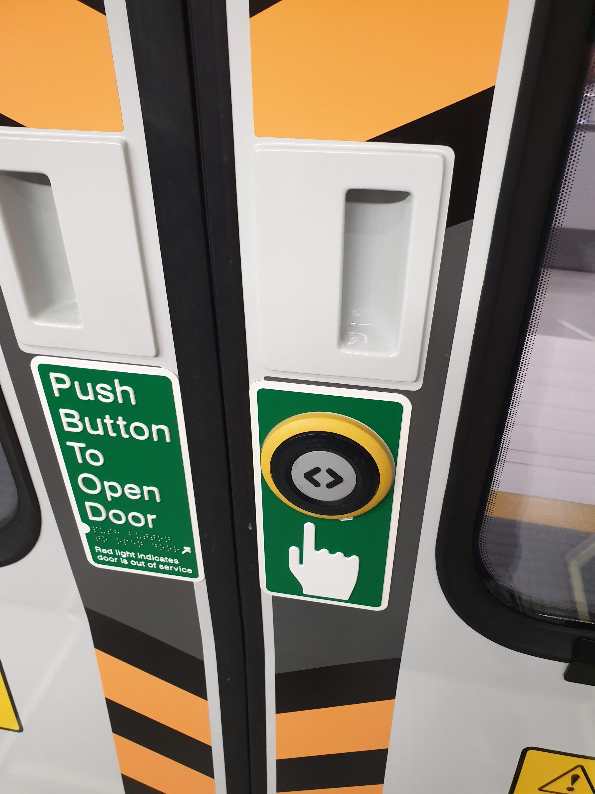

อ๋อ อีกอันที่เจอคือ รถไฟที่นี่ประตูจะไม่เปิดเองนะ เราต้องกด ซึ่งทั้งข้างนอกและข้างในจะมีปุ่มให้กด

## อาหารการกิน

ที่ออสเตรเลีย **ไม่มีอาหารประจำชาติ** ฉะนั้นถ้ามาไกลขนาดนี้ จะหวังว่าอาหารประจำชาติอารมณ์ฝรั่งมาไทยต้องได้กินต้มยำกุ้ง บอกเลยว่าที่ออสเตรเลียไม่มีอะไรแบบนี้

แต่ที่ออสเตรเลีย อาหารค่อนข้างมีความ diversity สูงระดับนึงนะ ถึงแม้จะไม่เท่าไทยก็เถอะ

ถ้าให้ไล่เรียง ก็มี

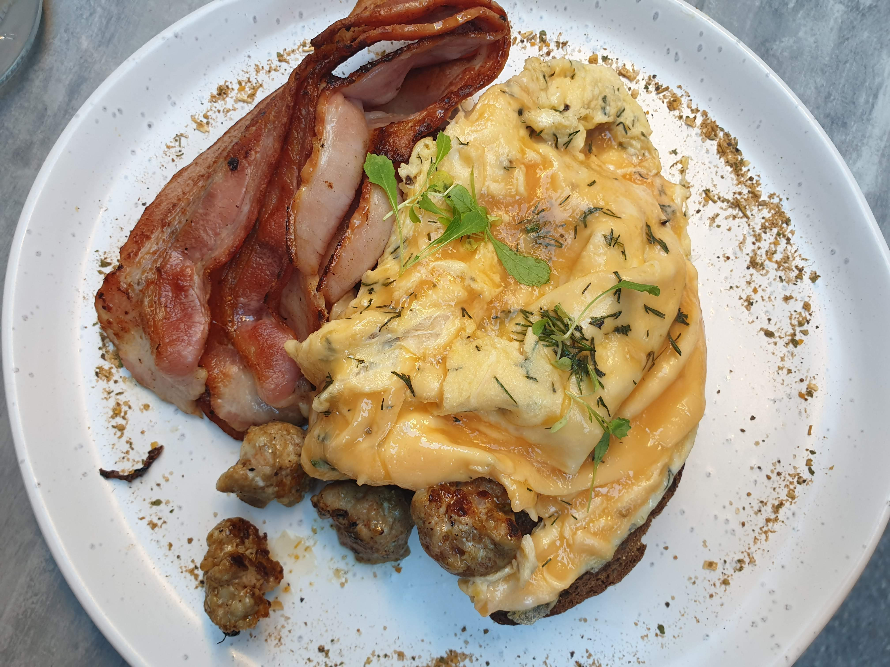

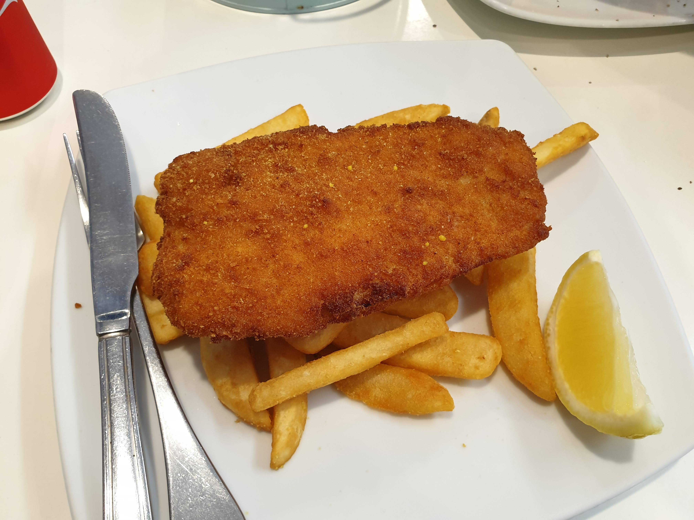

อาหารฝรั่ง จำพวกขนมปัง ไข่ เบค่อนยามเช้า (คุณดูความใหญ่ของเบค่อนสิ) หรือ Fish & Chip

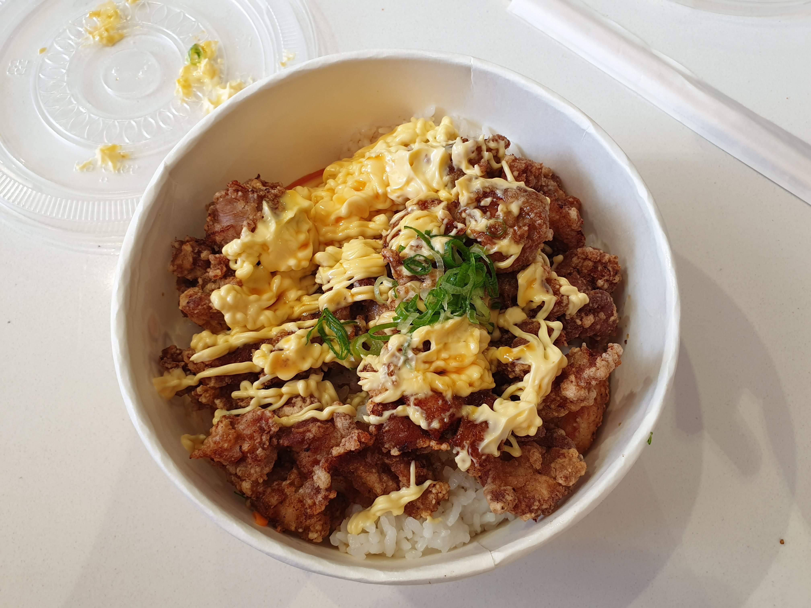

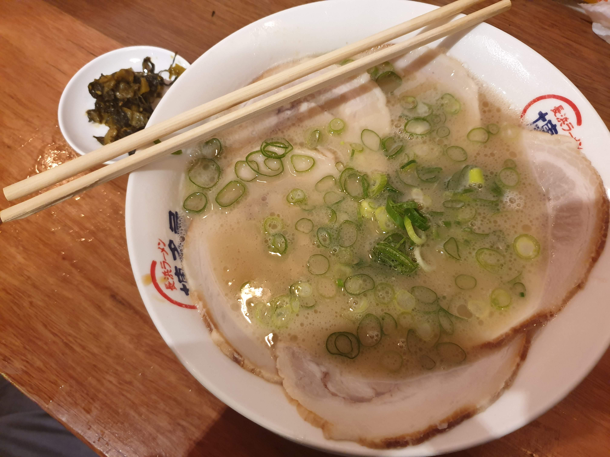

ญี่ปุ่น **(ซึ่งความแปลกคือ ที่นี่คนเกาหลีอะเยอะมากๆ แต่คนเกาหลีมันไม่ทำอาหารเกาหลีขายเว้ย แม่งทำอาหารญี่ปุ่นขาย)**

เกาหลี (ที่นี่คนไม่นิยมเกาหลีเทียบเท่ากับญี่ปุ่น อาหารญี่ปุ่นดูจะฮิตกันมากกว่า)

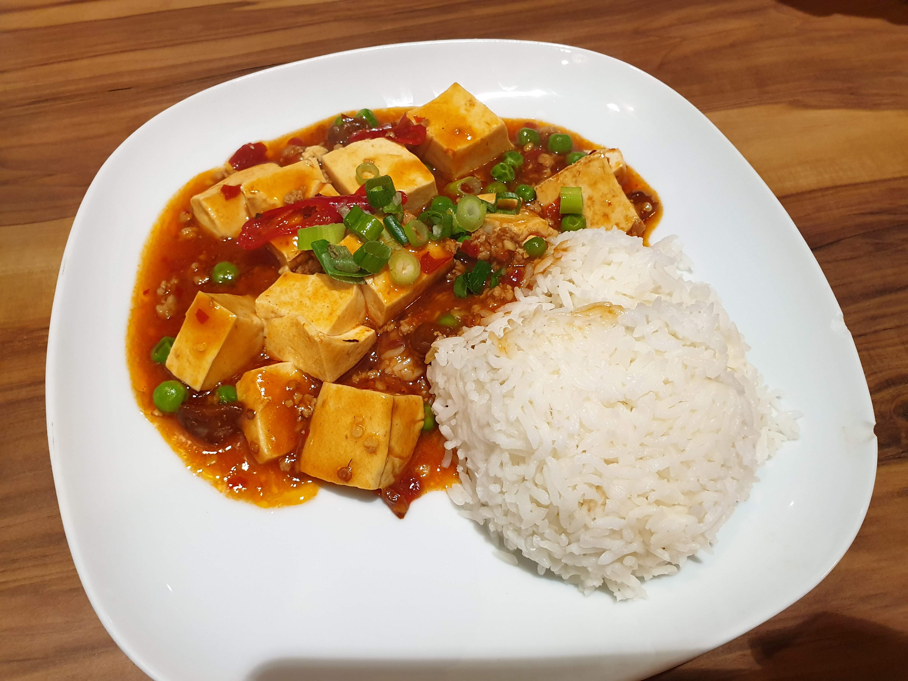

จีน (อันนี้กินไป โคตรพลาด คือเหมือนใส่หม่าล่าอะ ปากชาเลยกู)

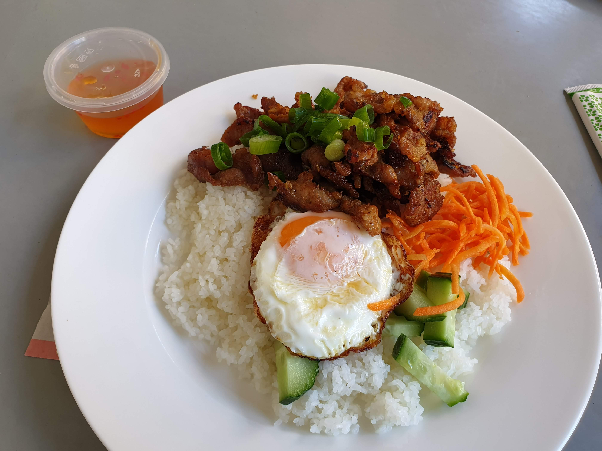

เวียดนาม (ชีวิตไม่เคยจะกินอาหารเวียดนาม แต่บอกเลยว่า แม่งอร่อยสรึส หมูกรอบแม่งสุดมาก หมูกรอบแม่งคือ อร่อยที่สุดในชีวิตแล้วอะ แต่ลืมถ่ายมา ไอ้อันนี้ก็อร่อยเหมือนกัน เป็นหมูย่าง ทึ่งอะสิ คือที่ไทยแม่งอาหารเวียดนามจะไม่มีเมนูแบบนี้เลย แต่ที่นี่มีจ๊ะ)

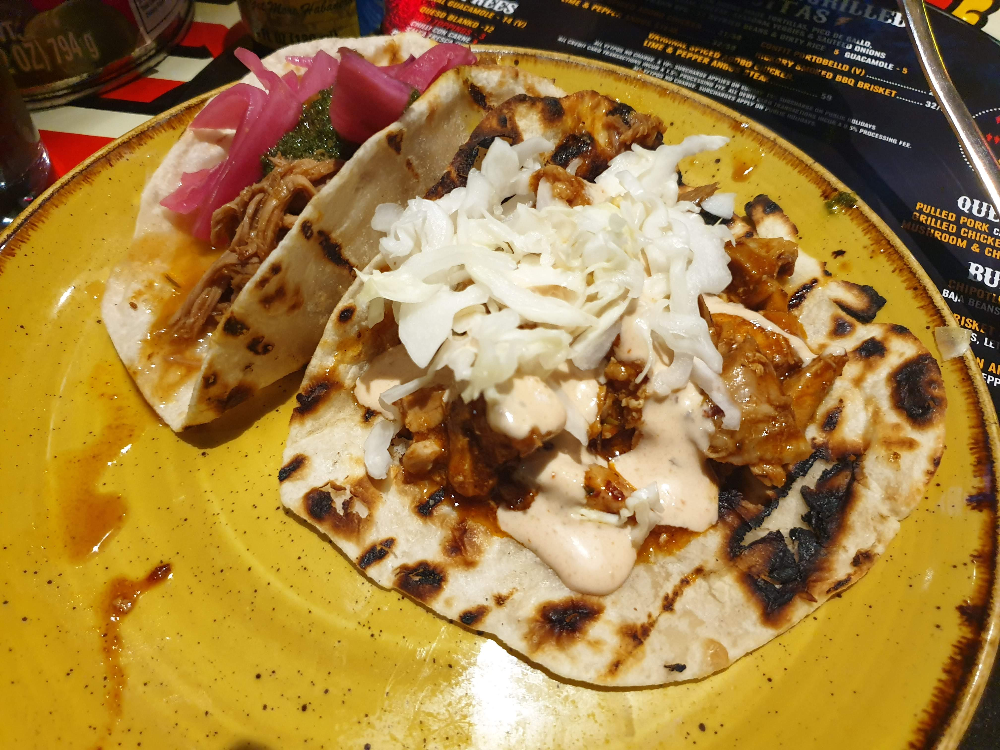

อาหารแม็กซิกันก็มี ร้านนี้ได้ดาวเยอะมากๆ 4 ดาวกว่า และน่าจะดีที่สุดในย่านบริสเบนและ

ส่วนอาหารไทยก็มีเหมือนกัน แต่ยังไม่ได้ไปโดน

ประเด็นคือ **โดยรวมๆ แล้ว รสชาติถือว่าอร่อยเลย** เท่าที่กินมาคืออร่อยหมด **ถ้าจะให้ติ ก็คือเรื่อง portion ของอาหาร** คือคนออสเตรเลียกินเยอะมากๆๆๆๆ **portion ที่ได้กินมันคือ portion ฝรั่งกินอะ แบบเยอะบ้าบอมากสำหรับคนไทย** (ขนาดคนไทยที่โตที่ออสเตรเลียตั้งแต่เด็ก ยังบอกว่าเยอะมากๆ เลยคิดเอา) ซึ่งเราก็จะมองมันเป็นข้อดีก็ได้ คือเราก็ซื้อมาแบ่งกินหลายมื้อเอา

ในส่วนราคานั้น เนื่องจากโชคดีเราได้มาทำงานอยู่ในมหาลัย ดังนั้นราคาอาหารแถวๆ นี้ก็จะถูกกว่าในเมืองพอตัว เจอถูกสุดอยู่ที่ A$8 แพงสุดคือ A$15 ในขณะที่ถ้าเป็นในเมือง ราคาจะตกที่ A$15 คือ start

แต่ถ้าจะเอาถูกแบบ ultimate คุ้มค่าสุดๆ ก็คือทำกับข้าวเอง เพราะวัตถุดิบที่นี่ ราคาถือว่าถูกเทียบกับซื้อกิน แถม portion ยังมหาศาลอีก

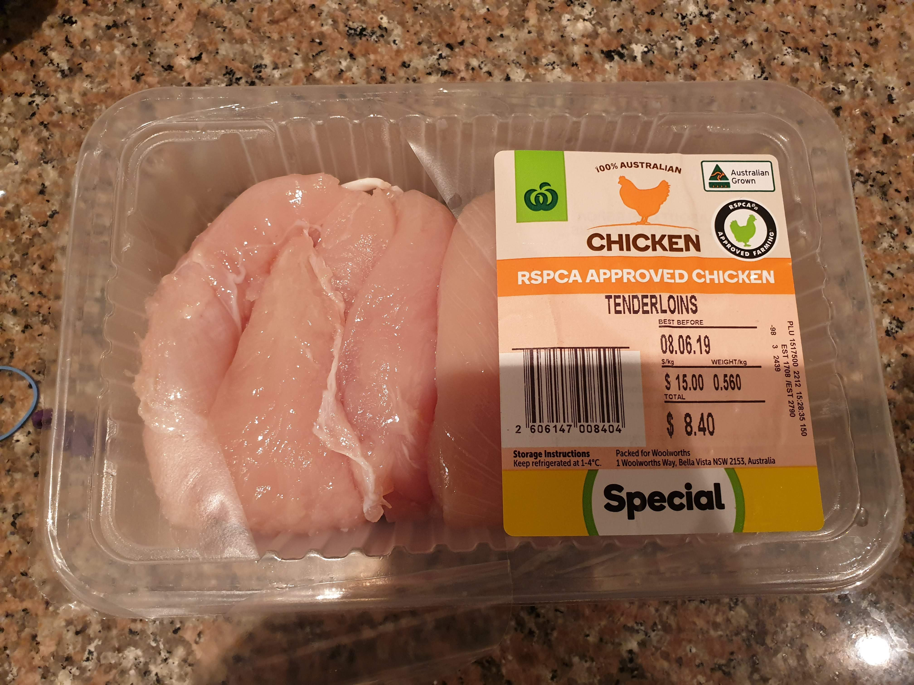

เช่น สันในไก่ ที่ผมเอามันมาทำไก่กระเทียม / แกงกะหรี่ไก่ กิน กล่องนี้เนี่ย A$8.4 แต่กินได้แม่ง 4 มื้อเลยครับ

แต่อีกปัญหาของการทำอาหารเองคือ ตัวผมนั้น**ไม่เคยทำกับข้าวเองมาก่อนเลย** มาที่นี่คืออาศัยพี่ๆ เขาช่วยชี้แนะล้วนๆ บางอันก็มา improvise เอาเอง แต่ก็สนุกดีเหมือนกัน (กลายเป็นตอนนี้ติดทำกับข้าวละ ลองสรรหาเมนูนู้นนี้มาทำดูเรื่อยๆ 55)

ในส่วนของเครื่องดื่ม ที่นี่พวกน้ำอัดลมแช่เย็นจะแพงมาก เพราะเขาเองก็คิด cost การแช่เย็นด้วย และอีกประการคือถึงแม้จะไม่แช่เย็น ราคาก็แพงอยู่ดี เทียบกับซื้อขวดใหญ่ คือซื้อขวดใหญ่คุ้มกว่าเยอะ เช่นวันนี้เจอว่านมขวดเล็กราคา A$3 แต่พอมาดูขวดใหญ่มากๆ ใหญ่กว่าเกือบ 4 เท่า ราคาแม่ง A$4 เฉย แล้วงี้ใครมันจะไปซื้อขวดเล็กถ้าไม่จำเป็น หรือหิวขนาดนั้น

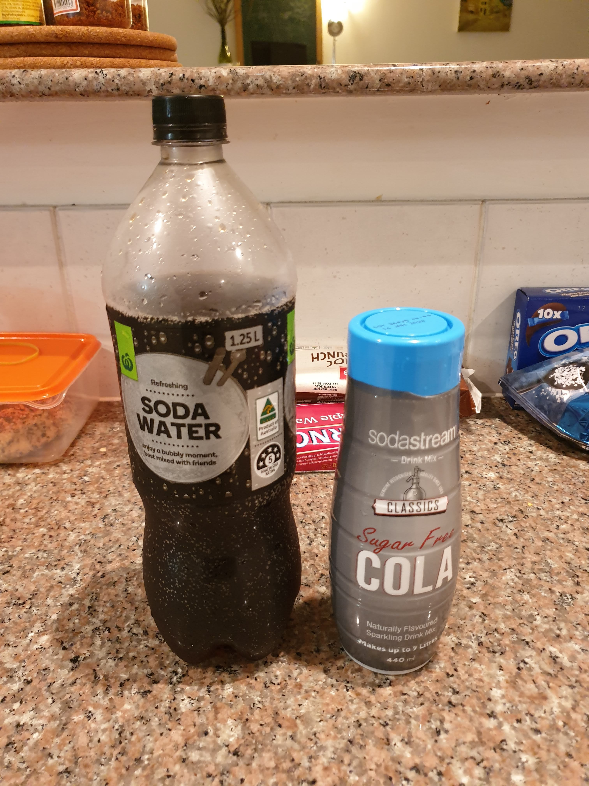

**แต่ผมได้ค้นพบอีก solution สำหรับคนอยากกินน้ำอัดลม ก็คือทำเองครับ** ไปซื้อหัวเชื้อ Cola มา 1 ขวด ราคา A$7 (วันนี้เห็นลดเหลือ A$5) แล้วก็ซื้อโซดาขวดใหญ่มา (ครับ ที่นี่โซดามีเป็นขวดใหญ่แบบ 1.25 ลิตรเหมือนโค้กเลย) เอาโซดาแช่เย็นไว้ ตอนจะกินก็หาขวดมาแบ่งโซดา แล้วก็ใส่หัวเชื้อ Cola ไป แล้วก็เขย่าเบาๆ อย่าแรง แค่นี้คุณก็ได้โคล่าซ่าๆ มากินแล้ว ในราคาที่โคตรถูก เพราะอีหัวเชื้อมันเยอะมากๆ สามารถใช้ได้ถึง 9 ลิตร และโซดาขวดที่ผมซื้อมาเนี่ย A$0.8 เท่านั้น

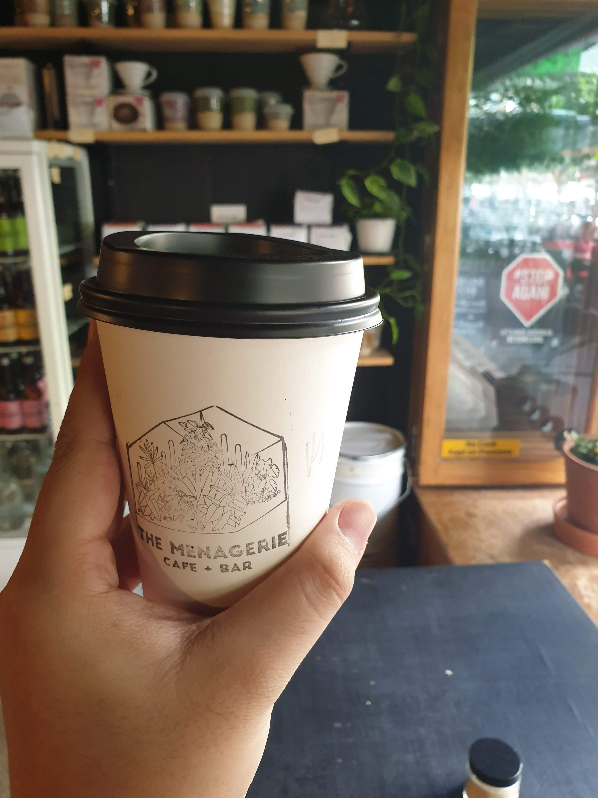

หรือถ้าไม่ชอบน้ำอัดลม **ชอบซดกาแฟคาเฟอีน ที่นี่ถือว่าเป็นสวรรค์ของคุณเลยแหละ คาเฟ่ที่นี่เยอะมากๆ** มากแบบตามไปกินให้หมดนี่คือต้องแหกตาตื่นเช้าไปทุกวันวันละร้าน อร่อยจัด แล้วคือด้วยความที่อากาศหนาวไง กาแฟร้อนๆ สักแก้วแม่งคือสวรรค์ชั้นเลิศเลยแหละ และราคาก็โอเคเลย (คือที่นี่สตาร์บัคส์ ไม่ได้ผุดได้เกิดอะ คือคาเฟ่มันเยอะ และคุณภาพมันก็ดีกว่าอีก ราคาก็โอเคอีก) และที่นี่ถ้าคุณเอาแก้วส่วนตัวไปเอง เขาลดให้ด้วยนะเออ นี่ที่ไทยไม่มีแก้วกาแฟเล็กๆ มานี่ซื้อไปละเรียบร้อยจ้า 5555

## คุยเพลินกับคนโลคอล (ได้คุยบ่อยโดยเฉพาะตอนนั่ง Ola 555)

**ยังยืนยันคำเดิมจากตอนก่อนว่า คนที่นี่ nice มากๆ เจอคนชวนคุยนู้นนี่นั่นเยอะและบ่อยมาก** โดยเฉพาะอย่างยิ่ง ถ้าเรานั่ง Ola เนี่ย มีหลายคนทีเดียวก็จะชวนเราคุย ขอเล่าเป็นคนๆ ละกัน

**ลุงเคยไปพันธุ์ทิพย์:** คนนี้น่าจะประทับใจสุดเท่าที่ได้คุยมาละ ตอนนั้นเรียก Ola ไปร้านอาหารแม็กซิกัน ลุงคนขับแกเขาก็ชวนคุย ก็เลยบอกว่าไอมาจากไทยแลนด์นะ เขาก็บอก โอ้เขาก็เคยมาเที่ยวไทยเมื่อนู้นสิบปีก่อน ก็เลยถามว่าไปไหนมาบ้าง เขาก็บอกไปไอ้ตึก IT ใหญ่ๆ อะ เราก็ทักไป อ๋อพันธ์ุทิพย์อะนะ เขาก็ โอ้เยสๆ แล้วก็บอกว่า ตอนนั้นซื้อโปรแกรมมาโคตรถูกเลย ถูกมากๆ (เออพี่ ไอ้ที่ลุงซื้ออะ แม่ง Illegal นะ 555555) และเขาประทับใจช่างที่พันธ์ุทิพย์ด้วยนะ ตอนนั้นโทรศัพท์พัง เลยให้ไปซ่อมที่พันธุ์ทิพย์​คือเขาชมช่างว่ามือโปรอะ แบบซ่อมได้ไม่มีปัญหาเลย แล้วเขาก็บอกมาว่า "ยูด้อนทรัสอินเดียอินสิงค์โปร์นะ" (เขาคงโดนช่างที่สิงค์โปร์หลอกฟันตังมาแหงๆ)

**ไอติ้งยูอาร์เจแปนนีส:** ตอนนั้นไป meetup เสร็จ ก็นั่ง Ola กลับ ทีนี้คนขับเขาก็เป็นคนเอเชีย ฟังจากสำเนียงแล้วกำลังคิดว่าอาจจะเป็นเวียดนาม พอขึ้นรถเขาก็ทักว่าแบบ ยูเพิ่งทำงานเสร็จเหรอ ก็บอก อ่อโนๆ เพิ่งไปมีทอัพมา...หลังจากนั้นก็ขับไปสักพัก เขาก็ชวนคุย เขาก็ถามว่ามาจากไหน ก็บอกว่ามาจากไทย เขาบอกอ่าวเหรอ "ไอติ้งยูอาร์เจแปนนีส" (หน้ากูญี่ปุ่นขนาดนั้นเลยเหรอ) แต่จริงๆ เขาคิดว่าเรามาจากญี่ปุ่น เพราะสำเนียงภาษาอังกฤษของเราเขาฝั่งแล้วนึกว่าเป็นคนญี่ปุ่น ไอ้เราก็ มึงไม่ใช่ละ ก็บอกไปว่า ไอมาจากไทยแลนด์​ แต่มายแกรนด์พาเป็นคนจีน เขาก็เลยอ่อออออออ เลย...พอถึงบ้านปุ๊ป ก็นั่งๆ คิดนะ หรือว่าไอ้สำเนียงการพูดภาษาอังกฤษเนี่ยมันอาจจะสืบทอดมาจากสายเลือดได้วะ

**อาร์ยูสติวเด้น?:** คนที่นี่ทักว่าเราเป็นนักเรียนเว้ย ทักเยอะมากๆ ก็บอกไป โนๆ ไอแกรดดูเอทฟอร์ทูเยียร์ออลเรดี้นะ 5555

**ทำไมคนออสซี่เขาไม่ขี่มอไซด์กัน:** ตอนนั้นใน BrisJS ที่เป็น meetup ก็ได้ลองใช้สกิล networking อันน้อยนิดพูดคุยกับคนข้างๆ ที่เป็นออสซี่แท้ๆ ดันโชคดีว่าเขาเคยมาไทย เลยมีเรื่องคุยกันเยอะเลย คนนี้เขาเคยอยู่ไทยนานพอตัว ความน่าสนใจคือพี่แกไปมาหลายจังหวัดมากๆ ไปกรุงเทพ / เชียงใหม่ / เชียงราย และอีกจังหวัดนึง จำไม่ได้ แต่เป็นจังหวัดเมืองรองแบบรองมากๆ คือก็ตกใจเหมือนกัน เพราะถ้าบอกว่าเจอชาวออสซี่เคยมาไทยแล้วก็จะยังไม่พีคเท่าว่า เขาเคยไปเยือนเมืองรอง (เขายังพอจำคำไทยได้ด้วยนะ อย่างน้อยก็สวัสดีครับ กับขอบคุณครับ 5555)...ทีนี้ไอ้เราก็สงสัยเรื่องนึงในตอนนั้น คือที่บริสเบนเนี่ย เขาไม่ค่อยขับมอเตอร์ไซด์กัน ถ้ามีทีก็คือบิ๊กไบค์เลย Ducati เงี้ย เลยถามเขาไปว่า เออทำไมที่นี่เขาไม่ขับกัน ตอนแรกเขาก็ไม่รู้ แต่เขาก็คิดๆ แล้วก็บอกว่า "อาจเป็นเพราะเมืองมันโตมากับรถยนต์​ คนก็เลยโตมากับรถยนต์" และทุกอย่างก็พัฒนาเพื่อรถยนต์ การออกแบบผังเมืองก็ออกแบบมาเพื่อรถยนต์วิ่งผ่าน ถ้าเทียบกับโซน Southeast Asia แล้วเนี่ย ผังเมืองมันมีตรอกซอกซอยเยอะ รถมันเดินทางลำบาก แมงกะไซด์เลยนิยมเพราะมันลัดเลาะซอกซอยได้ เราก็คิดตามแล้วก็ เออๆ มีเหตุผลดี

**มายแดดวอสลีฟอินไทยแลนด์:** อันนี้คือตอนไป Node Brissbane เป็นมีทอัพแรกที่ได้ไปในออสเตรเลียเลย ก็บังเอิ๊ญได้เจอ organizer เลยพูดคุยกัน ก็แนะนำตัวไปว่าเออไอมาจากไทยแลนด์นา เขาก็บอกเลยว่า ไอเคยไปๆ พ่อไอเนี่ยเคยไปอยู่นู้นมาสองปีด้วยนะ เพิ่งกลับมาเดือนก่อน (เขาบอกเปิดร้านกาแฟด้วยที่อ่อนนุช ไอ้เราก็ดันลืมถามว่าร้านกาแฟชื่ออะไรจะได้ไปอุดหนุนสักหน่อยแหม่)

## อื่นๆ เท่าที่นึกออก

- **ทางม้าลายที่นี่โคตรศักดิ์สิทธิ์ คือถ้ามีคนข้ามอยู่ ไม่ว่ารถมึงจะใหญ่ขนาดนั้นมึงจะหยุดให้คนข้ามเสมอ**
- หรือต่อให้ตรงนั้นไม่มีทางม้าลาย **แต่ถ้ามีคนข้าม ก็จะชะลอให้คนผ่านก่อน**
- ด้วย culture แบบนี้ ตอนแรกก็มีความเกรงใจอยู่เหมือนกัน ก็พยักหน้าขอบคุณเขาทีนึง แต่จริงๆ แล้วคนที่นี่เขาก็ไม่พยักหน้ากันนะ เพราะปกติรถมันต้องจอดให้คนเดินผ่านอยู่แล้ว 55
- จริงๆ **หลักการรถหยุดให้คนข้าม apply ไปถึงรถบนท้องถนนกันเองด้วย โดยใช้หลักการว่ารถใหญ่รอรถเล็ก** (รถยนต์ รอจักรยาน / รถบัส รอรถยนต์)
- **โซนที่อยู่กับทำงาน มีความเป็นเนินเขาสูงมาก คือทางชันมาก** จะเจอเหตุการณ์ที่ว่า Google Maps พาเดินก็ดูจะไม่มีอะไรนิ แต่ความเป็นจริงไอ้ทางที่มึงมาพากูเดินคือชันมากๆ เข่าพังชิบหายวายวอด 555 **และเอาเข้าจริง Google Maps มันมีฟีเจอร์บอกความชัน แต่ในไทยแม่งไม่เคยใช้ไง 55555**
- **ที่นี่คนปั่นจักรยานเยอะ** และด้วยความ**ปลอดภัยในการใช้รถใช้ถนนมันสูง คนเลยกล้าปั่นจักรยานกัน** หรือแม้กระทั่งขับสกู๊ตเตอร์ไฟฟ้ากันก็มี (มี startup เจ้านึงชื่อ [Lime](https://www.li.me/) ที่ให้บริการสกู๊ตเตอร์ไฟฟ้าปั่นด้วย)
- **ที่นี่เดินลัดสนามหญ้า ไม่มีคนชี้หน้าด่านะครับ**
- เด็กๆ ที่นี่มารยาทดีมาก วันก่อนเจอคริสปี้ครีมฟรี เลยกำลังลังเลว่าจะเอาดีไหม มีเด็กเข้ามาจะต่อ แต่ถามว่า "ต่อคิวอยู่ไหมครับ" โอ้โห เป็นเด็กไทยแม่งต่อไปละจ๊ะ ไม่ถงถามกุสักคำ
- และ**เด็กๆ ที่นี่คือมีความกล้ามาก กล้าทำนู้นทำนี่ เล่นนู้นเล่นนี่ เพราะพ่อแม่ค่อนข้างปล่อย** แต่ไอ้คำว่าปล่อยมันก็ไม่ใช่ปล่อยให้มึงทำอะไรก็ได้นะ แต่เป็นอารมณ์แบบมองห่างๆ อย่างห่วงๆ ถ้าลูกทำอะไรไม่เข้าท่าถึงค่อยไปห้ามปราม
- **รถเมล์ที่นี่มีเลนถนนให้รถเมล์โดยเฉพาะด้วย**ในถนนบางเส้น และ**มีแม้กระทั่งอุโมงค์ให้รถเมล์ขับเท่านั้นด้วย** เพื่อให้มันไม่ไปรบกวนถนนหลักมาก
- **วันอาทิตย์ ร้านค้าจะปิดไวมากๆ ปิดแบบ ห้าโมงเย็นปิด** ส่วนวันธรรมดาตกทุ่มนึงก็ปิดแล้ว (ไอ้ความคิดว่าทำงานเสร็จเข้าเมืองไปดูนู้นนี่นั่นคือดับฝันไปเลย ถ้าจะไปคือต้องออกจากออฟฟิศก่อน)
- แต่วันศุกร์​ คนจะคึกคักมาก เพราะร้านค้าปิดดึกกว่าวันอื่น ปิดสามทุ่มงี้
- ที่นี่ผู้สูงอายุ ไม่ค่อยเห็นจะนั่งแช่อยู่บ้านกัน ก็เห็นออกมาทำนู้นทำนี่อยู่นะ **มีคนนึงอายุ 60 กว่าก็ยังทำ startup ก็ยังมี**

---

สำหรับตอนต่อไป หลังจากเราทำงานจันทร์-ศุกร์อย่างหนักหน่วงแล้ว วันเสาร์-อาทิตย์ ก็ถือเป็นวันพักผ่อนของเรา เดี๋ยวเรามาดูกันว่าบริสเบนมีอะไรน่าเที่ยวกันบ้าง!
