ปกติผมเขียนบล็อกในโฮสต์ของตัวเองครับ แต่มาลองเปลี่ยนมาเขียนใน Medium ดูบ้าง

**หมายเหตุ:** บล็อกนั้นจะ geek เยอะมากๆ ใครไม่ใช่สาย dev จะหาเรื่องอ่านยากมากนะ ฮ่าๆ

โอเค เข้าประเด็นเลยดีกว่า คือเพิ่งได้มีโอกาสไปเข้าร่วมค่าย Young Webmaster Camp ครั้งที่ 14 (YWC#14) เพิ่งกลับมาถึงบ้านเมื่อวานนี้ (นอนตายสนิท) ก็เลยมาเขียนรีวิวแชร์เรื่องราวให้ฟังกัน ว่าค่ายนี้มันคืออะไร สมัครแล้วสัมภาษณ์เป็นยังไง เข้ามาในค่ายแล้วเจออะไร

## YWC คือค่ายอะไร?

YWC เป็นค่ายที่เปิดโอกาสให้นิสิต-นักศึกษาในระดับมหาวิทยาลัย ทุกสาขาอาชีพ ทุกชั้นปี ที่สนใจในสายงานของการทำเว็บไซต์สมัครมาเข้าค่ายได้ โดยสาขาในค่ายนั้นจะมี 4 สาขาด้วยกัน คือ

- **Web Programming:** แน่นอน เว็บจะเกิดขึ้นมาให้เห็นได้ ก็ด้วยพลังของ Developer ขอบตาดำ(กำ)
- **Web Designer:** แต่ถึงแม้ Web Programming จะเสกเว็บให้ขึ้นออกมาได้ แต่หากขาดการ Design ไป ก็ไม่ได้เว็บที่มีหน้าตาสละสวยมาให้ใช้ไง ดังนั้น ดีไซน์เนอร์ระดับพี่ยุ่นฟรีแลนซ์(ไม่ได้นอนเฉย) ก็มีบทบาทสำคัญในการสร้างเว็บด้วย
- **Web Content:** ถึงแม้เราจะมีทั้งคนเขียนโค้ด ทั้งคนดีไซน์แล้ว แต่ถ้าเว็บไร้เนื้อหาที่ดึงดูดให้คนเข้ามาดูเว็บของเรา เว็บก็คงจะไม่มีจุดน่าสนใจใช่ไหมล่ะ ดังนั้นคนทำ Content ที่อดหลับอดนอนเพื่อคิด Content ระดับคุณภาพ จึงมีบทบาทสำคัญมากๆ เพราะ Dev กับ Designer ก็คิด Content สู้คนทำ Content จริงๆ ไม่ได้หรอก จริงไหม
- **Web Marketing:** และท้ายสุด หากเว็บมีทุกอย่างแล้ว ทั้งโค้ด ทั้งดีไซน์ ทั้งคอนเท้นท์ แต่หากขาดคนทำการตลาดที่ยอมแหกตาตื่นตลอดคืน เพื่อหา Business Model ที่จะทำเงินให้กับเว็บได้ เว็บก็เจ๊งอยู่ดี เพราะสุดท้ายเว็บจะไม่มีเงินเข้ามาเลย
  แม้ว่าอ่านๆ มา ทุกสาขาแม่งจะอดนอนเหมือนกัน(เวรกำ) แต่ทุกสาขาต่างพึ่งพาอาศัยกันครับ อย่างที่ได้กล่าวๆ ไว้

ซึ่งในค่ายนั้น ก็จะมีกิจกรรมเยอะแยะมากมาย ทั้งมีสาระ เช่น ฟังบรรยายจากพี่ๆ ตัวเทพในสาขา (ตัวเทพจริงๆ อันนี้บอกเลย) รวมถึงทำโปรเจคที่ยิ่งใหญ่อลังการงานสร้าง (ที่เป็นแก่นหลักของค่ายนี้) และกิจกรรมไม่มีสาระก็ยังมีด้วย เช่น สันทนาการ เล่นเกมฐาน บลาๆๆ เรียกได้ว่ากิจกรรมนี้มีหลากหลายครบเครื่องเลยทีเดียว

## สมัครยังไง?

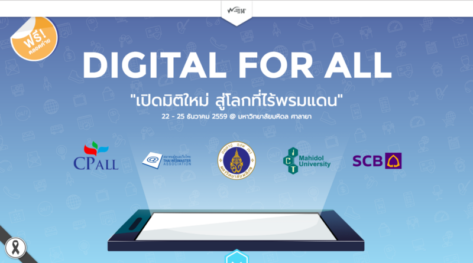

ค่ายก็จะมีเปิดรับสมัครบนเว็บครับ ช่วงเวลาไม่แน่ใจว่าตรงๆ กันไหมในทุกๆ ปีแต่ของปีนี้จะสมัครช่วงกันยายน — พฤศจิกายน ครับ ซึ่งก็ตามปกติของค่ายนั้นการสมัคร ก็จะต้องมีการตอบคำถาม โดยจะมีทั้งคำถามส่วนกลาง ที่จะถามภาพกว้างๆ และทั้งคำถามสาขา ที่จะถามเฉพาะเจาะจงไป

ในส่วนของคำถามสาขานั้น คือเราสมัคร Programming ไป (จริงๆ สมัครค่ายนี้ตั้งแต่ปีที่แล้วละ แต่ดันไปสมัคร Content ที่ติดก็แย่ละ 55) คำถามที่จะเจอก็จะแบบให้คิดเยอะอยู่เหมือนกัน ปีเราคำถามก็มี

- เลือก tools หรือ framework ที่ชอบที่สุดขึ้นมาตัวนึง อธิบายว่ามันคืออะไร ข้อดีข้อเสียคืออะไร
- หากต้องทำเว็บจดโน้ตออนไลน์ คล้ายๆ Google Notes น้องจะใช้ tools อะไรในการทำบ้าง ให้ครบทุกส่วน ทั้ง Front-End Back-End Database
- ทำไมน้องอยากเป็น Web Programmer

ซึ่งบางข้อเนี่ย ตอบได้อย่างชิว เว้นข้อสุดท้ายนี่แหละ แบบสะอึกมานิดนึง จะตอบว่า “ก็เพราะชอบทำเว็บ” มันก็กระไรๆ อยู่เนอะ 5555 แต่ตอนตอบนี่ก็ไม่ได้ตอบแบบ ไม่ใช่คำตอบของตัวเองนะ คือมันเป็นเหตุผลที่อยากเป็น Web Programmer จริงๆ เหมือนกัน

## สัมภาษณ์?

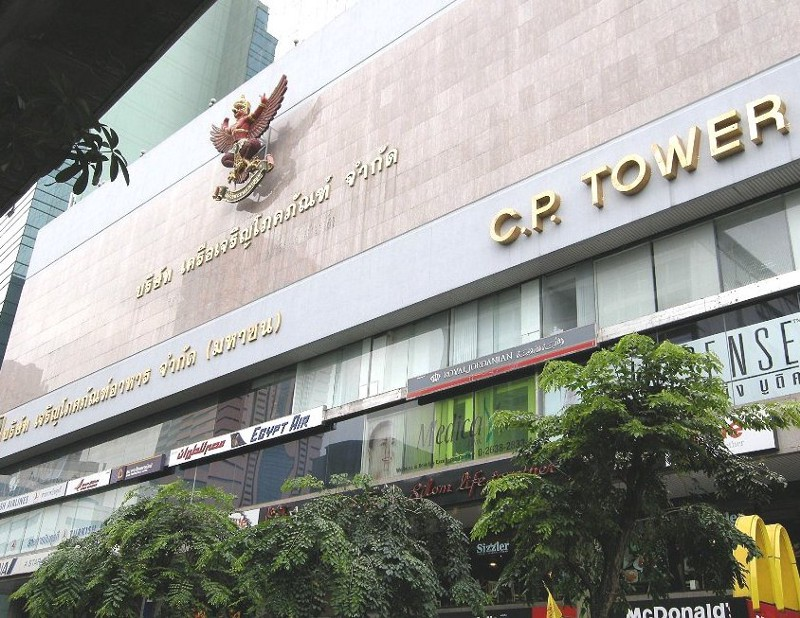

คือเท่าที่เราทำค่ายมา และเคยเห็นระบบการรับสมัครค่ายต่างๆ ก็จะอิงการคัดเลือกคนเข้าค่ายจากการตอบคำถามในใบสมัครนี่แหละ แต่ค่ายนี้มีอะไรที่ extra มาอีกชั้นนึงครับ คือค่ายนี้มีการ**สัมภาษณ์**เพื่อเข้ามาในค่ายอีกด้วย และการจะสัมภาษณ์นั้น ไม่ใช่ว่าทุกคนเข้ามาแล้วก็สัมภาษณ์นะ ต้องมีการทำ**การบ้านสาขา**อีก! การบ้านนั้นก็จะตามแต่ละสาขาให้ทำครับ

และผมสมัคร Programming ใช่ไหมละ แน่นอน การบ้านก็ต้องมีแนวโค้ดๆ ชัวร์ การบ้านที่โดนก็คือ **“ให้ทำเว็บที่มี 1 ไฟล์เท่านั้น มีตัวอักษร YWC อยู่ และให้แสดงความสามารถของ HTML5 ออกมาด้วย”**

ฟังเหมือนจะง่าย แต่จริงๆ มันไม่ง่ายเลย เพราะเขาต้องการ 1 ไฟล์เท่านั้น นั่นหมายความว่า เราต้องยัดทุกอัน ทั้ง CSS และ JavaScript ไปอยู่ใน Single HTML และด้วยความไม่แน่ใจว่าจริงๆ แล้วจะมีเน็ตไหมในที่สัมภาษณ์ ทำให้การทำต้อง base อยู่ที่ Offline first คือไม่มีเน็ตก็เข้าได้

และผมก็ทำอันนี้ไปครับ แงะ Source Code ดูกันได้

และก็ถึงเวลาสัมภาษณ์ครับ คือได้สัมภาษณ์รอบเช้า ก็ไปตั้งแต่เช้าเลย ตอนก่อนเข้าสัมภาษณ์ก็ชิวๆ นะ คือเตรียมงานที่เคยทำมาทั้งหมดแล้ว (เผื่อพี่เขาจะดู) แต่พออยู่หน้าห้อง และใกล้จะถึงคิว ความตื่นเต้นก็แบบ มาเฉย คือมือไม้เริ่มสั่น 555 และพอถึงคิว ก็เข้าห้องสัมภาษณ์ไป ได้สัมภาษณ์กับพี่ฮั้น CTO ของ Jitta ที่เป็น Startup ของคนไทยแท้ๆ แต่ไม่ได้เกิดที่ไทย(งงอะดิ) กับพี่บัง ที่เป็น 1 ใน contributor ของ Joomla!

> **สำหรับคนนอกสายที่เข้ามาอ่านนะ** Contributor เป็นคำที่มีการใช้ในวงการ Open Source คือเป็นวงการที่มีคนทำโปรเจคต่างๆ และทำการ Open Source Code ให้เลย ก็คือไม่มีการอุบอิบโค้ดใดๆ เลย โค้ดที่ release ปล่อยจริงเป็นยังไง ก็เป็นยังงั้นเลย ทีนี้ถามว่าทำไมเขาต้อง Open Source หล่ะ เหตุผลส่วนนึงคือ สมมติเรามีไอเดียอยากจะทำอะไรดีๆ เจ๋งๆ เราก็เปิดโปรเจคมา แล้วเราก็ทำๆ ไป สักพักนึงเราก็ค้นพบว่า เฮ้ยมีคนสนใจโปรเจคเราแฮะ อยากทำร่วมด้วย เขาก็มาช่วยเราทำได้ หรือแบบ เฮ้ย โค้ดตรงนี้มันเขียนไม่ดีนะ เขาก็มาช่วยแก้ให้ ซึ่งการช่วยทำ ช่วยแก้เนี่ย เขาเรียกว่า Contribute ให้ครับ ซึ่งในโปรเจคยักษ์ๆ ทางด้านการทำเว็บที่ดังๆ ต่างเป็น Open Source ทั้งนั้นครับ และ contributor ก็มีเยอะคนมากๆ

มาถึงพี่ฮั้นก็โยนคำถามมารัวๆ เลย ก็เริ่มจากถามชื่อ ต่อมาก็เริ่มถามลึกละ ว่าแบบ เนี่ยเห็นเขียนว่าเคยเขียน Angular 2 มาใช่ไหม ก็บอกว่าใช่ ก็ถามว่าชอบ TypeScript ป่าว ก็ตอบไปตามความรู้สึกส่วนตัว แล้วก็ถามว่าซีเนียร์โปรเจ็คทำอะไร ก็เล่าไปให้พี่เขาฟัง (พี่เขาก็บอกว่าดูไม่ค่อยมีอะไรนิ…กำ ก็เลยบอกว่า พี่ผมทำตั้งแต่ Low-Level Network ยัน Application เลยนะ 55)

นอกจากถาม technical แล้วก็มีแบบคำถามชิวๆ ด้วยนะ เช่น ถามว่ารู้จักพี่นัทพี่วีไหม (เป็นพี่คณะ ซึ่งพี่นัทก็ไปทำงานอยู่กับ Jitta) ก็ตอบว่ารู้จัก พี่ก็ถามต่อ “แล้วพี่นัทรู้จักเราเปล่า” อารมณ์แบบ อืมมมมมมมมมมมมมม ไม่รู้พี่ 5555555

และก็ปิดท้ายด้วยว่า เปิดโอกาสให้ถาม ตอนนั้นก็ไม่รู้จะถามอะไรเหมือนกัน ก็ถามพี่บังเรื่อง Open Source นี่แหละ ว่าแบบพี่ได้เข้าไปมีส่วนร่วมยังไง อะไรยังงี้ และความพีคต่อมาคือ เหมือนมีพูดถึงบล็อกอะไรสักอย่าง เราก็ เฮ้ย มีบล็อกนะ ก็บอกพี่ไป จริงๆ ผมก็เขียนบล็อกด้วยครับ พี่ฮั้นก็อย่างไวเลย ถามหาลิ้ง ผมก็บอกไป พี่เขาบอก เฮ้ยเข้าไม่ได้ (ชิบหาย)

สุดท้ายสัมภาษณ์เสร็จออกมา ค้นพบว่า **ไอ้ห่า Domain หมดอายุเมื่อวาน** (โคตรเศร้า) ฟีลลิ่งตอนนั้นก็แบบ โล่งเฉพาะเรื่องสัมภาษณ์นะ มาคุยกับพี่เขาสนุกดี คือเราคุยกับแบบชิวๆ ด้วยไง ไม่กดดันตัวเอง 55 (แต่โล่งไม่หมดนะ มีสอบไง ผมนี่กลับบ้านอ่านสอบต่อเลย)

หลังจากนั้นไม่นาน ผลสัมภาษณ์ก็ออกครับ (ออกในคืนที่สอบเสร็จไปตัวนึงเลย 555) ก็ติดค่ายเรียบร้อยครับ

## ค่ายวันแรก

ค่ายปีนี้จัดที่มหิดลครับ ก็นั่ง BTS ไปบางหว้า และทีนี้ค่ายก็มีเตรียมรถให้ ก็สบายใจไปเลย ไม่เสียค่าเดินทาง 55

ไปถึงก็มีพิธีเปิด แล้วก็มีบรรยายครับ มีสองเรื่องที่บรรยายในพิธีเปิดครับคือ

1. **เปิดโลกคนทำเว็บ แชร์ประสบการณ์ตรงคนดิจิทัล:** มีพี่ๆ สามท่านมาบรรยายให้ฟัง (จำชื่อได้ไม่หมด) ก็มาแชร์ว่าทำเว็บอะไรอยู่ เทรนด์ในปีหน้าจะเป็นอย่างไร ที่จำความได้คือเทรนด์ปีหน้าจะเป็น Real-time ซะเยอะ ถ้าทำ content ที่เป็น Live ได้ จะมีชัยไปเยอะ
2. **กฎหมายและจริยธรรม เรื่องไม่ยาก ที่ห้ามมองข้าม:** คนบรรยาย session นี้หลักๆ คืออ.ไพบูลย์ที่เป็นผู้ร่วมร่างพ.ร.บ.คอมฯ 2559 ขึ้นมาครับ คืออ.บอกว่า ที่เราเห็นๆ กันเป็นยังงี้เนี่ย จริงๆ เวอร์ชั่นตอนแรกชั่วร้ายกว่านี้มาก (ชั่วร้ายจนแบบ ทำให้วงการเว็บพังพินาศได้ 55) ซึ่งทางสมาคมผู้ดูแลเว็บไทยก็ออกร่างคู่ขนานมา ซึ่งอ.ไพบูลย์ก็มาช่วยออกร่างส่วนนั้นให้ และก็ตอบคำถามและสิ่งที่ควรรู้เกี่ยวกับตัวพ.ร.บ.คอมฉบับใหม่นี้ ซึ่งอ.บอกว่ารวมๆ แล้วหลายอย่างดีขึ้นมาก และมา clarify หลายอันให้ฟัง เช่น ถ้าถูกสั่งบล็อก content ก็จะมีการระบุระยะเวลาบล็อกที่ชัดเจน เช่นถ้าสั่งบล็อก 1 ปี พ้นไปปีนึงแล้ว เจ้าของเว็บปลดบล็อกได้ทันที รวมถึงถ้าสั่งบล็อกแล้ว กรอบเวลาที่เจ้าของเว็บจะทำการบล็อกนั้นจะขึ้นอยู่กับประเภทของเว็บไซต์ เช่น ถ้าเว็บใหญ่ๆ หน่อย ก็อาจจะใช้เวลานานหน่อย อะไรแบบนี้

หลังจากบรรยายเสร็จ มีเกมเล่นหน่อยๆ ให้หายง่วง แล้วก็แยกกันตามกลุ่มครับ (ตอนแรกก็รวมกันตามสาขาก่อน) พอแยกกันตามกลุ่มแล้วก็ทำความรู้จักกับเพื่อนๆ กลุ่มจุดที่ช็อคสุดในตอนนั้นคือ น้องที่อยู่สาขา Design คนนึงนั้นอยู่ปี 1 (เกิดย้อนถาม ตอนปี 1 ตูทำอะไรอยู่วะ 55) น้อง content อีกคนก็เรียนสหเวชฯ (ก็ค้นพบเลยว่า คนที่เรียนสาขานึง แต่ทำงานอีก field ที่ดูจะคนละเรื่องเลย ก็มีอยู่ให้เห็นๆ กันได้) และที่ช็อคสุดไม่แพ้กันคือ (เพื่อน)(พี่)คิน มาเป็นพี่กลุ่มเฉย

และก็แยกกันไปบรรยายตามสาขาครับ Dev มีสอง session มี

1. **Wongnai Infrastructure โดยพี่บอย CTO วงใน:** พี่บอยก็มาเล่าให้ฟังว่า ตั้งแต่เริ่มทำ Wongnai มาเนี่ย design infrastructure ยังไงบ้าง และขยับขยายยังไงบ้าง ซึ่งพี่ก็มีเล่าให้ฟังว่า มีช่วงที่เว็บเคยล่มไปสองสามวันเพราะ migrate Database รวมระหว่าง Wongnai Beauty (ที่รีวิวเกี่ยวกับพวกความสวยงามเป็นหลักๆ) กับ Wongnai เข้าด้วยกัน ที่ตอนนั้นไปสองสามวันเพราะ พี่เขารวม database 2 อันเข้าด้วยกันใน database เดียว และใช้ flag เพิ่มอีกคอลัมน์ของตารางว่า อันนี้เป็นรีวิวอาหาร หรือรีวิว Beauty ซึ่งไอ้เหตุที่ล่มอะ คือการเพิ่มคอลัมน์ใหม่ให้กับ data เป็นล้านๆ row นี่แหละ ระหว่าง migrate I/O ก็ใช้งานหนักไง Web ก็เลยตายไปเลย ซึ่งจุดที่พี่ๆ พูดหลายอันเราเลยเห็นภาพเลยว่า เวลาขยับขยาย หรือจะทำอะไรสักอย่างเนี่ย การเลือก tool ก็เป็นส่วนสำคัญมาก พี่เขาโฟกัส tool ที่มี community ใหญ่ๆ เพราะเชื่อว่า community ยิ่งใหญ่ เวลาเกิดปัญหาจะมีคนช่วยแก้เยอะ
2. **เปิดโลก Open Source โดยพี่บัง 1 ใน Contributor ของ Joomla!:** ตอนสัมภาษณ์ก็เจอพี่บังไป ก็เคยถามเรื่อง Open Source ไปทีนึงละ ทีนี้พี่ก็จัดเต็มเลย พี่ก็เล่าให้ฟังว่า Open Source คืออะไร รวมถึงประเด็นที่ชอบมากคือ ไอ้ License แต่ละอันเนี่ย แม่งต่างกันตรงไหนวะ พี่เขาก็พูดได้ clear ดี สรุปความต่างหลักๆ ของแต่ละ License คือจะมีการอนุญาตให้เอาไปใช้ต่อต่างกันไปครับ บางตัวนั้นถ้าเอาไปใช้ต่อ ต้องระบุชัดเจนว่ามาจากไหน บางตัวถ้าใช้ต่อ งานนั้นต้องมี License ประเภทเดียวกัน อะไรแบบนี้ นอกจากนั้นพี่ยังเล่าให้ฟังว่า จริงๆ แล้ว Open Source มันเหมือนวงการที่แบบ มีคนมีเป้าหมายเดียวกัน อยากทำอะไรร่วมๆ กันมาช่วยกันทำครับ ซึ่ง Joomla! ก็เป็นหนึ่งในนั้น เป็น CMS ที่แบบเกิดมาจาก Open Source จริงๆ ฟังแล้วแบบ โคตรยิ่งใหญ่อะ เหมือนทุกคนมาทำไม่หวังผลอะไรเลย อยากทำเพื่อ contribute ให้กับคนอื่นๆ แค่นั้นเลยจริงๆ

แม้รวมๆ แล้ว topic อาจจะดูไม่มีอะไร แต่ได้แง่คิดเยอะเหมือนกัน

## Thinking Process

ในค่ายก็จะมีให้เราทำเว็บครับ โดยธีมเว็บนั้นคือ “Digital for All” ตามธีมของค่ายเลย เราจะพบว่าธีมแม่งโคตรกว้างยังกะทะเล อารมณ์เหมือนกันอยากจะทำอะไรก็ทำได้ทั้งนั้นอะ ซึ่งแน่นอนว่าเราก็ต้องมีคิดว่าเราจะทำอะไรกันครับ โดยการคิดหาไอเดียนั้นจะใช้สิ่งที่เรียกว่า **Thinking Process** กันในค่ายครับ

ถ้าจะให้บอกว่าทั้งค่ายชอบ session ไหนมากสุดๆ ยกให้ session นี้เป็น session ที่ชอบมากๆ ครับ Thinking Process ที่สอนในค่ายนั้นเกิดจากความคิดของ พี่ตั้ง Google Developer Expert คนแรกของไทย ซึ่งพี่เขียนละเอียดเรื่องเบื้องหลังของ Thinking Process กว่าจะออกมาใช้ในค่ายไว้ในบล็อกพี่เขาแล้วว่ากว่าจะมีมาสอนในค่าย มันเป็นมายังไง

ไอเดียหลักของ Thinking Process นั้นคือ

> **“ทำยังไงให้การ Brainstorming นั้นไม่ถูกชี้นำโดยคนๆ เดียว และให้ Process นั้นย้อนกลับ และทำซ้ำได้”
> ความเจ๋งคือการที่มันมีขั้นตอนที่ชัดเจนครับ เพราะโดยปกติ หากเคยได้ยินการ Brainstorming กัน ภาพที่เราเห็นคือ เราก็สุมหัวรวมกันช่วยกันคิด ซึ่งบางทีสิ่งที่เกิดขึ้นได้ก็มี**

- ไอเดียเกิดจากการชี้นำของคนบางคน
- เราคิดถึง solution ก่อนที่จะคิดถึงปัญหาอีก
- เราไม่รู้จะย้อนกลับไปคิดตรงไหนก่อนถึงจะดี เราควรจะกลับไปหา solution ใหม่ หรือจะกลับไปหาปัญหาใหม่ หรือควรจะกลับไป discuss core ไอเดียใหม่

ซึ่ง Thinking Process ที่พี่ตั้งคิดมานั้น ได้ design ให้ process มีขั้นตอนรวมๆ ตามนี้ครับ

1. **Find Theme:** ขั้นแรก ทุกคนในกลุ่มจะเขียนหัวข้อ หรือสิ่งที่เราสนใจ คนละ 3 หัวข้อ จะเขียนอะไรก็ได้ ไม่มีการจำกัดกรอบ **แต่ห้ามเขียน Solution เอาแค่ไอเดีย** เมื่อทุกคนเขียนเสร็จ เราก็จะเล่าให้เพื่อนฟังว่า ทำไมถึงเขียนอันนี้ ทำไมมันถึงน่าสนใจ **และห้ามเล่า Solution** ทำไปเรื่อยๆ ทุกคน เมื่อเสร็จ จะโหวตกัน โดยมีคะแนน 3 โหวตให้โหวตว่าชอบไอเดียไหน เมื่อโหวตเสร็จ เอาอันที่คะแนนโหวตเยอะสุดแค่อันเดียว
2. **Map Insight:** เราจะถามเจ้าของไอเดียว่า “ทำไมถึงเลือกปัญหานี้” โดยเราจะถามเพื่อพยายามให้เข้าใจว่า จริงๆ แล้วปัญหาของเขาคืออะไร และตอนนั้นที่เขาเจอปัญหาดังกล่าวเขาจัดการปัญหายังไง และถามปิดท้ายว่า ถ้าอยากให้มีอะไรสักอย่างมาแก้ปัญหาเนี่ย เขาอยากเห็นหน้าตาเป็นยังไง
3. **Decide:** เมื่อเราได้ปัญหามาแล้ว ทีนี้เราจะมาหาสิ่งที่ใกล้เคียงกับ Solution ไปขั้นนึง **แต่ยังไม่ใช่ Solution** โดยให้เราเขียนเป็น How might we “เราน่าจะ…” แทน เช่น สมมติปัญหาคือ หาร้านอาหารไม่เจอ เราก็อาจจะเขียน “เราน่าจะช่วยให้เขาหาร้านอาหารได้ง่ายขึ้น” สังเกตว่ามันไม่ใช่ solution เสียทีเดียว แต่เป็นคำพูดที่บอกว่า เราน่าจะทำแบบนี้นะ solution คือพอยท์ทางไปเลยว่าแบบ ทำขั้นตอน 1 2 3 ตามนี้ โดยเพื่อนในทีม จะเขียนคนละ 3 อัน แล้วเอามาขายเพื่อนๆ แล้วทำการโหวต โดยเอา top 4 ที่โหวตเยอะสุดมา
4. **Idea Sketch:** ขั้นนี้จะทำ **“Crazy’s 8”** โดยเอา A4 มาแบ่ง 8 ช่อง **เขียน Solution ที่เราอยากทำ** โดย 1 ช่องเสมือน 1 feature วาดเขียนอะไรก็ได้ ไม่จำกัด โดยให้เวลาวาดแค่ 8 นาทีเท่านั้น (+ เวลาคิดก่อน 5 นาที) เมื่อเสร็จก็จะมาขายของกัน แต่ละคนก็จะขายว่าจะทำอะไร เสร็จแล้วก็โหวต โดยมี 7 แต้มให้เราโหวต
5. **Draw It!:** ขั้นสุดท้ายคือ เราจะเอาทุกอย่าง มาวาดในกระดาษแผ่นใหญ่ จะวาดอะไรก็ได้ เช่น ฟีเจอร์เว็บเราจะมีอะไรบ้าง จะหาเงินจากไหน Business Model เป็นยังไง หรือจะบอกว่า concept เว็บเราคืออะไร

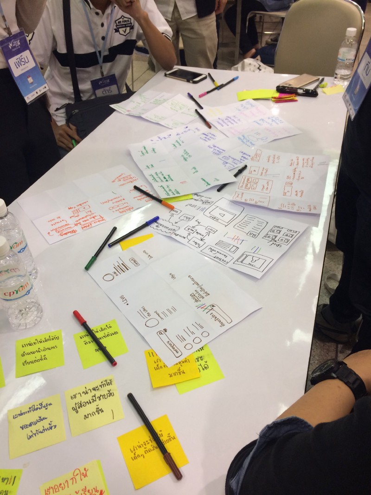

ความเจ๋งของ Thinking Process คือ หากเรารู้สึกว่าอันไหนไม่เวิร์ก เราสามารถย้อนกลับไปได้ เช่น เรานั่ง sketch เสร็จ เจอว่า ทำไมรู้สึกวิธีแก้ไขจาก เราน่าจะ… มันไม่เวิร์กหว่า เราก็ย้อนกลับไปนั่งทำ เราน่าจะ… อีกรอบก็ได้ หรือถ้าธีมมันพังแต่แรก ก็ย้อนกลับไปทำแต่แรกได้ ซึ่งหากเราทำ Brainstorm เรามักจะย้อนกลับไปนั่งโฟกัสอะไรไม่ได้ เพราะเราพูดโถมๆ รัวๆ กันหมด ตั้งแต่ปัญหายัน Solution แต่ใน Thinking Process นี้แต่ละขั้นจะมีการโฟกัสอย่างชัดเจน ว่าเราตั้งเป้าทำอะไร ทำให้การย้อนกลับไปทำนั้นดูมีเป้าหมายเพื่อจะแก้ปัญหานั้นๆ

## เวลานอนคืนที่หนึ่ง: ตี 1 ครึ่ง

คือพอทำ Thinking Process เสร็จในวันแรก ก็ต้องกลับที่พัก ความเงิบหลังทำเสร็จคือ “ยังไม่เป็นรูปเป็นร่าง” คือเราได้ topic ว่าจะทำเกี่ยวกับ “การศึกษา” แต่ไม่รู้ว่าจริงๆ เราอยากจะแก้ปัญหาอะไร (การศึกษาปัญหาย่อยมันเยอะ) เราก็เลยมาคุยกันในที่พัก คุยกันให้เคลียร์ไปเลยว่าจะแก้ปัญหาอะไร เราก็คุยๆ กันก็พบว่า**เราจะแก้ปัญหาเรื่องการลดจำนวนเด็กซิ่วลง ด้วยการให้เขารู้จักตัวเองมากขึ้นว่าจะเรียนอะไร** จริงๆ ในการคุยกันตอนนั้น เราคุยกันว่าแบบอาจจะเอาเรื่อง Health มาทำแทน ซึ่งเป็นอันดับสองที่โหวต theme กัน พบว่าทุกอันดีหมด เว้น content ที่ไม่รู้ว่าจะทำอะไรเลย แต่สุดท้ายเราก็กลับมาที่การศึกษานี่แหละ

วันแรกก็ยังไม่มีอะไรดุดันมาก ก็เลยได้นอนเร็ว (นี่คือเร็วแล้วนะ 55)

## “เป็น Dev มึงต้องพูดให้รู้เรื่อง”

วันที่สองก็มาถึงซัดเลย มีบรรยายแยกสาขา เน้นๆ 3 ชั่วโมง โดยของ Programming นั้นมีคนบรรยายสองคนครับ คือพี่ตั้ง กับพี่ฮั้น โดย session แรกจะเป็นของพี่ตั้ง พี่ตั้งมาพูดถึงเรื่อง Agile กับ Mindset ครับ มาอันแรกคือเรื่องของ Agile ก่อนเลย

พี่เขาก็เปิดภาพนี้ครับ (จริงๆ ไม่ใช่แบบนี้เป๊ะๆ)

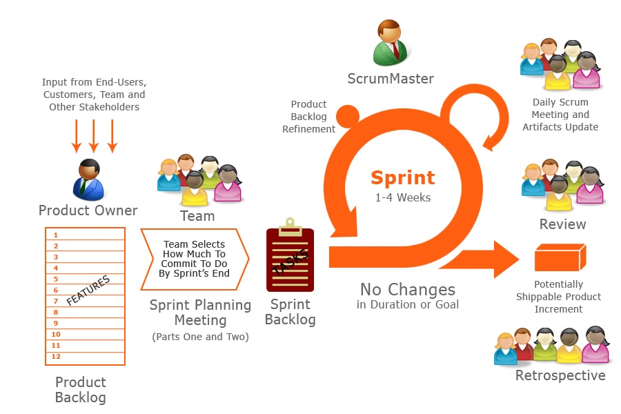

พี่เขาถามว่า ไอ้นี่คือ Agile ปะ? (ซึ่งเรารู้อยู่ละว่าไม่ใช่ เพราะก็ทำมาตั้งแต่ฝึกงานละ) พี่ก็บอกว่าหลายคนเข้าใจผิดมาตลอดว่า ไอ้นี่แม่งคือ Agile เว้ย แต่จริงๆ ไม่ใช่ ไอ้นี่คือ Scrum เป็น 1 ใน Agile

แล้วพี่ก็บอกว่า จริงๆ Agile มันคือไอ้นี่ เราเรียกมันว่า Agile Manifesto

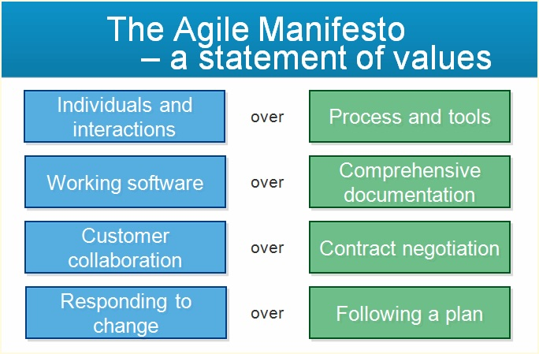

ซึ่งพอหลายคนเห็นอันนี้แล้ว เราแม่งก็ตีความมันผิดอีก เพราะเราดันชอบคิดว่า

- เฮ้ยทำงานกัน ใช้ Slack นะ ใช้ Trello จะได้ track งานได้ ทั้งๆ ที่จริง เราควรสนใจว่าให้ทีมได้คุยกันยังไงมากกว่า แต่เราดันไปโฟกัสว่าจะใช้ tools อะไรในการทำงาน
- อยากได้ Working Software ใช่ไหมละ งั้นกูไม่ทำเอกสาร ช่างแม่ง ทั้งๆ ที่จริงแล้ว เอกสารก็ต้องทำ แต่ควรทำให้พอดีๆ และสำคัญ
- เรามักเข้าใจว่า Customer Collaboration คือการคุยกับลูกค้าบ่อยๆ แต่ไม่จำเป็นต้องทำสัญญา หรือมีการ negotiation ไหม ไม่ใช่ครับ ลูกค้าเป็นพระเจ้าก็จริง แต่เราก็ควรจะต่อรองได้บ้างครับ เช่น เราคิดว่าฟีเจอร์นี้มันไม่น่าจะมีประโยชน์มาก ไร้สาระ เราก็ควรจะคุยกันว่า จะเอาฟีเจอร์นี้จริงๆ เหรอครับ แล้วก็ถกกันว่าจะเอายังไง
- พี่ตั้งถามเราง่ายๆ “มึงชอบแก้งานปะ” ก็ไม่มีใครสักคนเลยที่บอกว่าชอบ แล้วก็ถามต่อว่า “มึงเคยเขียนโค้ดแล้วไม่ต้องแก้งานปะละ” ก็ไม่มีใครตอบสักคน เราควรจะต้องน้อมรับกับ change ทุกๆ อย่างได้ แต่อย่างที่บอกไป บางคนก็อาจจะไม่ยอม change เพราะเราทำตามแผนที่เขาบอกมา แบบสิ้นเดือนนี้อันนี้ต้องเสร็จนะ ซึ่งพี่ก็บอกว่า เราต้องยอมเปลี่ยนแผน ถ้าเปลี่ยนแล้วงานมันจะเลต ก็ต้องบอก จะเอายังงี้จริงๆ ใช่ไหมครับพี่ ถ้างานต้องเลตไปอีกสองวีก

แล้วพี่ก็แนะนำ Kanban เล็กน้อยครับ Kanban เป็นหนึ่งใน Agile Framework ตัวนึงที่มีคนใช้กัน Kanban เป็นอะไรที่ simple ครับ คือเป็นบอร์ดแบบนี้ครับ

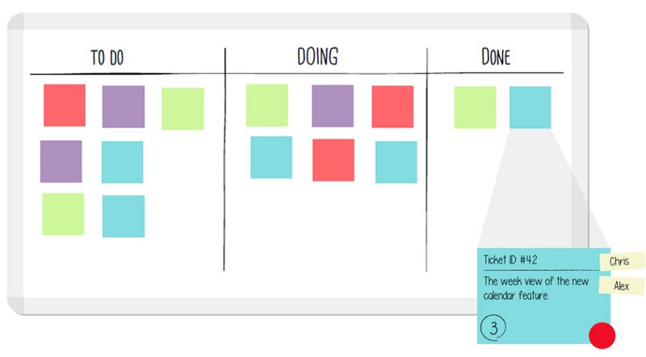

ซึ่งจริงๆ แล้ว บอร์ดไม่จำเป็นต้องมีเฉพาะ To do, Doing, Done อาจจะมี Testing หรือ Reject (เพื่อบอกว่า Test แล้วไม่ผ่าน) ด้วยก็ได้

และก็มีให้เล่นกิจกรรม Kanban แบบง่ายๆ ครับ ซึ่งทำให้เราได้ข้อสรุปว่า Kanban ช่วยให้เราเห็นว่า จุดไหนของ process เกิดคอขวด คืองานไปกองกันเยอะๆ ในจุดไหน ตอนทำเราจะเห็นเลยว่า บางช่วงคนทำ Test แม่งโคตรว่างอะ แต่ Dev แม่งงานเป็นล้านเลย เราก็จะเห็นละ เฮ้ยตอนนี้ Test แม่งว่างหว่ะ เพราะ Dev ยังทำไม่เสร็จ มีแต่งานยากๆ ทั้งนั้นอะไรแบบนี้

และปิดท้ายของพี่ตั้งด้วยการพูดเรื่อง Mindset ของ Dev ว่าควรจะมี Mindset แบบไหน และพี่ตั้งก็ย้ำไปว่า **“เป็น Dev มึงต้องพูดให้รู้เรื่อง”** (พี่โคตรย้ำมากๆ อันนี้)

## โคตร Technical กับพี่ฮั้น

เรื่องที่พี่ตั้งพูดจะไม่ลง technical มาก ต่างกับพี่ฮั้นอย่างสิ้นเชิง ที่ลง technical มากกว่า (จริงๆ ก็ไม่มากหรอก) ดังนั้นจะขอไม่เล่าละเอียดมากละกัน

แต่จุดนึงที่เราจับได้จากพี่ฮั้นคือ พี่เป็นคนที่โคตรเก่งมากๆ จนถึงตอนนี้ ก็เพราะส่วนนึงคือ หาเจอเร็วว่าชอบโค้ด พี่เขาเขียนเว็บตั้งแต่อายุ 15 จนตอนนี้จะ 30 เห็นจะได้ รวมถึงพี่เขาโค้ดโหดมาก คือโค้ดต่อวันนึงแบบ 7–8 ชั่วโมงอะ ทำยังงั้นทุกวัน ไม่เซียนก็แย่แล้ว (สุดท้ายคนเราก็เก่งได้ จากความขยันนี่แหละครับ)

ปิดท้ายของพี่ฮั้นด้วย tools และของต่างๆ ในสายงาน Web Development ครับ ใครสนใจเข้าไปดูได้ บางอันจะมี link สอนของอันนั้นๆ อยู่ครับ

หลังจากจบบรรยายแยกสาขาแล้ว ก็กลับมารวมกันแล้วเล่นกิจกรรมครับ เป็นเกมฐาน ก็ผ่อนคลายกันไป (แต่โคตรร้อนเลยเฟ้ย)

## คุยงานกัน(อีกแล้ว)

หลังจากทำกิจกรรมเสร็จ ก็กลับมาคุยงานกันต่อเลย (ปรับโทนไม่ทัน สมองไม่แล่นอีก) ก็ต่อจากเมื่อคืนคือ เรามีเป้าที่จะแก้ปัญหาลดจำนวนเด็กซิ่วลง โดยการให้เขาเข้าใจตัวเองมากขึ้น มาตอนนี้ปุ๊ป พี่ตั้งก็ลีดให้เราทำ Draw It! ที่เป็นขั้นสุดท้ายของ Thinking Process ครับ ซึ่งความพิเศษรอบนี้คือ จะเปิดให้กรรมการได้รับฟังไอเดียของเราก่อน หากมีข้อติงก็จะได้ปรับแก้

ซึ่งสิ่งที่เกิดขึ้นตอนแรกคือ ทุกคนยังไม่เห็นภาพปัญหาชัดเจนนัก ยังสับสนงงๆ รวมถึงตัว solution ที่จะแก้ก็ดูงงๆ ตาม ทุกคนเลยย้อนกลับไปทำ “เราน่าจะ…” อีกครั้งนึง โดยครั้งนี้ทุกคนเข้าใจ topic ใหญ่แล้วว่าอยากให้เด็กเข้าใจตัวเองมากขึ้น

พอเราทำใหม่อีกรอบ จนสุดท้ายคิดว่าลงตัวละ เราจะทำยังไงก็ได้ให้เด็กเข้าใจตนเองมากขึ้น ความยากแม่มอยู่ตรงนี้แหละ **“ทำยังไงล่ะ?”** อย่างที่เคยบอกว่า “เราน่าจะ…” เนี่ยมัน abstract มากพอตัว ก็เลยลองวนถามเพื่อนๆ ในทีมว่า เอ้ยตอนอยู่ม.ปลายเนี่ยรู้ได้ไงว่าอยากเรียนคณะนี้ ก็เล่าร่ายๆ ไป ก็พบว่าส่วนมากเกิดจากการลองลงมือทำจริงๆ มีคนนึงก็อยากเข้าวิศวะคอมเหมือนเราเลย แต่ว่าได้ลองไปฝึกงานเขียนโค้ด ผลคือ บายขรั่บ ลาก่อน และก็มีน้องคนนึงเหมือนกันที่แบบตอนนี้เรียนไปรู้สึกไม่โอเคเลย ไรเงี้ย แต่พอคุยๆ แล้วก็ดันเคว้งกว่าเดิมอีกว่าจะทำยังไงดีหว่า

จนสุดท้ายได้ solution คร่าวๆ ว่า เข้ามาให้ทำแบบสอบถามที่จะระบุเอาคร่าวๆ ว่าน่าจะเรียนคณะนี้ๆ นะ เสร็จแล้วก็มีแบบรวม event หรือ camp ที่จะให้เด็กได้ไปทดลองทำงานจริงๆ ลงมือทำจริง และปิดด้วยอาจจะมีคอร์สให้เรียน เสียตังกับฟรี อะไรก็ว่าไป

โอเค พอได้มาแล้วคร่าวๆ ว่าเว็บเราจะเป็นยังไง ก็เข้าไปหากรรมการขอคำแนะนำเลย กรรมการก็เห็นว่า เอ้อไอเดียดีนะ ปัญหามันชัดโคตรๆ และถ้าแก้ได้มันจะโคตรปัง แต่พี่ไม่เห็นด้วยเรื่อง solution ว่ามันจะเวิร์ก เพราะพี่เขาบอกว่า มาถึงจะให้ทำแบบสอบถามพี่ก็ไม่ทำอะ (เราก็เลยรู้สึก อืมมมมมม ก็ใช่ แต่ลึกๆ รู้สึกว่าเราสามารถ design แบบสอบถามให้มันน่าทำก็ได้นะเออ ไรงี้)

เราก็เลยกลับออกมากัน ทีนี้แม่งเครียดกว่าเดิมอีก คือ solution แม่งหายากมากๆ เราก็ลองคิดหลายท่าแล้ว และตอนนั้นเวลาก็เหลือน้อยแล้ว เพราะจะหมดเวลาให้ปรึกษากรรมการแล้ว ก็เลยลองไปพรีเซนต์กับกรรมการอีกโต๊ะแทน พี่ก็มาบอกทำนองเดียวกันเลย คือปัญหาแม่งโคตรชัด แต่พี่ไม่เชื่อว่า solution เราจะนำพาไปสู่ทางออกได้จริงๆ

## เวลานอนคืนที่สอง: ตี 3 ครึ่ง

ก็คิดกันยาวๆ จนกระทั่งกลับมาที่พัก ตอนนั้นทุกทีมดูเดือดมาก เพราะว่ามีหลายทีมเลยที่ solution ก็ยังนึกไม่ออก ไอเดียยังไม่เวิร์ก กลับมาก็จะเหลือเหรอ คุยกันต่อสิ กลุ่มเราก็เช่นกัน ก็ยาวๆ ไป ซึ่งก็ต้องมานั่งคิดหา solution จริงจังละ เพราะวันต่อมาก็ต้องทำ Workshop แล้ว ซึ่งจะเป็นโคตรอภิมหาความมันส์ที่แท้จริงของค่ายนี้

เราก็นั่งสุมหัวคิดกัน แต่ความที่เราอึ้งคือ (เพื่อน)(พี่)คิน ที่เป็นแชมป์ปีที่แล้ว ก็ไปลากเพื่อนๆ มาด้วย มาช่วยน้องๆ คิด ความรู้สึกคือแบบ เฮ้ย คือขอบคุณพี่มากๆ เราสัมผัสได้เลยว่าแบบค่ายนี้มันคือครอบครัวก็ตรงจุดนี้แหละ คือพี่ๆ กลับมา แล้วก็มาช่วยเหลือกัน เสมือนเป็นครอบครัว (แต่ก็ไม่ได้คิดแทนนะ)

แล้วคืนนั้นก็พิเศษอีกอย่าง คือมีพี่ senior มาช่วยคิดด้วย พี่ก็ประมาณว่าจิ้มคำถามว่าแบบ คิดว่าเด็กอยากรู้อะไรหล่ะถ้ายังไม่รู้จักตัวเอง เด็กจะลองลงมือทำดู หรือเด็กจะลองหาข้อมูลดู ซึ่งคุยๆ กันไปๆ มาๆ ก็มีไอเดียว่า เฮ้ยถ้าเราทำเว็บที่เด็กมหาลัยเข้ามาเขียนประสบการณ์ หรือ lifestyle การใช้ชีวิตในคณะหรือสถาบันต่างๆ ให้กับเด็กม.ปลายได้เข้ามาอ่านดูอะ มันน่าจะเวิร์กนะ ซึ่งมันจะเวิร์กได้ content ต้องปังๆ เช่น “F 5 W 2 ก็จบ 4 ปีได้” “เห็นแดกเหล้ายังงี้ ก็ได้เกียรตินิยมนะจ๊ะ” เราเลยปักหลักว่า **เราจะใช้ content บทความในการให้ inspiration น้อง หรือให้น้องรู้จักตนเองมากขึ้น**

ซึ่งเห็นกว่าจะได้อันนี้มานี่ มาอีกที ชิท ตี 3 ครึ่งแล้ว ก็เห็นว่าสมควรแก่การนอนละ ก็ไปนอน (ผ่านไปสองชั่วโมง ก็ตื่น สรุปวันนั้นได้นอน 2 ชั่วโมง น้อยสุดในปีนี้ไปละ)

## Workshop 8 ชั่วโมง: โคตรมันส์ที่สุดของค่าย

ก็เคยได้ยินแล้วแหละ ว่ามีต้องทำเว็บในเวลาจำกัด แต่ไม่คิดว่าแม่งจะจำกัดขนาดนี้ 5555 ตอนแรกเราก็คิดว่า ไปถึงก็ต้องซัดเลย แต่จริงๆ มันไม่ได้เป็นยังงั้นซะทีเดียว เพราะค้นพบว่า แม้เราจะมี solution ได้สักพักนึง แต่เราก็พบว่ายังไม่มี flow จริงๆ ซะทีเดียว ก็เลยนั่งคิด flow กัน แต่พอได้ flow ระดับนึงแล้ว design ก็เริ่มทำงานได้ (เพราะจะได้ลง landing page คร่าวๆ ได้) dev ก็จะทำต่อจาก design ซึ่งเรากับกร ที่เป็น programmer ก็ช่วยกันเซ็ตอัพ Laravel ก่อนให้มันติด แล้วลองเข้า server ที่ต้องใช้ส่งงาน ดูว่ามัน deploy ได้ไหม ก็ deploy ได้ ตอนนั้นรู้สึก pain อย่างนึง เพราะ composer create-project แม่มทำบน folder เปล่าๆ ไม่ได้ กว่าจะเอามันมารวมกับ Git ได้นี่ก็ปวดหัวดี (เห็นยังงี้ก็ยังใช้ git นะ 55)

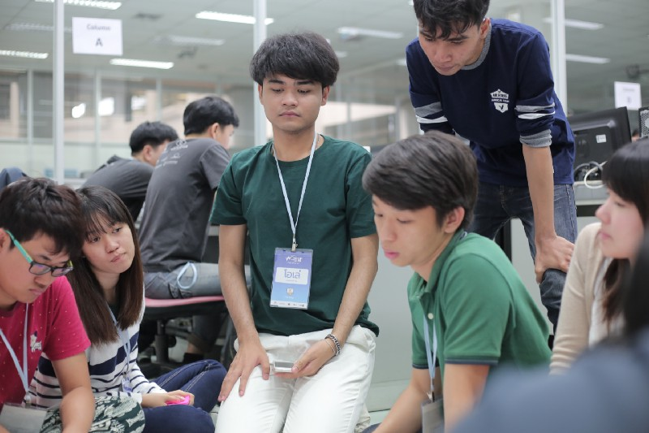

โอเค พอ setup ได้ละ ใช้ dev ได้ทั้งสองคน กรก็ไปช่วยเพื่อนๆ คิด flow งานให้ เราก็นั่งซัดโค้ดตาม design ไป ก็พบ pain point บางอย่าง เช่น เพื่อนดีไซน์ใช้ฟอนต์อื่น ก็ต้องมานั่งทำ web font ให้ ตอนแรกก็จะเพิ่ง Google Fonts ละเพราะมีใช้ฟอนต์ในนั้น แต่เราก็คิดว่า ถ้าตอนพรีเซนต์คอมไม่ออกเน็ตอะ เท่านั้นแหละ ผมใช้ web font ก็ได้ -\_- นั่งเซ็ตกันไป

หลังจากผ่านไปได้ชั่วโมงนึง เพื่อนๆ ก็สรุป flow กันเสร็จละ คิดว่าแนวทางนี้คงเวิร์กแล้ว Content ก็นั่งปั้น content ไป Marketing ก็เริ่มทำสไลด์ขายของ ส่วน design กับ dev ก็นั่งปวดกบาลกับการดีไซน์และโค้ดไป เราก็นั่งตัด CSS จาก Design มา

ตอนนั้นขอบอกเลยว่า คำว่า **MVP   — Minimal Valuable Product** แม่งเป็นเรื่องจริง คือเราต้องทำของน้อยๆ แต่ effort สูง เอาไปโชว์ได้ และก็ดูไม่ชุ่ย บวกกับเราทำ Front-End เป็นหลักไง ไอ้คำพูดที่บอกว่า “เนี่ย 3 pixel ก็ไม่ได้นะ” แม่งก็เป็นเรื่องจริงอีกละ (แต่ก็ยอมถัวๆ ยอมๆ ไปในตอนท้าย)

ตอนเวลาผ่านไป ก็ยังไม่ซีเรียสมาก เราก็ทำๆ ไป จนกระทั่ง เวลาแม่งเหลือ 2 ชั่วโมงสุดท้าย นี่แหละความชิบหายมาแล้ว เราพบว่า flow ยังไม่ครบ บางอันถ้า present ไปน่าจะเละเป็นขี้แน่ server ก็ยังไม่ได้เซ็ต แถมมีพี่ๆ เดินเข้ามาแล้วแบบ เปิดลิ้งเว็บดูเลยว่าแบบ ใครทำถึงไหนแล้ว ก็พบว่าบางคนหน้าเว็บแม่งมาละวะ ชิบหายกูนี่หน้าขาวจั๋วเชียว ก็เลยให้กรไปช่วย set up server หน่อย ก็เจอปัญหาเยอะโคตร เพราะบางอันเราแก้เองไม่ได้ (ต้องเซ็ต nginx) ก็ไปถามพี่เขาต่ออีก ปรากฎว่าพี่เขาก็กำลังบู๊กับ server เหมือนกัน เราก็นั่งปั่นๆ ไป จนพบว่า เวลาแม่งไม่ทันละ แถมประเด็นคือหน้าที่สำคัญยังไม่ออกมาด้วย เราก็เลยใช้แผนสำรองครับ เพื่อที่จะให้มัน Demo ได้เราก็เลยทำการ

> ใช้ JPG ไงครับ จะอะไรละ

เราก็ซัดเลยครับ crop รูป design ไปปะในเว็บ ใส่ navigation ให้พร้อม เทสลิ้งว่ากดไปๆ มาๆ ได้จริง คิดว่าไม่เจอบั๊คละ (ถ้ากดถูกที่นะ 555555555) ที่ทำแบบนั้น เพราะเราก็คิดว่า ถ้า dev โดนด่าแค่คนเดียวเรื่องมึงใช้รูปแทนโค้ด HTML/CSS เนี่ย ก็ดีกว่าทีมจะโดนด่าว่าเว็บแม่งใช้ไม่ได้อ่อวะ ไม่มีอะไรเลย ก็เลยซัดๆๆๆ ไป แต่เวลาแม่งแคบลงเรื่อยๆ ตอนนั้นเหลืออีกแบบ 20 นาทีได้มั้ง เว็บก็เสร็จละ หันไปอีกทีกรกับ(เพื่อน)(พี่)คินก็ช่วยดู server ให้ เจอความเทพของ FileZilla อีก (แม่ง skip ไฟล์กูหมดเลย สาดดดดดดดด อัพไปเป็นอันเก่าเฉย) จนสุดท้าย เวลาก็หมดลง

สิ้นสุดการโค้ด 8 ชั่วโมง (ทำจริงๆ น่าจะ 7 ชั่วโมงนะ)

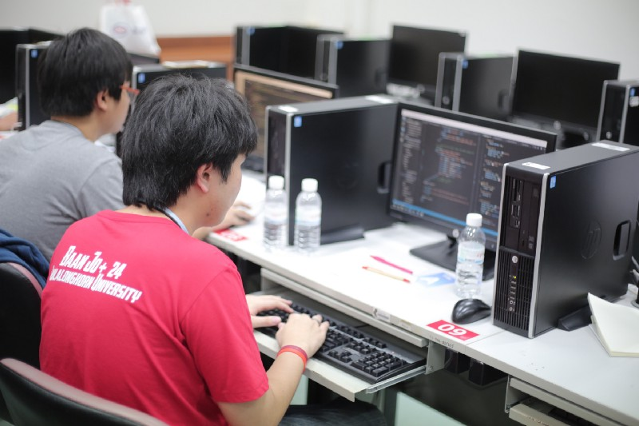

ถามว่าตอนนั้นได้รู้อะไรบ้าง จริงๆ ได้รู้เยอะเลยนะ

- รู้ว่า Laravel ที่เห็นเซ็ตง่าย แม่งก็ยากได้ (โดนเรื่อง ModRewrite, Permission)
- ที่เลือก Laravel เพราะคุยกับ dev อีกคนแล้ว บอกว่าเคยใช้ เราก็เคยใช้ด้วย ก็เลยเลือกใช้อันนั้นไป แม้หลังๆ จะถนัด JS Stack แต่ก็ต้องเล็งการทำงานร่วมกับเพื่อนเป็นหลัก
- แต่ช้อยส์ดีสุด เราว่า Pure PHP นี่แหละ แม่งโคตร easy
- ตอนก่อนค่าย ไม่คิดจะไปใช้ JS Framework ใดๆ อยู่แล้ว เพราะแม่งเซ็ตยากเป็นห่า
- MOCK MOCK MOCK รัวๆ เวลา 7 ชั่วโมงทำอะไรมากไม่ได้ MOCK เอา DB ไม่ต้องใช้ก็ได้ พี่ตั้งบอกถ้าจำเป็นต้องเก็บข้อมูล ใช้ local storage แทน ไอ้เรานี่ความฮาอันนึงคือเขาบอกไปเซ็ต DB Password ด้วย เรานี่ไม่ได้เซ็ตเลย โถ่ก็ไม่ได้จะต่อ database จะไปเซ็ตทำห่าอะไร
- คำนึงการใช้ Offline First เป็นหลัก เพราะเราคิดว่าคงไม่ออกเน็ตได้ง่ายๆ รวมถึงด้วยเวลาจำกัด ทุกอย่างเลยต้องอยู่ใน local, เราควรทำ main feature ให้ออกมาก่อน ถ้าเวลาไม่ทัน แล้วต้องเสร็จ ก็ต้องยอมทำเลวๆ เช่น ใช้ JPG 5555555
- แม้เวลาจะจำกัด แต่ส่วนตัวจะไม่ยอมให้เรื่องอ่านโค้ดไม่รู้เรื่องมาเป็นข้ออ้างอยู่ดี เราก็ตั้งชื่อให้สื่อความเหมือนเดิม
- ได้เห็นว่า Design บางทีก็ทำ dev ปวดหัวได้ (เช้ดเข้ สวยสัส แต่ทำไงวะ 55555)
- และแน่นอน ได้โค้ด 7 ชั่วโมงแต่เว็บต้องออกมา (ไปลองทำกันดูได้ 555 โคตรระทึก)

หลังจากโค้ดเสร็จ ก็เป็นโหมดผ่อนคลายรัวๆ ครับ จนกระทั่งกลับที่พักนี่แหละ…

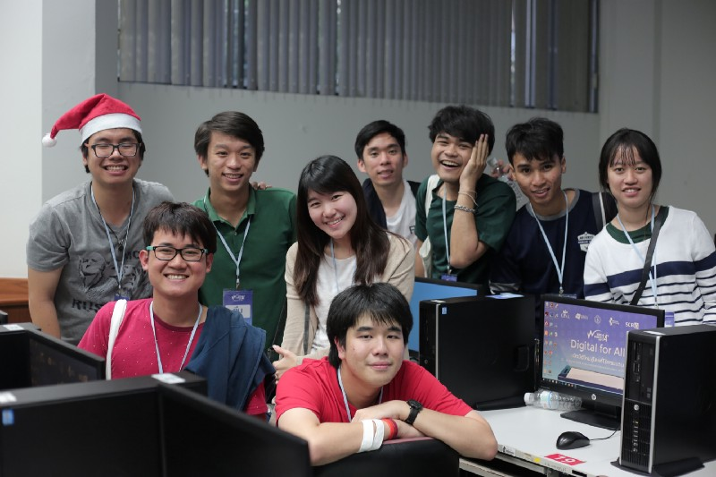

## เวลานอนคืนที่สาม: ตี 3 ครึ่ง — ตี 4 (อเกน????????????)

ตอนแรกเราเล็งว่า คืนนี้แม่งไม่น่าจะนอนดึกหรอก ทุกอย่างก็ขึ้นไปแล้ว นอนเร็วๆ ละกัน

ปรากฎว่า ไม่ได้เป็นงั้น

เพราะตอนลองพรีเซนต์ พบว่า Business Model กับแผนหาเงินจากเว็บมันยังไม่ดีพอ คือปัญหานี้เนี่ยนอกจากแม่งจะหา solution แล้ว หาตังก็ยากอีก เพราะจะไปเก็บตังคนอ่านที่เป็นน้องม.ปลาย ก็ไม่น่าใช่ละ content เราอาจจะไม่ได้ทรงคุณค่าขนาดนั้น พอบอกว่าใช้ Ads ก็ยากอีก ต้องหา traffic เยอะๆ (Ads นี่ได้ตังโคตรน้อย) คือหายากจริงๆ

แล้วตอนนั้นคือเราโคตรง่วง แบบไร้ประโยชน์กับทีมมาก ณ จุดนั้น ง่วงแบบ พูดอะไรมา นั่งคิดๆ ในหัว แล้วแบบ แม่งหายจากหัวไปเลยอะ 55555 ถามอะไรมานี่ก็แบบ ต้อง ฮื้อ ทีนึง ถึงจะรู้ว่าถามอะไร 55 เพื่อนมาเก็ตกับคอนเท้นก็คุยๆ กันไป เราก็นั่งพยายามช่วยเท่าที่ช่วยได้ ก็มีซ้อมพรีเซนต์ด้วย ให้พี่รุ่น 13 ช่วยดูให้ พร้อมลองยิงคำถามดู (ใครเห็นจาก Live หรือดูเราพรีเซนต์ ที่เห็นตอนนั้นคือผ่านการยิงจนพรุนมาระดับนึงละนะ 55) ซึ่งก็โดนยิงพรุนระดับนึง

จนสุดท้าย เวลาประมาณตี 3 ครึ่งละ ทุกคนเริ่มแบบ ไม่ไหวแล้วโว้ย กูจะนอน ก็แยกย้ายกันไปนอน

(ความช็อคต่อมาคือ กลับถึงห้อง เชี่ย ทีมของรูมเมทเราแม่งยังคุยกันอยู่เลย เหยดเข้)

## วันสุดท้าย

พอถึงวันสุดท้าย ตื่นมาก็อารมณ์เดียวๆ กับวันก่อนหน้า คือกูง่วงมาก ตอนนั้นลงจากที่พักมา ทุกคนนี่คือซอมบี้อะ 55 ขึ้นรถมาก็นอนคร่อกกันทุกคนเลย

พอถึงห้องประชุม กรรมการพรีเซนต์ก็เริ่มมากันครบละ ก็เริ่ม present กัน ซึ่งก็มีระบบ random อันเป็นเอกลักษณ์ของค่าย มีใช้กันทุกปี ปีนี้มาในธีมเรียบๆ ง่ายๆ เป็น spinner ธรรมดา (ลืมถ่ายรูปมา 55) แต่เห็นง่ายๆ ยังงี้ก็ลุ้นนะ

เราก็ลุ้นไปทั้งครึ่งเช้า พบว่ามีหลายครั้งที่แบบ ใกล้จะถึงเราละอะ (ไอ้เข็มตัวเลื่อนแบบ ถ้ามึงหมุนแรงอีกนิดนึงกูก็โดนแน่ๆ) จนพ้นครึ่งเช้า ปล่อยไปกินข้าว ก็ยังไม่ได้จ้า พอกลับมาครึ่งหลัง อารมณ์ก็เป็นอีกอย่าง คือให้กูออกไปเถอะ กูเครียดดดดด

## สุดท้ายได้อยู่กลุ่มสุดท้ายค่าาาาาาาาาาาาาาาาาาา

ทีนี้ต้องเล่าระหว่างทางก่อน คือเราก็นั่งดูพรีเซนต์ไง กรรมการก็จัดเต็มจัดหนักแต่ละคนมาก แต่ที่เด็ดสุดก็คงไม่แพ้พี่ปอนด์เลย คือเคยได้ยินชื่อเสียงมาเหมือนกัน แต่ไม่เคยได้ยินไง พอได้ยินเท่านั้นแหละ โอ้ยเป็นกูโดนนี่ลงไปนอนกองกับพื้นละจริงๆ ตอนนั้นเรากังวลมากว่าพี่ตั้งจะด่ากูไหมวะ คือแบบบางคนโดนเละด้วยคำง่ายๆ เช่น “ถ้าเป็นยังงี้ไม่ต้องมี Programmer ก็ได้ครับ” (กูก็แบบ เชี่ย โดนจริงนี่กูลงไปนอนพื้นแล้ว T-T)

พอถึงเวลาพรีเซนต์ เพื่อนก็พรีเซนต์ไป (ยกงานพรีเซนต์ให้คอนเท้น กับมาร์เก็ตติ่งเลยครับงานนี้ ยอม) เราก็ไปยืนกดคอมกดสไลด์ให้ ตอนแรกก็คิดว่าเวลาอาจจะไม่ทัน แต่สุดท้ายก็ทัน รอดไป

แต่ความอัดอั้นตันใจมันยังไม่จบแค่นั้นครับ…เพราะก็มีรอคอมเม้น

คนแรก พี่ตั้งก็จับไมค์มาละ เรานี่ก็ สูดลมหายใจเขาแรงๆ พร้อมละ กูพร้อมโดนด่าละ

ปรากฎพี่ตั้งบอกว่า **“พี่ว่ากลุ่มนี้ Programming สมบูรณ์ที่สุดแล้ว”**

ผมนี่แบบ แม่งโคตร unexpected จริงๆ ไม่โดนด่า ยังโดนชมเฉย

ต่อมาพี่เอ็ม ก็มาคอมเม้น content ครับ พี่เขาก็บอกว่าให้เลื่อนดูเว็บอีกทีนึง ผมก็ไถๆ ไป ตามพี่เขา (ในใจ พี่จะหาบั๊คปะวะชิบหาย 55) ปรากฎว่า พี่บอกว่า **“content ครบดีครับ มี content ทุกหน้า แม้บางอันจะมีคำผิดนิดหน่อย แต่โอเคครับ เพียงพอต่อการ present”** content ก็ตัวลอยกันไปอีก

ถัดมาพี่เจ สาขา Marketing ก็คอมเม้นต่อ คอมเม้นว่า **“เป็นตัวอย่างที่ดีในการ mock up คือเวลาเรามีจำกัด แต่เรา mock มาได้ดี เวลาเทสกดๆ ดูก็เห็นภาพว่าเขาจะใช้เว็บเรายังไง”** และมีตินิดหน่อยเรื่อง Marketing ว่า “แผน Marketing ยังเจาะกลุ่มไม่ค่อยดีมาก” แต่รวมๆ พี่ก็ชมว่าโอเค เมื่อเทียบกับเรื่องอื่นๆ (ก็ลอยไปอีกนิด)

ต่อมาพี่บอย เจ้าของ Pantip ก็คอมเม้นว่า **“Pain point มีอยู่จริง แต่ solution ยังไม่แน่ใจว่าจะตอบโจทย์ได้จริงๆ หรือเปล่า”** พี่ก็ยกมาว่าตอนนั้นพี่อยากโค้ด เพราะพี่เคยทำแบบนั้นไง ก็เลยรู้สึกว่าชอบ ซึ่งก็เป็น 1 ใน solution ที่ก็เป็นไปได้เหมือนกัน

ถัดมา พี่ว่าน ผู้จัดการค่าย ก็มาคอมเม้นว่า **“ชอบที่มีการใช้รูปแทนที่เป็นตัวหนังสือยาวๆ แต่ก็ยังรู้สึกว่าไปกันคนละทาง”**

ถัดมา พี่จิ๊บ ก็คอมเม้นเรื่อง Marketing ว่า **“พี่ยังงงๆ ว่าการตลาดเราทำยังไง”** ก็ตอบไปตามที่พรีเซนต์อีกทีนึง พอพี่เคลียร์แล้ว พี่ก็บอกว่า **“Pain point มันมีจริง แต่แบบ ถ้าทำต่อ ต้องคิดเรื่องการตลาดนิดนึง”**

ต่อมาเลย ก็เจอตัวจริงในวงการเลยครับ พี่ปอนด์ Dek-D มาพร้อมกับคู่หู พี่หนึ่ง บอกว่า **“ก็อย่าหาว่าพูดเยอะเลยนะครับ เดี๋ยวคิดว่าโม้ แต่เด็กดีมีหมดแล้วเนี่ย”** เป็นไปตามคาดเดะ 555555 **“แต่เขาเอามาเรียบเรียงใหม่ให้เรียบร้อยขึ้น อันนี้มัน compact ไง”** **“อยากทำก็ทำ ไม่ได้ว่าอะไรนะครับ”** ก็บนความเงิบก็มีความฮากันไป แล้วก็ดูโลโก้ครับ **“ภูมิใจเสนอนะ ดูเป็นแว่นขยาย จะได้มองเห็น แต่พี่ว่าเหมือนไม้ตักไอติม”** (ช็อคไปสิกู)

แล้วก็ยังไม่หมดอีก **“รู้สึกจะใช้โทนสีฟ้าอ่อน เหลืองอ่อน กับสีขาวเนอะ มันเป็นเทรนด์หรืออะไรเนี่ย”** (โดนไปอีก)

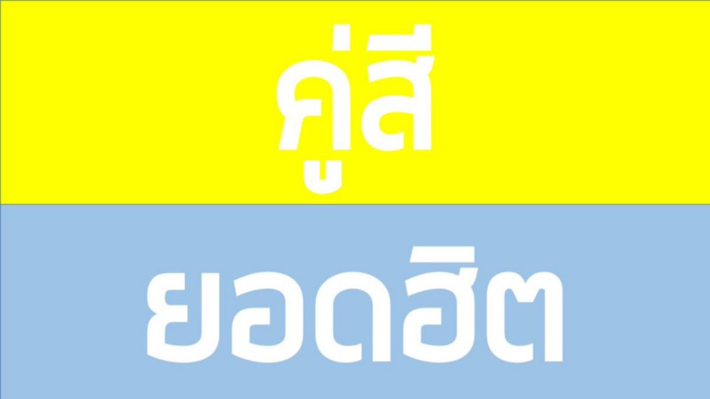

แล้วก็มาอีก “ไอค่อนไม่เข้ากับโลโก้เลย” “Infographic ที่ใช้นี่มันไม่เข้ากันเลย คนละ style เลย”

ตบท้ายด้วยพี่หนึ่งบอกว่า “น้องอาจตบตาคนอื่นได้ แต่ตบตาพี่ไม่ได้หรอก” (ครับพี่)

จบด้วยพี่ป้อม สาขา Marketing ก็บอกว่า “การตลาด Business Model ยังไม่เวิร์กเลย เอาเงินไปไม่รู้ว่าจะได้เงินคืนตอนไหน”

และก็จบการคอมเม้นกันไป แล้วก็รอประกาศผล

## ก็จบลงด้วย กวาดมา 3 รางวัลจาก 5 ซึ่งเยอะที่สุดตั้งแต่เรามาประกวดอะไรต่อมิอะไรละ (รู้สึกเป็นปลื้ม)

## สุดท้ายนี้

ตอนเข้าค่าย เราก็ expect มาระดับนึงละอะ ว่าแบบมาเจอตัวเทพของวงการ มารู้จักกับเพื่อนๆ วงการเดียวกัน และวงการอื่นๆ แต่ก็แบบ สิ่งที่เจอมันเกิดคาดไปมาก

- เราได้ประสบการณ์อดนอนสามวันสามคืนเต็มๆ (ตอนแรกก็รู้ว่าน่าจะอดนอน แต่ไม่คิดว่าจะฮาร์ดขนาดนี้)
- ได้ทำงานเป็นทีมกันกับเพื่อนที่แบบมาจากต่างคณะ ต่างมหาลัย ต่างชั้นปีไปเลย มันดูท้าทายนะ เพราะเราต้องปรับตัวให้ทัน งานก็ต้องเสร็จใช่ไหมละ
- ได้เจอเพื่อนเทพๆ นี่แหละ ทุกคนคือเก่งจริงๆ ไม่มีใครน้อยหน้าใครเลย
- ได้มารู้จักพี่ๆ เด็กค่ายเก่า และพี่ๆ ที่อยู่ในวงการทำเว็บ
- ได้สัมผัสว่าส่วนนึงที่ YWC ยิ่งใหญ่ได้จนถึงตอนนี้ ก็เพราะความเป็นครอบครัว YWC ที่เราก็สัมผัสได้ (อารมณ์ตอนทำ FE Camp เลย พี่เก่าก็กลับมาหาน้องๆ มาพูดคุยกับน้องๆ)

สุดท้ายก็ต้องขอบคุณวิทยากรทุกคนที่ได้มอบความรู้ในเรื่องต่างๆ ให้ (ชอบส่วนนึงที่ในนี้ไม่พูดถึงมุม coding เยอะ เอามุมอื่นมานำเสนอแทน)

ขอบคุณคณะกรรมการที่คอมเม้นตอนนำเสนอให้ครับ ได้เห็นอะไรกว้างขึ้นเยอะ

ขอบคุณพี่ๆ YWC#13 ทุกคน ทั้งหน้าฉากและหลังฉากที่จัดค่ายขึ้นมาครับ เรารู้ว่าทุกคนอดหลับอดนอนไม่แพ้กับน้องๆ เลย ขอบคุณมากครับ

ขอบคุณ(เพื่อน)(พี่)คิน ในค่ายเป็นพี่ จบค่ายเป็นเพื่อน เก่งโคตรๆ เป็นปูชนียบุคคลของกลุ่มได้เลย กราบงามๆ

ขอบคุณพี่ๆ YWC#13 กลุ่ม J ของ(เพื่อน)(พี่)คิน ที่กลับมาช่วยน้องคิดงานบางส่วนด้วย ขอบคุณพี่มากๆ จริงๆ

และท้ายสุดเลย ขอบคุณเพื่อนๆ ทีมงานคุณภาพ กลุ่ม A “เรียนไรดอทคอม” ที่นำพาทีมมาสู่จุดที่ไม่คิดว่าจะมาถึงได้ขนาดนี้

ขอบคุณค่าย YWC#14 ที่จะเป็นหนึ่งในประสบการณ์ที่ดีที่สุดตลอดไป

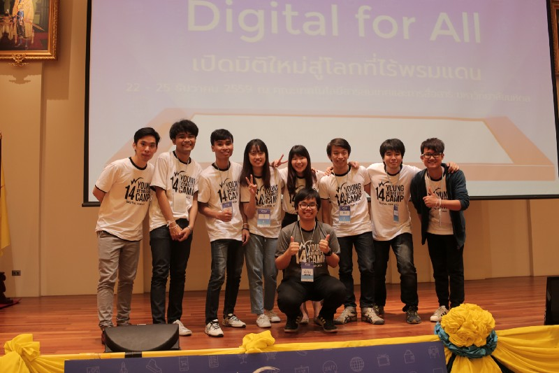

เบนซ์ YWC#14 สาขา Web Programming

ปล.โคตรยาว เขียนไปได้ไงวะเนี่ย 55555
