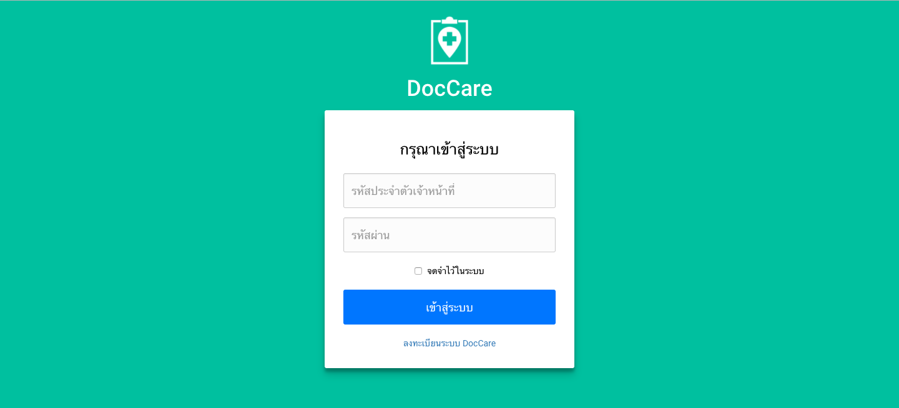
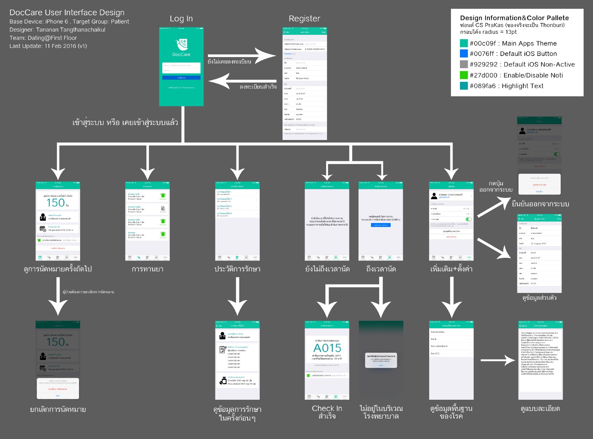
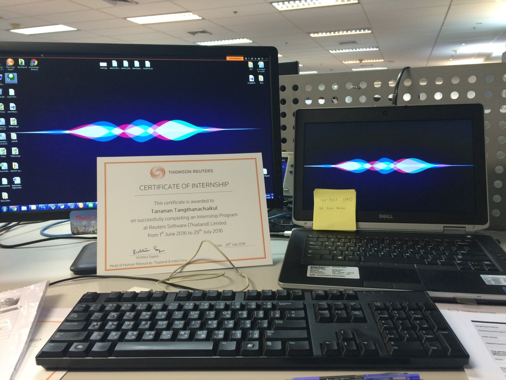
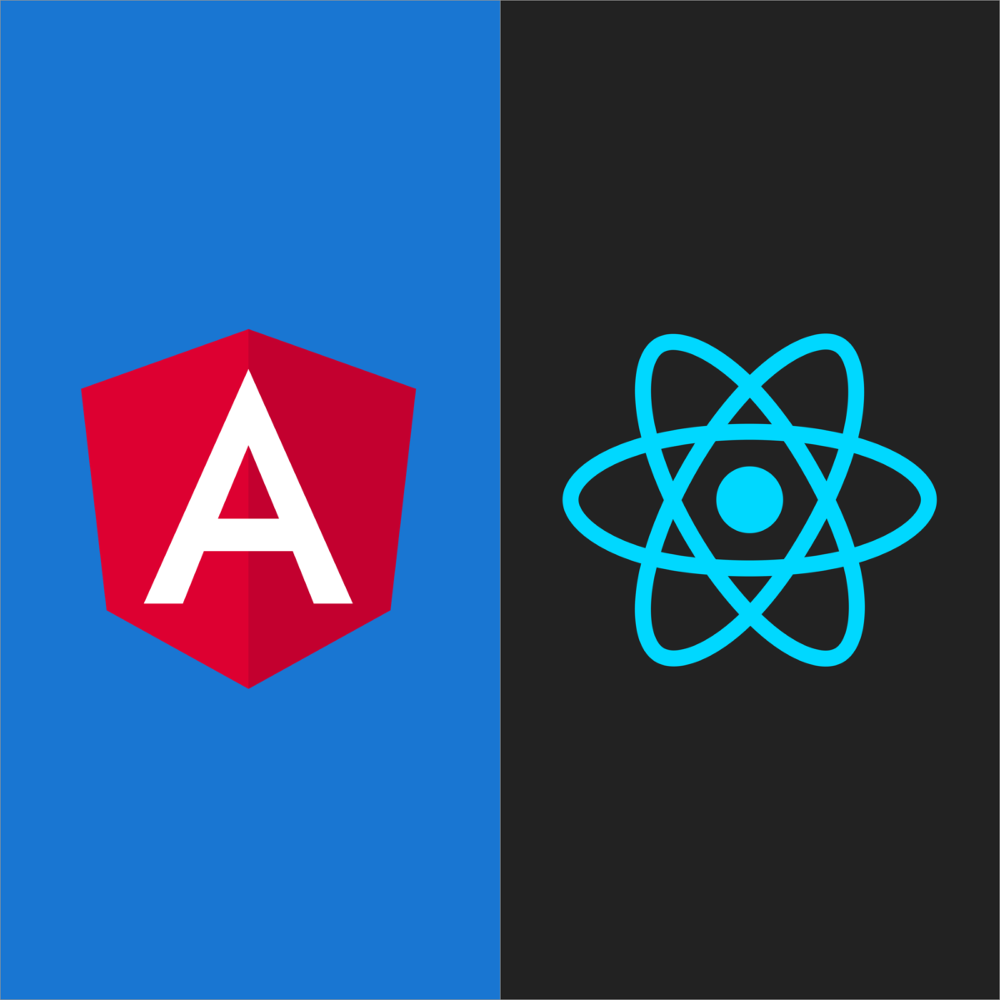
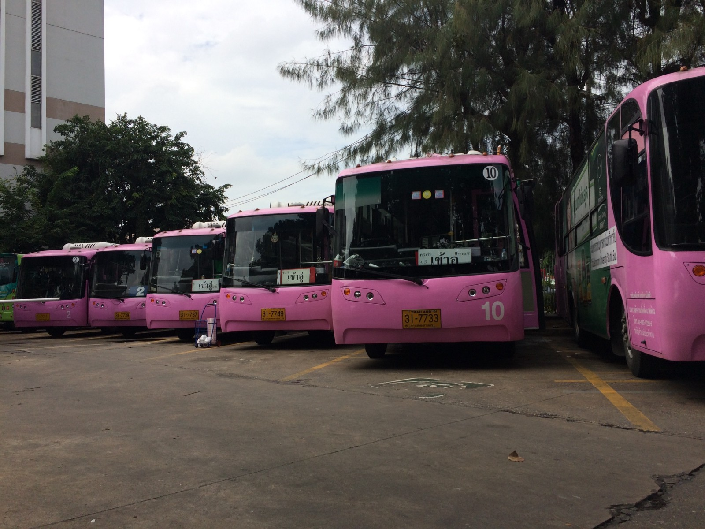
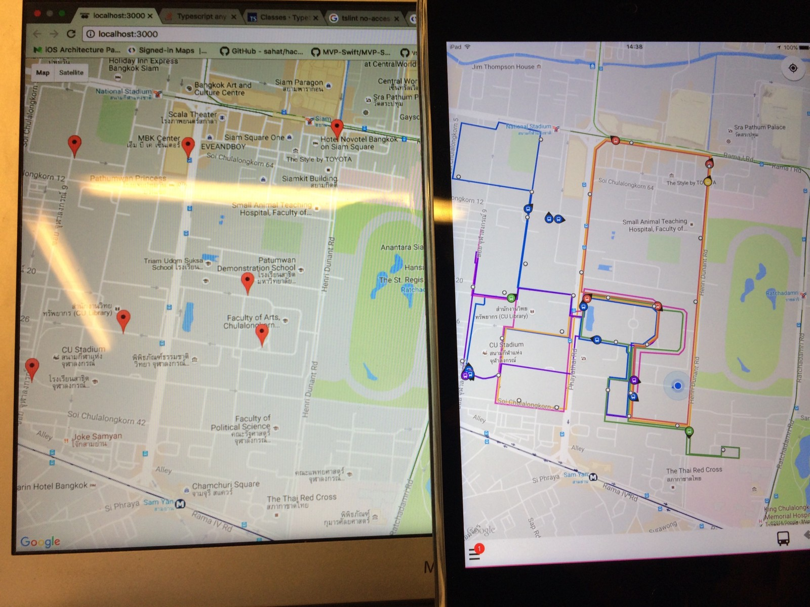

เป็นธรรมเนียมทุกปี ที่สิ้นปีเราจะมา recap ย้อนกันว่าปีนี้ได้ทำอะไรไปบ้าง ได้เจอะเจออะไรบ้าง

ซึ่งปีนี้สำหรับผมเอง ขอนิยามสั้นๆ ว่า

> **“เป็นปีแห่งการพัฒนาตัวเองแบบก้าวกระโดด”**

ปีนี้ได้เรียนรู้อะไรเยอะแยะมาก ไม่ว่าทั้งเกี่ยวข้องกับสายงาน หรือไม่เกี่ยวกับสายงานตัวเองก็แล้วแต่

เอาล่ะ ไม่พูดพร่ำทำเพลงรอช้าอยู่ใย มาดูกันเลย

## Project DocCare: จับโปรเจคใหญ่ครั้งแรก

ตอนต้นปียังเรียนอยู่ปี 3 เทอม 2 ตอนนั้นเราเห็นเพื่อนๆ หรือใครหลายคนรอบตัว เริ่มรับโปรเจคหรืองานนอกเข้ามาทำ (เพื่อนๆ ก็กลายสภาพเป็นยุ่นฟรีแลนซ์ไปทีละคนทีละคน 55) แต่เราเองก็ยังไม่เคยรับโปรเจคอะไรมาเลย จนจุดเริ่มต้นอยู่ที่ จะหาโปรเจคมาทำงานในรายวิชา SA (Software Analysis & Design) แล้วเพื่อนผม (เฟิส) ที่เป็น Project Manager ของทีม ได้ยินข่าวมาจากอ.อรรถสิทธิ์ ว่ามีงานของโรงพยาบาลจุฬาฯ เขาอยากจะทำ Smart Clinic คือระบบเอกสารหรือระบบอะไรต่างๆ ของเขาเนี่ย แม้จะมีคอมใช้งานเป็นส่วนมาก แต่ก็ยังมีการเดินเอกสารกันเป็นกระดาษอยู่ดี ทางโรงพยาบาลเลยอยากได้อะไรที่มันเป็นคอมล้วนไปเลย

ก็เลยตัดสินใจกันในกลุ่ม ว่าจะยังไง เพราะมันจะเป็นงานที่เอาไปใช้จริงนะ จบในวิชาคือไม่จบนะ ทุกคนก็ลงความเห็นว่า โอเค ลุยก็ลุย

สิ่งที่ได้จากโปรเจคนี้ คือจะบอกว่าเป็น**หนึ่งในจุดเปลี่ยนของชีวิตปีนี้**เลยก็อาจจะว่าได้ เพราะ

- ไม่เคยจับโปรเจคหรืองานนอกมาก่อน แต่มาจับโปรเจคจริง มี scale ขนาดใหญ่มากกกกกกกก มีต้องคุยกับ user จริงๆ เพื่อเก็บ requirement
- มีต้องเปลี่ยน requirement บ่อยมาก (ซึ่งเกิดแทบทุกครั้งที่ไปพรีเซนต์งาน)
- มีต้องโค้ดจริงๆ โดยที่ต้องเขียนแอพ iOS ทั้งๆ ที่ในทีมไม่มีคนเคยเขียนเลย และมี Macbook กันแค่เครื่องเดียวอีกต่างหาก (note ไว้ตรงนี้ว่า การจะเขียนแอพ iOS ได้ ต้องมี Macbook ไม่ก็หาวิธีลง mac OS เอง จะท่าไหนก็แล้วแต่) ถ้าว่าเขียนแอพยากแล้ว ตอนนั้นนี่ยากกว่าเดิมอีก และต้องมีทำส่วนของเว็บด้วย แต่ตอนนั้นสกิลเว็บของเราเองก็พอไปวัดไปวาได้ (HTML CSS บ้านๆ JS ไม่เคยแตะ) เพื่อนๆ ก็เริ่มหัดเขียน ก็เลยโอเคถือว่าก้าวไปด้วยกัน
- ซึ่งขอบอกว่าโปรเจคระบบโรงพยาบาลที่เราทำเนี่ย แค่ส่วนของการนัดหมายเฉยๆ ก็ยังปวดหัวได้ เพราะ condition ยิบย่อยเยอะมาก ทั้งว่ามีนัดหมายเป็น time slot หากมาไม่ทัน slot จะโดนไปต่อคิวในอีก slot นึง ยังไม่นับเรื่อง walk in เข้ามา หรือระบบก็ต้อง support คนไม่มีแอพด้วย (แอพมีฟีเจอร์ check-in คนไข้ด้วย คือเข้ามาถ้าถึงบริเวณโรงพยาบาล และถึงช่วงเวลาที่เปิดให้ยื่นใบนัด ก็จะ check-in แทนการยื่นใบนัดได้เลย)
- ต้อง balance ชีวิตเรียน กับทำงานส่งหมอ เพราะเราเอาโปรเจคจริงๆ มาใช้ในงานรายวิชา ซึ่งงานในวิชาก็จะเป็นงานเอกสารหนักๆ แต่อาจารย์ก็เน้นย้ำว่าไม่อยากให้เราเสียการเรียน คุณหมอเจ้าของโปรเจคก็เข้าใจจุดนี้ดี แต่ในมุมเรายังไงงานมันก็ต้องออกมาให้ได้อะนะ
- คำว่า “**บั๊คตอน present”** มันโคตรจริง เคยเจอเหตุการณ์เอาไปพรีเซนต์ในคลาสเรียน ตอนนั้น deploy บน server จริงๆ ละ ใช้ Amazon AWS ปรากฎว่าจู่ๆ server ก็ตายไปแบบไร้สาเหตุ พอเดินออกจากคลาสมา อ่าวเชี่ย กลับมาเป็นปกติสุขเฉยเหมือนไม่เกิดอะไรขึ้น (งง) แต่ดีที่ไม่ค่อยเจอตอนพรีเซนต์คุณหมอ (มีเหมือนกัน แบบกดปุ๊ป เวรกำ ไม่ไป 55)
- ได้ลองออกแบบ wireframe คร่าวๆ บน Photoshop ด้วย ซึ่งปกติเวลาเรา design ไม่เคยทำอะไรแบบนี้เลย เรามักจะคิดๆ ในหัว แล้วแปลงออกมาเป็นโค้ดเลย (ถือว่าเป็นคนที่ design ได้ประหลาดดี 55)

เกิดมาไม่คิดไม่ฝันว่าจะได้ทำอะไรยิ่งใหญ่แบบนี้ (ปล.เวอร์ชันนี้โดนแก้ยับไปแล้วเรียบร้อย 55)

จนบัดนี้ เมื่อวานมีคุยกับคุณหมอ จะส่งมอบระบบไปใช้ต่อแล้ว ซึ่งคุณหมอก็(น่าจะ)เอาไปทดลองใช้ปีหน้าครับ (เย้) แต่งานยังไม่จบ ยังมีอีกเยอะ (…)

## ฝึกงานที่ Thomson Reuters: เรียนรู้ไปอีกขั้น

เนื่องจากว่าที่คณะมีการบังคับว่า นิสิตที่จบปี 3 ต้องไปฝึกงานทุกคน ก็เลยต้องหาที่ฝึกงานครับ ซึ่งได้มีโอกาสไปฝึกงานที่ [Thomson Reuters](http://thomsonreuters.com/en.html) ครับ

ก่อนอื่นก็เล่าสั้นๆ ก่อนว่า กว่าจะได้ไปฝึกงานที่รอยเตอร์เนี่ย คือก็มีสมัครไป ยื่น resume ไป แล้วก็มีพี่ HR โทรมาว่ายังสนใจอยู่ไหม ก็บอกว่าใช่ครับ พี่ก็บอกว่าเดี๋ยวจะมีพี่ๆ ในทีมโทรไปสัมภาษณ์น้อง อ่ะ เราก็รอไป ประเด็นคือในบรรดาเพื่อนๆ ที่สมัครรอยเตอร์กัน เราได้รับโทรศัพท์จาก HR คนแรก แต่เวลาผ่านไป ปรากฎว่าเพื่อนก็สัมภาษณ์กันไปหมดละ จนเราไม่ได้สัมภาษณ์สักที สักพัก มีเมล์มา บอกรับเต็มหมดแล้ว ตอนนั้นคือแอบเฟลมาก เพราะเราก็อยากฝึกงานที่นี่ไง แบบเคยไปดูงานตอนปี 2 ในวิชา ICT พาไปทัศนศึกษานอกสถานที่ แล้วดูบรรยากาศแบบน่าทำงานดี และที่นี่ถ้าพูดถึงเรื่องสายงาน Software Engineer, Developer ถือว่าน่าทำมาก แต่ตอนนั้นก็เลยตัดใจไปสมัครที่อื่น (คงไม่น่าติดละ)

สักพัก ก็มีโทรศัพท์ดังมา เอ้ยเบอร์คุ้นๆ ก็รับสาย พี่ HR บอกว่า บังเอิญมีทีมอยากเปิดรับเพิ่ม ยังสนใจอยู่ไหม ผมก็เออนาทีทองละ เอาครับเอา แล้วก็ได้จัดแจงสัมภาษณ์ไป และก็ติดครับ ได้เป็นเด็ก Intern ที่รอยเตอร์แล้ว

ฝึกงานนั้นแม้จะเป็นเวลาสั้นๆ ประมาณ 2 เดือน แต่ได้เรียนรู้อะไรเยอะมากๆ จากการทำงานที่นั่นครับ เช่น

- ปกติเรามักจะเขียนโค้ดไม่ค่อยจะสนใจโลก เอาเหอะเขียนๆ ไปให้มันใช้ได้ แต่พอมาทำงานจริง นอกจากโค้ดเราต้องทำงานได้จริง เราต้องเขียนให้คนอื่นรู้เรื่องด้วย และถ้าทีมมีมาตรฐานการทำงานยังไง เราก็ต้อง follow ตามนั้น
- ได้ Refactor Code ครั้งแรก
- ฝึกการทำงานแบบ Scrum (เป็นวิธีการบริหารทีมแบบนึง)
- ได้เขียน JavaScript แบบเต็มสตรีมครั้งแรกตอนฝึกงาน จากก่อนหน้านั้นเขียนไม่เป็นเลย และได้จับ AngularJS แบบเต็มๆ ด้วย
- ตอนแรกใช้ Git ไม่คล่อง ฝึกงานเท่านั้นแหละ ใช้เป็นเลย (แถมใช้ Command Line ด้วยนะ 55)
- ทำให้มุมมองต่อวิชาเรียนในห้องเรียนเปลี่ยนไป ทำให้รู้ว่าบางทีวิชาที่เราเรียนๆ ไปคิดว่ามันไม่ได้ใช้ มาถึงจุดๆ นึงปรากฎว่า เออวะนี่มันที่เรียนในห้องเลยนี่หว่า
- เรียนรู้ชีวิตการทำงานไปอีกขั้น ได้รู้ละว่าชีวิตพนักงานออฟฟิศเป็นยังไงกลายๆ
- ได้วิ่งครั้งแรกในรอบกี่ปีก็ไม่รู้

## 3 Framework ใน 4 เดือน

ถ้าพูดถึงเรื่องโค้ดหรือทักษะในสายงานตัวเอง ปีนี้นับว่าเป็นปีที่สกิลตัวเองพุ่งทะลุปรอทไปมาก เรียนรู้ JavaScript Framework ไป 3 ตัวใน 4 เดือน ประกอบด้วย AngularJS, Angular 2 และ React

และมูฟจากมนุษย์ Front-End ทำแต่หน้าบ้าน เริ่มมาทำ Back-End ได้บ้างเล็กๆ น้อยๆ ก็โตกันไปอีกขั้น (ไปๆ มาๆ จะกลายเป็น Full-Stack แล้วเหรอ ม่ายยยยยยยยยยยย)

## Senior Project: ปีนป่ายรถป็อป (ใช่เหรอ ???)

ก็ขึ้นปี 4 ปุ๊ป แน่นอนว่าก็ต้องทำซีเนียร์โปรเจ็ค ซึ่งทำกับอ.กุลธิดา ใน topic เกี่ยวกับรถป็อปนี่แหละ คือที่แลปมีทำ Vehicular Ad-hoc Network (ภาษาไทย: ให้ยานพาหนะสามารถคุยกัน ติดต่อสื่อสารกันได้ผ่านเน็ตเวิร์กไร้สาย) มาใช้บนรถป็อป (รถสีชมพูที่วิ่งในจุฬาฯ ตามรูป) ก็ทำกันไปนานแล้ว ทีนี้บนรถก็มีข้อมูลถูกผลิตออกมาเรื่อยๆ ซึ่งข้อมูลที่ว่ามีสองส่วน ส่วนนึงคือข้อมูลของเซนเซอร์ที่ติดบนรถป็อป อีกส่วนคือข้อมูล log ของ protocol (วิธีการสื่อสารแบบมีมาตรฐาน) ที่แลปกำลังพัฒนาและใช้จริงอยู่ครับ

ทีนี้ อาจารย์อยากจะได้ระบบ Cloud สร้างขึ้นมาข้างบน โดยให้รถป็อปส่งข้อมูลมาให้ตรงๆ เลย แล้วเอามาจัดเก็บบน Cloud แล้วในอนาคตอาจต่อยอดได้เช่นนำข้อมูลไป Analyze ต่อ หรือไหนๆ มันก็รับข้อมูลอยู่แล้ว ก็เอามา monitoring รถเลยก็ยังได้

_Senior Project VS CU Pop bus (หมายเหตุ: เราไม่ได้จะทำแข่งกับ CU Pop bus นะครับ ถถ)_

ซึ่งพาร์ท monitoring ก็ทำเสร็จไปแล้ว ยังแซวๆ ว่าแอพ [CU Pop bus](https://play.google.com/store/apps/details?id=com.iseinc.cupopbus&hl=th) ช้าจังไม่ Real-time เบย ถถ)

แต่ตอนนี้ยังติดพาร์ทส่งข้อมูลทุกก้อนอยู่ เพราะข้อมูลใหญ่จริง ผลิตออกมาเร็วด้วย (ผลิตที่ 90 บรรทัดข้อมูล ต่อวินาที) กำลังหาวิธีแก้อยู่ (ปีหน้าก็คงต้องเสร็จเนอะ เอาไปประกวด NSC ด้วย เง่อะ)

## YWC#14

ไม่ต้องพูดอะไรมาก [กดลิ้งนี้ไปปปปป](/ค่ายบ้าอะไร-แทบไม่ได้นอน-ywc14-b9471330ed54) 555555

## อื่นๆ จิปาถะ

- เกรดยังคงดีอยู่เรื่อยๆ คงจบที่เกียรตินิยมอันดับ 2 (ขึ้นมาไกลจากปี 1 มากๆ ได้เท่านี้ก็ดีใจละ)
- สุขภาพก็ยังดีอยู่เรื่อยๆ แต่ต้องออกกำลังกายบ้างละ (ฝึกงานเสร็จวิ่งอยู่ไม่กี่ครั้งเอง เง้อ)
- เพจ Thai programmer โปรแกรมเมอร์ไทย [เอา Playlist สอนเขียนโปรแกรมภาษา Python ที่ทำให้ชมรม Clique ไปแชร์ด้วย](https://www.facebook.com/programmerthai/photos/a.1406027003020480.1073741827.1392939564329224/1790025281287315/?type=3)
- เริ่มเอาโปรเจคบางอันขึ้น [Github](https://github.com/MicroBenz) แล้ว
- Fork Project [js-stack-from-scratch](https://github.com/verekia/js-stack-from-scratch) มา[แปลไทย](https://github.com/MicroBenz/js-stack-from-scratch) (นับว่าเป็น contribute ได้ไหมเนี่ย ถถถถ อาจจะเป็นก้าวที่ดี)

## ปีหน้า?

ผมไม่ค่อยชอบ set goal รายปีแฮะ ไม่รู้ทำไม แต่เราชอบ set goal เป็นรายเดือนหรือรายสัปดาห์มากกว่า ปีนี้เอาบ้างละกัน

- พัฒนาตัวเองเรื่องภาษาอังกฤษมากขึ้น (อังกฤษอ่อนแอเหลือเกิน)
- พัฒนา Soft skill ให้มากขึ้น (ทั้งการพูด การพรีเซนต์ และอื่นๆ)
- งาน Senior Project ที่เอาไปส่ง NSC อยากให้ติดเข้ารอบถัดไป (จะรอดไหมวะเนี่ย ถถถถ)
- contribute ใน Open Source ให้มากขึ้น
- ขยันเขียนบล็อกมากขึ้น (ขอทีเดือนละตอนละกันนะ)
- อยากเอา “เรียนไรดอทคอม” ที่ทำในค่ายมาทำต่อจริงๆ
- มีงานดีๆ ทำ (ตัดสินใจทำงานหลังเรียนจบแน่ๆ)

สำหรับปีนี้ ก็ขอให้ทุกคนที่ผ่านเข้ามาในชีวิตนี้มีความสุขมากๆ กันทุกคนครับ ปีหน้ามาเจอกันใหม่ครับ

> สวัสดีปีใหม่ครับ :D
