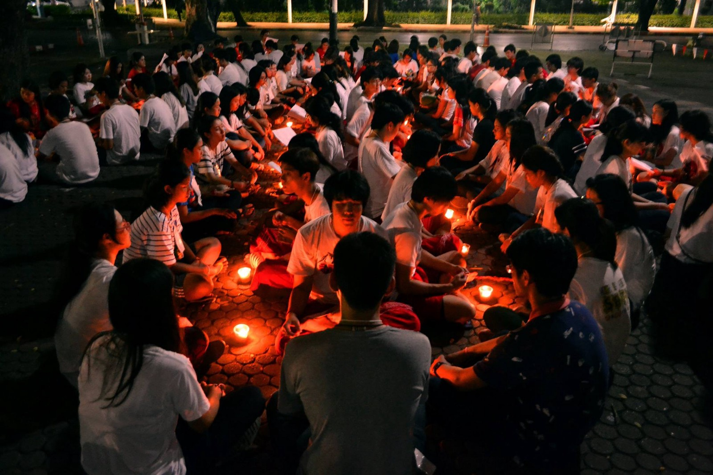
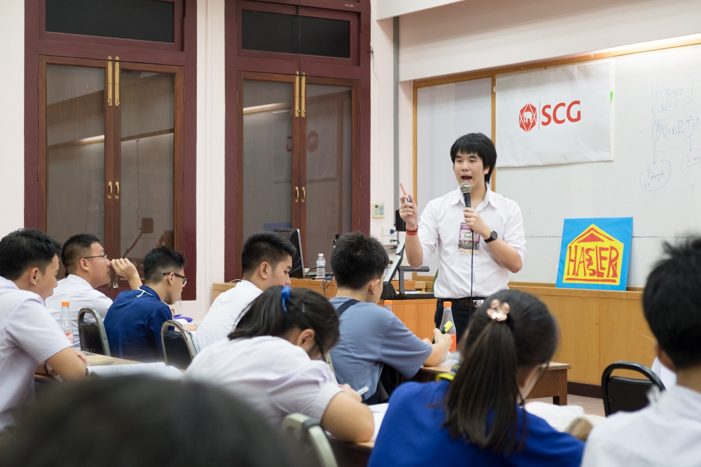
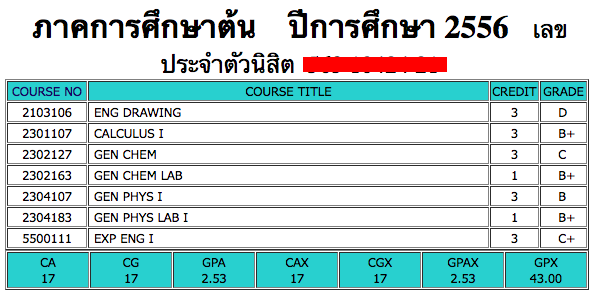
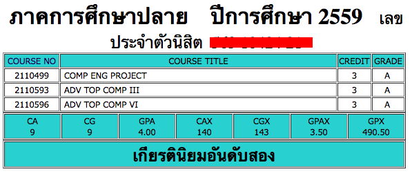
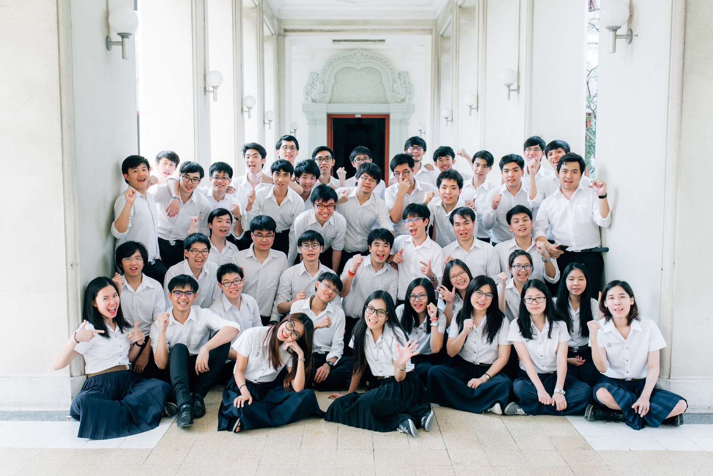
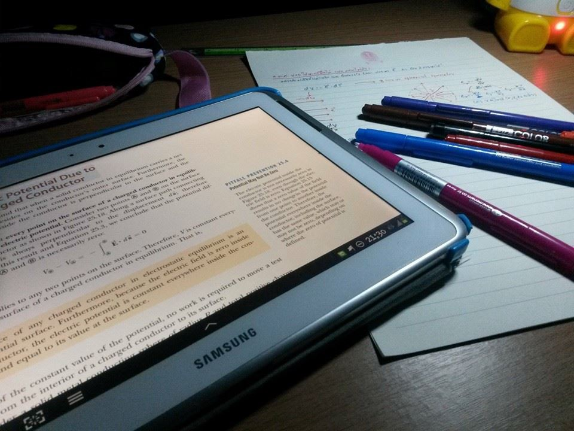
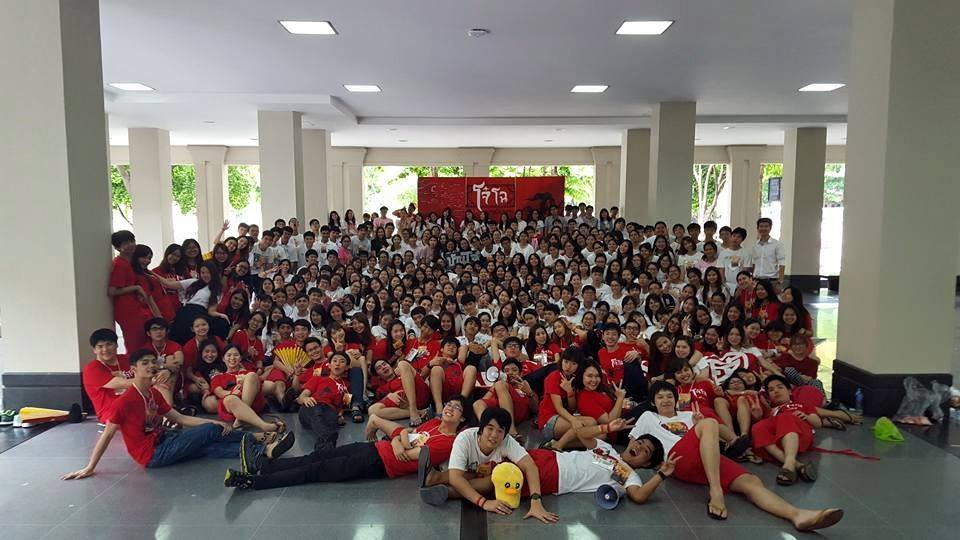
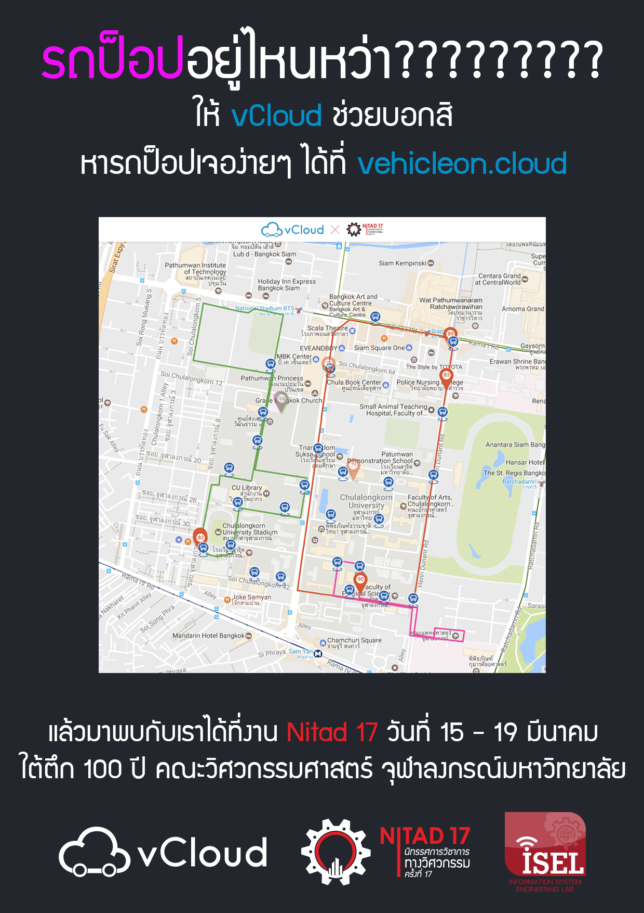
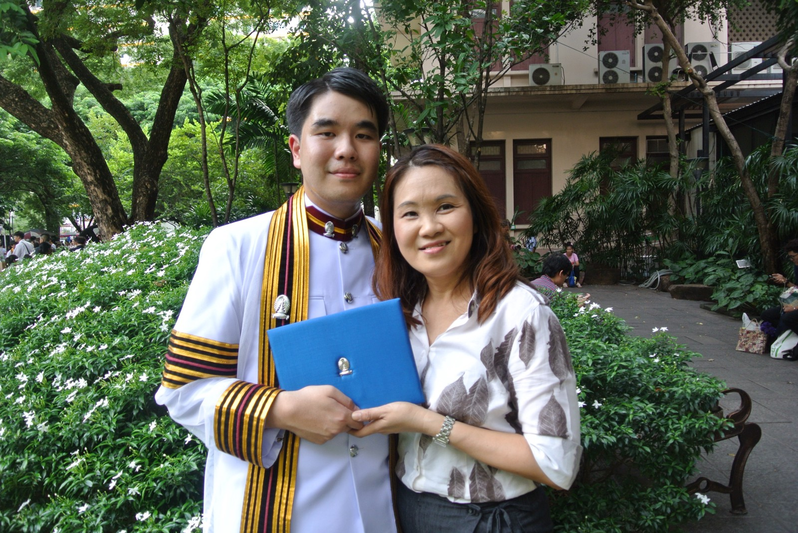

เพิ่งผ่านงานรับปริญญามาสดๆ ร้อนๆ เมื่อวาน(ซืน)นี้ครับ

ในใจนึงก็รู้สึกตื้นตันและดีใจมากๆ มันเป็นวันที่ดีมากๆ ได้เจอเพื่อนๆ เจอพี่ๆ เจอน้องๆ ทุกคนที่ผ่านเข้ามาในชีวิตของเราในวันเดียว นอกจากนั้นมันเป็นวันที่ชี้ชัดว่าชีวิตเรากำลังเดินก้าวไปอีกขั้นอย่างแท้จริง ก้าวออกจากชีวิตการเรียน การศึกษาที่กินเวลามาอย่างยาวนาน ไปสู่ชีวิตการทำงานที่แท้จริง ก้าวออกไปสู่โลกกว้างภายนอกที่มีอะไรต่อมิอะไรให้ค้นหามากมาย

แต่นั่นก็ทำให้รู้สึกใจหายเบาๆ เหมือนกัน

ตอนแรกก็ไม่ได้คิดหรอกว่าวันที่เรียนจบแล้วมันจะมีฟีลลิ่งที่เหมือนมี flashback ภาพชีวิตย้อนมาให้เห็นสั้นๆ

และพาลให้คิดว่า เอ้อ ที่พี่ๆ เขาพูดกันมานักต่อนักมันก็จริงแฮะ

> 4 ปีมันผ่านไปไวนะ

ก็เลยมาเขียนบล็อก เอา flashback ที่ย้อนกลับมาให้อ่านกัน

จะบอกว่าเป็นบันทึกหลังเรียนจบ ก็คงใช่แหละ…ก็เก็บมันไว้ให้เป็นความทรงจำ และเครื่องเตือนใจว่าครั้งนึงเราก็เคยได้อะไรเยอะแยะมากมายจากที่แห่งนี้

## กิจกรรมสอนให้คนทำงานเป็น

เรามาเรียนในมหาวิทยาลัยก็ต้องหาความรู้แน่นอน เพราะเราก็ต้องเอาความรู้ที่ได้เนี่ยไปใช้ทำมาหากินในอนาคต

แต่สิ่งที่ผมว่ามัน fullfill ให้ชีวิตมีประสบการณ์​และมีรสชาติไปอีกขั้นตลอดเวลาในรั้วมหาลัยก็คือการทำกิจกรรมนี่แหละ

เหมือนที่เขาบอกว่า **การเรียนทำให้คนมีงานทำ แต่กิจกรรมสอนให้คนทำงานเป็น** ซึ่งผมก็กล้าพูดได้เต็มปากเต็มคำเช่นกันว่ามันเป็นเรื่องจริง

ผมเป็นหนึ่งคนที่ทำกิจกรรมค่อนข้างเยอะพอสมควรครับ มีทั้งกิจกรรมที่วิชาการจ๋าๆ (สอนฟิสิกส์ในค่าย FE Camp, สอนคอมพิวเตอร์ในค่าย BitByte) ไปจนถึงกิจกรรมเพียวสันทนาการที่แท้ทรู (รับน้องบ้านโจ๋) แต่ก็ทำกิจกรรมในขอบเขตที่พอดีกับตัวเอง

_ค่าย FE Camp ได้เปิดโอกาสได้เราได้แบ่งปันความรู้ที่เรามีแก่น้องๆ รวมถึงสร้าง inspiration ให้น้องๆ ที่อยากเข้าวิศวฯ ​ด้วย_

เราอาจจะเคยเห็น case study มาเยอะแล้วที่การทำกิจกรรมทำให้เสียการเรียน จนทำให้หลายๆ คนก็มาพร่ำบอกว่าให้ไปตั้งใจเรียนสิ เรามาเรียนนะไม่ใช่มาเล่น มาทำกิจกรรมอะไร

แต่ผมจะบอกว่า คนประเภทนั้นคือคนที่เขาจัดสรรเวลาไม่เป็นครับ

ผมพร่ำบอกกับน้องๆ กับทุกคนที่รู้จักเสมอว่า เออกิจกรรมมันดีนะ แต่ต้องทำให้พอดี อย่ามากเกินไป

อันไหนที่ทำแล้วไม่สบายใจ ก็ไม่ต้องทำ อันไหนที่ทำแล้วทำให้เรารู้ตัวว่า มันไม่ใช่เวลาที่น่าจะต้องทำ ก็ไม่ต้องทำ

ถ้าถึงช่วงต้องสอบ ต้องอ่านหนังสือ ก็บอกเขาไปเลย เออพี่ผมอ่านหนังสือนะ

ไม่มีใครบังคับให้เราทำกิจกรรมหรอกครับ เราเป็นคนเลือกทำครับ

ซึ่งกิจกรรมมันไม่ได้ให้เราได้แค่มิตรภาพที่เกิดจากระหว่างการทำงาน แต่มันยังให้ประสบการณ์เราแบบอ้อมๆ อีกด้วย

บางกิจกรรมที่คนนอกก็มองดูไร้สาระ และไม่ได้อะไรเลยนอกจากความสนุก อย่างเช่น การเต้นสันทนาการ หรือการตีกลอง จริงๆ แล้วมันมีอะไรที่ได้มากกว่านั้นเยอะครับ

หรืออย่างการทำค่ายเอง ก็ได้อะไรเยอะครับ ได้ตั้งแต่เป็นมดงานช่วยจัดค่าย ยันไปช่วย organize, manage งานค่ายให้ดำเนินไปได้ด้วยดี

สิ่งเหล่านี้เนื้อหาในห้องเรียนไม่มีสอนจริงๆ ครับ

และถ้าอยากได้ต้องไปไขว่คว้าหาเอาเองจริงๆ

ผมเองก็ไม่กล้าพูดว่าเป็นเด็กกิจกรรม แต่ก็บอกได้เต็มปากว่าเป็นคนที่ทำกิจกรรมครับ

## บางที การที่เราได้ C หรือ D มาบ้าง ก็ไม่ใช่เรื่องแย่อะไร

หลายคนคาดฝันว่าอยากจะได้เกียรตินิยมกันตอนเข้ามาแรกๆ ซึ่งก็แหงละ มันก็เป็นความเท่ห์ที่มีให้เห็นอยู่บนใบปริญญาบัตร ว่าได้เกียรตินิยม และเป็นสิ่งที่แสดงว่าเรามีความเทพอยู่ในตัวเรา ตอนที่ไปสมัครงาน (หรือจะเอาไปโม้ให้ญาติๆ ฟังก็ยังได้)

แต่เชื่อไหมว่า บางทีชีวิตเราก็ไม่ต้อง perfect หรือจบด้วยเกรดที่มีแต่ A กับ B ใน transcript ก็ได้

เกรดเทอมแรกในชีวิตมหาลัยผมไม่มี A สักตัวครับ

แม้กระทั่ง Calculus ที่เขาว่าได้ A ง่ายที่สุดและก็ยัง B+ แถมหนำซ้ำเป็นวิชาที่ได้คะแนนมิดเทอมเยอะมาก (89/100 อารมณ์แบบ easy A เลยแหละ ไม่น่าพลาดอะไร)

และเทอมนั้นยังมี D ด้วยครับ

ตอนนั้นชีวิตก็รู้สึกเฟลหน่อยๆ ครับ แต่พอมาวันนี้ เรารู้สึกว่าการได้ D ในวันนั้นทำให้ผมได้มุมมองชีวิตเพิ่มมาอีกมุมมองนึงครับ

มันเป็นช่วงเวลาที่ทำให้เราย้อนกลับไปคิดถึงความผิดพลาดของตัวเองได้

เป็นช่วงเวลาที่ทำให้เราสำรวจตัวเองว่า เออทำไมมันถึงได้ D มาวะ

จนผมค้นพบว่าจริงๆ แล้วไม่มีใครหน้าไหนที่ทำให้เราได้ D นอกเหนือจากเราทำตัวเราเองล้วนๆ ครับ

ผมเจอว่าผมอ่านหนังสือช่วงนั้นพลาดไปมาก ไปทุ่มเทกับวิชานึงมากเกินไป จนลืมว่าตัวอื่นยังมี แถมหน่วยกิตก็เท่ากันด้วย

มันเลยเป็นบทเรียนจนถึงทุกวันนี้ว่า เราอย่าทุ่มเทให้กับอะไรมากเกินไป ถ้าความสำคัญมันเท่าๆ กัน

จนถึงวันนี้ผมไม่รู้สึกเสียดายกับเกรดเทอมแรกที่ได้เฉลี่ยที่ 2.52 ครับ

หนำซ้ำรู้สึกดีด้วย เพราะน้องๆ ที่ผ่านมาเห็นก็จะได้พบว่า

เกรดเทอมแรก 2.5 ก็เรียนจบที่เกรดเฉลี่ย 3.5 และได้เกียรตินิยมอันดับ 2 ได้ ถ้าเราไม่ขาดซึ่งความพยายาม

(แต่นั่นก็ต้องมาด้วย mindset ที่พร้อมจะพัฒนาตัวเองอยู่ตลอดด้วยนะครับ :D)

## เพื่อนดี ชีวิตก็ดี

มีคำไซโคจำนวนหนึ่งบอกว่า เพื่อนในมหาลัยหน่ะมันไม่ได้เหนียวแน่นไปกว่าเพื่อนสมัยมัธยมหรอก

ซึ่งมันก็คล้ายๆ คำลวงที่ว่า เดี๋ยวเข้ามหาลัยได้แล้วก็สบายแหละ หรือคำลวงอีกเป็นล้านอย่างที่เรามักเคยได้ยินมา

เพื่อนๆ ในมหาลัยก็ดีไม่ได้แพ้เพื่อนมัธยมหรอก

หนำซ้ำพอมาตอนนี้รู้สึกด้วยซ้ำว่า เราผ่านอะไรกันมาเยอะมากๆ

ไม่ว่าจะเป็นช่วงการอ่านหนังสือสอบ ผมก็เป็นหัวโจกทุกครั้งในการชวนเพื่อนมาอ่านหนังสือ และผมก็เป็นหัวโจกในการติวเพื่อนๆ เช่นกัน

ตอนปี 1 จะติดนิสัยการเขียนสรุปเนื้อหา เพราะส่วนตัวเป็นคนที่ชอบการสรุปเนื้อหา มันเหมือนกับการทบทวนความรู้ตัวเอง แถมยัง share กับเพื่อนๆ ได้อีก

และบวกกับชอบสอนมาจากตอนสอนค่าย FE Camp ก็มีโอกาสสอนเพื่อน ติวเพื่อน ช่วยเพื่อนอยู่บ่อยครั้ง

หรือแม้กระทั่งทำงานกลุ่ม ผมก็เป็นหัวโจกของกลุ่มหลายๆ งาน (อาจเพราะมี technical skill สูงด้วยแหละมั้ง 55)

ซึ่งจะบอกว่า หลายๆ ครั้งถ้าไม่ได้เพื่อนที่ดีเนี่ย ชีวิตนรกเลยนะครับ การทำงานกลุ่มเนี่ย

ทำงานกลุ่ม 6 คน ถ้าสั่งงานไปแล้วเพื่อนมันไม่ทำ ก็ชิบหายเลยครับ เหนื่อยหนักกว่าเดิมอีก (เพราะมันก็ต้องเป็นเราเอง ที่ทำงานส่วนที่เพื่อนมันเทไง)

หรือไม่ต้องเป็นโปรเจคในวิชาเรียนก็ได้ การทำกิจกรรมก็เหมือนกัน เราก็จะเจอจังหวะเครียดๆ เยอะมาก เครียดกลัวงานออกมาไม่ดี เครียดกลัวงานล่ม เหนื่อยเอามากๆ

_บ้านโจ๋ บ้านรับน้องที่เป็นหนึ่งในกิจกรรมที่เรียกได้ว่าให้อะไรกับเราได้ครบเครื่องมากๆ พาชีวิตเราไปสู่หลายๆ จุดที่ไม่เคยคิดเคยฝันว่าก่อนว่าจะได้เจอ_

แต่เหมือนที่จั่วหัวไว้ครับว่า **“เพื่อนดี ชีวิตก็ดี”**

การมีเพื่อนดีๆ อยู่ข้างๆ คอยช่วยเหลือกันในเวลาที่ยากลำบาก ในเวลาที่เครียดๆ มันดีกว่าที่เราผจญฝ่าฟันเรื่องนั้นไปคนเดียวจริงๆ และตอนจบของเรื่องนั้นก็จะได้เพื่อนเพิ่มมาอีกคนนึง

ซึ่งคำนี้พูดได้กับทุกเรื่องจริงๆ ไม่เว้นแม้กระทั่งการไปจีบสาวก็ตามทีเหอะ 5555

และจริงๆ ผมเองก็โชคดีมากๆ ที่ตลอด 4 ปีเจอแต่เพื่อนดีๆ จริงๆ :D

## มีงาน มีกิจกรรม มีเรียน ก็มี…ความรักบ้างก็ได้

> ในที่สุดก็เรียนจบพร้อมกับคำว่า “4 ปีไม่มีแฟน” จริงๆ 55555555555555555555

แต่การไม่มีแฟนเลย ก็ใช่ว่าจะไม่มีโมเม้นเกี่ยวกับเรื่องนี้นะ

จริงๆ พอมองในช่วงเวลานี้ บางทีการมีแฟนในช่วงมหาลัยมันก็ดีไปอย่างนะ คือรู้สึกว่ามันก็เหมือนเป็นช่วงดูใจกันอะ และชีวิตมหาลัยมันก็พอมีเวลาที่จะได้เจอกันเยอะด้วย ได้ไปอ่านหนังสือด้วยกัน ได้ไปเที่ยว ไปเล่น ทำกิจกรรมด้วยกัน (เทียบกับมาทำงานแล้วเนี่ย มีแต่งานๆๆๆๆ จริงๆ จะเอาเวลาที่ไหนไปหา)

และก็พาลอิจฉาหลายๆ คู่ที่ก็แห่ไปถ่ายรูปชุดครุยกัน ยังกะถ่ายพรีเวดดิ่ง 555555

หรือหลายๆ คู่ที่ต่างคนต่างมาช่วยถือของ มาช่วยดูแลกันในงานรับปริญญา

ส่วนผมเองเรื่องความรักในรั้วมหาลัย 4 ปีก็ดูจะมีสีสันสุดก็ตอนปี 1 นี่แหละ

เป็นโมเม้นที่ดีเอามากๆ และก็ขำตัวเองเหมือนกัน 555 ขำในความกล้าขั้นสุดของตัวเอง กล้าทำอะไรที่ชีวิตนี้ไม่เคยคิดว่าได้ทำอะ

พอผ่านปี 1 ไปก็ไม่ได้คุยกับใครอีกเลย 5555555 จริงๆ ก็น่าจะนับได้อีกคนนึงตอนปี 2 แต่มันขมขื่นหน่อยๆ และแย่เอามากๆ จนหลังจากนั้นชีวิตไปทุ่มอยู่กับเรื่องอื่นแทน

จนมาช่วงเร็วๆ นี้ที่ผ่านมานี่แหละ ที่กลับไปมีโมเม้นอะไรแบบนี้อีกครั้ง

แต่ถ้าจะให้สรุปสั้นๆ คือ

> “บางทีความนก อาจให้อะไรกับเรามากกว่าที่เราคิดไว้ก็ได้”

(ก็ยังโสดต่อไปนะ 55 แต่ก็ขอบคุณที่มาสร้างชีวิตเราให้มีสีสันมากขึ้นนะ :D)

## อาจารย์ในมหาลัยก็ดีนะ

อีกคำไซโคนึงที่เคยได้ยินก็คือ อาจารย์ในมหาลัยน่ะ เขาก็ไม่ได้ดูแลเอาใจใส่เราแบบสมัยม.ปลายนะ

จริงๆ จะบอกว่าไม่ดูแลเอาใจใส่นี่มันก็ผิดเต็มๆ ประตูเลยนะ จริงๆ อาจารย์หลายๆ ท่านก็ดูแลเอาใจใส่นิสิตเราๆ ดีมากๆ เลยนะ

แต่สิ่งนึงที่ผมค้นพบว่าเหตุใดที่มีคนพูดคำนั้นมาให้ได้ยิน นั่นก็เพราะว่า อาจารย์ก็ดูแลเอาใจใส่เรานะ แต่ถ้านิสิตไม่สนใจ ก็ไม่มีประโยชน์

นั่นก็คงเพราะว่าเราต้องโตขึ้นครับ จะให้อาจารย์มาตามทวงตามจิกแบบตอนเรียนม.ปลายก็คงไม่ใช่แล้ว เพราะเราโตขึ้น เราก็ต้องมีความรับผิดชอบครับ ถ้าคิดว่าจะมีปัญหาอะไร ก็ต้องติดต่ออาจารย์เองเลย

อาจารย์หลายท่านเห็นตอนสอนก็เข้มๆ ดุๆ โหดๆ เนี่ย แต่ตอนไม่ได้สอนนี่คนละเรื่องเลยก็มีนะครับ

โดยเฉพาะตอนทำซีเนียร์โปรเจค หรือตอนทำโปรเจคหลายๆ อย่าง กล้าบอกได้เลยว่าอาจารย์ในมหาลัยก็ดูแล และให้คำปรึกษาที่ดีดีไม่แพ้อาจารย์ตอนม.ปลายจริงๆ ครับ

หนำซ้ำอาจารย์ในภาคหลายๆ ท่านก็ให้โอกาสได้จับโปรเจคที่นำไปใช้งานจริงหลายๆ ตัวด้วยครับ ทั้งๆ ที่โปรเจคหลายตัวอาจต้องใช้ศักยภาพที่เกินตัวเราด้วยซ้ำ

แต่อาจารย์ก็เห็นว่า นิสิตอย่างเราๆ ก็สามารถดันศักยภาพได้เกินกว่าที่ตัวเองคิดว่าจะทำได้จริงๆ และไว้ใจว่าเราทำได้

ซึ่งก็ต้องขอบคุณอาจารย์ทุกท่านมากครับ ที่ทำให้ผมมาจนถึงจุดนี้ได้ในทุกวันนี้

## PUSH YOUR’S LIMIT!!!

_เขียน React เป็น หรือทำอะไรต่ออะไรเป็น ก็จาก Senior Project นี่แหละ_

ผมค้นพบว่า 4 ปีในมหาลัย นอกจากได้เรียนรู้อะไรๆ มากขึ้น สกิลนึงที่ปลดล็อคมาได้แบบงงๆ คือ การผลักดันตัวเองขึ้นไปอีกขั้นครับ

จนผมเรียนจบ ผมเองก็บอกได้เลยว่า การเรียนในห้องเรียนเนื้อหาก็ไม่พอออกไปทำมาหากินครับ

ยิ่งสายงานคอมพิวเตอร์ บอกเลยโลกโตไปไวมากๆ ครับ ถ้าบอกกันตรงๆ คือเนื้อหาในห้องเรียนบางวิชานี่โคตรโบราณเอาพอสมควรเลย

ดังนั้นสกิลนึงที่ได้มาเต็มๆ คือ **Self-Learning** ครับ

ผมก็พร่ำบอกน้องๆ เสมอว่า **“กรุงโรมไม่ได้เสร็จวันเดียว แต่ถ้าอาจารย์อยากได้กรุงโรมพรุ่งนี้ ก็ต้องเสร็จ”**

เป็นคำที่สะท้อนหลายอย่างมากๆ เช่น 1.งานใหญ่แค่ไหน วันส่งก็คือวันส่ง 2.ทำไม่เป็น แต่ก็ต้องทำให้เป็น จนมีงานส่งได้

อันแรกจริงๆ ไม่ค่อยเจอมากหรอกครับ ส่วนมากก็เผาออกมากันจนเสร็จ แต่อันสองนี่เจอบ่อยมาก

ในหลักสูตร ก็ไม่ได้บังคับเขียนเว็บนะ แต่โปรดักส์สุดท้ายของวิชา SE ก็คือต้องมีเว็บที่ใช้งานได้

หรืออย่างผมเอง ตอนปี 3 มีทำโปรเจคกับโรงพยาบาลจุฬาฯ​ ต้องเขียนแอพ อืม ก็ไม่เคยเขียนเลยครับ แต่สุดท้ายก็เข็นมันออกมาจนได้

ทุกอย่างที่ฟังดูโหดร้ายมากๆ แต่จริงๆ มันทำให้เราโตขึ้นได้ก้าวกระโดดมากจริงๆ

และผมว่ามันเป็นสกิลที่ดีมากๆ เลยนะ เพราะจริงๆ การเรียนรู้ไม่ได้จบแค่ในห้องเรียนหรอก หากแต่ทั้งชีวิตเราเนี่ยแหละ มันคือการเรียนรู้ครับ

## อยู่ดงคนเก่งๆ จะเก่งตามได้แน่ๆ

ผมจบจากโรงเรียนวัดราชบพิธ ที่ใครหลายคนได้ยินชื่อก็อาจจะไม่ค่อยรู้จัก เพราะโรงเรียนก็ไม่ได้มีชื่อเสียงดังเท่าอย่างสวนกุหลาบที่ก็อยู่ละแวกแถวโรงเรียนผมนี่แหละ 555 เพื่อนหลายคนก็ยกยอให้ผมเป็นตัวท็อปของโรงเรียน (ซึ่งทุกวันนี้ก็ยังถ่อมตัวอยู่นะ กูไม่ได้เก่งขนาดนั้น เพราะมันมีคนที่เก่งกว่าจริงๆ 555)

ดังนั้นให้นึกภาพว่า ชีวิตวัยเรียนผมก็คงเหมือนเด็กมัธยมจำนวนส่วนมาก ก็มีชีวิตสนุกสนานในห้องเรียน มีวีรกรรมแสบๆ กันทั้งนั้น

จนเข้ามาเรียนในวิศวฯ จุฬาฯ ผมพบว่ามันเป็นก้าวแรกในรั้วมหาลัยที่โคตรจะเปิดโลกของเราให้กว้างเอามากๆ

ผมได้เจอกับเพื่อนที่เป็นเด็กค่ายโอลิมปิก ได้เหรียญระดับประเทศ

ต้องเรียนกับคนที่ได้ PAT1 เต็ม 300 คะแนน

เจอเพื่อนที่หัดเขียนโปรแกรมตั้งแต่ประถม!

ตอนนั้นเรารู้สึกได้คำเดียว

> “กู noob สัส”

จริงๆ 5555555 คือแต่ละคนที่โหดๆ ทั้งนั้น

ก่อนหน้านั้นผมมีความคิดว่า คนเหล่านี้น่าจะเป็นคนที่เนิร์ดๆ คุยแต่เรื่องเรียนๆๆๆ คงจะน่าเบื่อปวดกบาลแน่ๆ เลย แต่คิดผิดครับ พวกเขาก็เป็นคนธรรมดาเหมือนผมนี่แหละ คุยกันได้ทุกเรื่อง หยอกล้อได้หมด แถมบางคนเก่งทั้งด้านดนตรี และเก่งกีฬาพ่วงมาด้วย (แฟนสวยอีก โอ้ perfect man สัสๆ)

ซึ่งผมว่าเหตุนึงที่เราเห็นคนจบจุฬาฯ​ แล้วเก่งกันมากๆ ก็เพราะว่าเราอยู่ในสังคมที่มีแต่คนเก่งครับ

ผมกล้าบอกเลยว่า พอมีแต่คนเก่ง สิ่งที่เกิดขึ้นคือ

> “เราต้องเก่งได้กว่านี้สิ” “มันทำได้ กูก็ต้องทำได้สิ”

และผมบอกเลยว่า คนเก่งเหล่านี้พร้อมจะแชร์ความเก่งให้เพื่อนๆ ด้วยซ้ำครับ ขอแค่ไปบอกมันก็พอ (แต่จะรับพลังความเก่งมาไว้กับเราได้เยอะแค่ไหน อันนี้อยู่ที่เราแล้วล่ะ 55)

ผมยังจำได้เลยว่าตอนช่วงปี 2 ยังเขียนเว็บไม่เป็นเลย จนเพื่อนมีโครงการนึง ซึ่งมันดีมากๆ คือโหวตกันว่าอยากจะเรียนเรื่องอะไร แล้วก็จะหาคนที่เก่งๆ เรื่องนั้นมาสอน มาแชร์ให้ฟัง ซึ่งตอนนั้นเรื่องเว็บชนะ เพื่อนก็เลยมาสอนเขียนเว็บ ผมก็ไปเรียนด้วย จนถึงทุกวันนี้บอกได้เต็มปากว่าเขียนเว็บได้ ก็เพราะเพื่อนคนนี้เลย

ยังไม่นับว่า มีเพื่อนที่ไปหางานข้างนอกมา แล้วเราก็ไปร่วมวงทำด้วยนะ เป็นประสบการณ์ที่ดี และเราก็เก่งขึ้นได้จริงๆ

## ก็ถูกแหละ ปริญญาบัตรมันก็เป็นกระดาษใบนึง

ก่อนผมรับปริญญา ผมก็เคยคิดแว่บๆ นะ ว่าปริญญาบัตร มันก็เป็นกระดาษใบนึง ที่บ่งบอกว่า เออกูเรียนจบแล้วนะ

ทั้งๆ ที่จริงตอนผมสมัครงานเนี่ย ผมก็ยังเรียนไม่จบด้วยนะ ยังเรียนเทอมสุดท้ายด้วยซ้ำ สิ่งที่เอาไปสมัครคือความสามารถส่วนตัวล้วนๆ ไม่ใช่วุฒิการศึกษา (เชื่อผมสิ transcript ผมพี่เขาก็ยังไม่เคยเห็นเลย 555)

แต่มาตอนนี้ เมื่อผมรับปริญญาแล้ว จริงๆ ใบปริญญามันมีอะไรมากกว่านั้นครับ

มันเป็นเหมือนเครื่องเตือนใจว่า เราได้เจออะไรมาบ้างในรั้วมหาลัย เราได้ฝ่าฝันอะไรมาบ้างในชีวิตการเรียนของเรา จนได้ใบปริญญาบัตรนี้มา

ผมบอกเลยว่า 4 ปีเนี่ย รู้สึกว่ายังทำอะไรหลายอย่างได้อีกเยอะครับ ยังทุ่มเทกับมันได้อีก

แต่ถามว่าอะไรที่เคยทำลงไปตลอด 4 ปีนี้รู้สึกเสียดายไหม ผมตอบได้เลยว่า ไม่เสียดายสักนิดเดียว

และผมก็มีความภูมิใจส่วนตัวครับ ที่ได้เอาปริญญาบัตรไปฝากให้พ่อกับแม่ครับ เพราะพ่อกับแม่ผมไม่เคยได้สัมผัสใบปริญญาบัตรครับ

เหมือนเป็นรางวัลให้กับพ่อแม่ผมที่อดทน และทุ่มเทเพื่อผมมานานแสนนานเอามากๆ

## Big Thanks to everyone that come to my life

ตอนแรกจะติดนิสัยดองแล้ว แต่บล็อกนี้ต้องเข็นให้เสร็จจริงๆ ไม่งั้นมันจะไม่เสร็จออกมาให้ได้อ่านกันสักที 5555

ท้ายสุดมาถึงตอนนี้ ขอขอบคุณทุกคนที่ผ่านเข้ามาอ่านกัน (ถ้าทนอ่านจนจบนะ 55) และขอขอบคุณส่งถึงทุกคนที่เกี่ยวข้องในช่วงชีวิตผมผ่านช่องทางนี้ละกัน

ขอบคุณเพื่อนสมัยประถม โรงเรียนแม่พระประจักษ์ ที่ก็แหงละ เพื่อนๆ มีซนกันบ้างตามประสาเด็กๆ สมัยนั้นอะนะ 5555 แต่ก็คิดถึงเพื่อนๆ ทุกคนเสมอมานะ

ขอบคุณเพื่อนมัธยม โรงเรียนวัดราชบพิธ พวกมึงทุกคนเองก็เป็น 1 ในความทรงจำที่ดีมากๆ หาคนมาแทนยากจริงๆ

ขอบคุณเพื่อนภาคคอม ที่อยู่กันมาตลอด 4 ปี ฝ่าฝันสาระพัดสิ่งมาด้วยกันเยอะมากๆ ไล่ขอบคุณทุกคนไม่หวาดไหวจริงๆ

ขอบคุณเพื่อนบ้านโจ๋ กลุ่มเพื่อนที่ได้มอบหนึ่งในประสบการณ์ที่ดีที่สุดในรั้วจุฬาฯ​ จริงๆ เราผ่านอะไรกันมาด้วยกันเยอะมากๆ รักพวกมึงทุกคน

ขอบคุณเพื่อนฝ่ายวิชาการแห่ง FE Camp พวกมึงคือ the best สุดทุกทางจริงๆ เรียนก็เก่ง งานก็โหด เกรียนก็เกรียน

ขอบคุณเพื่อนร่วมรุ่นในจุฬาฯ ที่ได้รู้จักกันผ่านกิจกรรมหลายๆ อย่าง บางคนอาจจะลืมเราไปแล้ว แต่เรายังไม่ลืมนะ :D ยินดีที่ได้รู้จักทุกคน

ขอบคุณอาจารย์ทุกท่าน ที่สั่งสอนผมมาในทุกช่วงชีวิต ตั้งแต่อาจารย์สมัยอนุบาล ประถม มัธยม มหาลัย ขอบคุณที่ให้ทั้งความรู้ คำแนะนำ คำปรึกษา คำเตือนสติต่างๆ ตลอดมา หลายๆ ท่านดุกับผมมากๆ ในบางช่วง แต่ผมขอบคุณมาก เพราะนั่นเป็นการเตือนสติผม และทำให้เบนซ์เป็นเบนซ์จนถึงทุกวันนี้ครับ

ขอบคุณพี่ๆ ทุกคน ที่ช่วยให้คำแนะนำต่างๆ และดูแลน้องเสมอมา

ขอบคุณป๊ากับม๊ามากที่สนับสนุนทุกๆ อย่าง ทุกๆ อย่างจริงๆ

และสุดท้ายจริงๆ ขาดไม่ได้เลย

> ขอบคุณตัวเอง ที่พาตัวเองมาจนถึงจุดนี้ได้
