เมื่อสิ้นปีที่ผ่านมา คนที่เขียน React หลายคนคงเคยได้ยินเรื่องราวของ **hooks** ฟีเจอร์ใหม่ที่กำลังจะมาในอนาคตอยู่บ้าง วันนี้ก็เลยเอามาเล่าให้ฟังกันว่ามันคืออะไร แล้วทำไมคนถึง hype ฟีเจอร์นี้กันหนักหนา

## เราจะ reuse logic ได้ยังไงใน React?

เหตุเกิดจากที่ว่ามีคนตั้งคำถามที่ง่ายมากๆ คือเราจะ reuse logic ใน React ได้อย่างไรบ้าง ซึ่งในอดีตที่ผ่านมานั้นก็มีคนพยายามหาวิธีเพื่อมา solve สิ่งนี้มาหลายต่อหลายรุ่นหนัก ผมขอเล่าให้ฟังก่อนจะพูดถึง hooks กันจริงๆ จังๆ เพื่อให้ทุกคนเข้าใจก่อนว่า ทำไมการมาของ hooks คนถึง hype กันนัก

## ยุคสมัยแห่ง Higher Order Component (HoC)

สำหรับคนที่สงสัยว่า Higher Order Component (ย่อว่า HoC) คืออะไร คำนิยามของมันสั้นๆ ก็คือ

> เป็นฟังก์ชันใดๆ ที่รับตัว Component เข้าไป แล้วมันจะ return Component ใหม่ออกมา

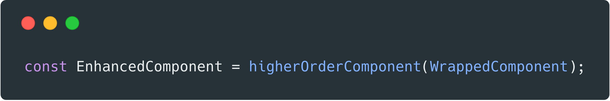

สิ่งที่ตัว function นั้นมักจะทำกันก็คือ เรามักจะ reuse logic บางอย่างในตัวฟังก์ชันนั้นๆ ให้มากสุดเท่าที่จะมากได้

ขอยกตัวอย่างจาก docs หลักของ React มาละกัน

สมมติเดิมเรามี component `CommentList` ที่จะมีการ subscribe ตัว data source แล้วนำมาแสดงผล

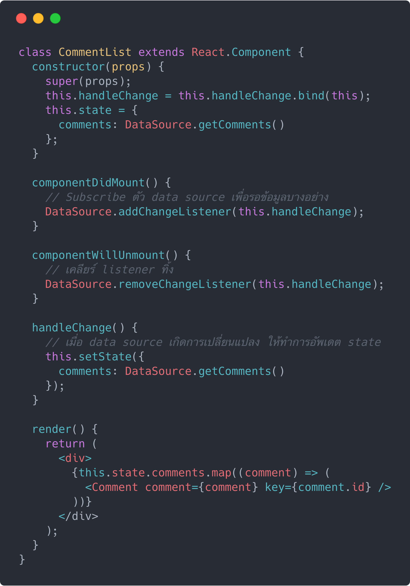

ก็ตรงไปตรงมาตามปกติ เราทำการ subscribe ตัว data source ได้ใน lifecycle `componentDidMount` เขียน function `handleChange` เพื่อรอการเปลี่ยนแปลงของข้อมูล แล้วก็ clear listener ที่ subscribe ตัว data source ไว้ในจังหวะ `componentWillUnmount`

โอเค สมมติต่อมาเราทำ component `BlogPost` กันบาง โดยจะมีการ subscribe ตัว data source แล้วนำมาแสดงผลเช่นกัน

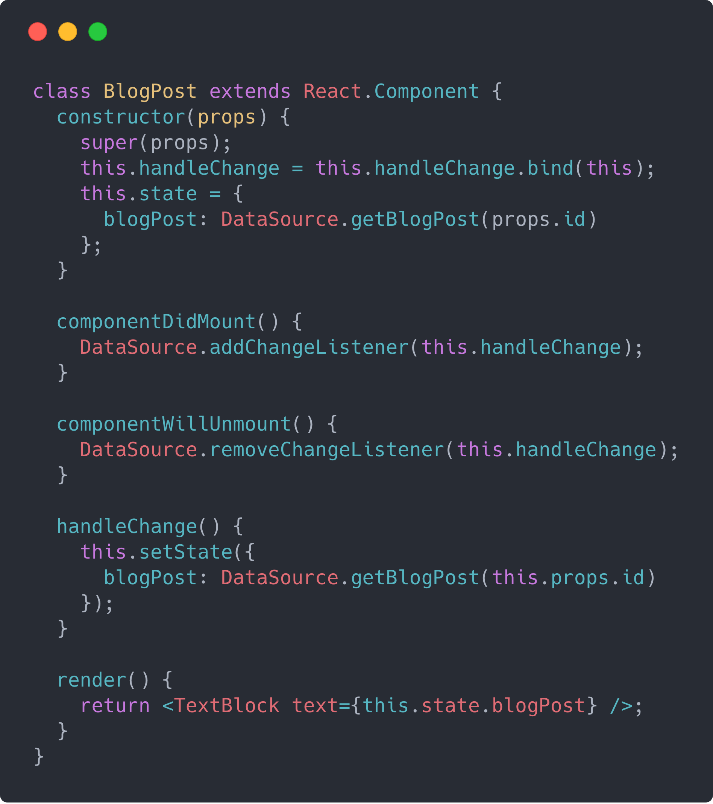

อาจจะเริ่มสังเกตได้ว่า เฮ้ย เราเจอโค้ดซ้ำซ้อนกัน ถ้าเราดูดีๆ ทั้งหมดทั้งมวลนี้จะมีความคล้ายคลึงกันกับตัว CommentList เลย คือ

- เรา subscribe ตัว data source ที่ `componentDidMount`
- เราเคลียร์ listener ที่ `componentWillUnmount`
- เรามีฟังก์ชันเพื่อรองรับการอัพเดตข้อมูลคล้ายๆ กัน (ฟังก์ชัน `handleChange`)

เราก็เลยอยากจะ reuse logic ทั้งสามอย่างที่เราเห็นว่ามันทำหน้าที่คล้ายๆ กัน โดยจะทำเป็นฟังก์ชันที่ชื่อว่า `withSubscription` โดยจะรับ component และฟังก์ชันที่จะใช้ในการอ่านข้อมูลจาก data source มาเป็น parameter เพราะหากเราดูดีๆ แม้ว่าขั้นตอนจะคล้ายๆ กัน แต่มีการดึงข้อมูลคนละตัวกัน

- CommentList อ่านข้อมูลจาก `DataSource.getComments()`
- ส่วน BlogPost อ่านข้อมูลจาก `DataSource.getBlogPost()`

พูดง่ายๆ คือ ในปลายทางของเรา เราจะใช้ HoC ชื่อ `withSubscription` ในการ reuse logic ทั้งสามที่ผมบอกไว้ แล้วเวลาจะเรียกใช้ เราจะทำแบบนี้แทน

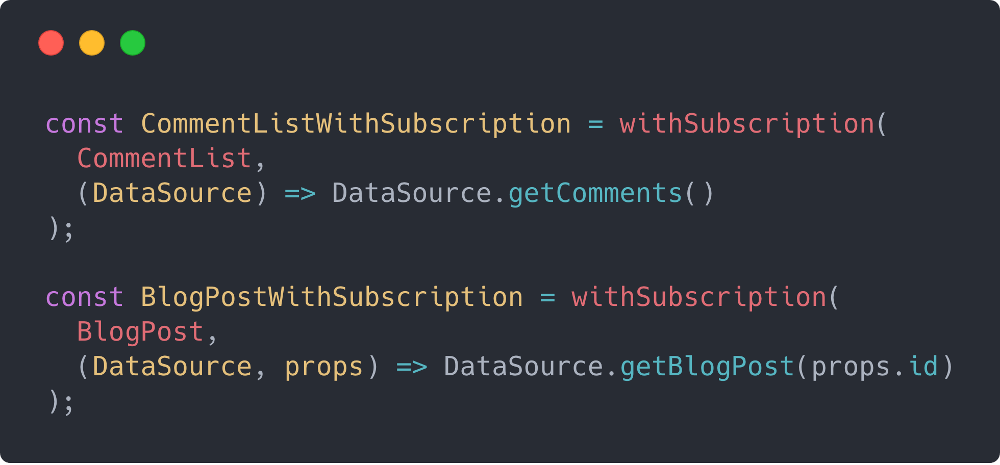

แล้วเราก็สามารถนำ component `CommentListWithSubscription` ใช้งานแทน `CommentList` ดั้งเดิม กับ `BlogPostWithSubscription` ใช้งานแทน `BlogPost` ดั้งเดิม

## แล้วมัน implement ยังไง

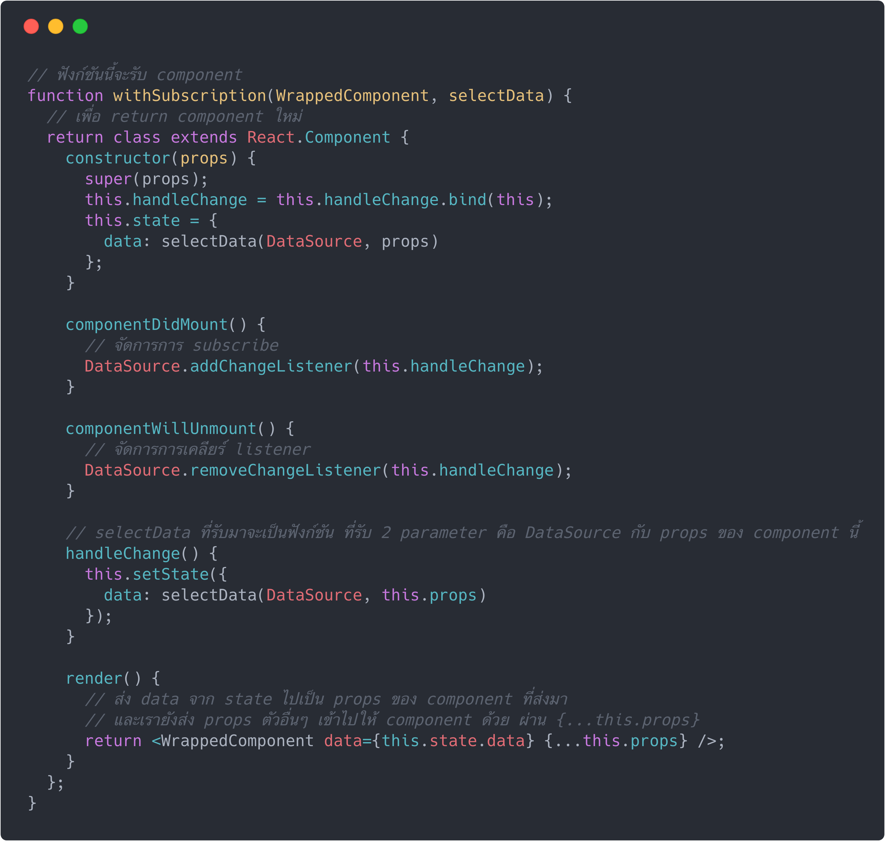

เราจะเห็นได้ว่า ตัว function นี้ จะรับ component มา แล้ว return component ใหม่ออกไปก็จริง แต่ตัว component ที่รับมา จะไม่โดน mutate ใดๆ เสมือนว่าจริงๆ แล้วฟังก์ชันนี้ทำการ **"ห่อ" component เก่าด้วย "logic หรืออะไรก็ตามแต่ที่อยากจะทำ" แล้วก็ส่งออกเป็น component ใหม่เอาออกไปใช้งานได้เลย**

โดยจุดที่เรา reuse ได้ ก็คือสามส่วนที่ผมได้บอกไว้

- ใน `componentDidMount` เราทำการ subscribe data source
- ใน `componentWillUnmount` เราทำการเคลียร์ listener ทิ้ง
- ฟังก์ชัน `handleChange` จะคอย set state ของ data โดยอิงตาม parameter ที่สองของฟังก์ชัน `withSubscription` ที่ส่งมา อารมณ์ประมาณว่าเขียน callback function เพื่อดึงข้อมูลยังไง ก็ทำตามนั้น ไม่ทำอะไรนอกเหนือจากนั้น

## HoC ก็ดูดีใช่มะ?

มันดูดี เพราะว่านอกเหนือจากเรา reuse logic บางส่วนได้แล้ว อีกข้อดีคือเราสามารถห่อมันไปอีกหลายๆ ชั้นได้

เช่น เราคุ้นเคยกับฟังก์ชัน `connect` ใน `react-redux` ฟังก์ชัน `connect` ก็เป็น HoC แบบนึงอย่างไม่ต้องสืบ

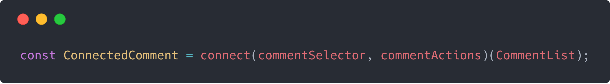

หรืออย่าง `react-router` ก็จะมี `withRouter` เพื่อให้ component รู้ว่า ตอนนี้อยู่ที่ route อะไร ก็เป็น HoC เหมือนกัน

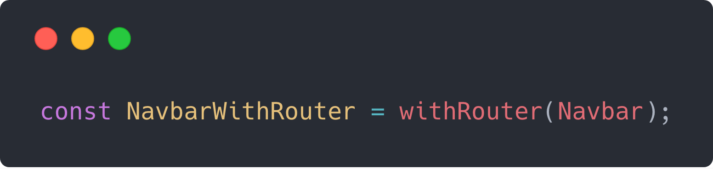

เราสามารถใช้สองสิ่งนี้คู่กันได้ เพราะอย่าลืมว่า HoC จะ return Component ใหม่ออกมา ดังนั้นเราก็เรียกซ้อนกันแบบนี้ได้

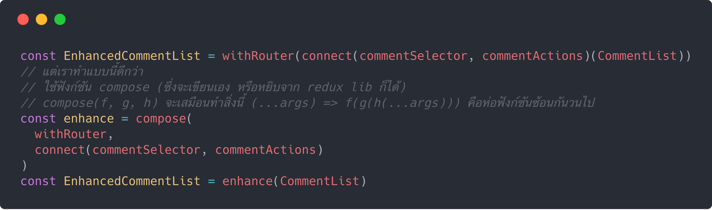

> HoC ของ HoC ก็คือ HoC

## แต่ก็ไม่ดีขนาดนั้น

บางครั้งเรามักใช้ HoC เยอะไปจนลืมตัว และจุดบอดของมันที่สำคัญสุดคือ **เราจะเริ่ม debug ยากขึ้นหากซ้อนกันเยอะๆ** เพราะตัว HoC เองมีการ conceal รายละเอียดทิ้งไปหมดเลย เช่น props ใหม่งอกมาจาก HoC ตัวไหนกันแน่ เพราะโดยหลักการส่วนมากแล้ว HoC มักจะเป็นตัวที่คอยสร้าง props ใหม่ขึ้นมาเรื่อยๆ พอใช้หลายๆ อัน ถึงจุดนึงก็จะงงงวยว่าอี props นี้งอกมาจากไหนวะ

และขั้นต่อมาคือ debug ยากขึ้น พอไปส่อง React Devtools ก็จะเจอสิ่งนี้

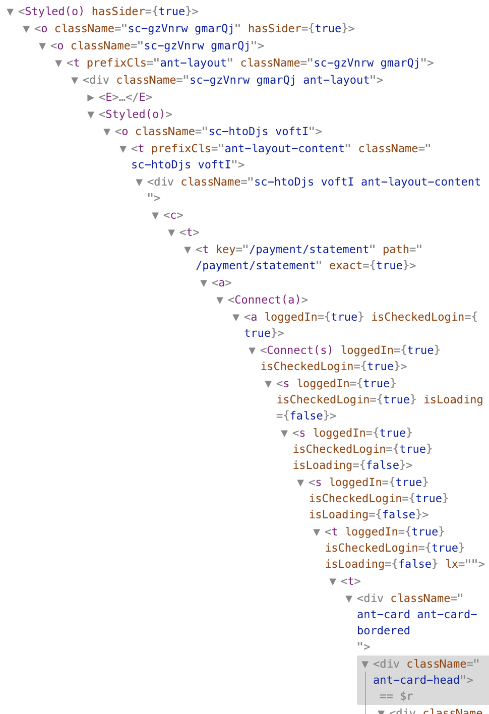

เพราะท้ายสุดในเชิง implementation มันก็คือการ generate component ใหม่ออกมาเรื่อยๆ ดังนั้นถ้า wrap ไป 6-7 ชั้น ก็สวัสดีปีใหม่ เจอแน่ๆ 6-7 layer กว่าจะหาเจอว่าพังตรงไหนก็น้ำตาท่วมนอนตายไปก่อนแล้ว

## Render Props จึงเกิดมาเป็นอีกหนึ่งแนวคิด

โดย Render Props เป็นแนวคิดที่ว่า

> รับ props ที่จะคอยบอกว่า จะ render data แบบไหน

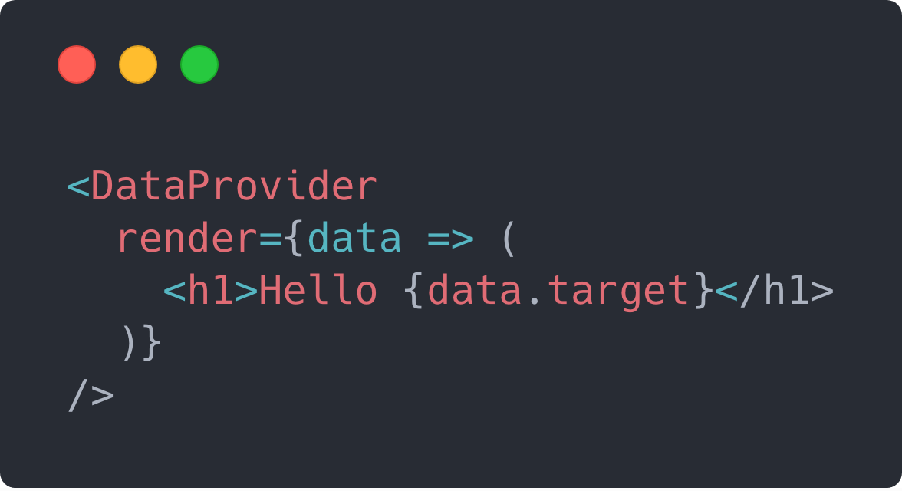

ยกตัวอย่างจาก doc ของ React อีกครั้ง สมมติผมทำ Component ชื่อ `MouseTracker` ไว้ทำการ detect ตำแหน่งของเมาส์ในจอ โดยโค้ดหน้าตาเป็นดังนี้

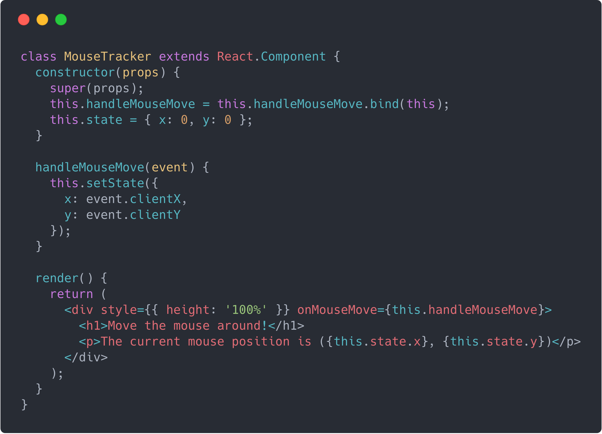

ก็ตรงไปตรงมา เราใช้ `onMouseMove` เพื่อดัก event ตอนเมาส์เคลื่อนที่ใน div นั้นๆ แล้วทำการ setState ใหม่เพื่ออัพเดตตำแหน่งที่จะไป render ตำแหน่ง x, y ในแท็ก `
`

แต่ทีนี้ถ้ามีจุดไหนที่เราอยากจะต้องการรู้ตำแหน่งของเมาส์ในลักษณะแบบนี้เหมือนกัน แต่เปลี่ยนวิธีการ render เฉยๆ เราจะทำยังไงดี?

ขั้นแรกเลยถอด `MouseTracker` ออกให้เป็น component ชื่อว่า `Mouse` แทน โดยที่ component นี้จะสนใจเรื่องของตำแหน่งของเมาส์เท่านั้น ไม่มีสิ่งอื่นได้ จึงได้ component หน้าตาแบบนี้

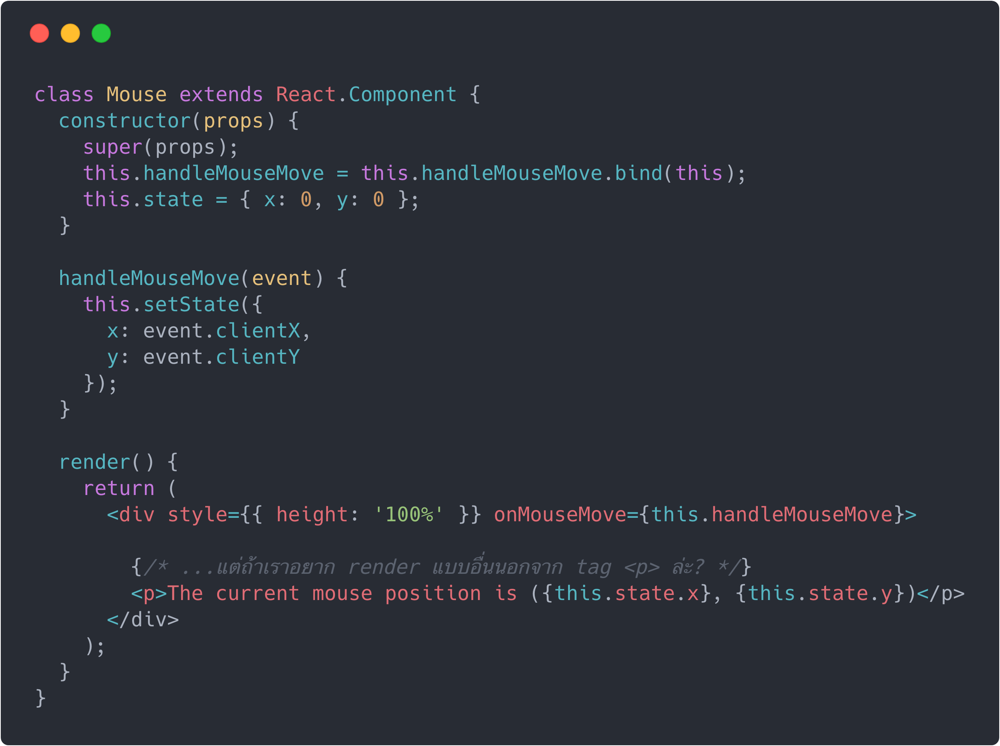

ทีนี้ถ้าเราอยาก render component อื่นนอกเหนือจาก tag `
` เราจะทำยังไงได้ วิธีการที่ง่ายสุดคือ ก็ทำ component ใหม่เลย เช่น ชื่อ `MouseWithCat` ถ้าอยาก render รูปแมวตามตำแหน่งของเมาส์แทน tag `
` แบบเดิมๆ

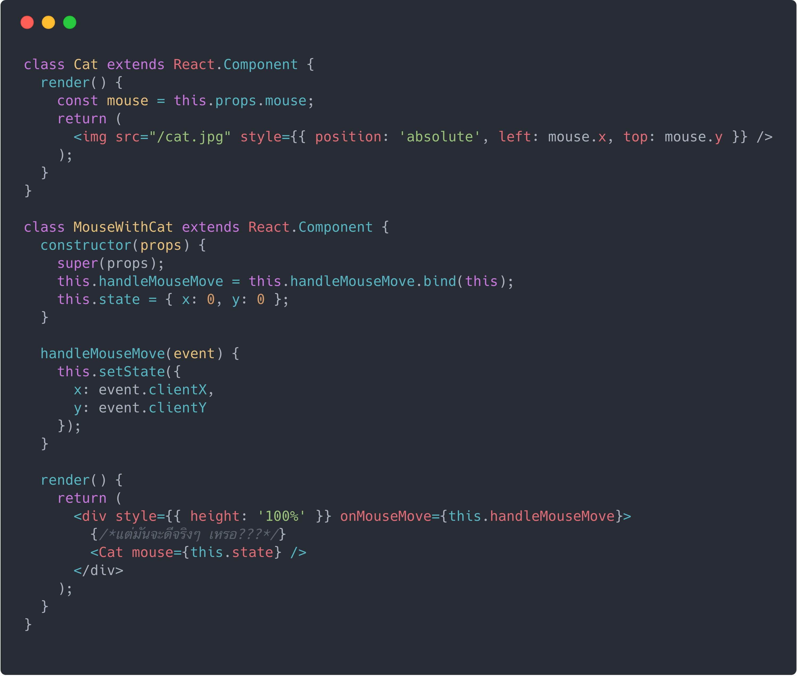

โอเค มันก็คงจะทำได้แหละ ถ้าหากมี component แค่ `MouseWithCat` แต่ถ้าอนาคตเราอยากวาดรูปเสือ เราต้องไปทำ component `MouseWithTiger` อีกอันงั้นเหรอ? ก็คงจะไม่ดีใช่มะ

ดังนั้น แทนที่เราจะ render สิ่งนั้นตรงๆ เราทำให้การ render dynamic มากขึ้น โดยขึ้นอยู่กับ **props** ที่ส่งมา นั่นทำให้เราเรียก pattern นี้ว่า **render props** ยังไงล่ะ

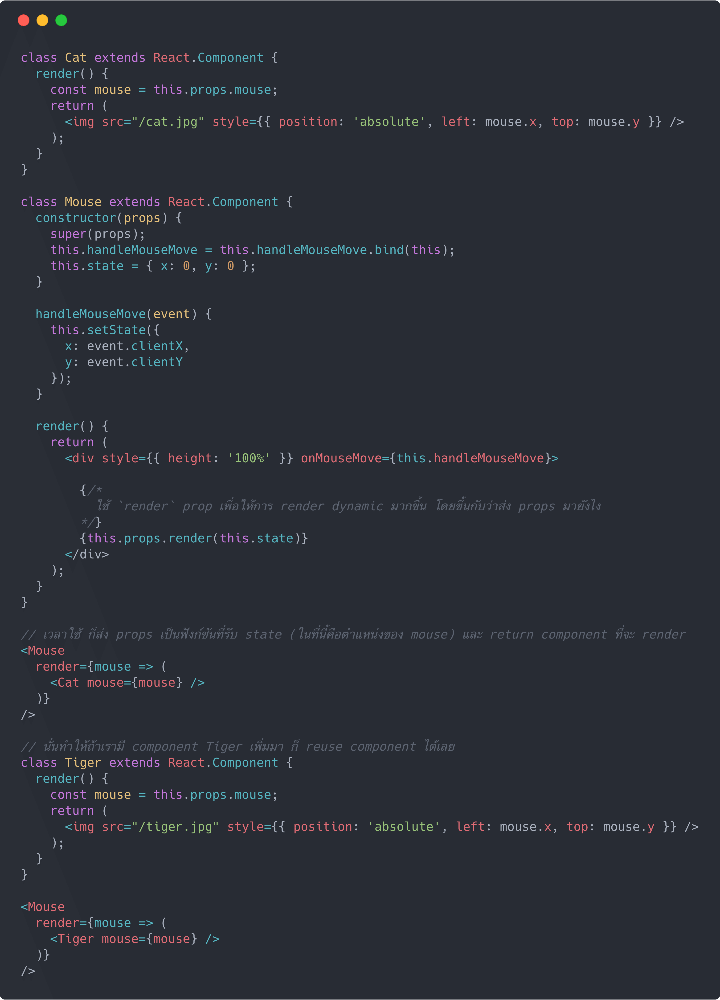

ดังนั้น ต่อให้มี component ที่ต้องทำอะไรแบบนี้อยู่สิบอัน เราก็มาใช้ `Mouse` อันเดียวเพื่อจัดการเรื่องตำแหน่งของเมาส์ได้ ส่วนจะ render แบบไหน ขึ้นกับ use-case

## Render Props แบบขี้เกียจ ก็ใช้ children ซะเลย

จริงๆ ใน React มันจะมี props ชื่อว่า `children` สำหรับอ้างอิงถึง child ของตัว component อยู่แล้ว ดังนั้นเมื่อผนวกกับ pattern นี้ จริงๆ เราสามารถทำสิ่งนี้แทนได้

เอามันไปอยู่ใต้ component เลย ด้วยพลังแห่ง JSX!

## แต่ใดๆ ในโลกมากไปก็ไม่ดี

ถ้าจุดบอดของ HoC คือการ wrap หลายๆ ชั้นแล้ว props งอกมาจากไหนก็ไม่รู้ render props จะเจอป้ญหาเรื่องของ `render props hell` ซึ่งล้อเลียนมาจาก callback hell

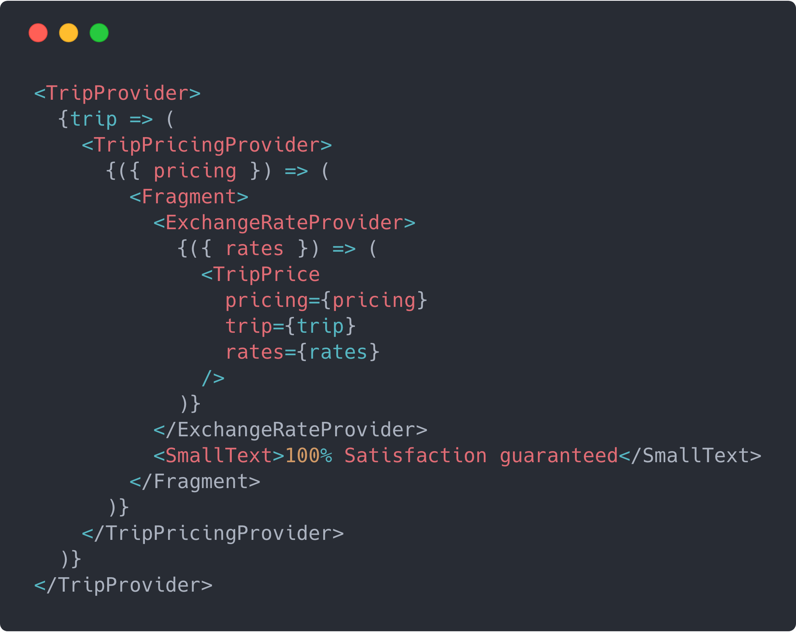

เช่น มี use-case นึงที่เคยเจอคือ ในการแสดงผลราคา product ต้องดึงข้อมูลของ Trip ผ่าน `TripProvider` ข้อมูลราคาผ่าน `TripPricingProvider` และดึงอัตราแลกเปลี่ยนจาก `ExchangeRateProvider` อีก เพราะต้องมีการเลือกหน่วยเงิน ซึ่งทั้ง 3 component นั้นใช้ render props pattern ที่ต่างคนต่างส่งข้อมูลออกมาให้ผ่าน children

ผลคือถ้าอยากใช้ทั้งสาม ถ้าเราไม่ทำ DataProvider ตัวใหม่ไปเลย เราก็ต้องซ้อน 3 ชั้นแบบนี้

ซึ่งแน่นอนว่าแค่นี้ก็ hell แล้ว กลายเป็นกว่าจะรู้ว่าสุดท้าย render อะไร หาไปเหอะ hell สุดมาก

## Hooks จึงเกิดมา เพื่อพยายามแก้ไขสิ่งเหล่านี้!

Hooks นั้น intro มาเพื่อบอกกล่าวทุกคนว่า ในอนาคตหลังจากนี้ หาก component ไหนอยากใช้ state หรือฟีเจอร์บางอันของ React เช่น lifecycle ไม่ต้องไปใช้ class component อีกต่อไป คุณสามารถใช้ functional component ได้ และใช้เครื่องมือต่างๆ ที่เรียกว่า **hooks** เพื่อให้ component นั้นมีพลังความสามารถตามที่มีอยู่ ([Dan Abramov](https://github.com/gaearon) ผู้สร้าง Redux บอกว่า hook เสมือนกับว่าให้ functional component สามารถ hook เอาฟีเจอร์ต่างๆ ของ React มาใช้งานได้)

เช่น hook พื้นฐานสุดคือ `useState` ที่จะช่วยให้ functional component มี state ได้แล้วโดยไม่ต้องทำเป็น class component!!!!!!

หากใครเคยใช้ [recompose](https://github.com/acdlite/recompose) จะคุ้นชินกับสิ่งนี้ดี เพราะมันคล้ายๆ กัน แต่ไม่ใช่ HoC อีก มันมาอยู่ในรูปของการเรียกฟังก์ชันธรรมดาๆ เลย โดยไอเดียคือ หากอยากใช้ state ใน functional component ให้

- ใช้ฟังก์ชัน `useState` ในตัว component โดยฟังก์ชันจะ return array สองช่อง โดยที่
- array ช่องแรกเป็นค่าของ state ในปัจจุบัน
- array ช่องที่สองเป็นฟังก์ชันใช้เซ็ตค่า state นั้นๆ

เราสามารถใช้ hooks เดียวกันหลายๆ รอบได้ และต่างคนก็ต่าง contain state ของมันเอง!

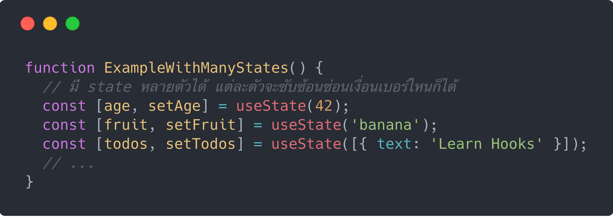

นอกจาก `useState` แล้วยังมีอีกตัวนึงคือ `useEffect` แน่นอนว่าหลายๆ ครั้งเรามักจะต้องมีการทำ data fetching หรือ subscribe data ซึ่งเดิมๆ เราจะไปทำใน `componentDidMount` แต่ด้วย `useEffect` เราสามารถใช้แทน lifecycle เดิมๆ สามตัวคือ `componentDidMount` / `componentDidUpdate` และ `componentWillUnmount` จบในตัวได้เลย!

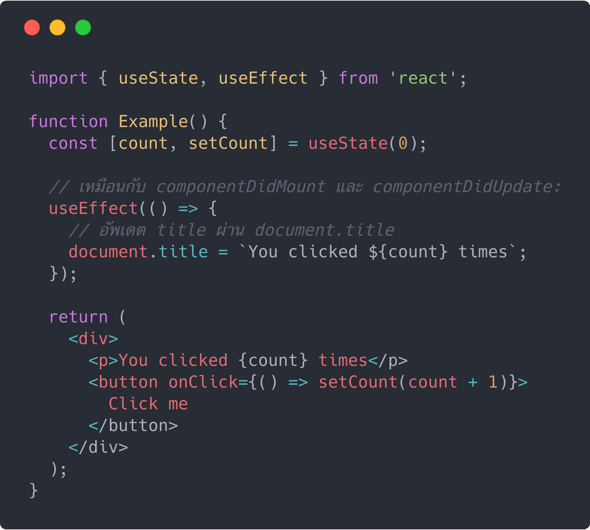

`useEffect` จะรับฟังก์ชันที่จะถูกนำไปรัน ในจังหวะที่เหมือนกับ `componentDidMount` และ `componentDidUpdate` พูดง่ายๆ คือ หากสมมติค่าของ state มีการเปลี่ยน ก็จะรันฟังก์ชันใน `useEffect` อีกครั้ง อย่างในตัวอย่างคือ เมื่อค่าของ count มีการอัพเดต ก็จะมีการเรียกฟังก์ชันใน `useEffect` อีกครั้ง เพราะการที่ state เปลี่ยน ใน class component ก็จะมีการเรียก `componentDidUpdate` อีกครั้ง

แล้วความเจ๋งคือ ใน `useEffect` หากฟังก์ชันที่ใส่ลงไป return ฟังก์ชันอะไรออกมาสักอัน ฟังก์ชันนั้นจะโดนเอาไปรันเสมือนจังหวะ `componentWillUnmount` เช่น ถ้าเรา subscribe data ไว้ เราก็สามารถ unsubscribe ได้โดยท่าประมาณนี้

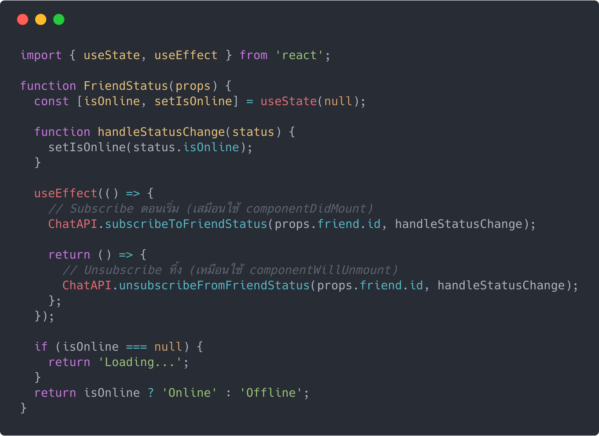

(เราเรียกท่าการ return ในฟังก์ชัน useEffect ว่าการ cleanup effect เสมือนเคลียร์ทิ้งก่อนลาจาก)

## ความเทพคือ เราสามารถสร้าง hook ใหม่จาก hook อื่นๆ ได้

ถูกครับ เราสามารถสร้าง hook ใหม่เองได้ เช่น จากตัวอย่างล่าสุด หากผมจะทำ hook จะคอยจัดการเรื่อง state ว่า friend คนนี้ยัง online อยู่ไหม ผมสามารถสร้าง hook ชื่อว่า `useFriendStatus` ขึ้นมาได้

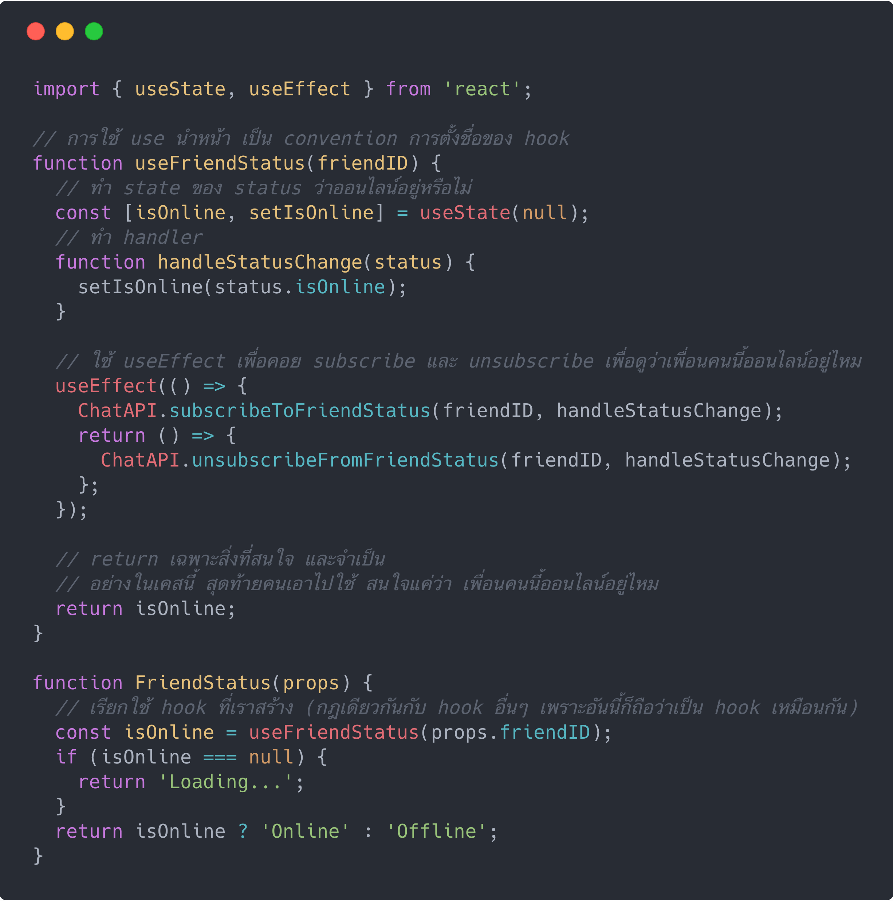

ถ้าเราสังเกตดีๆ เราจะเห็นได้ว่า เราสามารถแยก logic ขาดออกมาจาก component ได้พอสมควร โดยที่ทุกอย่างก็ยังดูมีที่มาที่ไป เช่น การใช้ `useState` เราจะเห็นค่า state ออกมาให้เห็นตรงๆ ออกจากฟังก์ชันเลย ต่างจาก recompose ที่ `withState` นั้นถูกส่งออกมาใช้เป็น props

## ข่าวดีอีกอันคือ hooks จะไม่ก่อให้เกิด Breaking changes ใดๆ

hooks นั้นเป็นฟีเจอร์ใหม่เอี่ยมที่ถูกเพิ่มมา นั่นทำให้ไม่มี breaking change คุณไม่ต้องไปนั่งแก้โค้ดเก่าๆ เลยแม้แต่นิดเดียว class component ยังใช้ได้ยังไง ก็ยังคงใช้ได้ต่อไป และไม่มีแผนจะเอาออกจาก React ด้วย (เอาออกทีบันเทิงสิพี่)

## กฎของการใช้ hooks

ถ้าสังเกตดูดีๆ จริงๆ แล้ว hooks เป็นฟังก์ชันที่มีความ magic ระดับนึง ซึ่งมีกฎอยู่แค่สองข้อเท่านั้นที่ต้องทำตามหากต้องการใช้ hooks คือ

1. **ใช้ hook เฉพาะใน React functions เท่านั้น**: เช่น ใน functional components กับถ้าจะสร้าง custom hook เอง **ห้ามเรียกใช้ hooks ใน JavaScript function ปกติ**
2. **เรียก hook ที่ top-level เท่านั้น**: **ห้ามเรียก hook ใน loop หรือมี condition ครอบ** เพราะด้วยตัวการ implementation ของ hook เอง ทำให้ต้องมีการเรียงลำดับการเรียงเหมือนเดิมตลอด ([มีเหตุผลที่คอยอธิบายว่าทำไมลำดับการเรียกถึงมีผลกับการใช้ hook](https://reactjs.org/docs/hooks-rules.html#explanation))

## ลองเอาตัวอย่าง HoC กับ Render Props มาแปลงเป็น hooks ดูสิ

HoC

HoC version hook

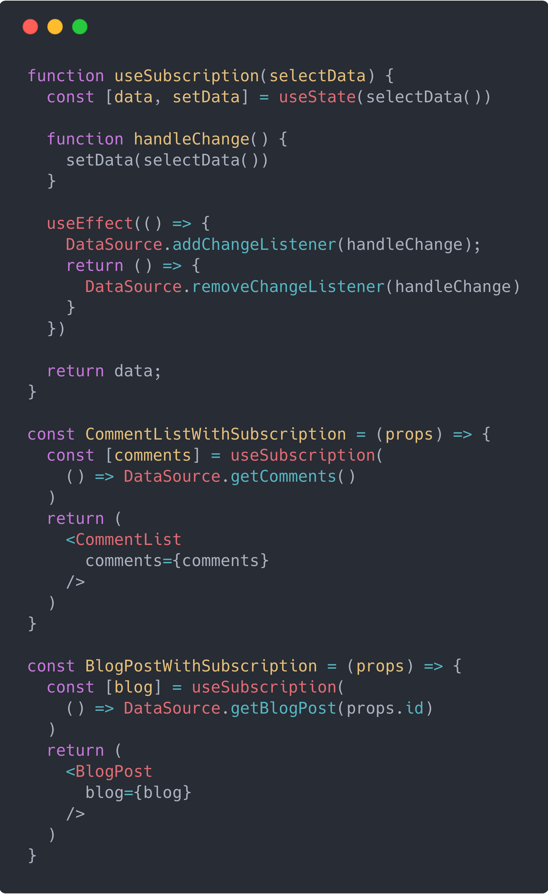

Render Props

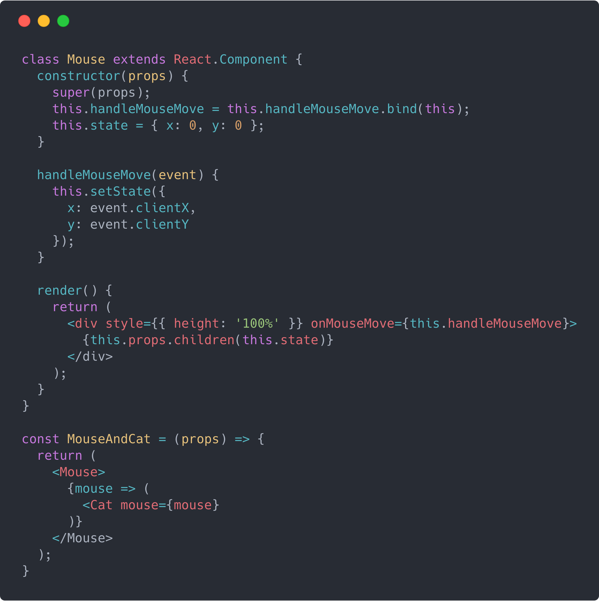

Render Props version hook

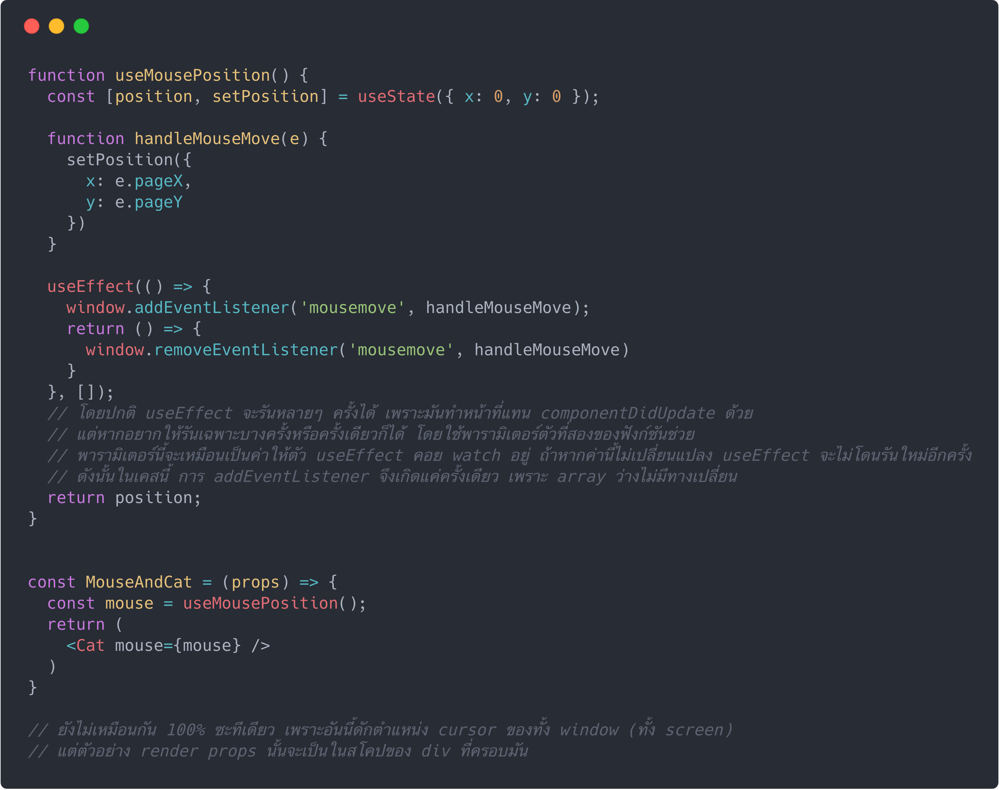

## hook ที่ built-in ติดมามีเยอะกว่านี้

บางตัวก็น่าสนใจมากๆ เช่น `useContext` ที่จะให้การใช้ Context API ของ React ใช้งานง่ายขึ้น หรีอใครชอบ pattern การเปลี่ยน state แบบ Redux reducer ก็มี `useReducer` ให้ใช้

ตัวอย่างด้านบนเป็น `useReducer` เหมือนเขียน Redux reducer เลยจ้า

## จะมาเมื่อไหร่?

ตามโร้ดแมพของทีม React นั้นก็จะมาใน Q1 ของปีนี้ครับ! เตรียมตัวเตรียมใจกันได้เลย แต่ผมค่อนข้างมั่นใจโดยส่วนตัวว่า สิ่งนี้จะมาแก้ปัญหาหลายๆ อย่างที่เราปวดหัวในวันนี้ได้เยอะแน่ๆ เท่าที่ดูทรงแล้วเป็นแนวคิดที่เข้าท่าอยู่พอสมควรเลยแหละ

## ข่าวดีคือ

หากคุณอยากลองใช้ hooks ณ ตอนนี้ ในเวอร์ชั่น alpha ของ React 16.7 มีให้ใช้แล้ว **แต่มาร์กตัวโตๆ ว่า ยัง alpha นะ ฉะนั้นการเอาขึ้น production จึงต้องระมัดระวังกันไว้นะจ๊ะ** พังไปไม่มีใครรับผิดชอบเด้อ
