ช่วงหลังๆ ผมเองอินเรื่อง Web Performance เยอะมาก พอมีงานไหนที่เขาเปิดให้ไปพูด ก็เลยเอาเรื่องนี้ไปพูด และพบว่า

- สไลด์ไม่อาจแทนเนื้อหาและคำพูดได้ ในสไลด์แต่ละอันที่ผมทำ พอเรามาลงละเอียดลึกๆ ในแต่ละหน้าพบว่ามันมีเรื่องให้พูดอีกเยอะแยะเลย
- มีคนตื่นตัวและสนใจเรื่อง Web Performance เยอะ แต่ไม่รู้ว่าจะทำยังไง ทั้งๆ ที่จริงๆ แล้วบางอย่างง่ายจนเกินคาดเลยแหละ

เลยว่า นอกจากจะไปตระเวนพูด ขอเข็นบล็อกออกมาออกมาเป็นซี่รี่ส์เลยละกัน โดยจะอยู่ในซี่รี่ส์ **Web Performance Series** ครับ จะมีกี่ตอนก็ไม่รู้เหมือนกัน และพยายามจะให้แต่ละตอนค่อนข้างอิสระและไม่ต่อเนื่องกันเป็นตอนๆ พูดง่ายๆ คืออยากอ่านเรื่องไหน จิ้มอ่านได้เลยตามที่สนใจ

และขอประเดิมตอนแรกด้วยเรื่องที่คิดว่า น่าจะเข้าใจง่ายสุด เห็นภาพสุด (literally ภาพ) และเอาไป adopt ใช้ได้ง่ายสุดเหมือนกัน

นั่นคือเรื่อง **รูปภาพ** ที่ใช้ในเว็บไซต์นั่นเอง

## รู้หมือไร่: รูปเป็นสิ่งที่ใช้ปริมาณเน็ตมหาศาล

HTTP Archive บอกว่า เวลาเข้าเว็บมา 1 หน้า กว่า 60% ของ data นั้นล้วนมาจากรูปภาพทั้งสิ้น! ซึ่งโดยเฉลี่ยแล้วเว็บไซต์มีขนาดรวมที่ 3.0 MB แสดงว่า user โดนดูด 4G ไปประมาณ 1.7 MB เพียงแค่โหลดรูปภาพ ซึ่งในประเทศบางประเทศนั้น ค่าบริการของ 4G แพง และความเร็วก็ไม่ได้ดีเท่าประเทศไทยด้วยซ้ำ

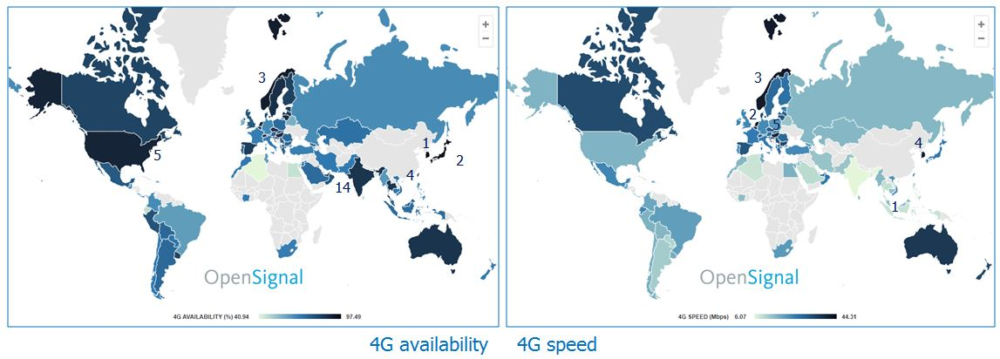

ถ้าดูจากรูปด้านบน เราจะพบเลยว่า บางประเทศที่คิดว่าเน็ตเขาน่าจะแรงกว่าเรา กลายเป็นว่าช้ากว่าบ้านเราเฉย แถมก็ไม่ใช่ว่ามีเน็ต 4G ให้ใช้ทั่วถึงอีกต่างหาก
ดังนั้นการที่เว็บมีการโหลดรูปหนักมากๆ จึงเป็นเรื่องที่ไม่ดีนัก เพราะมีการ [survey](https://calendar.perfplanet.com/2014/images-are-king-an-image-optimization-checklist-for-everyone-in-your-organization/) มาแล้ว ว่ารูปภาพเองก็เป็นปัจจัยสำคัญที่ทำให้คนรู้สึก "เซ็งเป็ด" ขึ้นมาได้ โดยผมขอยกผลการ survey บางส่วนมาให้อ่านกัน


รูปด้านบนคือผล survey ของคำถามที่ว่า **"รู้สึกเซ็งเป็ดไหมเมื่อรูปใช้เวลาโหลดนานมาก"** คำตอบที่ได้คือคนตอบว่า "ใช่ กูเซ็งเป็ดมาก" ถึง 65% เลย

และที่น่าสนใจในอีกประเด็นคือ มีคนจำนวน 25.5% บอกว่า "ถ้ารู้สึกมันโหลดช้ามากๆ ตูก็จะเซ็งเป็ดมาก" พูดง่ายๆ คือถ้าเว็บมันเร็ว เขาก็จะไม่รู้สึกอะไรนั่นเอง

แต่ใน segment ของ 25.5% แม้เราอาจจะมองว่าเป็น segment เดียวกันกับคนที่บอกว่า "ไม่" แต่ขอให้ลองเอาอีก pie chart มาประกอบกัน

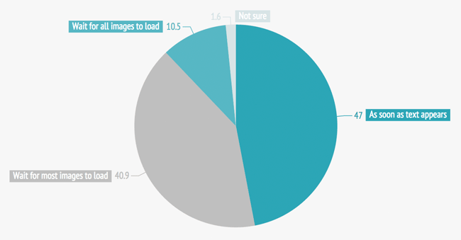

Chart นี้เป็นผลจากการถามว่า "เมื่อไหร่คุณจะเริ่มใช้งานเว็บไซต์" กว่า 47% บอกว่า "เมื่อมีข้อความขึ้น ก็เริ่มใช้เลย"

ซึ่งลองนึกภาพว่าโดยปกติสิ่งที่ขึ้นออกมาให้ user เห็นก่อนในหน้าเว็บเลย มันก็คือตัวข้อความนี่แหละ ดังนั้นการวัดว่าเร็วช้าจะตัดสินใจในเวลานั้น ถ้ารูปโหลดทันพอๆ กับข้อความ เขาก็จะไม่เซ็งเป็ด แต่ถ้ารูปหนักเท่าเทืิอกเขาหิมาลัย เขาก็จะรู้สึกว่า "เว็บมันช้าๆ ว่ะ ว่าไหม"

นั่นทำให้จริงๆ แล้ว segment 25.5% ใน chart แรกจึงสามารถถูก**เขย่ง**ไปอยู่ในกลุ่ม 65% ได้ทันที รวมกันก็ล่อไป 90% เลยครับ

> ฉะนั้น การทำให้รูปมีขนาดเล็กลง จึงเป็นสิ่งที่สำคัญ

## งั้นเราจะ optimize รูปภาพยังไงล่ะ

ทำตามนี้ไง

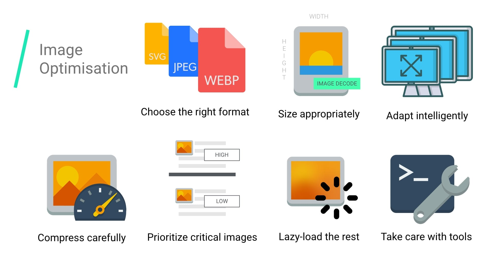

แต่แน่นอน ผมจะไม่ใจร้ายทิ้งให้คุณผู้อ่านยืนงงในดงเว็บเชื่องช้าให้งงๆ หรอกครับ ก็จะมาเล่าให้ฟังจากอันนี้นี่แหละ ว่าแต่ละอันมันคืออะไรกันแน่ และมีผลขนาดนั้นเลย

## ใช้คนให้ถูกงาน

เป็นสุภาษิตสุดคลาสสิคที่มักจะได้ยิน คือการ**ใช้คนให้ถูกงาน** ในการใช้รูปบนเว็บไซต์เอง คำนี้ก็ยังคงใช้ได้เหมือนกัน แต่คนในที่นี่ผมหมายถึง **ประเภทของไฟล์ภาพ เช่น JPEG, PNG, GIF, WebP** ยังไงล่ะ

ก่อนอื่นคือเราต้องเข้าใจก่อนว่า ไอ้รูปแต่ละฟอร์แมทเนี่ยมันแตกต่างกันตรงไหนวะ จริงๆ แล้วในโลกของรูปภาพในคอมพิวเตอร์นั้นสามารถ represent ได้สองแบบครับ

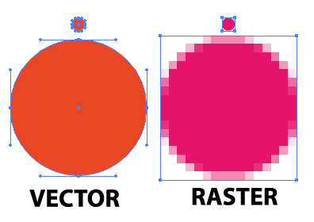

- **Raster (JPEG/PNG/WebP):** ภาพหนึ่งภาพจะถูก represent โดยใช้ค่าสีในแต่ละ pixel ครับ พูดง่ายๆ คือตีรูป 1 รูปแบ่งเป็น grid 2 มิติ แต่ละช่องคึอ 1 pixel แล้วก็บอกว่าค่าสีนั้นคือสีอะไร รูปประเภทนี้ความละเอียดจะถูก fix ไว้เลย ถ้าเกิดมาเป็น 400x300 มันก็จะเป็นยังงั้นอยู่นั่นแหละ ต่อให้โดนเอาไปแสดงผลเป็น 800x600 ที่ใหญ่ขึ้น 2 เท่า แต่สุดท้ายความละเอียดก็ยังเป็นที่ 400x300 อยู่ดี ถ้าเราพยายามขยายขนาดมัน แน่นอนว่าขนาดของไฟล์ก็ต้องใหญ่ขึ้น

- **Vector (SVG):** ภาพตระกูลนี้จะใช้เพียงแค่จุดกับเส้น ในการ represent รูปล้วนๆ (เลยเรียก vector ซึ่งเป็นสิ่งเดียวกับในคณิตศาสตร์นั่นแหละ) โดยปกติแล้วรูปทรงทางเรขาคณิตปกติ หรือว่าโลโก้นั้นมักจะใช้ vector กัน เพราะโดยตัวรูปทรงเรขาคณิตมันสามารถใช้ vector ในการ represent อยู่แล้ว และข้อดีของ format นี้คือ ความละเอียดของภาพนั้นสามารถขยายได้ไม่อั้น ต่อให้ดั้งเดิมจะละเอียดแค่ 400x300 แต่ถ้าโดนยืดเป็น 800x600 ก็ยังชัดใสกิ๊งได้เหมือนเดิม และขนาดของไฟล์ยังคงเท่าเดิม

ซึ่งฟังๆ แล้ว แม้ว่าภาพ vector ก็ดูดีกว่าเยอะ แต่ vector ก็ไม่อาจตอบได้ทุกโจทย์ จะเอาภาพ vector มาแทนภาพแสงเหนือออโรร่าสุดสวยมันก็คงยังไงๆ อยู่ สุดท้ายเว็บเราจึงมีประมาณการใช้งานไฟล์ประเภท Raster เยอะกว่าอยู่ดี

แต่ แต่ แต่! หากเว็บคุณมีการออกแบบโดยอิงตามเส้น หรือทรงทางเรขาคณิตเยอะกว่า การใช้ vector ก็จึงดีกว่าแน่ๆ

> พูดง่ายๆ คือ ถ้ามันเป็น vector ได้ จงใช้ vector ถ้าไม่ได้ ก็อย่าฝืน

## มาพูดถึง JPEG กัน

อยากให้ดูรูปนี้กันครับ


คำถามคือ **คิดว่าแต่ละรูปต่างกันขนาดไหน**

ถ้ามองผ่านๆ เราแทบแยกความต่างของ 100 กับ 75 ไม่ออก เผลอๆ จะแยกกับ 50 ไม่ออกด้วย ถ้าไม่ดูละเอียดจริงๆ

แต่ขนาดของรูปมันช่างต่างกันเยี่ยงนัก **เพียงดรอป quality จาก 100 เป็น 75 ขนาดของรูปหายไปเกืิอบ 5 เท่า!**

ดังนั้นสิ่งที่อยากให้คิดกันต่อคือ **จริงๆ แล้ว user เรารับได้กับความละเอียดภาพขนาดไหน**

- **หากความละเอียดสำคัญมากๆ** เช่น ทำเว็บเก็บภาพแบบ stockphoto ดังนั้นความละเอียดของภาพจึงสำคัญกว่าการใช้งานอินเตอร์เน็ต ดังนั้นควรเน้น**เลือก quality สูงๆ ไว้ เอา 100 ไปเลย**
- แต่ถ้าจริงๆ แล้ว**เว็บเราไม่ต้องการภาพชัดคมกริบขนาดนั้น** แต่ก็ขอให้ความละเอียดไม่แย่ **การยอมลดทอนความละเอียดนิดๆ หน่อยๆ บ้างก็ทำให้ขนาดของรูปลดลงไปเยอะก็คุ้มค่า** เช่นรูปตัวอย่างการเลือกใช้ quality 75 อาจจะไม่เลว เผลอๆ ยอมดรอปไป 50 ด้วยซ้ำ
- **หรือเราไม่สนใจความชัดเลยก็ได้ เราสนว่าต้องเน้นเร็ว** ใช้อินเตอร์เน็ตเบาๆ **ก็อาจจะกดสุดไปที่ 10 ก็ได้** แต่เคสนี้ต้องอย่าลืมว่า **รูปรถเต่า มันก็ยังต้องเป็นรูปรถเต่า ถ้าลดความละเอียดจนมองรูปไม่รู้เรื่องก็อย่าเลย**

### Baseline VS Progressive JPEG

ผมเชื่อว่าทุกคนเคยเจอการโหลดรูป JPEG ในสภาพนี้


แบบนี้เราเรียกมันว่า **Baseline JPEG** ซึ่งรูปจะถูกโหลดทีละนิด ไล่จากบนลงล่าง ถ้ารูปยิ่งใหญ่ มันก็จะค้างในสภาพด้านซ้ายนานมาก (บางคนเอาไปเล่นเป็น meme ก็มี ลองดูอันล่าง)

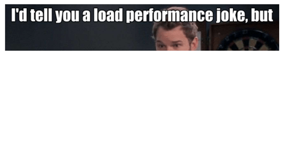

ในขณะเดียวกัน JPEG ก็มีอีกแบบที่เรียกว่า **Progressive JPEG** ชื่อมัน progressive เพราะว่ารูปจะไม่ได้โดนโหลดทีละนิด แต่จะเป็นการโหลดจาก **ไม่ชัด เป็นชัด**


ข้อดีของ Progressive คือ มันทำให้ user "พอเห็น" รูปบ้าง ในสภาพที่อินเตอร์เน็ตไม่ค่อยดีนัก ถึงแม้รูปที่เห็นมันจะไม่ชัดเจนเลย แต่ก็พอจะรู้ว่ามันคือรูปอะไรกันแน่

[Facebook](https://code.fb.com/ios/faster-photos-in-facebook-for-ios/) เองก็ประสบความสำเร็จในการ move รูปที่แสดงผลบนแอพ iOS จาก JPEG ปกติ มาใช้ Progressive JPEG โดยเคลมว่าลดปริมาณการใช้ data ไปได้ 10% แต่ประเด็นสำคัญคือ Facebook สามารถลดเวลาการรอรูปแสดงผลได้ดีขึ้น 15% เลยทีเดียว

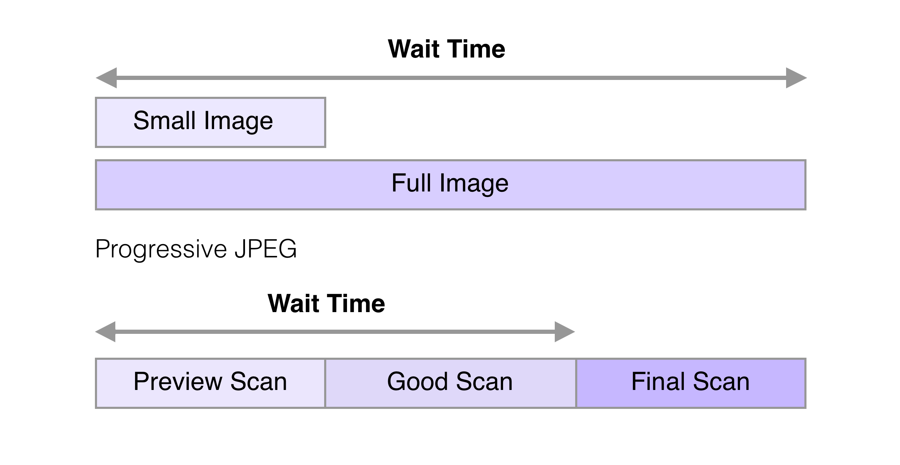

เพราะพอมาใช้ Progressive JPEG user ไม่จำเป็นต้องรอรูปจนโหลดครบชัดกิ๊ง แต่โหลดรูปจนถึงจังหวะที่ "ชัดดีแล้ว" ก็พอใจ แล้วก็ไถไปเล่นอย่างอื่นต่อแทน อย่างรูปด้านบน ที่ส่วนล่างนั้นตัว Progressive JPEG จะมีการแบ่งช่วงภาพชัดไม่ชัดเป็น 3 ช่วง Preview / Good / Final ซึ่งจริงๆ แล้ว user ส่วนมากพอเห็นที่ Good Scan ก็พอใจแล้ว ทำให้สามารถลดเวลาการรอรูปแสดงผลได้ ต่างจากแบบปกติ ที่เริ่มจากไม่มีรูป เป็นมีรูปขึ้นมา

ถ้าไม่เชื่อว่าแค่ Good scan ก็พอแล้ว ลองดูรูปนี้ครับ


### Progressive "ไม่ได้ดีกว่าเสมอไป"

- **อาจช้ากว่าถึง 3 เท่าได้ในมือถือเก่าๆ**: Progressive JPEG จะใช้เวลาในการ decode รูปเพื่อมาแสดงผลช้ากว่าแบบ baseline ได้ถึง 3 เท่าเลยทีเดียวบนมือถือเก่าๆ บางรุ่น และยิ่งถ้ามีรูปเยอะๆ แล้ว ทำให้ CPU อาจจะแทบไม่ได้พักผ่อนเลยทีเดียว
- **ไม่เล็กกว่าเสมอไป**: รูปขนาดเล็ก เช่น Thumbnail ต่างๆ นาๆ การทำ Progressive JPEG ก็ไม่เป็นประโยชน์เบอร์นั้น แต่ดันได้ขนาดรูปใหญ่กว่า baseline เฉยเลย

ดังนั้นข้อแนะนำคือ ให้ลองดูว่า ใน scenario นั้น baseline หรือ progressive ใครดีกว่า เพราะสุดท้ายมันก็คือการ trade-off

### ImageOptim: ช่วยลดขนาดรูปได้แบบโคตรง่าย

ข่าวดีคือ การ optimize รูปประเภท JPEG นั้นสามารถทำได้ง่ายมาก สำหรับคนใช้ Mac มีโปรแกรมชื่อ [ImageOptim](https://imageoptim.com/mac) สามารถโหลดมาติดตั้งใช้ได้เลย

วิธีใช้ก็ง่ายมาก เพียงแค่ลากรูปที่จะ optimize เข้าไป แล้วก็รอๆๆๆๆ มันก็จะ optimize ขนาดรูปให้เอง!

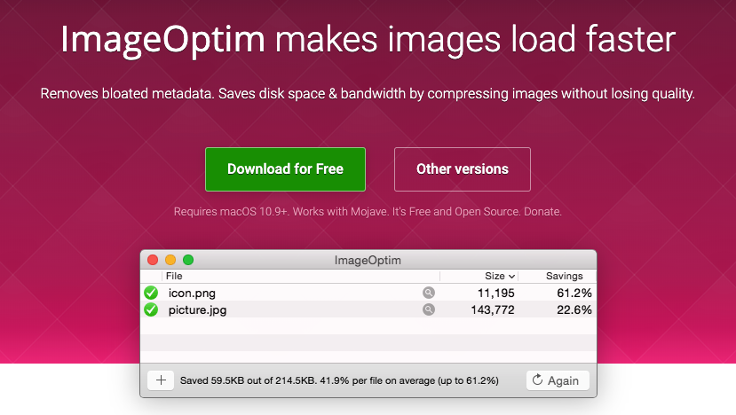

## WebP: มาตรฐานใหม่ที่น่าสนใจสำหรับรูปบนเว็บ

WebP เป็น format ใหม่ของรูปภาพที่ใช้บนเว็บพัฒนาโดย Google โดย Google เล็งว่าฟอร์แมทนี้นั้น

- มีขนาดไฟล์เล็กลงกว่าประเภทอื่นๆ แต่ไม่ลดคุณภาพของตัวรูปลง
- Support animation เหมือน GIF และรูปที่มี transparent แบบ PNG
- Support ทั้ง lossy (ยอมเสียคุณภาพรูปนิดหน่อย) กับ lossless (เน้นคุณภาพเหมือนเดิม)

ความเจ๋งของ WebP คือ โดยเฉลี่ยแล้วขนาดของรูปภาพจะลดลงจากฟอร์แมทอย่าง JPEG/PNG แบบเดิม**ลงไปได้ถึง 25-34%** เลยทีเดียว!

ผมก็เลยทดลองมาใช้งาน WebP บน production ผลลัพธ์ถือว่าประทับใจมากๆ ผมสามารถลดขนาดรูปลงไปได้รวมๆ ถึง 50% เลยทีเดียว!

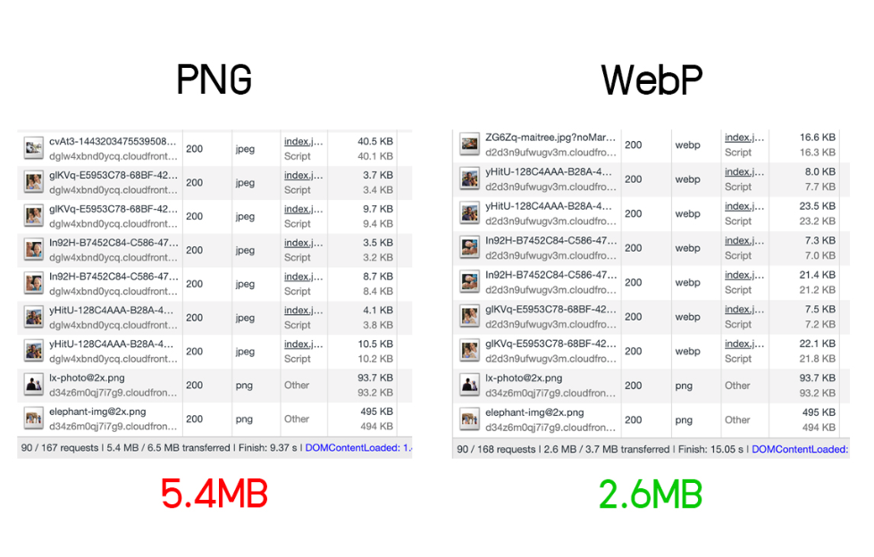

และเว็บดังๆ หลายๆ เจ้า โดยเฉพาะของ Google เอง ลดขนาดรูปไปได้ราวๆ 25-30% เช่นกัน


### แม้ WebP จะดีจริง แต่ช้าก่อน!

WebP **ยังไม่ support ในทุก browser**

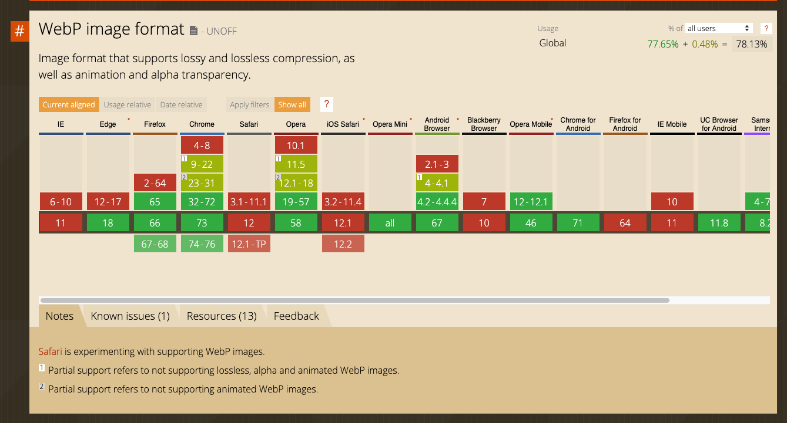

แล้วจะให้ทำยังไง???????? จริงๆ เราไม่ต้องรีรอให้ support 100% ถึงค่อยใช้ก็ได้ (รอนานขนาดนั้นเหงือกแห้งพอดี) จริงๆ พอมีวิธีจัดการเรื่องนี้อยู่ เช่น

- **ใช้แท็ก `<picture>`**: Browser จะตัดสินใจเองว่าจะเลือก format ไหนมาแสดงผล ถ้า browser รองรับ WebP ก็จะแสดงผล WebP ถ้าไม่รองรับก็จะ fallback ไปใช้แบบอื่น

```html
<picture>
  <source srcset="/path/to/image.webp" type="image/webp">
  
</picture>
```

- **ดัก Accept ที่ HTTP header (ทำที่ server-side)**: browser เวลาจะ request รูป จะแนบ `Accept` header มาให้ด้วย ซึ่งถ้าตัว browser รองรับ ก็จะมีการส่ง `Accept: image/webp` แนบมา เราสามารถดูจากสิ่งนี้ได้ แล้วเลือกที่จะส่ง format ที่รองรับไป เคสนี้จะเหมาะกับการที่เราทำ image server เองเพื่อทำอะไรบางอย่าง (เช่นของ TakeMeTour มี image server ที่คอย crop รูปแบบ on-the-fly อยู่่แล้ว เลยมาใช้วิธีนี้)

- **ใช้ CDN**: [Cloudinary](https://cloudinary.com/) สามารถทำตัวเป็นทั้ง CDN และคอยแปลงรูปตาม browser ทืี่ request เข้ามาได้เลย วิธีนี้ง่ายสุด ใช้ตังสู้ 5555

- **Wordpress มี [Plugin](https://jetpack.com/support/site-accelerator/)**: หมูตู้สุดๆ ไปเลย

## ใครใช้ GIF อยู่ โปรดหยุดดดดดดดดดดด

GIF เป็นฟอร์แมทที่อยู่กับชาวเว็บมานานแสนนาน มันเทพเหลือเกิน เราก็แค่หยิบมันมาใช้ เราก็จะมีวิดิโอจิ๋วไว้เล่นได้ทันที แถม support ทุก browser แม้กระทั่ง IE ก็ยังใช้ได้

แต่อนิจจา นี่มันปี 2019 แล้ว! GIF เป็นฟอร์แมทที่บาปมหาศาลมาก เพราะขนาดของ GIF นั้นใหญ่ชิบหาย

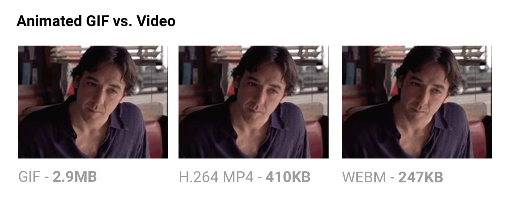

GIF มีขนาดใหญ่ เพราะจริงๆ แล้วลักษณะการเก็บไฟล์ GIF เป็นการเก็บรูปเป็น frame ไปเลย แต่ถ้าเป็นวิดิโอ MP4 สมัยนี้ วิธีการ encoding ชาญฉลาดขึ้นมาก ทำให้ไฟล์วิดิโอจึงเล็กลงๆ มากๆ

แม้กระทั่ง [GIPHY] เองก็ยังไม่ใช้ GIF เลยครับ!


หรือ [Twitter](https://mashable.com/2014/06/20/twitter-gifs-mp4) เองที่เราเห็นว่ามันเป็น GIF แต่จริงๆ ก็ไม่ใช่ GIF

## SVG เองก็ไม่ใช่แค่หยิบมาใช้ก็พอนะ

SVG เองก็มีประเด็นที่น่าสนใจเมื่อต้อง optimize ซึ่งหลายคนมักมองข้ามไป เพราะ **SVG มีสิ่งแอบแฝงที่ไม่มีประโยชน์ตอนเอาไปใช้งานจริงเยอะ** และเราสามารถ optimize มันได้ เช่น

- **Layer ที่มองไม่เห็น**: เวลาแสดงผลเราไม่เห็น แต่จริงๆ ในตัว SVG จะยังคงมีข้อมูลพวกนั้นอยู่
- **Metadata**: ตัว metadata มีประโยชน์ก็จริง แต่เวลาเราเอาไปใช้งานมันในฐานะรูปภาพ ก็ไม่ค่อยมีประโยชน์​ สามารถถอดออกได้
- **SVG ก็คือ text แบบนึง**: ดังนั้นมันจึงสามารถโดน minify ได้ / compress ด้วย GZip ได้ เพื่อลดขนาดตัว SVG
- **ใช้ tag SVG พื้นฐาน มากกว่าใช้ path เยอะๆ**: เช่น `<circle>` `<rect>` `<ellipse>` `<line>` `<polygon>` การใช้ path จะต้องพึ่งพาพลังงานเยอะมาก แต่ tag พื้นฐานนั้นจะใช้พลังงานไม่เยอะเท่า จึงเร็วกว่า และก็ทำให้ตัว SVG ซับซ้อนน้อยลง ไฟล์ก็จะเล็กลง
- **ถ้าต้องใช้ path ให้พยายาม simplify มัน**: การที่ path ยิ่งเยอะและซับซ้อน จะทำให้เว็บใช้พลังในการ render SVG เยอะขึ้น (ทำให้เว็บช้าลงไปอีก) ตัว [Illustrator เองมี tool ไว้ช่วย simplify](http://jlwagner.net/talks/these-images/#/2/10) อยู่แล้ว

แต่ทั้งนี้ทั้งนั้น จะมานั่งทำเองน่าจะปวดหัวตาย โลกนี้มี tool ช่วยชื่อ [SVGOMG](https://jakearchibald.github.io/svgomg/) (ชื่อแม่งกวนทีนดี) tool นี้จะช่วย optimize SVG ได้ง่ายขึ้น มี UI ให้ใช้ง่ายๆ สวยๆ

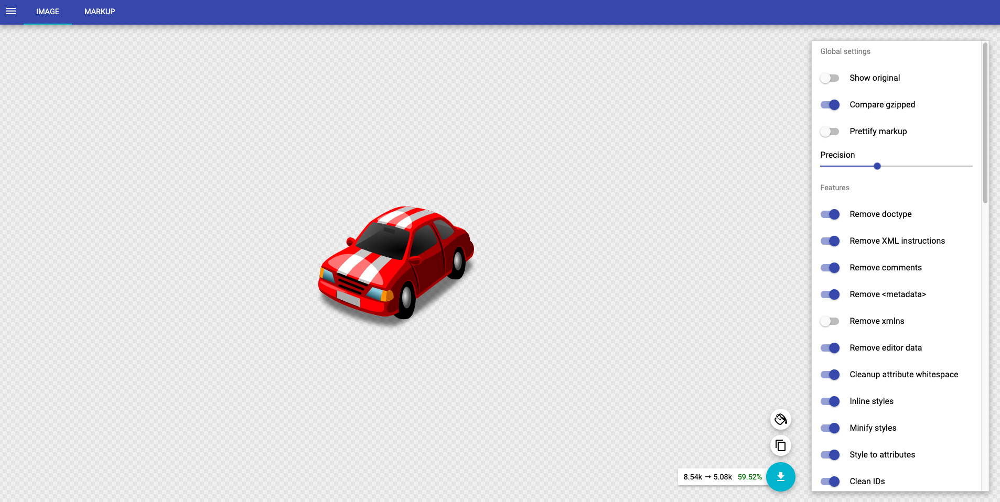

หรือถ้าเป็นสาย automate 100% มี [svgo](https://www.npmjs.com/package/svgo) เป็น cli ให้ใช้เหมือนกัน

ซึ่งถ้าเราเอา SVG เดิมมา optimize ด้วย tool ที่บอกไว้ แล้วเอาไป encoding ผ่าน GZip หรือ Brotli อีกที ก็จะลดขนาด SVG ไปได้มหาศาล


## โชว์ขนาดเท่าไหน โหลดขนาดเท่านั้นมา

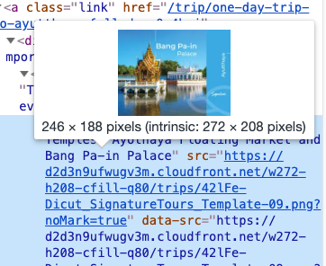

รูปที่เราโหลดมาใช้ในหลายๆ ครั้งมักจะมีขนาดไม่ตรงกับที่ใช้ และโดยส่วนมาก เรามักจะโหลดรูปขนาดใหญ่มาใช้ แต่พอจะโชว์จริงๆ ดันย่อซะงั้น ถ้าทำอย่างนั้นเยอะๆ กลายเป็นว่าเว็บเราจะเสียเวลาการ decode รูปภาพใหญ่ๆ โดยใช่เหตุ เพราะรูปยิ่งใหญ่ขึ้น ยิ่งเปลืองเวลา decode เยอะขึ้น

ซึ่งพอเอาประเด็นเรื่องการ decode รูปมาแล้ว จริงๆ การ decode รูปนั้นก็ใช้เวลาอยู่พอสมควร และเรื่องน่าตกใจคือ ประสิทธิภาพการ decode ในเครื่องบางเครื่องอาจช้ากว่าแบบมีนัยยะสำคัญเลยทีเดียว

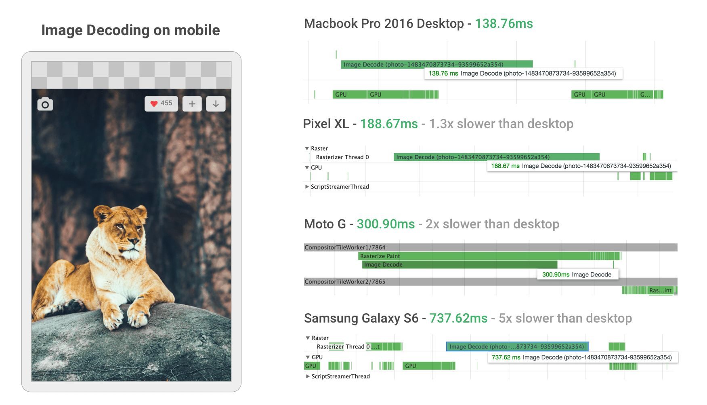

อย่างรูปด้านบน เขาบอกว่าสำหรับมือถือบางเครื่อง การ decode รูปรูปนึงอาจใช้เวลานานกว่าถึง 5 เท่าเทียบกับบน PC ได้เลย! และยิ่งรูปยิ่งใหญ่ การ decode ยิ่งใช้เวลานาน ดังนั้นการหยิบรูปให้มีขนาดพอเหมาะจึงเป็นสิ่งที่ควรทำ

ซึ่งใน HTML นั้นมี tag [`srcset` กับ `sizes`](https://developer.mozilla.org/en-US/docs/Learn/HTML/Multimedia_and_embedding/Responsive_images) ที่ช่วยให้เราเลือกโหลดรูปตามขนาดของหน้าจอที่ใช้ได้ ถ้าจอใหญ่ก็ใช้รูปใหญ่ ถ้าจอมือถือ ก็โหลดรูปเล็กๆ มาใช้

## Image Sprite: ท่ายาก รู้ไว้ก็ดี

ต้องทำความเข้าใจก่อนว่า ยิ่งมีการโหลดรูปหลายๆ ไฟล์​ cost ที่เพิ่มมาที่เรามักคาดไม่ถึง คือ cost ของการทำ HTTP Request ถ้าเราโหลด 10 รูป ก็จะมีการ request 10 รอบ ซึ่งเสียเวลาอย่างมาก เพราะการทำ HTTP Request 1 ขั้นมีกระบวนการเยอะมาก

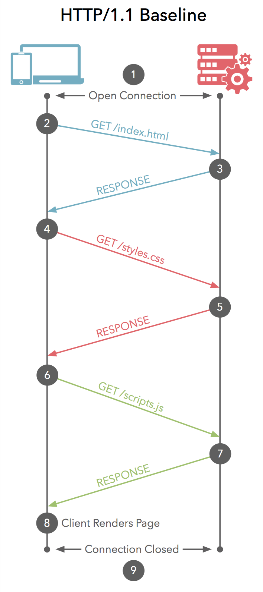

ดังนั้นในแต่ก่อน มีอีกกลยุทธ์ของการประหยัดเวลาตรงนี้ คือการทำ Image Sprites ที่จะทำให้่แทนที่เราจะโหลดรูป 10 รอบ เราก็มาโหลดรูปเพียงแค่รูปเดียว แล้วใช้ CSS `background-image` ในการตัดส่วนที่ต้องการใช้แทน

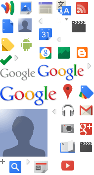

เวลาใช้ ก็จะเป็น CSS แบบนี้

```css
.sprite-sheet {
  background-image: url(sprite-sheet.png);
  width: 40px;
  height: 25px;
}

.google-logo {
  width: 125px;
  height: 45px;
  background-position: -190px -170px;
}

.gmail {
  background-position: -150px -210px;
}

.maps {
  height: 40px;
  background-position: -120px -165px;
}
```

เวลาใช้ก็ใช้ผ่าน class แทน

```html
<div class="google-logo">
```

แต่ที่ผมบอกว่ารู้ไว้ก็ดี เพราะทุกวันนี้เรามี HTTP/2 แล้ว ซึ่งมันแก้ปัญหาการ request เยอะๆ พร้อมกันแล้วช้าๆ ได้แล้ว ด้วยการที่สามารถ request ขอหลายๆ ไฟล์พร้อมกันได้ ทำให้การใช้ Image Sprite จึงไม่ตอบโจทย์แล้วในสมัยนี้ (เว้นแต่ต้องทำเว็บบน network เป็น HTTP/1 วิธีนี้ก็ยังได้ผล)


## LazyLoad Image

โดยปกติแล้วเวลาเว็บไซต์มีการเรียกใช้รูป มันก็จะโหลดทุกรูปมา โดยไม่สนใจว่ารูปนั้นจะโผล่มาใน viewport ที่เรามองอยู่หรือเปล่า ดังนั้น เว็บที่มี scroll area เยอะๆ ยาวๆ ก็จะเจอปัญหาที่ว่ากิน data การโหลดรูปเยอะ ทั้งๆ ที่ user ยังไม่เคย scroll ลงไปเลย

อย่างของ TakeMeTour เอง ก็เป็นเว็บที่มี scroll area เยอะมาก


ดังนั้นถ้าไม่ทำอะไร เว็บเราจะใช้ data เปลืองมาก บวกกับเสียเวลา hardware นั่ง encode รูปอีก จึงมีวิธีการที่เรียกว่า **LazyLoad** คือ **"ขี้เกียจโหลดอะ ไว้ค่อยโหลดทีหลังละกัน"** โดยหลักการคือ **เราจะไม่โหลดรูป หาก user ยัง scroll ไปไม่ถึง, พอไปถึงแล้ว เราค่อยโหลดรูป**

เทคนิคนี้เว็บดังเช่น Medium, Pinterest ก็เอามาใช้เหมือนกัน ของ Medium ทำ Lazy Load ด้วยการใส่ blur filter รูปความละเอียดต่ำไว้ก่อน แล้วค่อยเอา blur ออกตอนรูปโหลดเสร็จ...วิธีนี้แอบรู้สึกว่าไม่ดีมากขนาดนั้น ถ้าเป็นเว็บเน้นรูปภาพเยอะๆ เพราะการใส่ blur filter กินพลัง hardware เยอะมาก ถ้า blur รูปเยอะๆ จะเกิดอาการกระตุกอย่างชัดเจน (เคยเอามาใช้แล้ว เจ็บปวดมาก)


ซึ่งเครื่องมือช่วยทำมีเยอะครับ มี library ชื่อ [lazyload](https://github.com/verlok/lazyload) ก็ใช้ง่าย หรือถ้าอยากทำเอง ใช้ [Intersection Observer](https://developers.google.com/web/updates/2016/04/intersectionobserver) ที่เป็น JavaScript API ก็ทำได้เหมือนกัน

## display: none ไม่ช่วยอะไร!

หลายคนเข้าใจว่าถ้าเราใส่ `display:none` ลงไป รูปก็จะไม่โดนโหลด หลายคนเลยชอบทำอะไรแบบนี้ เพราะคิดว่าก็ถ้ามันซ่อน มันก็ไม่โหลดรูปสิ

```html

<style>
@media (max-width: 640px) {
    img {
        display: none;
    }
}
</style>
```

จริงๆ แล้วเป็นความเข้าใจผิดอย่างมหันต์ **การใส่ display:none ไม่ช่วยให้รูปไม่โหลด**

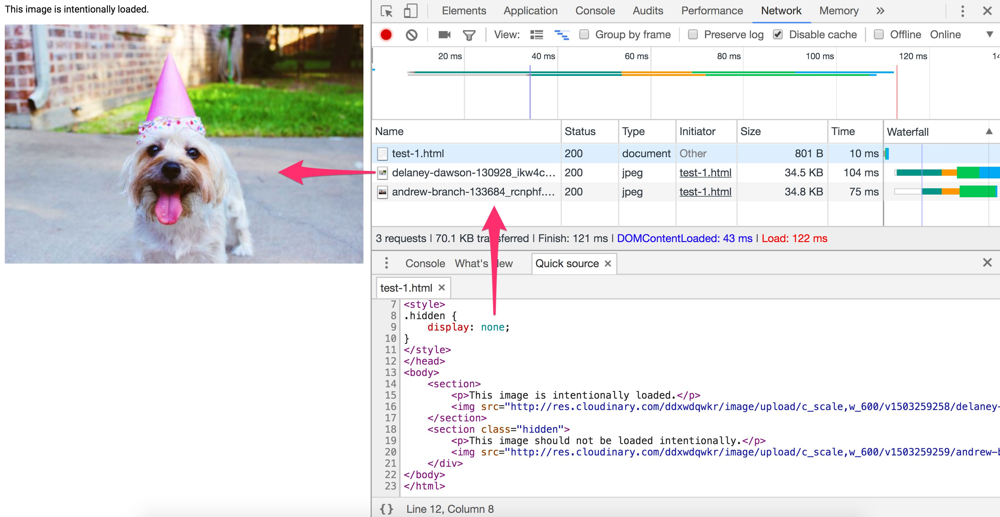

แต่ **CSS background-image** จะไม่โหลดรูปหากโดน `display:none`

```html
<div style="display:none">
  <div style="background: url(img.jpg)"></div>
</div>
```

ดังนั้นหากจะทำอะไรแบบด้านบน ให้ทำเป็น CSS Background แทน จะได้ผลครับ

## จริงๆ ยังมีอีกมาก

บล็อกนี้ผมอ้างอิง reference มาจาก [Essential Image Optimization](https://images.guide/) ซึ่งจริงๆ ยาวมากๆ และละเอียดมาก (ละเอียดยัน algorithm แต่ละแบบของ JPEG มีผลต่อขนาดของรูปในสภาพต่างๆ) ถ้าใครสนใจอ่านเพิ่ม ก็จิ้มต่อจากนั้นได้เลยครับ

สำหรับตอนต่อไปจะเอาเรื่องอะไรมาแชร์นั้น รอติดตามได้เลยครับ :D
