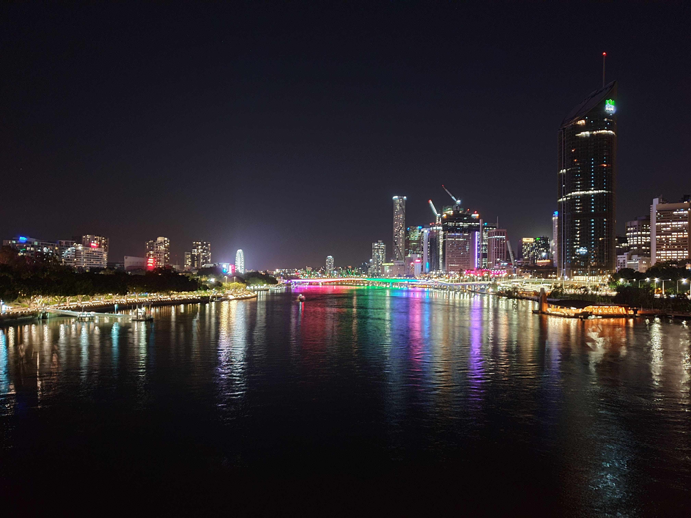
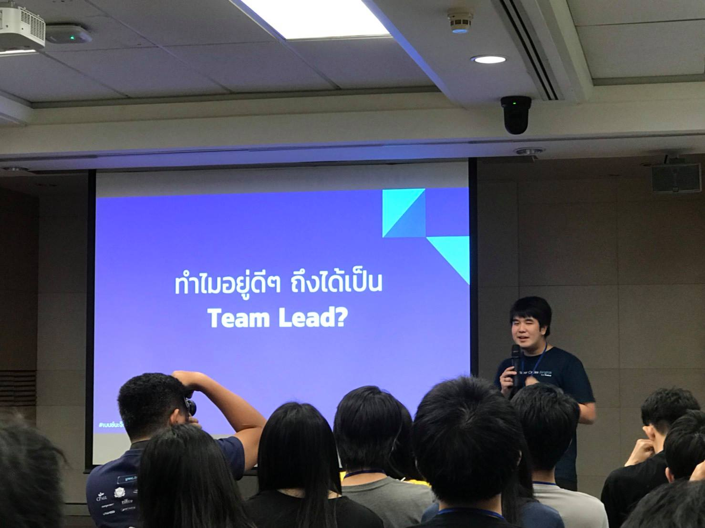
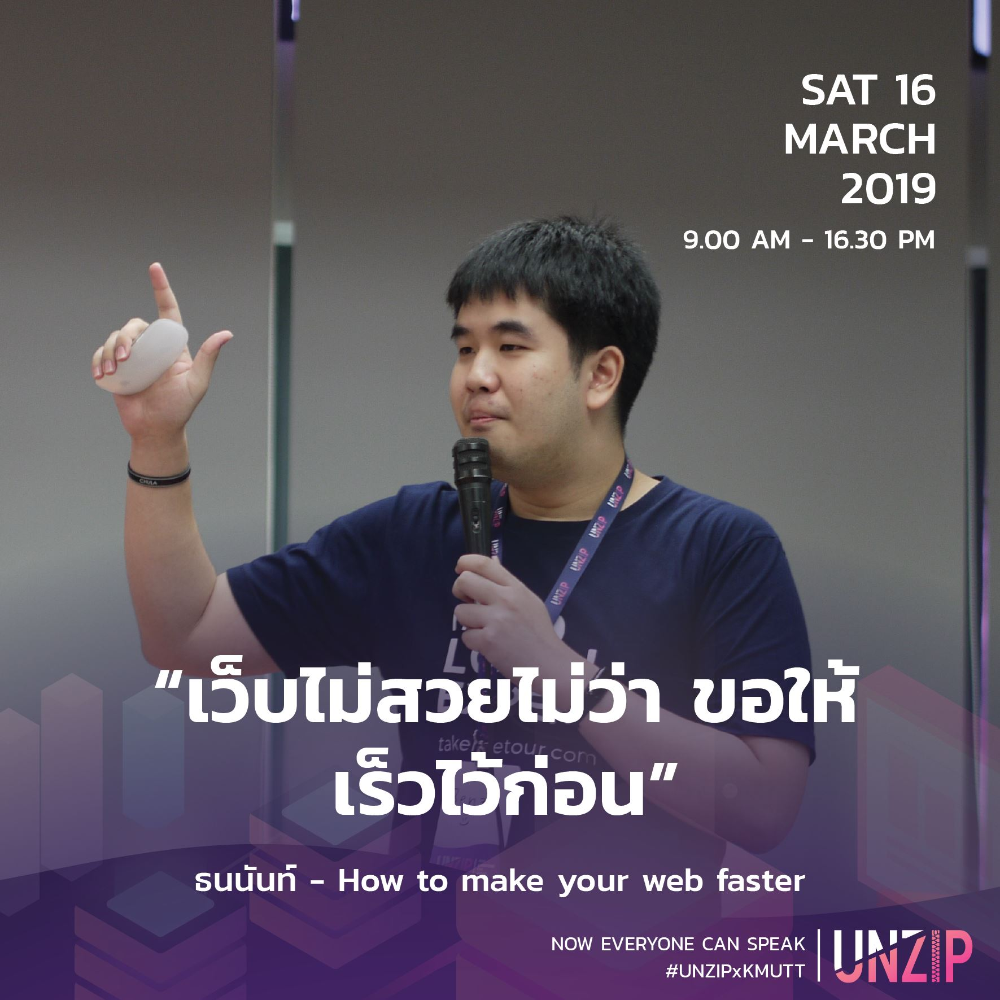
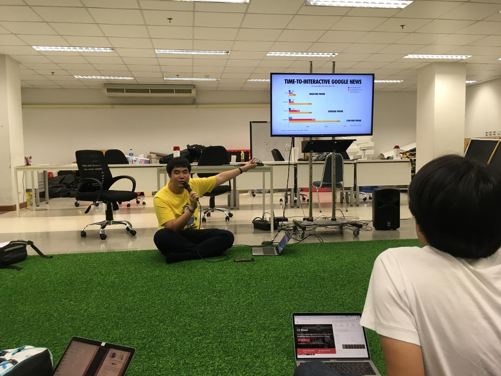
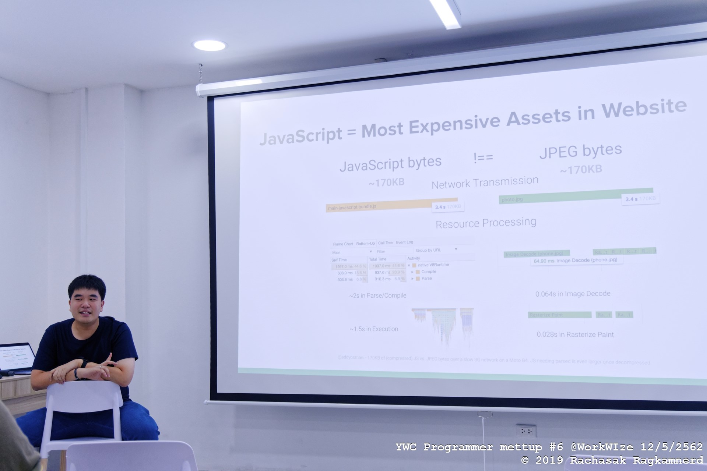
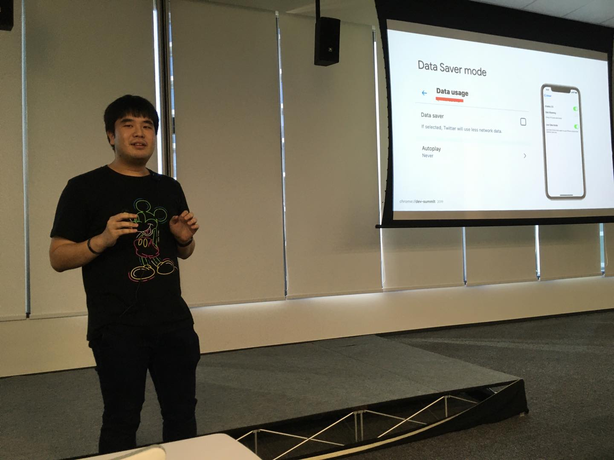
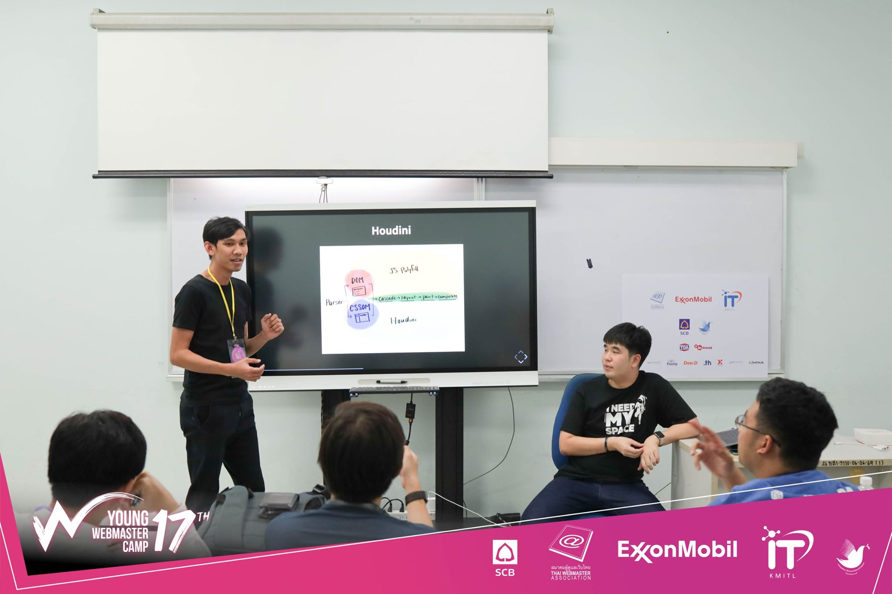
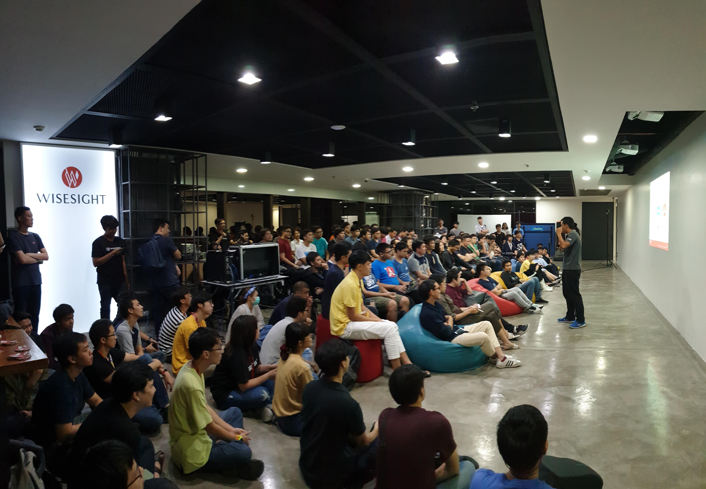
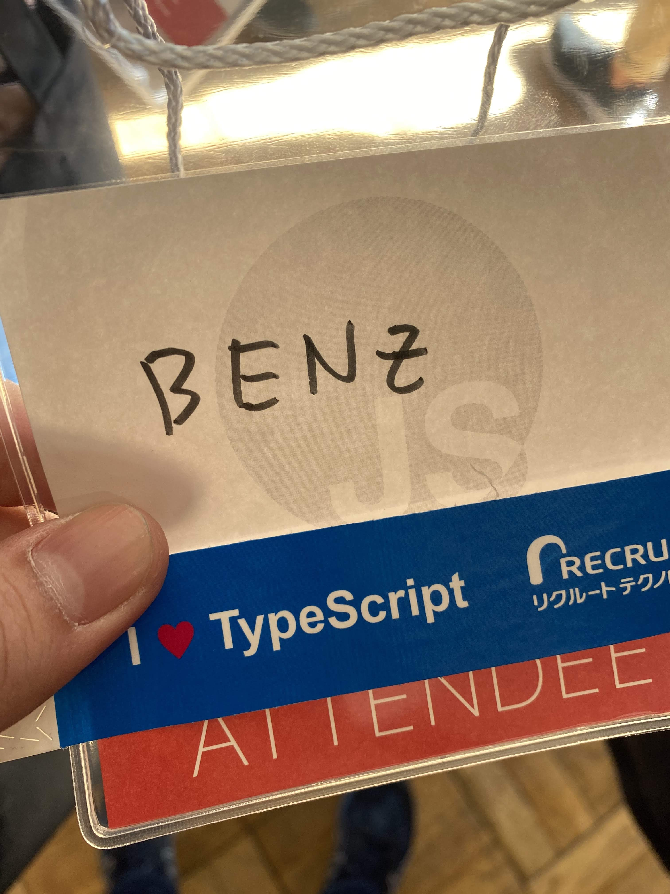

หลายคนก็เริ่มจะคิดละว่า ไอ้นี่มาอีกละ 2019 Year in Review สำหรับผมเองใครใคร่คิดอะไรก็สุดแท้แต่แหละครับ ผมรู้ว่าไม่มีใครห้ามความคิดใครได้หรอก

> แต่ส่วนตัวเราเอง มองว่าการมองย้อนเรื่องที่เกิดขึ้น มันก็เหมือนได้กลับมาทบทวนตัวเองดีเหมือนกัน

ปีนี้จะไม่ยืดยาดในการเขียนเยอะ จะไปไวๆ ดีกว่า

## 1 month in Australia

น่าจะเป็น checkpoint ที่ใหญ่ที่สุดในปีนี้แล้วแหละ กับการได้โอกาสจากบริษัทไปทำงานที่เมืองบริสเบน ประเทศออสเตรเลีย เป็นเวลาเดือนนึงเต็มๆ

ซึ่งการไปอยู่ที่นู้นเต็มๆ เดือนนึงสำหรับเราเองก็ไม่ง่ายเหมือนกันนะ ลองคิดดูว่า ถ้าชีวิตนี้เคยไปต่างประเทศไกลสุดคือไปสิงคโปร์ และไปแค่ไม่กี่วัน แต่ครั้งนี้ต้องไปออสเตรเลีย และไปเดือนนึง มันจะขนาดไหน

และนั่นแหละ เลยได้เรียนรู้อะไรเยอะมาก และเป็นเรื่องที่ไม่คาดคิดด้วย

- ได้หัดทำกับข้าว
- ได้หัดดูแลบ้าน (ล้างห้องน้ำเป็นต้น)
- ลองใช้ชีวิตอยู่คนเดียว แบบคนเดียวจริงๆ
- ใช้ภาษาอังกฤษเป็นหลัก ทั้งการใช้ชีวิต ทั้งการทำงาน
- การทำงาน remote ข้ามประเทศ timezone ห่างกัน 3 ชั่วโมง
- ไปลองร่วมงาน meetup ต่างๆ นาๆ

สำหรับเราเองมองว่าเป็นเรื่องที่ดีสุดในปีนี้เลยก็ว่าได้ ขอบคุณบริษัทที่ให้โอกาสนี้ได้ไปอีกครั้ง และถ้ามีโอกาสอีก ก็อยากจะไปอีก

## ออกงานพูดเยอะขึ้น / ช่วยจัด meetup

จากปีก่อนได้ไปพูดใน React Bangkok 3.0.0 ปีนี้ก็พยายามมองหางานและโอกาสไปแชร์เรื่องราวต่างๆ ตั้งแต่ต้นปี ก่อนหน้านี้เรารู้สึกว่าปีนี้ดูห่างหายจากเรื่องนี้ เพราะมีน้องคนนึงที่รู้จักก็ทักเหมือนกันว่าไม่ค่อยเห็นในงาน meetup

แต่พอมาดูจริงๆ ปีนี้ได้ไปออกงานพูดบ่อยอยู่นะ

YWC Ignite ตอนต้นปี: ไปแชร์เรื่องอยู่ๆ ก็ได้เป็น Team Lead แบบงงๆ  (ขอบคุณรูปจาก เฟิร์นนี่ ผู้ไปอยู่ที่ UK แล้ว ถถ)

ทอล์ก Web Performance ใน UNZip ของบางมด: เหตุแค่อยากลองส่งหัวข้อไปดู ปรากฎว่าได้ไปพูดเฉย (ขอบคุณรูปจาก official page กับ quote สุดล่อตีน designer 5555)

ไปพูดเรื่อง Web Performance แบบงงๆ ในงานของ Thinc  (ขอบคุณรูปโดย JaMe Angular Thailand)

พูดเรื่อง Cost of JS ใน YWC Programmer Meetup (ขอบคุณรูปจากน้องบิ๊ก YWC#15)

พูดเรื่องการหนีออกจาก Medium มาใช้ Gatsby ในงาน Gatsby Meetup ครั้งแรกของไทย (ไม่มีรูป เสียใจ)

พูดเรื่อง Adaptive Loading ใน Chrome Dev Summit Extended 2019 (ขอบคุณรูปโดย JaMe Angular Thailand)

ไปพูดเรื่อง Web Development Trends ปี 2019-2020 ใน YWC#17 ที่เพิ่งจบไปสดๆ (ไปนั่งให้น้องถอนหงอก แล้วก็มีพี่ตั้งช่วยถอนหงอก ถถถถถ) (ขอบคุณรูปจาก official page ด้วยครับ)

นี่ถ้าไม่มานั่งทำรีวิวตลอดปี ก็ยังเข้าใจไปเองอยู่นะว่าปีนี้พูดน้อย ทั้งๆ ที่รู้สึกว่าเยอะขึ้นกว่าปีก่อน (และพูดเรื่อง Web Performance เยอะด้วย ถถถถ)

ก็สำหรับใครอยากใช้บริการไปแชร์เรื่องราวเกี่ยวกับ React / Web Performance หรืออื่นๆ หลังไมค์หรือหน้าไมค์ชักชวนได้ครับ :D

นอกจากนั้นแล้ว ปีนี้ได้โอกาสจากพี่ตั้งมาช่วยเป็นหนึ่งในทีมช่วยจัด BKK.JS Meetup แล้ว! (เหตุจาก บ่นๆ ว่าในไทยน่าจะจัดถี่เหมือนที่บริสเบน พี่ตั้งบอก อยากช่วยจัดไหมล่ะ มาสิ แล้วก็เรียบร้อย 55555)

## JSConf JP

ใจจริงอยากไป JSConf Asia เหมือนกัน แต่สู้ค่าตั๋วเข้างานไม่ไหวจริงๆ แรงมากแม่ แต่พอมาเจอ JSConf JP ค่าตั๋วเข้างานถูกมว๊ากกกกกก 8000 เยนถ้วน (2000 กว่าบาท) เลยแบบ เฮ้ย ต้องไปสิวะ แล้วก็ญี่ปุ่นอีก เลยได้ไปซะเลย

เป็นครั้งที่สองของปีนี้ที่ได้ไปต่างประเทศ ญี่ปุ่นก็จะมีความคนละสไตล์กันกับบริสเบนที่ไปมาเลย บริสเบนจะออกแนวสงบๆ หน่อย ญี่ปุ่นนี่วุ่นวาย ถถถถถ แต่ก็ชอบคนละแบบ

ส่วนตัวงาน ก็ถือว่าคุ้มค่าตั๋วมาก จะติดแต่ว่ายังรู้สึก networking ไม่ค่อยคุ้มเท่าไรนัก

(แต่ที่รู้สึกว่าคุ้ม คือภูเขาไฟฟูจิสวยมาก clear view โคตรๆ)

## อื่นๆ เท่าที่คิดได้

- **ได้เป็นส่วนนึงใน contributor ของเว็บรายงานผลเลือกตั้งของ Elect.in.th ด้วย**
- **ปีนี้เป็นปีนึงที่เจอบททดสอบจิตใจค่อนข้างจะเยอะ และค่อนข้างหนักหนาเอาเรื่อง** แต่สุดท้ายมันก็ผ่านพ้นมาได้
- **"มันอาจจะเป็นเรื่องดีแล้วที่เราได้เจอเรื่องราวบางอย่างก่อนคนอื่น"**
- คำว่า **"อย่ากดดันตัวเองมากเกินไป"** ยังคงใช้ได้อยู่เหมือนเดิม
- **โลกนี้ยังมีเรื่องที่ต้องเรียนรู้อีกเยอะมากๆๆๆๆ** ไม้ยมกให้สักล้านตัว
- เป็นปีที่รู้สึกว่า **เราทำบางอย่างได้ไม่ถึงเป้า แต่พอนั่งคิดดีๆ ไอ้ที่เราทำได้มันก็เยอะแล้วนี่หนา** กลายเป็นกดดันตัวเองไปแบบงงๆ
- **ปีนี้เก็บตังไว้ไม่ค่อยอยู่** โดยเฉพาะช่วงท้ายปีเก็บไม่อยู่จริงๆ ปีหน้าต้องเก็บเงินเยอะขึ้นและจริงจังกว่านี้มาก
- **ปีนี้จะค่อนข้างบ้าเรื่อง Web Performance พอสมควร** และคงเป็นแบบนี้ต่อไปในปีหน้า
- คนยังเข้าใจว่าเราเป็น CTO **ไม่ใช่นะจ๊ะ เป็นแค่ Team Lead จ้า** 555
- **อ่านหนังสือน้อยลงไปมาก** ปีนี้น่าจะอ่านจบได้แค่ 10 เล่มเองมั้ง
- **แต่เริ่มมีอ่านหนังสือภาษาอังกฤษแล้ว** ต้องขอบคุณการไปบริสเบน ที่ environment เอื้อ ละก็ถอย Kindle มาให้อ่านได้สะดวกขึ้นอีก
- **ค่อนข้างติดเกมหนักจริง** เล่นทุกวันจริงๆ
- **ไปเป็นผู้ปกครองให้น้องสาวเป็นครั้งแรกในชีวิต** รู้สึกเกร็งชิบหาย 555555

## 2020?

จากการคาดการณ์ส่วนตัว ด้วยเรื่องต่างๆ จากปีนี้ และปีหน้าก็อายุ 25 (เบญจเพศ detected) **ปีหน้าน่าจะเป็นปีที่ไม่ธรรมดาสำหรับเราแน่ๆ** แต่ก็อยากจะ set goal บางอย่างของตัวเองไว้ เพราะปีก่อนพอไม่ได้เซ็ตเป็นรูปธรรม แล้วดูชีวิตมันเลื่อนลอยมากขึ้นจริงๆ

- **อ่านหนังสือ ทุกวัน วันละ 10-20 นาที** อยากกลับมาสร้าง habit การอ่านหนังสือมากขึ้น
- **ออกกำลังกาย วีกละ 1-2 ครั้ง** ปีนี้เหลวไหลเรื่องการออกกำลังกายมาก และเริ่มรู้สึกว่าตูแก่ขึ้น
- **บล็อกละเดือนต้องเกิด** จะเขียนเรื่องบ้าอะไรก็ได้ ปีนี้รู้สึกขาดบล็อกไปมาก ดูจำนวนบล็อกระหว่างรีวิวปีก่อน กับรีวิวปีนี้ดู มีแค่นี้เองอ่อวะ
- **No Gaming 1 วันต่อวีก** ปีนี้เล่นเกมทุกวัน ปีหน้าน่าจะต้องมีสักวันที่ไม่เล่นเกม และเอาเวลาไปทำอย่างอื่นแทน
- **No มือถือใหม่ No คอมใหม่ No ผ่อนของใหญ่** อันนี้ต้องลาขาดจริงๆ ละ รู้สึกถี่มากจริงๆ ปีนี้กับการเสียเงินไปซื้อของพวกนี้
- **ลงทุนซะทีสิโว้ย**

ปีหน้ามาเจอกัน ไม่สิ ต้องบอกว่า quarter หน้ามาเจอกันดีกว่าว่าทำได้ถึงไหน

---

สวัสดีปีใหม่ทุกคนนะครับ :)

Happy New Year :)

ปล.เขียนได้สั้นดีจริง ไม่น่าเชื่อ 5555
