ใช่ครับ อ่านไม่ผิดหรอกครับ

> บล็อกชื่อว่า "2020 - 2021" และถูกเขียนในปี "2022"

วันนี้ที่เขียนบล็อก วันเสาร์ที่ 26 มีนาคม 2022 วันนี้ก็เป็นวันดีๆ อีกวันนึงที่ท้องฟ้าสวยงามมากๆ แบบน้ำตาจะไหล และก็นั่งรอคิวโมโม่อยู่ที่ร้าน GRAPH สาขา Siam Discovery ที่เปิดชั่วคราว

อยู่ๆ ก็นึกได้ว่า เอ๊ะ บล็อกก็ไม่ได้เขียนมาน่าจะ 2 ปีได้

เลยจัดแจง clone ตัวโค้ดลงมาในโน้ตบุ๊ค (ใช่แล้วครับ ยังไม่เคยแม้กระทั่งมีโค้ดเว็บนี้ในคอม) นั่งอัพเกรด Library ที่เก่าชาติเศษ

แล้วก็มาเขียนบล็อกนี้ขึ้น ตรงร้านกราฟนี่แหละ

ซึ่งคนมันก็คงจะสงสัยว่า ทำไมอยู่ๆ มาเขียนเรื่องปี 2020 - 2021 กันในปี 2022 กันนะ

ความคิดผม ณ เวลานี้ก็คือ อยู่ๆ ก็อยากจะ reflect ตัวเอง อยากลองมองย้อนกลับไปดูว่า ในตัวตนปัจจุบัน ที่เริ่มรู้สึกเหนื่อยล้ากับวันธรรมดาอย่างมาก ทั้งภาระงานและใดๆ ก็แล้วแต่ และเสาร์อาทิตย์ที่มันก็ผ่านไปเร็วเหลือเกิน อยากรู้ว่าตัวเราเอง ณ วันนี้ มองเราในอดีต และเรื่องที่ผ่านมายังไงกันนะ

อะใช่ และผมก็อาจกำลังตั้งคำถามตัวเอง และพยายามหาคำตอบว่า

**"หรืออดีตมันช่วยอะไรผมในวันนี้ได้ไหมนะ"**

---
## ตัวตนที่เคยหลงลืม

เลยเล่นง่ายไปเปิดเฟสบุ๊คตัวเองนี่แหละ เพราะใดๆ คิดว่าเราน่าจะโพสสิ่งต่างๆ บนเฟสอยู่แล้ว มากด filter ดูปี 2020 - 2021

สิ่งแรกๆ ที่เจอคือโพสนี้

**เชี่ย ตอนนั้นกุผอมขนาดนั้นเลยเหรอนะ**

**เชี่ย ตอนนั้น 21 โลวิ่งไปได้ยังไงนะ**

ใช่แล้ว ตัวตนแรกที่เคยหลงลืมไป และช่วงนี้กำลังเอามันกลับมาพอดี คือ **นักวิ่ง**

พอนึกย้อนไปแล้ว ก็เลยจำได้ว่าปี 2020 เป็นปีที่มาจริงจังเรื่องสุขภาพครั้งแรกน่าจะในชีวิตเลย ปกติก่อนหน้าเป็นเด็กอ้วนกินตามใจปาก ไม่ค่อยออกกำลังกาย

แล้วก่อนหน้านั้นก็คิดตลอดว่า ตัวเองน่าจะน้ำหนัก 80 ละมั้ง

จนชั่งน้ำหนักมาวันแรก ป้าง 85 โล

เลยรู้สึกได้ว่า เชี่ย เกินไปแล้ว...ลดเถอะ

เลยตัดสินใจว่าออกวิ่ง...โอเค หลายคนก็แนะนำ รวมถึงพี่ที่ออฟฟิศก็แนะนำเหมือนกันว่า ถ้าอยากลดน้ำหนัก การวิ่งไม่ค่อยจะเป็นหนทางที่ดีนัก เทียบกับวิธีอื่นๆ

แต่ผมก็คิดแค่ว่า ก็ถ้ามันออกกำลังกายบ้าง ก็ดีกว่าไม่ออกแหละวะ และวิ่งก็เป็นกีฬาที่ออกได้ง่ายๆ เพราะขอแค่ชุดวิ่ง รองเท้าวิ่ง ก็พอแล้ว

เลยเริ่มออกสตาร์ทวิ่งตั้งแต่ตอนนั้นเป็นต้นมา

แต่แน่นอนว่า เราก็รู้ตัวแหละว่าวิ่งก็ไม่พอ เลยศึกษาแบบครูพักลักจำเอาจากพี่ที่ออฟฟิศ ที่เขาเองก็คุมน้ำหนัก เข้ายิมออกกำลังกาย ก็เรียนรู้พอให้ได้แนวทางว่าถ้าอยากลดน้ำหนักจริงๆ ก็ควรต้องคุมอาหาร

ทีนี้ด้วยความที่แม้เราอยากจะลดน้ำหนักแหละ แต่ก็ไม่อยากเอามากดดัน ว่าเดือนนี้ๆๆๆ ต้องลดเหลือแค่ 80 โลหรืออะไรนะ คือไม่อยากตั้งเป็นเป้าให้เครียดและกดดัน ก็เลยอาศัยว่าลดทีละหน่อยก็ดี ไม่ลดก็เท่าทุน ถ้าเพิ่มมาหน่อยก็อย่าให้มันเพิ่มอีกละกันวันต่อไป

สูตรลดน้ำหนัก ก็ไม่ได้มานั่งนับเป็นแคลๆ ว่าวันนี้กินไปแล้วเท่าไหร่ ไม่ได้นับโภชนาการละเอียด ไม่ได้นับโปรตีนว่าขาดขนาดไหน อาศัยสูตรหลักคือเลี่ยงน้ำตาล เลี่ยงของทอด ของเสี่ยงอ้วน หยุดหมดเลย

แต่ก็ยังมีโอกาสให้เราได้ชีทบ้าง เพราะถ้าเลี่ยงหรืองดตลอดบางทีเหมือนร่างกายไม่ได้ rewarding อย่างปีนั้นก็คือชานมไข่มุกให้กินแค่เดือนละแก้วพอ ก็ให้ reward ตัวเองตามสมควรไป แต่ก็ต้องยั้งใจว่าไม่ควรให้บ่อยๆ

ก็เป็นความยากแหละ เพราะการลดน้ำหนักนี่ว่าเหมือนๆ กับการสั่งสมบุญแบบนึง คือมันเห็นผลชัดๆ วันนี้พน. ไม่ได้หรอก มันต้องไปเรื่อยๆ พอเรามาไกลแล้วมองย้อนไปก็จะ โอ้ ก็มาไกลจริงๆ

---

ตัดข้ามมาจากการลดน้ำหนัก ก็เรื่องการวิ่ง

การวิ่งนี่ผมเองจะชอบถูกถามประจำว่า "วิ่งนี่มันสนุกยังไงนะ"

ผมจะตอบตรงๆ ว่า

**"เอาจริงมันก็ไม่ได้สนุกซะทีเดียวนะ"**

5555555555555555

คือต้องเล่าก่อนว่าจริงๆ แล้วการวิ่งที่สนุกและเอาสุขภาพที่กำลังดี คือการวิ่งระยะไม่เกิน 5 กิโลเมตร เพราะเป็นระยะที่พอดีทั้งความสนุก ความเหนื่อย และได้สุขภาพด้วย

แต่ถ้าเกินจากนั้น จะ 10 / 15 / 21 / 42

พวกนี้เอาจริงๆ มันคือ **"ความหาทำ"** รูปแบบนึง

**และเป็นความหาทำที่อาจเป็นการเอาร่างกายมาทรมานด้วยนะ**

ลองนึกภาพคนๆ นึงวิ่งสับเท้าซ้ายขวาไปเรื่อยๆ ในเส้นทางที่บางทีก็ต้องวนๆ เป็นระยะเวลาเป็นชั่วโมง เป็นระยะทางกว่า 10 กิโลเมตร สลับไปเป็นพันๆ หมื่นๆ ก้าว มีหยุดบ้าง มีหย่อนบ้าง เร่งบ้าง เป็นใครจะไม่เบื่อ

ใช่ ตูยังเบื่อเลย 555555 ยัดเพลงก็แล้ว ทำอะไรต่ออะไรก็แล้ว

แล้วถามว่าทำไมตัวผมเองก็ยังเลือกวิ่งในระยะที่มันท้าทายขนาดนั้น

**"ก็เพราะเราเห็นตัวเองกำลังก้าวขีดจำกัดบางอย่างของตัวเองอยู่เรื่อยๆ มั้ง"**

เลยนึกความคิดและความรู้สึกตอนวิ่งได้ 10 กิโลแรกออกเลย

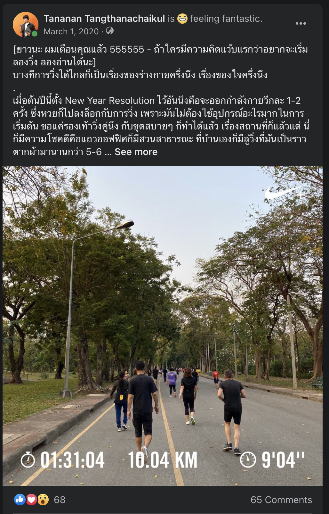

ในวันนั้นก็เป็นวันปกติทั่วไป อากาศก็พอได้ ตอนนั้นสถิติไกลสุดก็น่าจะที่ 5 กิโลได้ ไม่เคยเกิน 7 กิโลคือสามรอบสวนลุมแน่ๆ

ก็ไปใช้ชีวิตตามรูทีนที่เคยเป็นของการวิ่ง ก็คือจะหาร้านกาแฟนั่งกินก่อนไปสวนลุมช่วงห้าโมงเย็น

วันนั้นไม่ได้กะวิ่งอะไรมากมาย แต่พอวิ่งไปได้ห้าโล อยู่ๆ ก็รู้สึกว่า เออหรือเราจะลองอีกสักรอบนึง

ก็เลยซัดไปอีกรอบ เป็น 7.5 กิโล นั่นเอาจริงก็เป็นการ **"ทะลายกำแพงขีดจำกัด"** ของตัวเองไปแล้วนะ

และก็คิดได้ว่า แต่ถ้าเอาอีกรอบก็จะได้ 10 โลเลยนะ

สิ้นความคิดนั้น ก็ซดน้ำหนึ่งอึกที่เหลืออยู่ และก็สับเท้าไปต่ออีกรอบนึง

แล้วก็ครบรอบนึง แท่นแท้น 10 กิโลเมตรแรกของชีวิต

ถ้าดูจากสถิติตอนแรกมันก็คงไม่ได้ดีมากหรอก แถมยังเป็นการวิ่งๆ เดินๆ  แต่นั่นก็เป็นก้าวแรกของการบอกกับตัวเองว่า "10 โลกูก็วิ่งได้" และนั่นทำให้ 10 กิโลเมตรที่สอง ที่สาม ที่สี่ ที่ห้า และ so on มันก็มีมาเรื่อยๆ ด้วยสถิติที่ก็ดีขึ้นเรื่อยๆ นั่นก็หมายถึงร่างกายแข็งแรงขึ้นเรื่อยๆ ทนทานขึ้นเรื่อยๆ ตามมาเป็นเงา

และเรื่องเช่นเดียวกันก็เกิดขึ้นกับการวิ่งได้ 12 กิโลเมตรแรก

และเรื่องเช่นเดียวกันก็เกิดขึ้นกับการวิ่งได้ 15 กิโลเมตรแรก

และเรื่องเช่นเดียวกันก็เกิดขึ้นกับการวิ่งได้ฮาฟมาราธอนแรก

พอมองย้อนมา มันเหมือนกับการที่เราค่อยๆ ขยายขีดจำกัดของเราเองออกไปเรื่อยๆ

**วันนี้ไม่ได้ ไม่เป็นไร พรุ่งนี้เอาใหม่**

**วันนี้แย่กว่าเมื่อวาน ไม่เป็นไร พรุ่งนี้เอาใหม่**

**วันนี้ดีกว่าเมื่อวาน เรายินดี และ celebrate small win และพัฒนาต่อในวันพรุ่งนี้**

การวิ่งเอาจริงแอบสอนปรัชญาการใช้ชีวิตได้ดีเหมือนกันนะ

**"ชีวิตคนเรามันก็มีวันดีบ้าง แย่บ้าง เป็นธรรมดา"**

ก็เหมือนวันนี้เราวิ่งได้ดีมากๆ ได้ New Personal Best บางวันเราก็ทำได้ไม่ดีเลย

ก็เรียนรู้จากมันเข้าไว้

---

พอไถๆ ฟีดไปเรื่อยๆ อีก ก็ไปเจอว่าอีกตัวตนที่หลงลืมไปพอสมควรคือ **มนุษย์ Tech ผู้จัดและช่วยจัด Meetup**

พลันคิดว่านานเท่าไหร่แล้วฟะ ที่ไม่ได้ไปงาน meetup แบบ offline กัน

โห แม่งก็สองปีเลยนะ

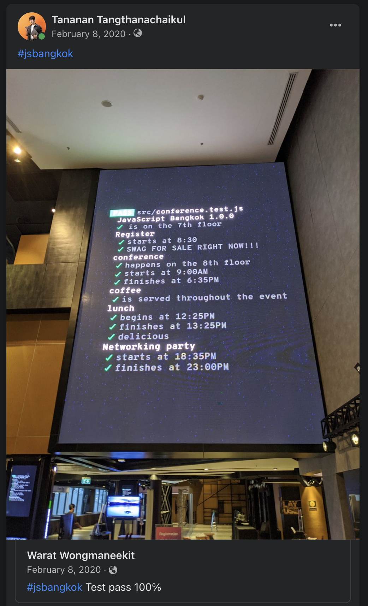

ปี 2020 ต้นปี คือเราจัดงาน JavaScript Bangkok 1.0.0 **เป็นงาน JavaScript Conference ที่ใหญ่ที่สุดในประเทศไทยเป็นครั้งแรก** ซึ่งพอมามองย้อน เราคิดว่า **แม่งโคตรรรรรรโชคดีที่จัดตอนนั้น เพราะถ้าไม่จัดตอนนั้น น่าจะอดจัดจนถึงทุกวันนี้** เพราะอีกประมาณเดือนนึงโควิดบุกพอดี

งานนั้นเป็นงานที่จัดสนุกมาก และเชิญสปีกเกอร์ที่โคตรเก่ง และมาจากหลากหลายประเทศด้วย เพื่อให้สมกับมันเป็น JS Conference ครั้งแรกของประเทศหน่อย

แต่เอาจริง เสน่ห์ของงาน conference หรือ meetup ต่างๆ เช่น BKK.JS เอย หรืองานไหนต่อไหนก็ตามรวมถึง JS Bangkok ไม่ใช่แค่มีคนเก่งๆ มาเล่าเรื่องราวหรือแชร์ความรู้แบบไม่กั๊กกัน แต่คือการ Networking ต่างหากล่ะ

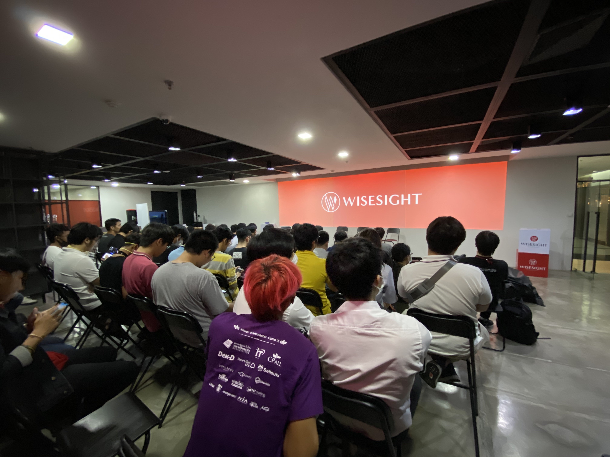

พอเจอเหตุโควิด งานหลายๆ งานมันกลายเป็น Online ซะเยอะ มันก็พอแก้ขัดได้ แต่พอมาตอนนี้เราคิดย้อน จริงๆ เราแม่งโคตรจะคิดถึงการ Networking แบบ Offline มากๆ

มันเป็นพื้นที่ที่ให้เราได้แชร์ประสบการณ์ เรื่องเล่า ไปหา connection หาโอกาสใหม่ๆ บางทีเจอเพื่อนใหม่ที่เป็นคนวงการเดียวกันได้

ถึงแม้นี่จะเป็นมนุษย์ Introvert แต่เอาจริงส่วน Networking จริงๆ คืออันที่ได้เยอะกว่าการนั่งฟังสปีกเกอร์เยอะมากๆๆๆ

ก็คิดถึง Offline Meetup จริงๆ แหละ และถ้ามีจัดอีก ก็จะไปแบบไม่ลังเลเลยล่ะ

---

## โควิด

อ่ะในช่วง 2020 - 2021 มันจะไม่พูดถึงโควิด ไม่น่าได้

พอมาปีนี้ เราเริ่ม(กำลังจะ)มองว่าโควิดเป็นโรคประจำถิ่น วัคซีนเริ่มเข้าถึง(?) แม้จะมีความกำหมัดว่ากะต้องจ่ายเงินเพื่อเอา mRNA ก็ตามที หรือต่อให้ติดโควิดตอนนี้ ก็ยังงงๆ ว่าจะทำยังไงกันดี ให้ Home Isolation แล้วกูจะได้ยาไหมนะ หรือยังไงนะ หาเตียงก็หาย๊ากยาก ถ้าไม่เส้นก็ไม่รู้จะได้ไหม

แต่กระนั้น ตอนนี้ตัวฉันก็นั่งอยู่กราฟสาขา Siam Discovery รอคิวโมโม่ที่คิิวน่าจะเป็นร้อยเห็นจะได้ มองดูคนเดินผ่านไปเดินมาเยอะมากอย่างไม่ขาดสาย

เหมือนกลับมาเป็นปกติ เพิ่มเติมคือทุกคนใส่มาสก์

**แต่ให้ย้อนไปช่วง 2020 ที่โควิดระบาดแรกๆ นะเหรอ ทุกคนไม่ชิวแบบทุกวันนี้แน่นอน**

ทุกคนต่างกลัวโรคระบาดชนิดนี้มากๆ ระดับที่ว่าไม่กล้าออกจากบ้านกันจริงๆ หรือการออกจากบ้านก็กลายเป็นเรื่องน่ากลัวโคตรๆ ไปแล้ว

เรา Work from Home กัน อยู่บ้านจนเส้นคำว่าบ้านกับที่ทำงานมันหายไปแล้ว งานกับบ้านถูกหลอมรวม แยกเวลาเริ่มงานเลิกงานไม่ค่อยออก...อ่ะ โอเคหลายคนก็อาจจะชอบ แต่ช่วงแรกของผมคือเป็นแบบนั้นจริง

ห้างปิด เหลือแต่ supermarket ของกินต้องซื้อกลับบ้านเท่านั้น

ปิดพรมแดน บินไปต่างประเทศไม่ได้

เดินทางข้ามจังหวัดยังลำบาก

ชีวิตเหมือนอยู่แต่ในบ้านตลอดเวลา

**จนหลายคนแทบจะบอกว่า การใช้ชีวิตแบบนี้ ไม่ใช่การใช้ชีวิตอีกต่อไปแล้ว**

แถมด้วยมาตรการรัฐที่โคตรจะหัวปวดต่างๆ นาๆ ตอนนั้นเราก็มองไม่ค่อยเห็นอนาคตกันเท่าไหร่ว่าเหตุการณ์นี้จะไปจบตรงไหน ละมันจะเป็นภาพยังไง

---

เหมือนคำกล่าวที่หลายคนบอกว่า โควิดส่งผลกระทบกับทุกคน และก็ไม่เหมือนกันด้วย

หลายคนอาจจะชอบ โอ้ชีวิตได้ work from home สบายดีออก flexibility เยอะขึ้น

หลายคนมองว่าเป็นโอกาสได้ลองทำอะไรใหม่ๆ ทำกับขงกับข้าว

ส่วนถ้าถามผมว่า เป็นยังไงน่ะเหรอ

**"มรสุม"**

เหตุหลักๆ มาจาก TakeMeTour ที่ผมทำงานด้วย เป็น TravelTech อยู่ในแวดวงการท่องเที่ยว

และแน่นอนว่า พอโควิดมา การท่องเที่ยวโดนหนักมาก เต็มข้อ

จากที่บริษัทกำลังโต กำลังได้โจทย์ใหม่ที่ท้าทายทั้งทีม อนาคตสดใสโคตรๆ

อยู่ๆ เราเห็นนักท่องเที่ยวขอยกเลิกการจอง เพราะโควิดกำลังมา

คนพาเที่ยว เริ่มไม่สบายใจ เพราะโควิด ไม่กล้าออกทัวร์กัน

ยอดจองเริ่มหดลงเรื่อยๆ

**รายได้เริ่มลดลงจนเหลือศูนย์**

โควิดเริ่มระบาดหนักขึ้น ทีมเริ่มถามหาเรื่อง Work from home

ผมจำวันที่ไม่ได้เลยว่าวันไหน แต่จำได้แม่นว่าเป็นวันนึงที่โคตรมืดหม่นมากๆ น่าจะมากที่สุดอันนึงของชีวิตเลยแหละ

พี่นพพี่ต้า ที่เป็น Co-Founder บอกกับผม และวงทีม Management ตรงๆ ว่า เงินสดเราอยู่ได้อีกสองเดือน ถ้าไม่ทำอะไรสักอย่าง เลยคุยกันว่าจะทำยังไง เพราะพี่นพพี่ต้าก็จนปัญญากันจริงๆ

เลยได้ข้อสรุปว่า ก็ต้องหั่นเงินเดือนออก บางคนอาจต้องลดวันทำงาน เป็นหนทางเดียวที่จะรักษาทีมไว้ให้ไปต่อกันได้ทุกคน ในระหว่างที่เราหาทางออกว่าจะทำยังไง

วันนั้นมันมืดหม่นมากจริงๆ เพราะนอกจากพี่นพพี่ต้า ต้องทยอยแจ้งข่าวร้ายเรื่องลดวันทำงานและลดเงิน ซึ่งผมในฐานที่เป็นคนที่ก็น่าจะมี emphaty เยอะพอสมควร ก็เข้าใจทุกคน เข้าใจทั้งมุมพี่นพพี่ต้าที่เป็นเจ้าของบริษัท ว่ามันก็ต้องประคองทีมให้ไปรอด มันต้องหาทางไปต่อ แต่ผมเองก็เข้าใจทุกคนในทีม ว่าการโดนหั่นเงินออกมันก็ส่งผลกระทบตรงๆ แน่ๆ

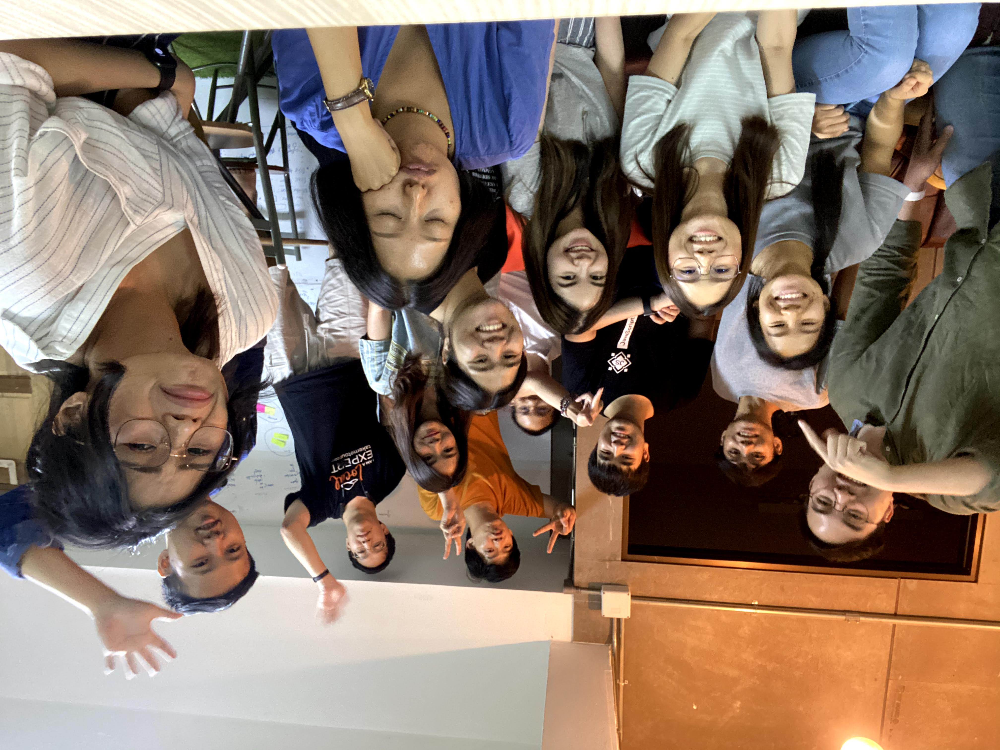

**แถมมันเป็นวันสุดท้ายที่ทุกคนได้เจอกันที่ออฟฟิศ**

**และก็ไม่รู้ด้วยซ้ำว่า ถ้าเรากลับมาทำงานออฟฟิศกันจะยังเจอกันครบทีมเหมือนเดิมไหม**

---

แต่ชีวิตไม่สิ้นก็ต้องดิ้นกันต่อไป

ช่วงโควิดแรกๆ เราเริ่มมาทำงานเป็น project รับงานมาทำต่อ

ตอนนั้นเข้าข่ายว่า มีอะไรให้กุทำ เอามาเหอะ ทำหมดอะ

ตอนนั้นถือโปรเจคหลายๆ อันมาก หัวหมุนกันมาก แถมยัง Work from home ในสเกลทั้งทีม ทุกอย่างใหม่มาก งงมาก เครียดมาก

เส้นแบ่งเวลางานกับชีวิต มันเริ่มหายไปทีละนิดๆ เริ่มงานเช๊าเช้า แต่เลิกงานมืดมาก

Work Life Balance ไม่ต้องถามหา ไม่มี พัง

บางคนในทีมโดนโปรเจคนรก ทำงานเบ็ดเสร็จติดกัน 20 วันต่อเนื่อง

ด้วยความที่เริ่มเห็นทีมเหนื่อยล้ากันมาก ก็พยายามจะหาอะไรที่ทำร่วมกันได้

นั่งเล่นเกมวาดรูปด้วยกันแบบปั่นๆ ก็ทำมาแล้ว (ทั้งกับทีมกับเพื่อนก็ด้วย)

ชวนทำ Workout Hour ให้เปลี่ยนอิริยาบทกันก็แล้ว

**แต่มันก็ไม่มีอะไรจะทดแทนกับชีวิตก่อนโควิดได้จริงๆ หรอก**

---

ผ่านไปได้ประมาณสองเดือนได้ สถานการณ์บริษัทเริ่มดี เราเริ่มจะเห็นหนทางใหม่ เห็นโอกาสใหม่

เราเห็นว่าทีมมีความสามารถในทุกขาของการทำ Digital Product

ทั้ง Tech / Product / Business

เราเลยตัดสินใจเปิดทางใหม่ เปิดบริษัทใหม่ขึ้นมา

ผมเองก็ได้โอกาสใหม่เหมือนกัน

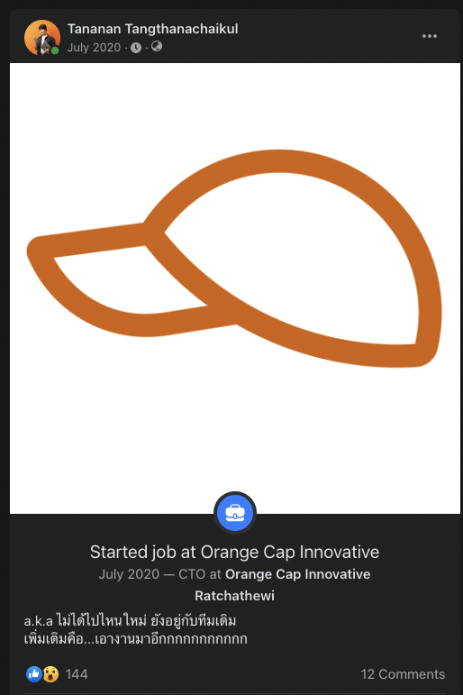

**ได้มาเป็น CTO ในบริษัทใหม่ที่ชื่อว่า ["Orange Cap Innovative"](https://www.orangecapinnovative.com/)**

เราวางตัวอยากเป็น "หมวกส้ม" สำหรับทุกธุรกิจที่ต้องการ Digital Product

หมวกส้มที่พร้อมไปช่วยคุณในหลากแง่มุม ทั้ง Tech / Product / Business / Marketing

หมวกส้มที่อยากจะพาคุณไปสู่ความสำเร็จ ในตลาดธุรกิจที่แทบจะต้อง Digital กันทุกสิ่งอย่าง

นอกจากนี้ เรายังได้พาร์ทเนอร์ที่เก่งมากๆ คือพี่รับขวัญ นักกฎหมายมือฉมังที่โคตรจะเก่งมากๆ ที่ถูกใจคอนเซปและแนวทางของ **[EasyPDPA](https://www.easypdpa.com)** และคุยกันถูกคอ มาร่วมกันก่อตั้ง **"EasyCompany"**

เหมือนความรู้ของทีมมันได้โตและกว้างขึ้น จากเดิมมีแค่ Product / Tech / Business / Design ตอนนี้มันมี Legal เข้ามา ก็สนุกไปอีกแบบ

---

## บทเรียน CTO ในวัย 26

หลายคนชอบบอกผมว่า **"มึงนี่แม่งเท่จัดๆ เป็น CTO แล้ว"**

ถามผมน่ะเหรอ

**เอาเหี้ยอะไรมาเท่**

555555555555555555555555

ความเท่หนึ่งเดียวของการเป็น CTO ก็คงจะเป็นแค่มี Job Title คือ CTO นี่แหละ

แต่ถ้าต้องมารู้ว่าชีวิตเป็น CTO นี่มันต้องเจออะไรบ้างนะเหรอ

ก็เยอะอะ ไม่รู้จะเรียงลำดับไงดี

เอาจากว่าปี 2021 เป็นปีที่เริ่มทำบทบาท CTO แบบจริงจังและ Full Stream เป็นปีแรกก็ว่าได้

ถ้าบอกว่าปี 2020 เป็นเด็กฝึกงาน ปี 2021 นี่แหละของจริง

---

**ถ้าให้เล่าบทเรียนของ CTO ได้บทเดียว จะขอเล่าเรื่องของทีมและผู้คน**

(จริงๆ คือ ขี้เกียจเขียน มันเริ่มจะยาวละ)

เป็นปีที่หาคนเข้าทีมเยอะมากๆ ปีนึง

จากทีม Tech ที่มีกันอยู่ 4 คน อยู่กันมายาวนานตั้งแต่ TakeMeTour จนเป็น OCI (ชื่อย่อบริษัท)

เราสเกลคนขึ้นเป็น 11 คนในปีเดียว (เฉพาะทีม Tech นะ)

ผมเคยได้ยินพี่ๆ ที่รู้จักเป็นเมเนเจอร์ เป็น Team Lead เป็น CTO หลายคน บอกว่าการสเกลคนนี่ก็ไม่ได้ง่ายนะ ไม่ใช่แค่สักจะหาคนเข้าทีมมาได้ก็จบ

ตอนนั้นก็ยังนึกภาพได้ไม่เต็มภาพมากนัก ถ้าเทียบก็คงเหมือนเห็นเป็นดินสอเขียนๆ ร่างๆ แบบไว้ พอเห็นว่ามันเป็นรูปภูเขานะ มีเมฆนะ

แต่พอมาเจอเองกับตัว ถึงเข้าใจภาพที่พี่ๆ เขาเคยเล่าให้ฟัง เห็นสีในภาพร่างที่พี่เขาเคยเล่า

**เออจริง มันไม่ได้แค่หาคนเข้าทีมก็จบ**

พอทีมใหญ่ขึ้น ก็ต้องมีวิธีดูแลที่เปลี่ยนไป เราจะดูคนเดียวครบทุกคนทั่วถึง มันก็ทำได้ แต่เราก็จะเหนื่อยมาก และบางทีเราก็แทบไม่ได้ทำงานของตัวเองด้วย

แค่คิดว่าต้อง 1-1 ทุกคน ก็หมดไปเป็นหลายวันแล้ว แถมเป็นอะไรที่ต้องใช้พลังเยอะมากอีก

แต่มันก็เป็นสิ่งที่ต้องทำอยู่ดี

บทเรียนแรกที่ได้เรียนรู้คือ

ใน timeslot วันนึง

เราอาจต้องเลือกว่า

**วันนี้จะทำงานของเรา ทำงาน technical คลุกดิน หรือจะทำงาน management**

---

ปีนั้นก็ได้มีโอกาสเข้า session Leader & Management กับพี่นุ่ม ที่เคยเป็นเมเนเจอร์ของพี่ต้าอีกที

โดย session มีทั้งหมดน่าจะประมาณ 10 มั้ง จำไม่ได้ละ แต่เข้าสองวีกครั้ง

ความประทับใจคือ ในทุก session นั้น ฟีลลิ่งไม่ค่อยเหมือนนั่งเรียนเลคเชอร์ ฟีลเหมือนนั่งคุยกันมากกว่า

พี่นุ่มจะลีดเราด้วยคำถาม และสถานการณ์บางอย่าง หรือบางครั้งก็เริ่มจากโจทย์จริงที่ผมกำลังเจอ หรือที่คาดว่าจะเจอ

แล้วเราก็ปล่อยให้ session ไหลไปในเวลาประมาณชั่วโมงนึง

ซึ่งจุดที่ผมประทับใจสุดคือ ใดๆ ในทุก session นั้น ทุกคำถามที่เราถามจริงๆ **เราอาจมีคำตอบในใจอยู่แล้วด้วยซ้ำ**

เพียงแต่ด้วยอะไรก็ไม่รู้ เราก็ยังไม่เชื่อในคำตอบนั้น หรือบ้างก็ไม่มั่นใจในคำตอบนั้น

**แต่บทเรียนสำคัญของการเป็น Leader หรือ Manager นั้นก็คือการที่หลายคำถาม มักไม่มีคำตอบที่ถูกต้องเสมอไป**

และผลลัพธ์ของการเลือกคำตอบมันก็มีสองแบบ

**ฉันคิดถูกแล้ว** หรือ **รู้อะไรไม่สู้รู้งี้**

แต่ใดๆ ทุกการตัดสินใจ มันก็เกิดจาก context / situational นั้นๆ ก็เลือกให้เราต้องเลือกในทางเดินนั้น

บางทีเรามองย้อนไป เราก็อาจจะไม่ชอบใจในการเลือกนั้น

บางทีเราก็ต้องยอมล้มบ้าง เจ็บปวดบ้าง เพื่อจะได้เรียนรู้อะไรบางอย่างจากมันมา

ต่อให้เรารู้เต็มอกว่า มันก็เจ็บอ่ะ ใครมันจะไปหาทำให้ตัวเองเจ็บกัน

แต่นั่นแหละ มันก็คงเป็นความจริงของชีวิตในรูปแบบนึงแหละมั้ง 

---

อีกสิ่งที่ได้มาจาก session ทั้งหมด ก็คือ Management Style ของแต่ละคนไม่เหมือนกัน

ก็เห็นด้วยนะ และก็มากๆ ด้วย

และก็ไม่ใช่ว่าแบบของใครดีไม่ดี

แล้วถ้าถามว่า Management Style ของผมเป็นยังไงนะเหรอ

เอาจริงตอนเข้า session ก็ตกผลึกมาประมาณนึงแล้ว ก็มีหลายข้อ หลายประเด็น

แต่พอมาช่วงสิ้นปี 2021 หลังจากได้ reflect ตัวเอง และรวมถึงกับคนรอบตัวด้วย

เหมือนก็ได้คำตอบที่เป็น core จริงๆ ของ Management Style มาว่า 

**Live to empower others**

(ถ้าตูจะเขียนหนังสือสักเล่ม และเขียนคำคม ก็คงเอาคำนี้ไปเขียนได้ปะหน้าได้เลย)

เพราะผมมารู้ตัวว่าจริงๆ ผมเองก็ value ที่ตัวบุคคลมากพอสมควร

value ในการ growth ของเขา อยากให้เขาได้เติบโตในแบบที่เขาควรจะเป็น

**ถ้าถูกทาง เราช่วยดัน ถ้าหลงทาง เราช่วยเขาหาทางที่น่าจะถูกต้อง**

ในวันที่เขารู้สึกหมดหนทาง หมดแรง ผมก็พยายามจะให้กำลังใจ ให้คำแนะนำ ให้หนทางไปทดลอง

ให้เขารู้สึกว่าแม้เขาเองก็จะไม่เชื่อมั่นในตัวเขาเอง แต่ผมก็ยังเชื่อมั่นในตัวเขาอยู่ตลอด

---

อีกสิ่งที่ผมมาค้นพบจังๆ ตอนสเกลทีม ก็คือการที่ผมมีตำแหน่งแปะป้ายว่า CTO มันสามารถสร้าง space หรือ gap ได้อัตโนมัติแน่ๆ

ชีวิตผมอยู่กับแก๊ง 4 กุมารทอง (ซึ่งทุกคนไม่ชอบชื่อนี้ แต่ก็เสือกตั้งชื่อใหม่กันว่า 4 หนอน กูก็งงว่าทำไมต้อง 4 หนอน และมันดีกว่าเดิมยังไง) กันมาตลอด

อยู่มาตั้งแต่ยังเป็น Senior จนเป็น Tech Lead

ฝ่าฝันเรื่องต่างๆ มากัน มรสุม TakeMeTour ก็พากันช่วยให้รอด

ถ้าจะบอกก็คือ ผมคลุกฝุ่นกับทีมมากๆ

ลุยก็ลุยด้วยกัน ร่วงก็ร่วงด้วยกัน บินสูงก็บินสูงไปด้วยกัน

**ดังนั้นเวลาผมขอ feedback อะไร หรือพูดคุยอะไรกัน มันมักจะตรงไปตรงมามากๆ**

เพราะทุกคนไม่กลัวว่าการจะ feedback อะไรผมแรงๆ หรือพูดข้อเท็จจริงที่จะเป็นความผิดของผมเต็มประตู เขาก็กล้าพูด เขาก็กล้าบอกว่าผมผิด

ซึ่งนี่ก็เป็นสิ่งที่ผมอยากได้มากๆ อยากได้มาตลอด even ว่าทุกวันนี้ก็ยังอยากได้

ถ้าผมพลาด ก็บอกว่าพลาด ผมยอมรับ

ซึ่งพอสเกลทีม สิ่งนี้จะหาได้ยากมากพอสมควร โดยเฉพาะคนที่จอยทีมมาใหม่

**เพราะพวกเขากลัวผมยังไงล่ะ**

แค่ผมแปะชื่อว่าเป็น CTO มันก็ทำให้คนมาจอยทีม automatically คิดไปแล้วว่า "He is my boss"

ความคิดมันง่ายดายแค่ว่า ก็ถ้ากูพูดอะไรแล้วมันดันไม่เข้าหูมึง ต่อให้มันเป็นเรื่องจริง กูก็อาจโดนเล่นได้อยู่ดี

ทำให้ผมเห็นเลยว่า space นี้มันมีอยู่จริงๆ และมันก็ใหญ่พอสมควร

แล้วเราจะทำยังไงให้ space นี้มันลดลงล่ะ

ผมเลยทำเรื่องที่ผมทำได้ง่ายสุด และเคยชินที่สุด

**ก็คือพยายามทำตัวให้เข้าถึงได้ตลอดเวลา**

---

คำว่าเข้าถึงได้ สำหรับผมนั้น มันมีสองแกน

**แกนงาน** กับ **แกนชีวิต**

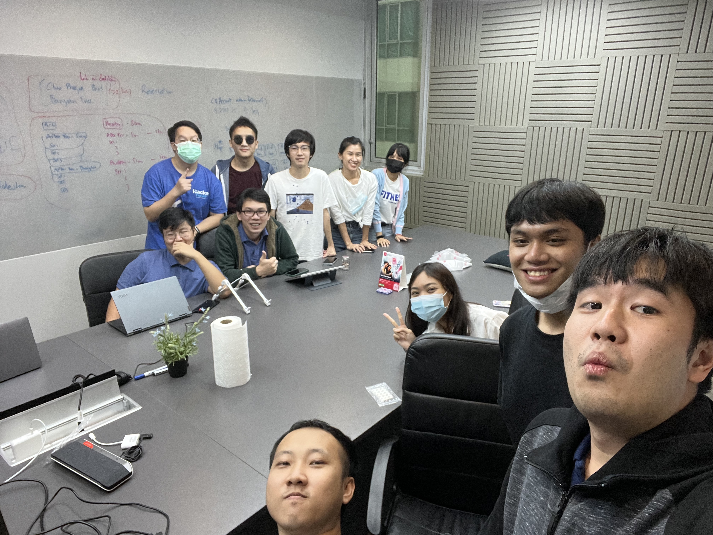

ในแกนของงาน ผมก็จะวางตัวให้ใกล้ชิดกับทีมมากที่สุด

เวลามีงานอะไรมา หลายครั้งผมก็จะไปช่วยทีมลุยงาน ถ้าพูดก็คือไปคลุกฝุ่นอยู่กับทีม แม้ว่าหลายครั้งผมอาจลงไปแค่เอารองเท้าไปคลุกฝุ่นเฉยๆ ไม่ได้ไปทั้งตัวก็ตามทีนะ

หลายครั้งผมก็จะเอางานไปให้ทีมช่วยกันคิด solution แม้ว่าเราจะคิดมาอย่างดีระดับนึงแล้ว แต่เราก็เอาไปให้เขาช่วยออกความเห็นเพิ่มเติม

เราไปด้วย open minded ว่าถ้ามีความเห็น ก็เอามาคุย มาถกเถียงได้

หรือแม้แต่ยอมรับว่า solution ที่เราคิดไว้แล้ว อาจไม่ดีอย่างที่คิด

เปิดโอกาสให้เขาได้ถกเถียง ให้เขาได้มองเห็นว่า ถ้าเป็นเรื่องงาน เราคุยกันด้วยเนื้องานล้วนๆ

ไม่ใช่ว่า เพราะตูเป็น CTO คิดอะไรก็ต้องถูกเสมอ

แต่บอกตรงๆ ว่าพอทำจริงมันก็ยากแหละ

เพราะด้วยตำแหน่ง ด้วยประสบการณ์ต่างๆ ก็ไม่แปลกที่น้องๆ ที่มาจอยทีมใหม่ ที่ยังด้อยประสบการณ์​ ก็คงเห็นว่าไอ้ที่ผมทำมามันก็ดีแล้วแหละ ก็จะเออออห่อหมกตามผมไปเลย ทั้งๆ ที่จริงวิธีที่ผมคิด อาจจะไม่ดีที่สุดก็ได้

แต่พอคิดย้อนๆ แล้ว แก๊ง 4 กุมารนี่แหละ ก็ช่วยให้เรื่องนี้ง่ายขึ้น

**ก็เพราะพวกเขาเถียงผมเวลาผมเอา solution ไปเสนอนั่นแหละ**

**คนอื่นก็จะเห็นว่า ผมสามารถรับฟัง เปิดประเด็น และ discuss ได้ตลอด**

คนใหม่ๆ ก็จะเริ่มกล้ามากขึ้น ที่จะมาเถียงผม ที่จะมา discuss กับผม

และพอเขาเริ่มทำแบบนั้น แล้วเขาไม่เห็น negative effect ที่ตามมาจากการเถียงผม หรือ discuss กับผม

เขาก็จะเริ่มรู้สึกว่า space มันลดลง

และเขาก็จะเริ่มกล้าพูดเรื่องต่างๆ มากขึ้นที่เกี่ยวกับงาน

และนั่นก็สามารถจะไปผูกผันกับอีกแกนนึงได้

นั่นคือแกนชีวิต

---

**ผมไม่เชื่อในคำว่า "เราทำงานกันเป็น ค ร อ บ ค รั ว" แม้แต่น้อย**

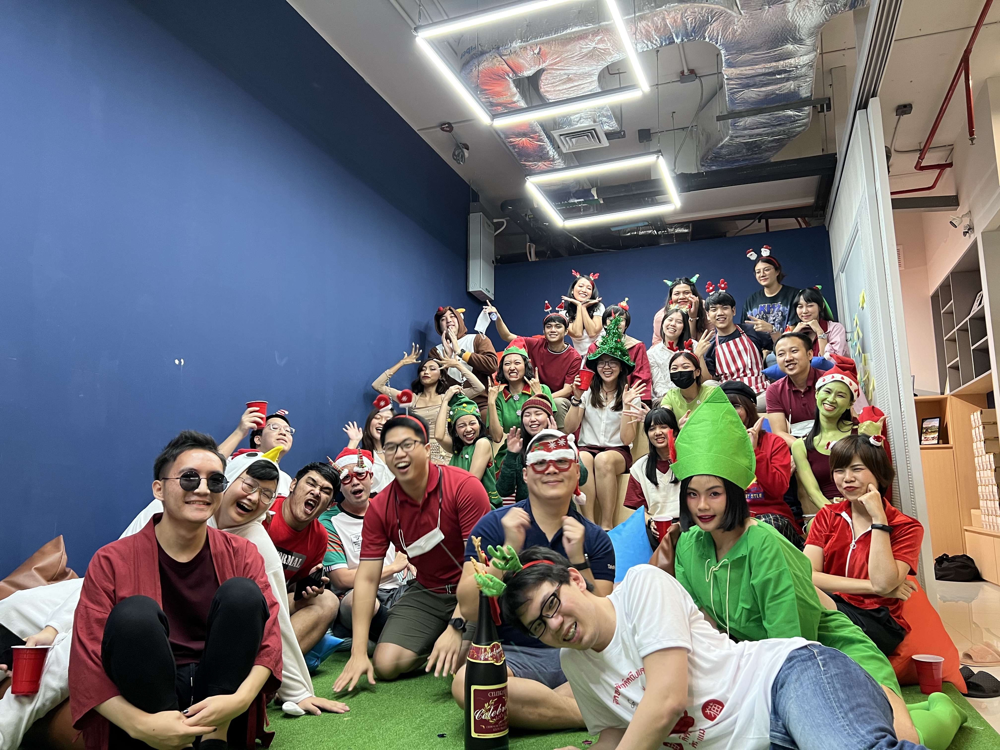

เพราะมันตลกสิ้นดี คือสังคมการทำงาน มันไม่น่าใกล้กับคำว่าครอบครัวเลยแม้แต่น้อย (เอาจริงคือคิดว่าโคตรห่างไกล)

ถ้าถามว่าผมเชื่อในอะไรน่ะเหรอกับการทำงานร่วมกับเพื่อนร่วมงาน

**ผมเชื่อว่า นอกเวลางาน เราสามารถมีโหมด "เพื่อน/พี่/น้อง" กันได้**

เราสามารถที่จะตั้งตี้นัดกันกินข้าว ไปเที่ยว ไปหา activity ทำร่วมกันได้

ก็คงเป็นการเชื่อมความสนิทกันแหละ

คือคำว่า แกนชีวิต ที่ผมหมายถึง

ในการ 1-1 meeting ของผมกับคนในทีมทุกคน

ผมจะเริ่ม session แรกสำหรับคนมาใหม่ทุกคนว่า

**ในการคุย 1-1 กันทุกครั้ง ผมอยากจะสลัดภาพ CTO ทิ้งลงไป สลัดความเป็นหัวหน้าและลูกน้องทิ้งไป**

**และเรามานั่งคุยกันแบบคนทำงานร่วมกัน หรือเพื่อน/พี่/น้องนั่งคุยกัน**

และผมเรียก session 1-1 ว่า **"สนทนาธรรม"**

เพราะบางทีเราก็ไม่ได้คุยกันแค่เรื่องงานจริงๆ เราคุยไปถึงเรื่องชีวิตส่วนตัวกันด้วย

จริงอยู่ที่ 1-1 ถ้านับ 80% ของเวลา ก็จะคุยเรื่องงาน เรื่อง career path เรื่อง pain หรือปัญหาที่เจอ หรือเรื่องที่อยากขอความช่วยเหลือจากผม

แต่ผมก็เปิดโอกาสให้คุยเรื่องชีวิตส่วนตัวได้ด้วย ก็เลยมี 20% ของเวลาที่หลายคนก็เอาเรื่องส่วนตัวมาคุยด้วย

และผมเองก็ไม่ปิดใจที่จะเอาเรื่องส่วนตัวผม ที่สามารถ relate กับเรื่องที่พูดคุยอยู่ มาเล่าให้เขาฟังด้วย

แชร์ประสบการณ์ที่ผ่านมา แชร์ความยากลำบากที่ผ่านมา

(บางครั้งและบางเรื่องเล่าไปน้ำตาคลอไปก็มี)

ซึ่งก็ไม่ง่าย และก็ไม่ทุกคนที่จะเปิดใจเอาเรื่องส่วนตัวมาพูดจริงๆ

แต่พอมันมี ก็มีน้องในทีมคนนึงเหมือนกัน มาถามผมว่า ถ้าแฟนพูดถึงแฟนเก่า นี่จะหมายถึงอะไรนะ (อิหยังวะ ถามกูเนี่ยนะ 55555555)

ผมมองว่าการทำยังงี้มันก็คือพยายามปิด gap CTO ของผมแหละ

คือผมแค่รู้สึกว่า ชีวิตเรามันก็มีนอกเหนือจากงานนะ แล้วทำไมเราต้องทำให้วงสังคมงานมันก็มีแต่เรื่องงานนะ

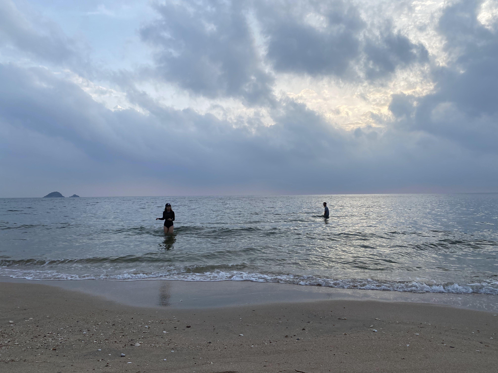

**ก็เลยเป็นที่มาว่าทำไมการทำตัวเข้าถึงได้ของผม จึงมีแกนของชีวิตมาเกี่ยวข้องด้วย**

แต่สุดท้ายสิ่งที่ผมเองก็ยังต้องยอมรับอยู่เสมอว่า

ใดๆ ต่อให้พยายามจะ close the gap เราก็จะลดได้ถึงจุดนึงแหละ

**gap CTO สุดท้ายมันก็ยังคงมีอยู่ดี เหมือนมันมี minimum บางอย่างอยู่**

แต่ด้วยความที่ตัวผมก็ value เรื่องการพยายามวางตัวให้เสมอกัน หรือการพยายามให้เข้าถึงได้

การพยายาม close the gap ก็เป็นสิ่งที่อยากทำอยู่ดี

แต่กับ manager บางคน ก็อาจจะไม่ต้องการ close the gap ซึ่งก็เข้าใจได้ และก็ไม่ได้ผิดแปลกอะไร

อย่างที่ผมบอกว่า management style ไม่เหมือนกัน

และนี่ก็คือ style ของผม

---

## ให้โอกาสตัวเองได้พักบ้าง

ช่วงท้ายปี 2021 ยอมรับว่าเป็นช่วงที่ก็หนัก เป็นช่วงนึงของชีวิตมีความงุนงงในตัวเองสูงมาก งานก็ค่อนข้างจะถาโถม

จนกระทั่งเดือนธันวาคม 2021 ก็ตัดสินใจไป Work from Chiang Mai และหาโอกาสเที่ยวด้วย

แถมยังเลือกวิธีเดินทางที่สุดจะสโลว์ไลฟ์ คือนั่งรถไฟ

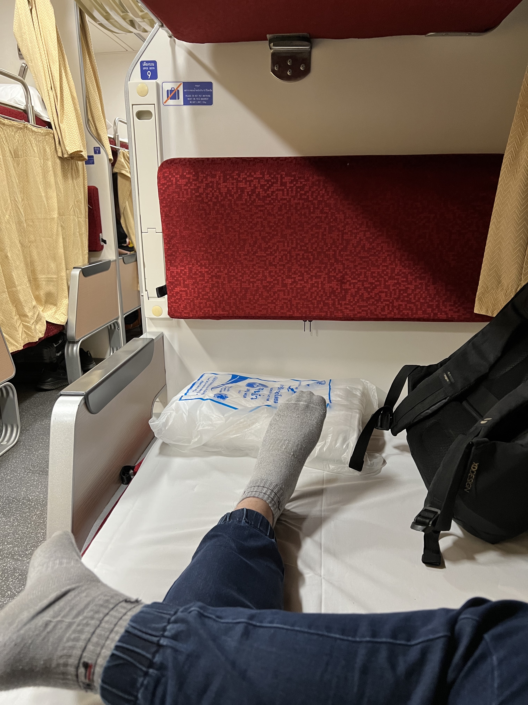

แถมแพลนไปก็ไม่ได้คิดอะไรด้วยนะ ปักแค่วันไป และวันกลับ แค่นั้น

เป็นทริปที่ค่อนข้างจะ go with the flow พอตัว คิดวันต่อวัน

---

ความตลกคือ ทริปนี้ ไปเชียงใหม่นะ

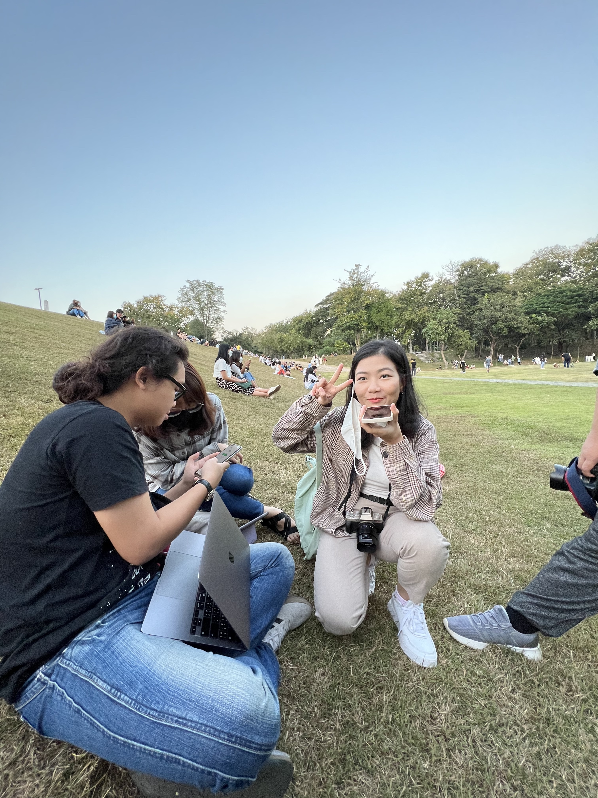

แต่กูเจอเพื่อนที่อยู่กรุงเทพฯ​ เต็มไปหมด

เหมือนประชากรกรุงเทพฯ​ ย้ายมาอยู่เชียงใหม่กัน

คิดดูก็ตลกดี แต่มันก็ดีที่ว่า

**อยู่ๆ ทริปนี้ก็ไม่เหงาอย่างที่คิด**

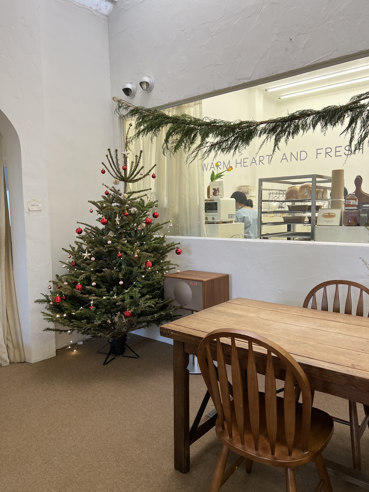

:)

---

พอมาย้อนวันนี้ รู้สึกว่า

**โคตรตัดสินใจไม่ผิดที่ไป**

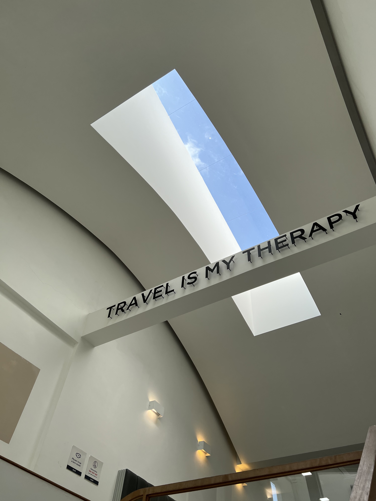

ถึงแม้มันจะเป็น Work from Chiang Mai ไม่ได้ไปเที่ยวทุกวัน

แต่ในสถานการณ์ชีวิตตัวเองช่วงนั้น ที่ตำแหน่งและงานที่ทำในตัวเองยังไม่ลงตัวนัก และชีวิตส่วนตัวก็ยังงงๆ ไปอีก

**การเลือกมา Work from Chiang Mai ก็เป็นการให้โอกาสตัวเองได้พักที่ดีที่สุดแล้วแหละ**

คนเราใดๆ มันทำงานได้ ทำดุเดือด บ้าคลั่ง ไม่หลับไม่นอน ทำทุกวันต่อเนื่องกัน มันก็(คงจะ)ทำได้

**แต่มันควรมีโอกาสพักบ้าง**

**และจะพักผ่อนแบบไหน ก็แล้วแต่คน**

บางคนอาจชอบที่ก็แค่นั่งโง่ๆ ในบ้าน เล่นเกม ดูเน็ตฟลิก

บางคนอาจชอบไปเที่ยวผจญโลกกว้าง

ทุกคนมีวิธีการพักผ่อนในแบบของตัวเอง

อย่าไปชี้หน้าเขาว่า นั่นไม่เรียกว่าการพักผ่อน คุณเอาสิทธิอะไรไปชี้บอกเขายังงั้นก๊อนนน

---

ตอนนั้นผมเลยตั้งเป้าเลยว่า

**เชียงใหม่ ฉันจะกลับมาอีก**

และก็ได้กลับไปจริงๆ ตอนท้ายเดือนมกราคม

อยู่ยาวสามวีก จนเกือบจะเป็นคนโลคัลละ

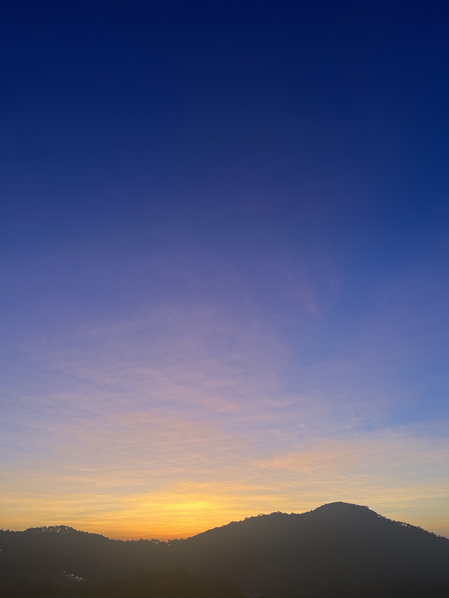

และปีนี้ก็ตัดสินใจค่อนข้างแน่วแน่ว่า

ธันวาคม 2022 เจอกัน

ไปอยู่ยาว เจอกันอีกทีปีใหม่

---

**“หรืออดีตมันช่วยอะไรผมในวันนี้ได้ไหมนะ”**

นี่เป็นคำเปรยแรกสุดที่ผมตั้งคำถามกับตัวเอง ในโมเม้นนั้นที่นั่งรอคิวโมโม่ยาวสามชั่วโมง และเริ่มเขียนบล็อกนี้

เขียนเสร็จวันที่ 31 มีนาคม ซึ่งก็นานอยู่

คำตอบของผมนะเหรอ

มันช่วยให้ผมรู้สึกว่า

ชีวิตเราแม่งก็ผ่านอะไรมาเยอะเหมือนกันนะ

ถ้าเทียบเป็นภูเขา เราแม่งเหมือนผ่านมาหลายลูกแล้ว

แม้วันนี้ภูเขามันอาจจะสูงชันจนเรารู้สึกเหนื่อยที่จะปีนมันไป

แต่เราลองมองย้อนกลับไป

**เราถอยกลับไปไม่ได้แล้ว**

**เราทำได้แค่เดินหน้าต่อไป**

ถ้าเหนื่อยก็พัก

ถ้าไหวก็ปีนต่อ

**ชีวิตมันก็คงแค่นี้จริงๆ แหละมั้งนะ**

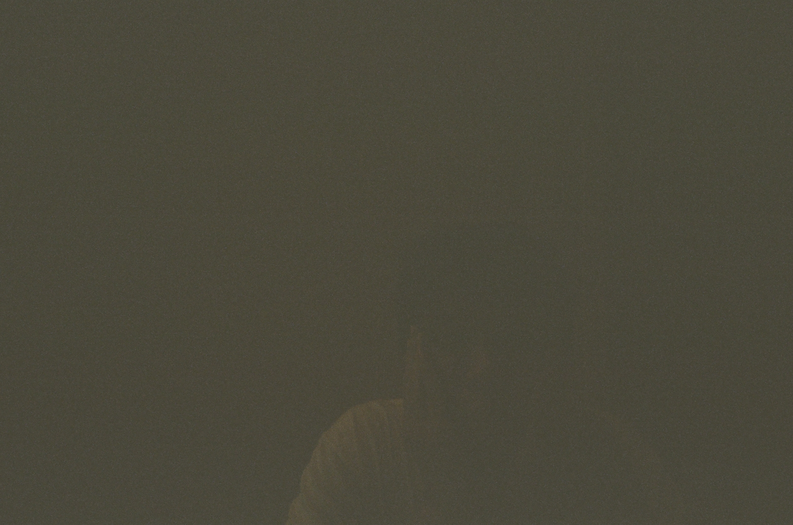

ปิดท้ายด้วยภาพกล้องฟิล์มม้วนแรก ที่เศร้าใจว่ามืดหมด เพราะไม่เคยถ่ายมาก่อน แต่ก็สนุกดีที่ได้ถ่าย และก็ยังได้รูปที่ดีๆ มาอยู่บ้าง เพื่อให้มีกำลังใจถ่ายต่อไป :)
