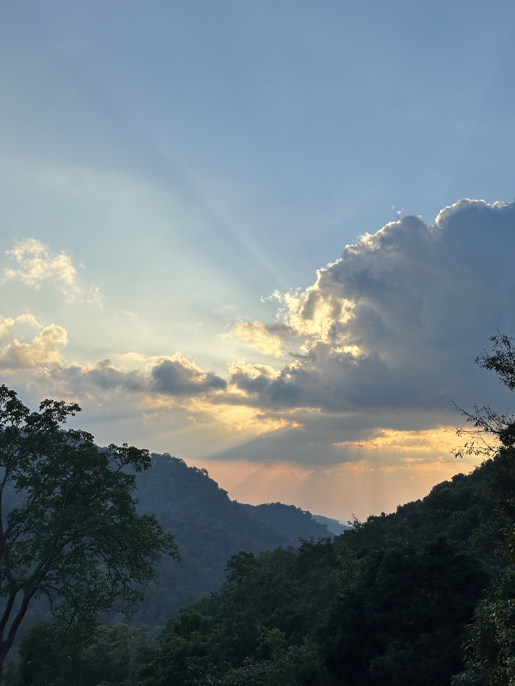
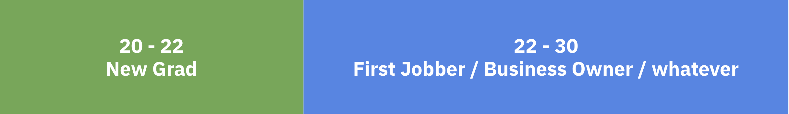
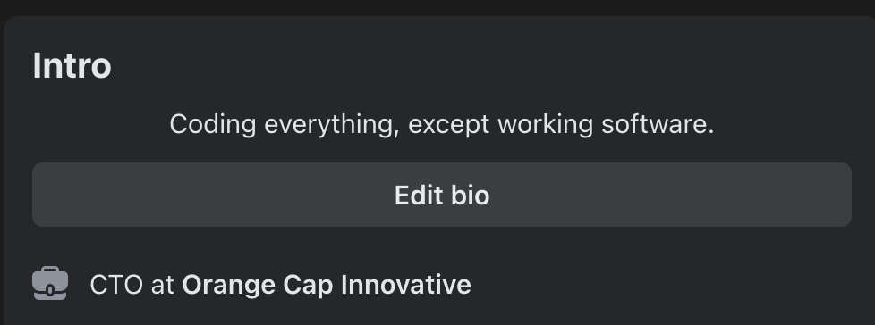
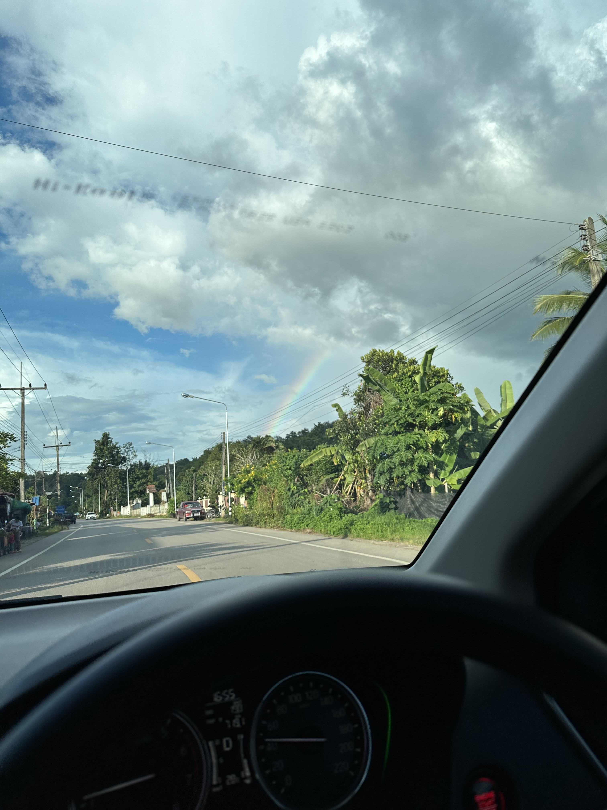
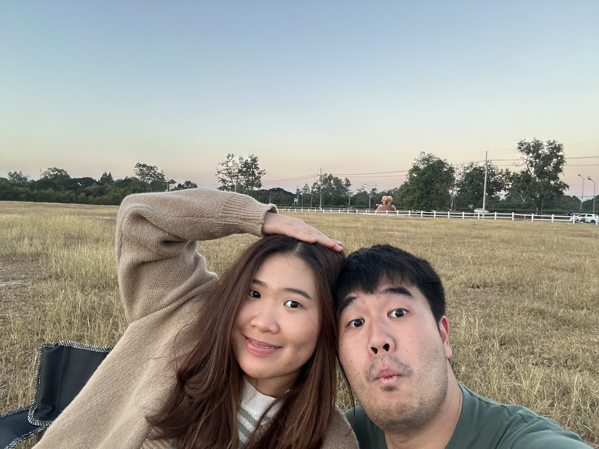
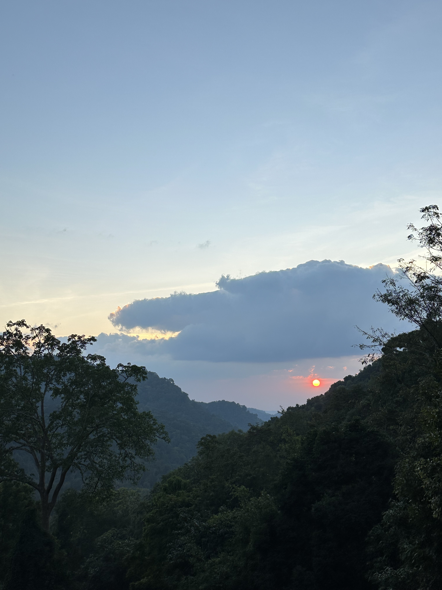

## ไอ้เบนซ์ มึงดองเค็ม!!!!

ก่อนอื่นขอบอกก่อนว่า รีวิวของปี 2023 ดองเค็มจนเป็นหมันไปละ 555555

ความตลกร้ายคือ ไอ้ที่เคยแซะๆ ไว้ในหัวบล็อกที่เขียนใน Draft ไว้ว่า "เขียนช้า แต่ก็มานะ เพราะไม่มีอะไรช้าเท่าของปี 2020 - 2021"

ครับไอ้เบนซ์ คือฉันดองข้ามปีแล้วจ้า 555555

แต่พออ่านย้อนแล้วก็รู้สึกว่า ไอ้ที่เขียนค้างไว้ ก็เป็นอะไรที่อยากให้มันเก็บเป็นดิจิตอลฟุตลองชีสละกัน หลายๆ อย่างก็เป็นจริง แล้วก็รู้สึกมีเรื่องที่อยากขอบคุณอยู่ในนั้น

เลยจะขอเอาของปี 2023 ฉบับ Director's Cut เขียนไม่เสร็จ และไม่เกลาคำอะไรเยอะ ไม่มีภาพประกอบ ไว้ที่ท้ายบล็อกละกันนะ

อ่ะ ของปี 2024 เริ่ม!

## 2024

> วันที่ 23 ธันวาคม 2567 20:12 เขียน ณ ทโล้โฮมสเตย์ แม่กำปอง จังหวัดเชียงใหม่

เป็นโมเม้นที่จงใจจะมานั่งเขียน Reflect ปี 2024 จริงๆ หลังจากอ่าน สคส. ที่ทุกคนในออฟฟิศเขียนให้ ขอบคุณทุกพลังใจพลังบวกจากทุกคนมากๆ ครับ

ปีนี้เป็นปีที่จะใช้ชีวิตในอายุเลข 2 เป็นปีสุดท้าย เพราะอีกสองเดือนข้างหน้า ก็จะอายุ 30 แล้ว

มุมนึงก็ตกใจว่า เออ นี่เราใช้ชีวิตมาจนถึงวัยเลข 3 แล้วเหรอ

วัยที่โลกจะคาดหวังให้เรามีอะไรสักอย่าง ประสบความสำเร็จอะไรกับเขาบ้าง

มีบ้าน มีรถ แต่งงาน มีครอบครัว อะไรเทือกนี้

โลกมันก็ยากจังเนอะ จะเอาอะไรมากกับคนที่อายุ 30 ที่ชีวิตในช่วง 8 ปีหลังจากเรียนจบมันก็เพิ่งมาเริ่มใช้ชีวิตกันจริงๆ จังๆ เป็นตัวของตัวเอง

Reflect ปีนี้ที่กำลังจะเขียนออกมา มันคงจะแตกต่างกับปีก่อนๆ เยอะแหละ (คือแค่เริ่มบทมากูก็อินดี้แล้วแหละเอาจริงนะ)

จะเรียกว่ารีวิวทั้งปีก็คงไม่เชิง ไม่ได้เอาทุกเดือนมากางๆๆๆ ว่าแต่ละเดือนเกิดอะไรขึ้นบ้าง

แต่คงเป็นรีวิวที่สรุปความคิดของตัวเองทั้ง 29 ปีกับอีก 10 เดือนที่เกิดมาบนโลกนี้ในบล็อกรีวิวปี 2024 ละกัน

## วัยที่โดน"บังคับโต"

ผมว่าช่วงอายุ 20 - 30 เป็นช่วงอายุที่คาบเกี่ยวสองสิ่งหลักๆ

หนึ่งคือ **ช่วงที่เรียนอยู่ และกำลังจะเรียนจบ** ช่วงที่เรายังสนุกสนานเฮฮา ชีวิตยากสุดก็แค่สอบมิดเทอมไฟนอล

สองคือ **ช่วงที่เริ่มทำงานหลังเรียนจบ** บางคนไปเป็นพนักงานประจำ เป็น First Jobber หรือบางคนอาจเป็นเจ้าของกิจการเอง บางคนอาจจะรับช่วงต่อจากที่บ้าน บางคนก็อาจจะเรียนต่อ

พอมาย้อนคิดเอาดู สิ่งที่หลายๆ คนน่าจะเจอ รวมถึงผมด้วย คือช่วงที่เรา Transition จากเป็นนิสิตนักศึกษาจบใหม่ป้ายแดง มาทำงานใช้ชีวิตในโลกใบนี้ มันกระทันหันแล้วรวดเร็วมาก

เสมือนว่าอยู่ๆ โดน**บังคับโต**

แล้วพอโดนบังคับโต อยู่ๆ ก็มีเรื่องราวต่างๆ นาๆ ถาโถมเข้ามาในชีวิตเต็มไปหมด

ตั้งแต่ว่า ภาษีนี่แม่งยื่นยังไงวะ? แล้วนี่กูเสียภาษีหรือต้องได้่คืนนะ?

นี่กูต้องมีรถแล้วเหรอ? ต้องซื้อบ้านแล้ว?

นี่ฉันต้องซื้อประกันสุขภาพ เพื่อลดหย่อนภาษีจริงๆ เหรอ?

บางคนที่มีแฟน พ่อแม่จะเริ่มถามแล้วว่าจะแต่งงานหรือยัง?

พอแต่งงานแล้ว พ่อแม่ก็อาจจะถามว่าจะได้อุ้มหลานตอนไหน?

บางคนก็อาจจะเจอว่าพ่อแม่ไม่ได้ทิ้งอะไรไว้ให้เลย มีแต่หนี้สินเต็มไปหมด ครั้นจะไม่ช่วยก็โดนหาว่าเป็นเด็กอกตัญญู บางบ้านดีไม่ดีไม่เคยบอกเรื่องนี้ไว้เลย ละมาคาดหวังว่าพอลูกเรียนจบทำงานแล้วจะมาช่วยแบ่งเบาภาระได้

บางคนก็เจอว่าไปทำงานแล้วเจอคนที่นิสัยไม่ดี อยู่ใน environment ที่ทำอะไรมากไม่ได้ ไม่มี room ให้ feedback นอกจากทำใจ และไม่มีทางเลือกชีวิต

ค่าบีทีเอสที่แพงขึ้นทุกวัน น้ำมันแม่งก็โคตรแพง ค่าครองชีพแม่งก็ไม่สัมพันธ์กันกับเงินที่ได้

การเมืองก็นะ ก็ตามที่เราเห็นๆ กันอยู่ นับวันยิ่งรู้สึกสิ้นหวังไปทุกวันๆ

ถ้าสรุปก็คือ ช่วงวัย 22 - 30 ไม่มีใครสอนวิชา **"การเป็นผู้ใหญ่"** เลยแม้แต่น้อย แถมมันยังกึ่งๆ เหมือนโดน**บังคับโต** ที่อยู่ๆ ก็ต้องรู้จัก และเข้าใจเรื่องพวกนี้

เรียนรู้กันตั้งแต่อายุ 22 ยาวๆ ไปจนตลอดชีวิต

บางคนบางวิชาก็ทยอยมา บางคน โดนเป็นสิบเรื่องพร้อมกันในช่วงเวลานึง

ใครเป็นผู้อ่านที่เดินผ่านไปผ่านมาอาจจะแว้บมาอ่าน แล้วอายุยังหนุ่มๆ สาวๆ ก็อาจจะคิด โลกแม่งยากขนาดนี้เลยเหรอวะ

มันก็ใช่แหละว่าโลกแม่งยากขนาดนั้น

แต่ก็ใช่ว่าจะไม่มีเรื่องดีๆ

## ครอบครัวที่ดีมันเป็นแบบนี้นี่เอง

ความโชคดีของผมอย่างนึงคือ **ครอบครัว = Super Safe Zone**

ผมอยากใช้คำว่า Super เพราะว่าเป็นเซฟโซนที่แท้จริงไม่พอ พอเราใช้ชีวิตเองมา 8 ปีก็นั่งคิด

เออ ป๊าม๊ากูนี่แม่งก็เก่งเหมือนกันว่ะ ทั้งทำงานหนัก และส่งลูกเรียนจนจบป.ตรี ใช้เงิน ใช้แรง ใช้เวลา ใช้พลังชีวิตไปขนาดไหน

ตัดภาพมาที่ฉัน แค่ทำงานบางวันก็หมดเรี่ยวแรงแล้ว ไม่ต้องไปคิดถึงคนอื่นๆ เลย

ยกตำแหน่ง Super Safe Zone ให้กับครอบครัวผมเลย

เอาจริงถ้าผมไปมองคนอื่นๆ ที่ต้นทุนชีวิตของครอบครัวเขาเยอะกว่ามาก บางคนที่บ้านก็ไม่มีภาระให้ต้องช่วย เงินเดือนได้มาก็เก็บเต็มๆ มันก็แอบอิจฉาแหละนะ

แต่ก็รู้สึกโชคดีที่ว่า เรื่องพวกนี้ป๊าม๊าเองก็เหมือนเก็บไว้จนพอเราพร้อมจะช่วยแบกภาระเหล่านั้น เขาถึงค่อยๆ ให้เราแบก

ถ้าใช้สไตล์ครอบครัวจีน ที่เขาบอกว่า บางคนมีลูกมาเพื่อใช้งาน เหมือนป๊าม๊าผมโดนแบบนั้นมา แกทำงานหนักตั้งแต่ยังเด็ก แกก็เลยไม่อยากส่งต่อสิ่งนั้นมาให้ลูกคนนี้

**เลยทำให้รู้สึกยังโชคดีที่ตัวเองมีบ้านที่เป็นบ้านจริงๆ**

วันไหนชีวิตยากลำบาก ไม่ต้องเจอเรื่องปวดหัวเพิ่ม ได้กลับบ้าน ได้ชาร์จแบตเต็มที่ มันดีจริงๆ นะ

ก็เป็นความโชคดีที่ถ้าเป็นศัพท์ของ Lean Canvas มันคือ Unfair Advantage นั่นแหละ

## เป็น CTO มันไม่เท่เลยสักนิด

ใช่ครับ เพราะความเท่ กับตำแหน่ง มันเอามากินไม่ได้ 555555

อาม่าชอบคิดและพูดบ่อยๆ ตั้งแต่เด็กว่าขยันเรียนโตไปทำงาน เป็นเจ้าคนนายคน นั่งอยู่ห้องแอร์เซ็นเอกสารสบายๆ

โตมาปุ๊ป จึงอยากบอกทุกคนว่า มันไม่ง่ายแบบใครเขาบอก ถ้าเจอใครบอกว่าง่าย ผมอยากจะขอไปเสวนากับคนที่บอกว่าง่ายด้วย เพราะอยากรู้จริงๆ ว่าง่ายยังไง

ด้วยตำแหน่งที่เราทำ เราไม่ใช่แค่ทำงานของเราเองคนเดียว เราทำอะไรที่ Impact มันไปไกลกว่านั้น มันไปกระทบถึงทุกๆ คนในบริษัท คนที่เราทำงานด้วยกัน

แปลว่าเราเองก็ทำงานกับคนเยอะขึ้น ซึ่งนี่ก็เป็นสิ่งที่ไม่มีใครสอนเหมือนกัน ว่ามันไม่ได้ง่ายแบบเหมือนเขียนโค้ด มันมีเรื่องละเอียดอ่อนอีกเยอะแยะคุยทั้งวันก็ไม่หมด

ถ้าให้เทียบกัน นับจากวันแรกที่ทำงาน ในวันแรกนั้นเราไม่ได้แบกใครเยอะ เราแบกแค่เราเองคนเดียว ทำงานตามที่สั่งมาได้และทำได้ดี ก็เก่งแล้ว

แต่พอมาเป็น Manager มาเป็น CTO มันต้องถึงกับแบกทีม แบกคนที่เราทำงานด้วยกันไว้

**"หนึ่งวันพันเหตุการณ์"**

**"แต่ละมื้อแต่ละเดย์"**

ประโยคสุดจะคลาสสิคของคนเป็น Manager ที่เจอในแต่ละวัน

พอมองเทียบกับเพื่อนๆ ด้วยกัน ไม่นับพวกที่จบมาแล้วเป็น Startup Founder หรือเป็นเจ้าของธุรกิจเลย ผมเองก็ถือว่าเติบโตในสายงานและมาเป็น CTO ได้เร็วพอสมควร

ความยากของตำแหน่งนี้ นอกจากว่ามันต้องแบกรับเรื่องต่างๆ ไว้เยอะแล้ว ดับเพลิงไฟไหม้ที่เกิดขึ้นในแต่ละมื้อแต่ละวัน อีกอันที่ยากคือ **เราต้องหาเองว่าเราจะทำอะไรต่อ**

เทียบกับวันแรกที่ทำงานเราก็มีเจ้านายสั่งงานเรา

มาวันนี้เราเองนี่แหละเป็นเจ้านายไปสั่งงานทีม

แล้วใครเป็นเจ้านายเราวะ?

กลายเป็นเราต้องคิดเองเยอะขึ้น แล้วต้องคิดรอบทิศด้วย เพราะการที่เราจะทำอะไรต่อ มันมีผลต่อทุกคน มีผลต่อคนทำงานด้วยกันเหมือนกัน

## พัก(+ปล่อยวาง)ให้เป็น

อีกคีย์เวิร์ดสำคัญโคตรๆ ที่ได้เรียนรู้ในช่วงอายุ 27 - 28 คือคำว่า **พักให้เป็น**

ช่วงนั้นเป็นช่วงที่กำลังเป็น CTO มือใหม่เลย โดนนวดมาเยอะมาก

นวดหนักมากจนมีช่วงเบิร์นเอ้าไปเลย

ตอนนั้นเลยตัดสินใจ ขอลายาว 1 วีก ขับรถขึ้นเหนือ ไปลำปาง ไปเชียงใหม่ เอาตัวไปอยู่กับธรรมชาติ

เป็นเวลาสั้นๆ แต่ในตอนนั้น บรรลุได้ 1 อย่าง

คือคำว่า **ปล่อยวางให้เป็นบ้าง**

ในช่วงนั้นเหมือนพอเรามือใหม่ในตำแหน่งมากๆ เรามักจะยังชินกับการที่ทำทุกอย่างด้วยตัวเอง

เขียนโค้ดเอง ดีพลอยเอา ทำ Infra เอง ทำนั่นนี่เองหมด

โค้ชทีม ตัดสินใจทิศทางต่างๆ คิดนั่น วางนี่

อะไรที่น้องๆ ทำมา ไม่ใช่ว่างานไม่ดีนะ แต่ก็อยากให้มันดีขึ้น ก็ไปเกลางาน ไปประกบกับทีม

พอคิดย้อนมันก็เป็นช่วงที่สนุกนะ แม่งก็ทำอะไรเยอะดี แต่พอทำไปนานๆ เข้ามันก็เหนื่อย มันก็เริ่มเบื่อ จนเบิร์นเอ้า

พอได้ไปพัก สิ่งนึงที่ได้เรียนรู้เลยคือ บางทีเราต้องปล่อยวางอะไรให้เป็นบ้าง

ปล่อยให้น้องทำงาน ปล่อยให้ทีมรันไป

เราแค่ไปช่วยดู ช่วยแนะนำ แต่ไม่ต้องลงไปจับมือทำ

ซึ่งเอาจริงมันก็เป็นศาสตร์และศิลป์แบบนึงนะ หา Balance ให้เจอ ระหว่างการปล่อยให้ทำ กับการทำเอง

เหมือนพอได้เข้าใจคำนี้มากขึ้น เราก็เป็นคนใส่เกียร์ต่ำเป็นมากขึ้น

พอได้หยุดพัก เราก็หยุดพัก หยุดให้เต็มที่

กลับไปก็ไปลุยใหม่

## ความรักดีๆ เป็นแบบนี้นี่เอง

> ความรักที่ดี คือความรักที่สบายใจ ละไม่ต้องระแวงต่อกัน

อันนี้จริงเลยทั้งจากประสบการณ์ตรง ที่ดีมากๆ ในปัจจุบัน

และจากประสบการณ์ที่คุยกับเพื่อนๆ ทุกคนเห็นแบบนี้ตรงกัน

ขอบคุณที่เข้ามาเป็นส่วนนึงในชีวิตมากๆ เลยคับ 🫶

## เชียงใหม่ครั้งที่ 7-8 และ...infinity

อย่างที่บอกว่าบล็อกนี้เขียนที่แม่กำปอง เชียงใหม่ นี่มาเชียงใหม่เป็นปีที่ 3 ที่ติดต่อกันแล้ว

ได้มาสัมผัสธรรมชาติ สูดอากาศบริสุทธิ์ ใช้ชีวิตใส่เกียร์ต่ำเป็นเวลาประมาณ 2 สัปดาห์ต่อปี ก็ดีเหมือนกัน

ยิ่งมาบ่อยยิ่งหลงรักเมืองนี้ขึ้นไปทุกวันๆ

แหม่ ซื้อบ้านเลยดีไหมเนี่ย

## เขียนเป็นข้อๆ ยังกะเป็น Life Coach ละกัน

คือพอเขียนไปเขียนมา มันก็มีหลายเรื่องอยากเล่า แต่สุดท้ายทำเป็นฟอร์แมทเขียนเป็นข้อๆ ดูจะเวิร์กสุด ขอเป็นแบบนี้ละกันนะ

**Disclaimer:** บางข้อน่าจะเป็นไกด์ บางข้อน่าจะขิง บางข้อเป็นความเชื่อส่วนตัว บางข้ออาจจะเหม็นเหมือนไลฟ์โค้ช ก็ใช้จักรยานในการอ่านละกันนะ ไกด์นี้มาจากประสบการณ์ส่วนตัว ใช้ข้อไหนได้ก็จะดีใจมาก ข้อไหนใช้ไม่ได้ก็ช่างแม่งงงงงก็ได้จ้า

**เรื่องการใช้ชีวิตทั่วไป**

1. เราไม่สามารถทำให้ทุกคนพอใจได้ ไม่ต้องไปคาดหวังให้ทุกคนบนโลก พอใจในสิ่งที่เราทำ หรือสิ่งที่เราเป็น
2. ถ้าชีวิตเรายังคิดหรือมองอนาคตตัวเองในปีสองปีห้าปีไม่ออก ไม่เป็นไรนะ แค่ใช้ชีวิตวันต่อวันได้ก็ยากแล้ว และยิ่งในสภาพเศรษฐกิจ การเมือง หม่นหมองขนาดนี้
3. ชีวิตเรา คือการวิ่งมาราธอน เป็นเกมยาว ไม่ใช่วิ่งสั้น บางช่วงเราก็ผ่อนบ้างได้ บางช่วงเราเร่งได้
4. หัด Monitor ระดับพลังงานชีวิตเราให้เป็น แล้วชีวิตจะดีขึ้นเยอะ และเราจะรับมือเรื่องต่างๆ ได้ดีขึ้น ตามระดับพลังงานของเรา
5. สกิล Empathy การทำความเข้าใจคน สำคัญจริงๆ สำหรับผมนะ
6. แต่สิ่งที่สำคัญกว่าคือ การตัดความอินออกให้ทัน บางทีเรารับรู้รับฟังเรื่องแบบนี้ จนเราลืมเคลียร์ตัวเอง แล้วสุขภาพจิตเราเสียก็มี
7. อย่าเอาไม้บรรทัดของตัวเองไปตัดสินคนอื่น
8. เราเอาไม้บรรทัดของเราเทียบกับคนอื่นได้ ให้เป็นเหมือนแรงบันดาลใจ เป็นเป้าหมายให้เราอยากเป็นแบบนั้นได้ แต่ถ้าวัดแล้วเราเครียดว่าทำไมเราไม่เป็นแบบเขาเลย อันนี้อย่าหาวัด เชื่อผม ไม่แฮปปี้หรอก แถมกดดันเปล่าๆ

**เรื่องงาน**

9. ทำงานหนักแล้วก็ต้องพักให้เป็นบ้าง
10. ทำความเข้าใจกับตนเองว่า ตอนนี้เราต้องการอะไร เราต้องการงานท้าทาย หรือเราต้องการเงินเยอะๆ หรือเราต้องการได้ทำงาน 5 วันต่อสัปดาห์ เพื่อที่จะคิดต่อว่า แล้วงานที่เราทำ มันสัมพันธ์กับเรื่องนี้ไหม
11. ถ้าเจอเหตุการณ์บางอย่าง แล้วเกิดคำถามที่งงๆ หรือเจออะไรที่ทำแล้วขัดใจ ให้ไปคุยกับ Manager Manager ที่ดีเขาก็อยากได้ Input จากคนทำงานเหมือนกัน
12. Manager ก็เป็นคนทำงานเหมือนกัน บางมุมคิดถึงใจเขาใจเราบ้าง
13. การพูดแบบไม่สร้างสรรค์ พูดแบบแซะ พูดแบบกระแนะกระแหน ไม่ช่วยให้ดูดีเลยแม้แต่น้อย (คนเขาดูออกนะ)
14. ทำงานเกิน ดีกว่าทำงานขาด
15. หมั่นพัฒนาตัวเองตลอดนั้นดี ดีขึ้นวันละนิดก็ยังดี รู้เรื่องใหม่ๆ วันละนิดก็ยังดี
16. ส่วนตัวเชื่อว่ายุคถัดไปจะเป็นยุคแห่งคนที่ทำได้หลากหลาย รู้หลายทาง มากกว่า specialist เพราะเราสามารถเอาความรู้ขแนงอื่น มาปรับใช้กับความรู้แกนหลักเราได้

**เรื่องวุ่นๆ ของวัยรุ่น C-Level / Management / เจ้าของ(ร่วม)กิจการ**

17. เป็นเมเนเจอร์มันไม่ง่าย และไม่เคยง่าย ละมันจะยากขึ้นเรื่อยๆ ต้องยอมรับเรื่องนี้
18. ทำความเข้าใจตัวเองว่า ในแต่ช่วงเวลา เราจะทำงาน Management กี่ % ทำงานที่ไม่ใช่ Management กี่ % แต่ละช่วงเวลาเราอาจต้องบริหาร บางช่วงเวลาเราต้องลุย ต้องคอยดูตรงนี้กันดีๆ
19. เราเอาความผิดพลาดในอดีตมาพัฒนาเราได้ แต่ไม่เอาความผิดพลาดตรงนั้นมา Define ว่าฉันเป็นคนแบบนี้ไปตลอดกาล
20. งานในตำแหน่ง Manager จะรับความกดดันเยอะ และจากทุกทิศทาง ต้องหาทางระบายออกให้เป็น และ 1 ในนั้นไม่ใช่การระบายกับลูกน้องในทีม
21. ความ Empathy ในตัวเรา จะถูกทดสอบเสมอในงานนี้ ต้องใช้ให้ถูกวิธี

**สุขภาพและการออกกำลังกาย**

22. จากใจคนที่เคยออกกำลังกายหนักและสม่ำเสมอจนวิ่งฮาฟมาราธอนได้ ยังไงชีวิตควรหาเวลาให้ตัวเองไปออกกำลังกายบ้าง ร่างกายดี ใจเราจะดีและสงบตาม
23. สำหรับคนอยากวิ่ง ระยะฮาฟมาราธอนยังเป็นระยะที่ Challenging กำลังดี และสนุกนะ เป็นความท้าทายที่ไม่มากเกินไป
24. ของมันของหวาน เลิกได้เลิก แต่ควรค่อยๆ ลด อย่าพยายามลดหักโหมแบบงดไปเลย
25. ถ้าชีวิตกินชาใส กาแฟดำแบบไม่หวานได้ เป็นลาภอันประเสริฐสุดๆ
26. ใครใคร่ชอบออกกำลังกายแบบไหน ออกไปเถอะ ดีทั้งนั้น แค่ขยับก็ดีกว่าไม่ทำอะไรเลยแล้ว
27. รองเท้าวิ่งนะ อย่าไปซื้อให้มันเยอะมาก พอมันไม่ได้ใส่ ขยะทั้งนั้น โฟมเสื่อม พื้นกรอบ 5555

**เรื่องเงินๆ ทองๆ**

28. ควรทำบัญชีรายรับรายจ่ายส่วนตัว พยายามแยกหมวดรายจ่ายให้ละเอียดที่สุดเท่าที่จะทำได้ ทำแล้วชีวิตดีขึ้นเยอะจริง การบริหารจัดการเงินเราดีขึ้นจริง
29. แนะนำให้เก็บเงินใน Kept (ผมไม่ได้ค่า Affiliate นะ 555) ปัจจุบัน Kept ได้ดอกเยอะพอสมควร จ่ายดอกทุกเดือน (คิดดอกแบบนับวันต่อวันด้วย) และถอนเข้าออกได้ตลอดถ้ามีเหตุต้องใช้เงินจริงๆ ของผมใช้เป็นบ่อพักหลังเงินเดือนออกเลย โยนเข้าอันนี้ทันที
30. แนะนำเอาเงิน 10,000 บาทไปเก็บใน Dime Saving เพราะได้ดอกเยอะสุดในเงินต้น 10,000 (อันนี้ก็ไม่ได้ค่า Affiliate เหมือนกัน)
31. อย่าหาเป็นหนี้บัตรเครดิต จ่ายครบงวดห้ามขาดแม้แต่บาทเดียว
32. บัตรเครดิต ถ้าใช้ให้เป็น และฉลาดใช้ บัตรเครดิตให้ประโยชน์เราเยอะ พวกได้ผ่อน 0% / โปร Cashback / เอาแต้มไปลดราคาของตอนช็อปปิ้ง
33. พอพูดเรื่องผ่อน ถ้าคิดว่าปิดไหว ผ่อนยิ่งสั้นยิ่งดี ผ่อนยาวบางทียอดต่อเดือนน้อยลงแหละ แต่มันเหนื่อยจ่ายนาน ผ่อนจนถามว่า นี่ยังไม่หมดอีกเหรออออออออ
33. รถถ้าไม่จำเป็น อย่าไปมี ถ้าต้องมี ต้องผ่อนไหวละยังเหลือเงินใช้นะ (ป๊าผมเคยสอนว่า ตอนผ่อนรถแล้วจนเลย ไม่เกินจริง)
34. แถมเรื่องรถ มันมีค่าน้ำมัน (ถ้ารถ EV ก็ค่าไฟ) ค่าบำรุง ค่าประกัน ค่าพรบ. พ่วงตามมาอีก พวกนี้เราชอบลืมคิดในค่าผ่อนรถ
35. อย่าหาเอาเงินร้อนไปเล่นหุ้น หรือไปลงทุนที่ใช้เวลา
35. เล่นหุ้่น หาหุ้นที่พื้นฐานดีๆ เถอะนะ ยิ่งถ้าไม่มีเวลา เราไม่อยากมีสภาพนอนไม่หลับเพราะหุ้นมันจะสวิงแบบไหน เราอยากได้หุ่้นที่นอนหลับสบาย
36. การลงทุนมีความเสี่ยง ผู้ลงทุนควรศึกษาให้ดีก่อนตัดสินใจลงทุน (เดี๋ยวนี้ ChatGPT ช่วยเรื่องพวกนี้ได้เยอะมากนะ)
37. วางแผนเรื่องภาษีดีๆ ลดหย่อนแต่พอดี คิดให้เยอะๆ มีปีนึงซื้อกองทุน SSF ลดหย่อนภาษี ซื้อเยอะมาก แต่โคตรไม่คุ้มเลย คือพอร์ทก็แดงชิบหาย แถมลดภาษีได้ไม่เยอะอีก สู้เอาเงินตรงนั้นไปจ่ายภาษีให้จบเรื่องจะดีกว่า

## 30 = New Era

จริงๆ เคยได้อ่านบทความนึงอยู่ ที่พูดเกี่ยวกับว่าอายุ 30 จริงๆ เป็นเหมือนอีกจุดหมุดหมายใหม่ของชีวิต ที่ไม่ใช่คำว่าแก่ ซึ่งหลายคนอาจจะบอกว่า มึงกำลังปลอบประโลมตัวเองป่าวว่ายังไม่แก่

ทั้งใช่ทั้งไม่นะครับ 555555 คือที่รู้สึกเห็นด้วยของบทความนั้น คือเรื่องที่ว่า

เหมือนในช่วงวัย 30 เราจะเริ่มรู้จักโลกแล้ว ผ่านอะไรมาประมาณนึง เรารู้แล้วว่าอะไรเวิร์กไม่เวิร์ก รู้แล้วว่าอะไรที่เราทำได้ รู้ว่าชอบอะไร ไม่ชอบอะไร มีประสบการณ์ชีวิตประมาณนึง และยังมีพลังอยู่

มันเลยเป็นช่วงที่เราพอรู้เข็มทิศชีวิตประมาณนึง งั้นก็พุ่งทยานไปตามทิศทางนั้นเลยละกัน

ซึ่งส่วนตัว พอไปรวมๆ กับเรื่องว่า เราเองก็เริ่มจะ**ปลง** กับอะไรหลายๆ อย่างไปแล้วเหมือนกัน

ก็รู้สึกว่า เออก็จริงนะ เหมือนตอนนี้เราเริ่มพอรู้ละว่าเราเป็นใคร ทำอะไรได้ และสามารถที่จะเป็นอะไรได้

เลยมองว่าอายุ 30 ก็เป็นการเปิดสู่ศักราชใหม่ของชีวิต สู่ความสนุกใหม่ๆ ความท้าทายใหม่ๆ

แม้รู้ตัวดีแหละว่า มันก็คงไม่ง่าย

แต่ชีวิตเราก็รู้สึกว่า กูก็ผ่านมรสุมมาหลายลูกมาได้อยู่นะ

เราพอรู้แล้วว่า ถ้าพอเห็นมรสุมตั้งเค้า เราก็ต้องเตรียมตัวให้ทัน

รวมถึงเราก็ต้องเตรียมตัวไว้ตลอดเวลา ว่าถ้ามันจะมาแล้ว เราก็พร้อมสู้ พร้อมซัดกับมันไหว

อย่างที่บอก พอเราบอกว่า**ปลง** กับหลายๆ อย่างได้แล้ว

ก็มองมรสุมที่มันอาจจะมา หรือไม่มาก็ได้ เป็นเรื่องปกติธรรมชาติไปละกัน

**เราแค่เตรียมพร้อมที่จะสู้มัน** ไม่ว่าอะไรจะเกิด มันก็ต้องเกิดแหละวะ

## 2025?

ผมให้ 1 Motto ปิดท้ายสำหรับรีวิวปี 2024 และให้คำอวยพรสำหรับปีหน้าละกัน

> ทำวันนี้ให้ดีที่สุด เท่าที่คนๆ นึงมันจะทำได้ ถ้าเราคิดว่ายังทำได้ไม่ดี ก็ช่างแม่ง แล้วไปนอนสักตื่น พรุ่งนี้มาเอาใหม่

ขอให้ปีหน้าเป็นปีที่ใจดีสำหรับทุกคนครับ :)

---

ยัง ยังไม่จบ ขอเชิญอ่านบทเขียนที่ดองเค็มไว้ อย่าง 2023 Year in Review ฉบับ Director's Cut คือดองเค็มไว้เป็นปีแล้ว เอามาให้อ่านละกัน 555

---

## 2023 (Director's Cut)

**จะมีอันที่เขียนวงเล็บ ละก็ใส่ตัวเอียง เป็นเหมือนโน้ตจากเบนซ์ในปี 2024 ไปคอมเม้นเบนซ์ในปี 2023 ละกันนะ**

เขียนช้า แต่ก็มานะ (เพราะไม่มีอะไรช้าเท่าของปี 2020 - 2021 อีกละ 555) *(อีเบนซ์ มึงดองงงง ไอ้เวรรร)*

ปีนี้ขอเป็นธีม 23 ข้อแห่งปี 2023 ละกัน จะได้อ่านกันง่ายๆ หน่อย *(ละมึงเขียนได้แค่ 12 ข้อละหยุดเขียน 555)*

## 1. สุขภาพพังพินาศ

น้ำหนักกลับไปสู่ New High อย่างเห็นได้ชัด

คอที่เคยบางๆ กลับมาหนาชัดมาก

อ้วนขนาดที่ว่ากลับไปดูรูปต้นปีคือ ไอ้เชรี่ย นี่กูเหรอ

แทบไม่ได้วิ่ง การกลับไปวิ่งใหม่เป็นศูนย์

ช่วงสิ้นปี ก็ดันอาหารเป็นพิษหนักมากที่เชียงใหม่อีก โชคดีที่มีคนรู้ใจช่วยประคองไว้ได้ทันท่วงที อิอิ

ปีนี้ 2024 เลยตั้งเป้าว่าต้องกลับมาจริงจังเรื่องสุขภาพ

ต้องกลับไปใช้วิธีคิดแบบปี 2020

เริ่มต้นแบบค่อยๆ แต่สม่ำเสมอ *(เริ่มช้าหน่อย มาเริ่มเดือนธันวาเลยนะ แต่ก็ดีกว่าไม่เริ่มนะ สู้ๆ ไอ้เบนซ์)*

ปีนี้แพลนว่าจะมีอีก Activity เพิ่มมานอกเหนือจากวิ่ง คือปั่นจักรยาน *(ได้ปั่นอยู่นะ ครึ่งปีแรกอะ แต่ยังดีว่าครึ่งหลังมีตีแบด ดีละ)*

มาดูกันสักตั้งว่าจะยังไง

## 2. การเงินก็พินาศเหมือนกัน

เป็นปีที่การเงินถือว่าย่ำแย่มาก แต่ไม่ได้ถึงกับต้องกู้หนี้ยืมสิน

มีช่วงที่ต้องใช้เงินสดเยอะ เพราะน้องสาวจะไป Work & Travel เมกา ขอให้ช่วยสปอนค่าตั๋วก่อน กับ Pocket Money แล้วค่อยคืนตอนกลับมา โดนไปจุกๆ

เลยรู้สึกว่าต้องบริหารการเงินให้ดีกว่านี้

เริ่มจากปีนี้จะต้องทำ Expense Tracker บันทึกรายรับรายจ่ายชัดเจนมากขึ้น *(สุดยอดมากเบนซ์ เอ็งทำได้)*

โดยเฉพาะรายจ่าย เพราะตอนนี้รู้สึกเรา Lost Track ของสิ่งนี้ไปเลย

## 3. แต่แล้วเธอก็ได้เข้ามาในชีวิต

*(รักมากขึ้นทุกวันๆ อิ 🫶🫶🫶)*

แม้การเงิน สุขภาพ จะเข้าขั้นปังพินาศ แต่ความรักปังสุดๆ

ขอบคุณอีฟที่ได้เข้ามาในชีวิตมากๆ เลย

อีฟทำให้เราเข้าใจว่า ความรักที่ดี มันมาในรูปแบบนี้นี่เอง

เป็น Safe Zone ที่เราพร้อมทิ้งตัวได้ตลอด ในวันที่ยากลำบาก ก็ยังมีอีฟเป็นคนคอยส่ง Positive Vibe ให้ตลอด

แม้จะมีช่วงที่เราสองคนยมเละเทะทั้งคู่ เพราะงานก็หนักหน่วงกันทั้งคู่ แต่ก็ยังมี Positive Zone ให้กันและกันเสมอ

ขอบคุณมากๆ เลยคับ 🫶

## 4. เป็นปีที่ไม่ได้ไปต่างประเทศ แต่เที่ยวในประเทศเยอะมาก

ตอนแรกมีแพลนอยากไปไต้หวันกับแฟน แต่แฟนไม่มี timing ที่ว่างเลย ก็เลยพับแผนไป *(ปีหน้าจะได้ไปแล้วววว อิอิ)*

เพื่อนก็ชวนไปต่างประเทศนั่นนี่ ก็ไม่ได้ไป เพราะตังก็ม่ายมีนั่นแหละ 55555

แต่ปีนี้ไปที่ยวในประเทศเยอะอยู่

เชียงใหม่ / น่าน / เชียงราย / หัวหิน / พัทยา / เขาใหญ่ / เขาช่องลม

## 5. เชียงใหม่ still my dream destination

มาเชียงใหม่เป็นครั้งที่หกแล้ว *(มีครั้งที่เจ็ดแล้ว และนี่ก็ครั้งที่แปด)*

หลังๆ เอาจริงก็เริ่มไม่ได้ไปร้านใหม่ๆ ร้านรีวิว หรือมีฟีลนักท่องเที่ยวขนาดนั้น

เหมือนไปแวะพักผ่อน ชาร์จแบต

ใช้ชีวิตช้าลงนิดนึง ไม่ต้องทำอะไรมาก

ให้ความช้านี้โอมล้อมเราไว้

แล้วเราก็จะได้เจอกันอีกนะ ชายเมี่ยง เชียงใหม่

## 6. งาน

เรื่องงานในปีนี้ จะมีอีกหลายๆ ข้อตามมา

เป็นปีที่งานถือว่าหนักหน่วงพอสมควร

แม้จะเป็นปีที่เราไม่มีอาการเบินเอ้า เทียบกับปี 2022

แต่เป็นปีที่เรียกว่าเขี้ยวเอาเรื่อง หินเอาการ *(2024 เขี้ยวกว่า 2023 อีกไอ้เบนซ์เอ้ย)*

แต่ก็ได้เรียนรู้อะไรๆ จากมันเยอะแยะเลย

## 7. ปล่อยวางเก่งขึ้น

*(2024 เปลี่ยนจากปล่อยวาง กลายเป็นเกรี้ยวกราดขึ้น หยอกๆๆๆ)*

จริงๆ มันก็คล้ายๆ กับเหมือนเรา**ปลง** มากขึ้น

เหมือนแต่ก่อนเราเป็นคนที่รู้สึกว่าต้องทำความเข้าใจกับทุกอย่าง

ซึ่งเข้าใจมันเข้าใจได้

แต่ในหลายสถานการณ์ ความเข้าใจ กลายเป็นความหนักของเรา ในการคิด ในการตัดสินใจต่อ

หรือบางทีก็นำพาให้เราดันไปเข้าใจความคิดของคนที่ toxic กับเรา โดยเราไม่รู้ตัวก็มี

ปีนี้เลยรู้สึกปลงมากขึ้น

พูดศัพท์ฮาๆ ที่เขาชอบใช้กันคือ **ไม่มีใครเก่งเท่าแม่มึงแล้วค่า**

ทำให้รู้สึกว่าพอปีนี้ปลงขึ้น ปล่อยวางเยอะขึ้น

เหมือนเราก็สบายตัวขึ้น เราควรเอา energy ไปทำอย่างอื่นที่มีประโยชน์ มากกว่านั่งคิดอะไรที่ไม่ประเทืองปัญญา หรือแบกเรื่องไม่เป็นเรื่องอยู่

## 8. สิ่งยากในเรื่องที่ยาก

2023 เป็นปีที่มีเหตุการณ์ที่รู้สึกยากมากๆ และใหม่สำหรับเราเองด้วย หลายเหตุการณ์พอสมควร

แต่การต้องตัดสินใจว่าต้องทำอะไรบางอย่าง ในสถานการณ์แบบนั้น กลายเป็นสิ่งที่ยากกว่ามาก

ต้องบริหารสภาพจิตใจ และพลังกายไปในตัว

แต่พอมันผ่านไปก็ทำให้เรารู้สึกว่า

## 10. กูน่าจะแก่แล้วจริงๆ แหละ

*(ใครเขาแก่กัน โถ่)*

มีหลายครั้งที่เวลาพูดคุยอะไร กับเพื่อน กับที่ทำงาน หรือกับใครก็ดี

มันจะมีฟีลเหมือนแบบ

"หรือกูแก่แล้ววะ"

มันเหมือนแบบถ้าเราถอดตัวเราออกมามองเราพูดเอง เราก็รู้สึกว่าคำพูดเราแม่งแก่ขึ้น 5555555

ก็คงมาคล้ายๆ กับเรื่องความปลงแหละมั้ง

## 11. การไม่ทำอะไร คือการทำอะไรอย่างนึง

เคยได้ยินคำว่า "การไม่ทำอะไร คือการทำอะไรอย่างนึง" ไหมครับ

2023 คือแบบนี้เลย

มีเหตุการณ์ที่ผ่านมา ที่เป็นผลจากการที่ "ไม่ทำอะไรเลย"

มัวแต่รอจังหวะเวลาที่ perfect

ไม่กล้าที่จะ action อะไรบางอย่าง ให้ทันท่วงที ปล่อยให้เวลาไหลผ่านไป

พอถึงจุดนึง จะ action อะไรไป ก็ไม่ทันซะแล้ว

เราก็ได้แค่ยอมรับความผิดพลาดนั้น แล้วก็ก้าวเดินต่อไป

พร้อมบทเรียนชิ้นใหญ่ในใจ

ให้เราเอาไปปรับแก้ เพื่อให้ดีขึ้น

## 12. What got you here won't get you there

สิ่งอะไรก็ตามที่พาเรามาถึงความสำเร็จ หรือพามาถึงยอดเขาลูกนี้

การจะไปต่ออีกภูเขาลูกนึง จะใช้วิธีเดิมๆ ไม่ได้อีกต่อไป

ผมและทีมก็โตมาแบบ Startup

มาวันนี้คนก็ไม่ใช่น้อยๆ แล้ว ปาไปจะ 50 ชีวิตแล้ว

วิธีคิดแบบเดิมๆ ที่เราเน้นลุยไปก่อน ลุยมั่วซั่วตั๋วเหล็ง ชักดาบไปรบทุกวัน อาจจะไม่เวิร์กแล้ว

ระบบ ระเบียบ ที่เราเคยคิดว่าไม่สำคัญเลย ก็เริ่มต้องมี

Process / Framework ที่เราเคยไม่ชอบ ก็ต้องทำ เพราะความจำเป็น *(เริ่มเห็นผลจริงว่ามันดีขึ้น และมันจะดีขึ้นไปได้อีก)*

ต้องบอกเลยว่าปี 2024 จะเป็นปีที่เจอโจทย์นี้ยากขึ้น
